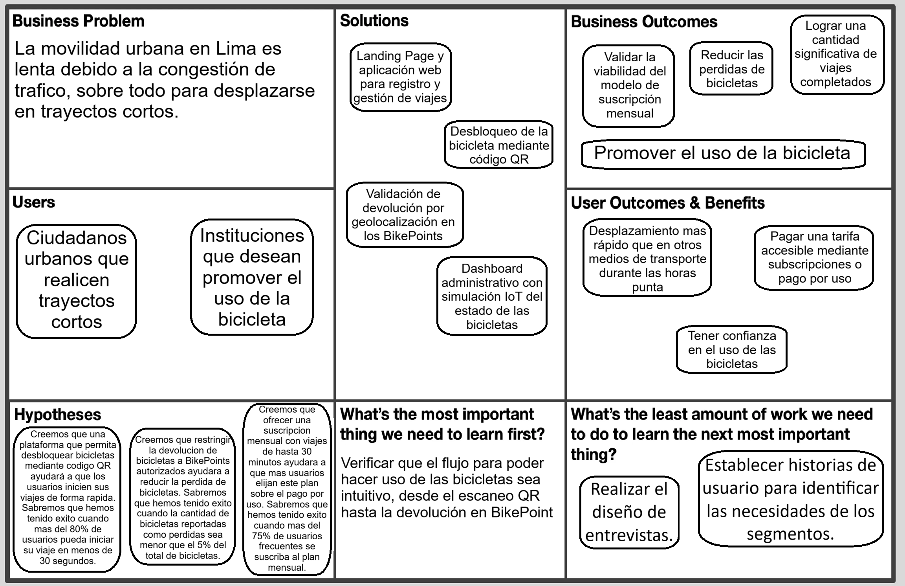

# CAPÍTULO I: INTRODUCCIÓN

## 1.1. Startup Profile

### 1.1.1. Descripción del Startup

Chapa es una startup de movilidad urbana sostenible que transforma la forma en que las personas se desplazan en Lima Metropolitana. Digitalizamos y optimizamos el transporte en zonas de alto tránsito como San Isidro, Miraflores y Santiago de Surco a través de BiciGo: una plataforma de micro-movilidad que conecta a los usuarios con una red inteligente de bicicletas y estaciones estratégicas (paradas), permitiendo trayectos rápidos, ecológicos y eficientes por la red de ciclovías.

Misión: Facilitar un transporte accesible, ecológico y digitalizado mediante soluciones de micro-movilidad inteligente, mejorando la calidad de vida urbana y reduciendo la huella de carbono en Lima Metropolitana.

Visión: Convertirnos en la plataforma líder de movilidad sostenible e intermodal en el Perú, transformando las ciudades en espacios más conectados, eficientes y libres de congestión vehicular.

### 1.1.2. Perfiles de integrantes del equipo

| Integrantes | Descripción |
| :--- | :--- |
| | |
| (foto xd) | **Nombres y Apellidos:** Adrian Andres Armestar Felipa   **Código:** U202410084   **Carrera:** Ingenieria de Software   Soy una persona confiable, adaptable y responsable en cuanto a las entregas de los trabajos. Me especializo en el lenguaje C++ pero también tengo conocimientos acerca de base de datos y JavaScript. Poseo una mentalidad de mejora continua, donde busco aprender y mejorar mis habilidades. Del mismo modo, busco trabajar de manera constante y con una adecuada gestión del tiempo. |
| | |
| | |
| | |

## 1.2. Solution Profile

### 1.2.1. Antecedentes y problemática
#### What?
En Lima Metropolitana existen pocas alternativas para movilizarse en rutas cortas sin atraer problemas, siendo que los ciudadanos tienden a usar taxis o transporte público. A largo plazo, esto genera congestion vehicular y algunos de estos vehiculos llegan a contaminar el medio ambiente.
#### Why?
Según un informe hecho por Lima Como Vamos (2026) ha habido un incremento en la población insatisfecha con el servicio de mobilidad que recibe, siendo que respecto al 2024 la cifra aumento de 11.5% a 27.7% en servicios de taxi y 18.7% a 37.6% en el Metro de Lima.
#### Where?
El problema ocurre en Lima Metropolitana, sobre todo en distritos con altas cantidades de transito y actividad urbana como Santiago de Surco, Miraflores y San Isidro.
#### When?
Esta problematica sucede diariamente, especialmente en horas de mayor transito.
#### Who?
Los afectados por dicho problema son los trabajadores, estudiantes y ciudadanos en general que necesitan realizar desplazamientos cortos de manera seguida en la ciudad de Lima.
#### How?
La problematica se evidencia cuando los ciudadanos utilizan un metodo de transporte convencional para trayectos cortos, metodo el cual no es sostenible debido al incremento en el transito o la emisión de gases.
#### How much?
Segun el grupo Banco Mundial, los costos relacionados al trafico en Lima equivalen al 1,8% del Producto Bruto Interno (2024). Esto evidencia que el impacto de esta problematica es significativo.
### 1.2.2. Lean UX Process

#### 1.2.2.1. Lean UX Problem Statements

El estado actual de la movilidad urbana en Lima Metropolitana se caracteriza por un uso intensivo del transporte privado y del servicio público para recorridos cortos, especialmente en distritos con alta densidad poblacional y congestionamiento, como San Isidro, Miraflores y Santiago de Surco. La mayoría de los usuarios realiza desplazamientos breves entre su hogar, trabajo, universidad o centros comerciales, pero enfrenta tiempos de espera prolongados, dificultades para encontrar opciones eficientes y altos niveles de frustración por la congestión vial y la falta de alternativas sostenibles.

Lo que los productos y servicios actuales no logran resolver de manera efectiva es la combinación entre rapidez, accesibilidad, seguridad y sostenibilidad en recorridos cortos dentro de la ciudad. En muchos casos, los usuarios deben depender de taxis, transporte público o movilidad privada, lo que incrementa el tráfico, aumenta los costos del desplazamiento y no responde adecuadamente a la necesidad de una solución ecológica y práctica.

Nuestra propuesta, BiciGo, busca resolver esta brecha a través de una plataforma de micro-movilidad inteligente que conecta a los usuarios con bicicletas disponibles en estaciones estratégicas y con una experiencia de uso digital, rápida y conveniente. La solución integrará una red de bicicletas, puntos de acceso (BikePoints), un sistema de desbloqueo por código QR y un modelo de acceso adaptable a distintos tipos de usuarios.

Nuestro enfoque inicial estará dirigido a trabajadores, estudiantes y ciudadanos urbanos que requieren traslados cortos, frecuentes y de alta repetición dentro de Lima Metropolitana, así como a instituciones interesadas en promover movilidad sostenible. Esta audiencia es la más sensible a los problemas de congestión, tiempo de viaje y costos de traslado.

Sabremos que hemos tenido éxito cuando observemos un aumento significativo en la adopción de la solución, una reducción en los tiempos de inicio de viaje y una mejora en la retención de usuarios. En términos medibles, esto se reflejará en un mayor número de recorridos diarios por usuario, un volumen de uso sostenido en horas pico y una reducción en la pérdida o uso ineficiente de bicicletas.

#### 1.2.2.2. Lean UX Assumptions

A continuación se presentan los assumptions definidos para el proyecto, organizados según los cinco tipos recomendados por Lean UX:

##### Business Assumptions
- Chapa puede posicionarse como una startup competitiva en el mercado de movilidad urbana sostenible, aprovechando la demanda creciente por soluciones de transporte alternativas en Lima.
- La implementación de bicicletas como servicio tendrá viabilidad económica si se logra una alta frecuencia de uso y una operación eficiente en zonas de alta demanda.
- La adopción del servicio dependerá de la capacidad de la empresa para establecer alianzas estratégicas con instituciones, municipios y usuarios frecuentes.
- Un modelo de negocio basado en suscripción mensual y pago por uso puede generar ingresos sostenibles y mejorar la retención de clientes.
- La operación de BiciGo puede escalarse en distritos con alta densidad poblacional, siempre que se mida correctamente la demanda y la logística de estaciones y bicicletas.

##### Business Outcome Assumptions
- Si la solución genera valor real para los usuarios, la empresa logrará aumentar la cantidad de viajes registrados por usuario al mes.
- La reducción en el tiempo de inicio del viaje y la mejora en la experiencia del usuario impulsará la retención y la frecuencia de uso.
- Un mejor control de la flota y una política de devoluciones más organizada disminuirá la pérdida y el daño de bicicletas.
- La organización podrá optimizar sus costos operativos si mantiene una proporción equilibrada entre demanda, inventario y mantenimiento.
- El crecimiento de la base de usuarios permitirá mejorar la rentabilidad del servicio a través de economías de escala.

##### User Assumptions
- Los usuarios principales son estudiantes, trabajadores y profesionales que realizan recorridos cortos dentro de la ciudad y buscan un transporte rápido y eficiente.
- El segmento urbano valorará mucho la conveniencia, la rapidez y la reducción del tiempo de desplazamiento durante las horas pico.
- Los usuarios estarán más dispuestos a utilizar la solución si la plataforma ofrece una experiencia simple, clara y accesible desde dispositivos móviles.
- Las personas que usan transporte público frecuentemente buscan alternativas más cómodas, menos congestionadas y con mayor control del tiempo de viaje.
- Las instituciones, universidades y empresas pueden actuar como aliados para ampliar la cobertura del servicio y fomentar la movilidad sostenible.

##### User Outcome and Benefit Assumptions
- Los usuarios esperan poder iniciar un viaje en segundos y evitar tiempos de espera prolongados.
- Los usuarios desean reducir la dependencia del transporte privado o del transporte público para recorridos cortos.
- El servicio debe ofrecer una experiencia de viaje accesible, segura y sostenible para el usuario cotidiano.
- Los clientes perciben valor cuando el costo del desplazamiento es menor o comparable con otros medios de transporte.
- Los usuarios valoran la posibilidad de recorrer distancias cortas de forma rápida, sin esfuerzo adicional y con menor impacto ambiental.

##### Feature Assumptions
- Un sistema de desbloqueo mediante código QR permitirá a los usuarios iniciar sus viajes de manera más rápida y sin fricción.
- La restricción de devoluciones únicamente a BikePoints autorizados reducirá la pérdida, el robo y el mal uso de las bicicletas.
- Una suscripción mensual con viajes de hasta 30 minutos incentivará la fidelización y la frecuencia de uso.
- La ubicación estratégica de estaciones en zonas de mayor demanda facilitará la accesibilidad y el uso cotidiano del servicio.
- Una app móvil con información de estaciones, disponibilidad y recorrido permitirá mejorar la comprensión del servicio y la experiencia de usuario.

#### 1.2.2.3. Lean UX Hypothesis Statements
A partir de los assumptions definidos, se establecen las hipótesis de valor del producto. Cada una de ellas refleja una relación entre la propuesta de valor, el segmento objetivo y la funcionalidad clave del sistema.

- Creemos que lograremos aumentar la adopción del servicio si los usuarios urbanos pueden desbloquear bicicletas mediante código QR de forma rápida y sencilla, porque esto les permitirá iniciar sus viajes con menor esfuerzo y menos tiempo de espera. Sabremos que hemos tenido éxito cuando más del 80% de los usuarios pueda iniciar su recorrido en menos de 30 segundos.

- Creemos que lograremos disminuir la pérdida y el robo de bicicletas si los usuarios solo pueden devolverlas en BikePoints autorizados, porque esto permitirá un control más eficiente de la flota y una operación más segura. Sabremos que hemos tenido éxito cuando la cantidad de bicicletas reportadas como perdidas o no devueltas sea menor al 5% del total de bicicletas.

- Creemos que fomentaremos la fidelidad del servicio si ofrecemos una suscripción mensual con viajes de hasta 30 minutos, porque muchos usuarios de uso frecuente preferirán un plan claro y económico frente al pago por uso. Sabremos que hemos tenido éxito cuando más del 75% de los usuarios recurrentes se suscriba al plan mensual.

- Creemos que lograremos aumentar la frecuencia de uso del servicio si ubicamos estaciones estratégicamente en zonas con mayor flujo cotidiano, porque esto reducirá la fricción de acceso y mejorará la experiencia de los usuarios en sus desplazamientos diarios. Sabremos que hemos tenido éxito cuando la demanda de viajes en horas pico aumente de forma sostenida en los distritos con mayor cobertura.

- Creemos que mejoraremos la experiencia del usuario si incorporamos una aplicación móvil con información en tiempo real sobre disponibilidad de bicicletas y estaciones, porque los usuarios podrán planificar mejor sus viajes y reducir la incertidumbre al momento de desplazarse. Sabremos que hemos tenido éxito cuando más del 70% de los usuarios utilicen la aplicación al menos una vez por viaje o al menos una vez por semana.

#### 1.2.2.4. Lean UX Canvas

## 1.3. Segmentos Objetivo
### Segmento 1: Ciudadanos urbanos que realicen trayectos cortos
#### Descripción general:
Se refiere a personas que necesitan recorrer trayectos cortos dentro de la ciudad y que busquen una alternativa accesible a comparación del transporte público actual.
#### Perfil demográfico:
Incluye a estudiantes y trabajadores jovenes de entre 18 a 40 años que residen en Lima Metropolitana.
#### Dato del sector:
Según ComexPerú (2024), los limeños pierden aproximadamente 157 horas al año debido al tránsito en las horas punta. Lo cual evidencia que el segmento se traslada con mayor lentitud a comparación de las bicicletas.
#### Necesidad:
Este segmento necesita una alternativa de movilidad rápida y accesible para los trayectos cortos, la cual no influya en la congestion vehicular ni del transporte informal.

### Segmento 2: Instituciones que desean promover el uso de la bicicleta
#### Descripción general:
Se refiere a instituciones que podrían albergar BikePoints de manera que se facilitan puntos de acceso al servicio dentro de sus instalaciones.
#### Perfil demográfico:
Incluye universidades, municipalidades o empresas interesadas en impulsar el transporte no motorizado.
#### Dato del sector:
La Ley 29593 promueve el uso de la bicicleta como medio de transporte sostenible. Esta ley, que declara de interés nacional el uso de la bicicleta, impulsa a las instituciones, sobre todo a las nacionales, a fomentar su uso.
#### Necesidad:
Este segmento necesita soluciones de bajo costo que les permita ofrecer una movilidad sostenible a sus trabajadores.