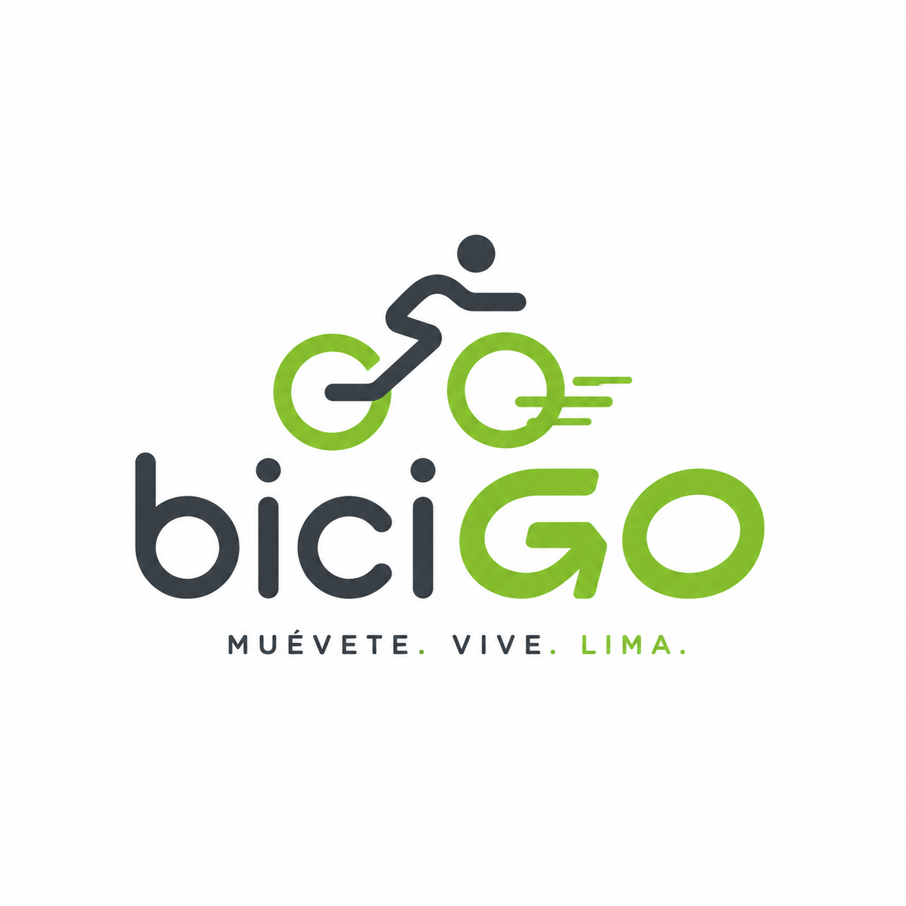
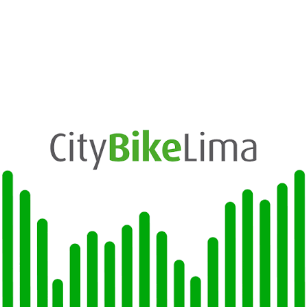
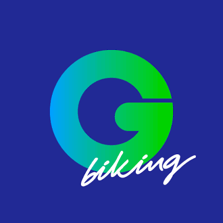
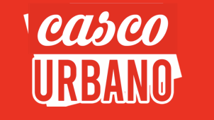

# CAPÍTULO II: REQUIREMENTS ELICITATION & ANALYSIS

## 2.1. Competidores

### 2.1.1. Análisis competitivo

### 2.1.2. Estrategias y tácticas frente a competidores

## 2.1.1. Análisis competitivo.
<table border="1" cellspacing="0" cellpadding="7" style="border-collapse: collapse; width: 100%; border: 2px solid black;"> <tr> <th colspan="6" align="left">Competitive Analysis Landscape</th> </tr> <tr> <td colspan="2" rowspan="2"><b>¿Por qué llevar a cabo este análisis?</b></td> <td colspan="4"><b>Identificar las características, fortalezas y debilidades de los principales servicios de alquiler de bicicletas en Lima, con el propósito de reconocer oportunidades de diferenciación y establecer una propuesta de valor competitiva para la startup.</b></td> </tr> <tr> <td colspan="4">&nbsp;  </td> </tr> <tr> <td colspan="2"><b>Competidores</b></td>   <th align="center">
     
    <b>biciGO</b>
  </th> <th align="center">
     
    <b>CityBike Lima</b>
  </th>
  <th align="center">
     
    <b>GOGO Biking</b>
  </th><th align="center">
     
    <b>Casco Urbano</b>
  </th>
</tr></tr> <tr> <td rowspan="2" align="center"><b>Perfil</b></td> <td><b>Overview</b></td>
<td>
  Startup enfocada en el alquiler de bicicletas para desplazamientos urbanos de corta duración. Los usuarios podrán localizar bicicletas, iniciar y finalizar alquileres, realizar pagos y gestionar sus viajes mediante una plataforma web y móvil.
</td>

<td>
  Sistema de bicicletas compartidas que funciona mediante una red de bicicletas y estaciones ubicadas principalmente en Miraflores.
</td>

<td>
  Empresa dedicada al alquiler de bicicletas y a la realización de recorridos turísticos por diferentes zonas de Lima.
</td>

<td>
  Negocio especializado en bicicletas que ofrece alquiler, mantenimiento, reparación, tours y otros servicios relacionados.
</td>
</tr> <tr> <td> <b>Ventaja competitiva  ¿Qué valor ofrece a los clientes?</b> </td>
<td>
  Servicio digital sencillo y flexible, alquiler por tiempo, consulta de disponibilidad y posibilidad de implementar puntos mediante alianzas con universidades, empresas y establecimientos.
</td>

<td>
  Infraestructura ya implementada, estaciones establecidas, tarifas accesibles y reconocimiento dentro de Miraflores.
</td>

<td>
  Atención personalizada, experiencia en alquiler de bicicletas y recorridos turísticos especializados.
</td>

<td>
  Combina el alquiler de bicicletas con servicios de mantenimiento, reparación y otros servicios especializados.
</td>
</tr> <tr> <td align="center"><b>Perfil de Marketing</b></td> <td><b>Mercado objetivo</b></td>
<td>
  Estudiantes, jóvenes, trabajadores, residentes y turistas que necesiten realizar desplazamientos urbanos cortos de manera práctica, económica y sostenible.
</td>

<td>
  Residentes, trabajadores y visitantes de Miraflores que realizan desplazamientos de corta distancia.
</td>

<td>
  Principalmente turistas nacionales y extranjeros interesados en recorridos recreativos y turísticos en bicicleta.
</td>

<td>
  Ciclistas, turistas y personas interesadas en alquiler, mantenimiento o reparación de bicicletas.
</td>
</tr> <tr> <td>&nbsp;</td> <td><b>Estrategias de marketing</b></td>
<td>
  Redes sociales, descuentos para estudiantes y nuevos usuarios, programas de referidos y alianzas con universidades, empresas, hoteles, gimnasios, cafeterías y comercios.
</td>

<td>
  Promoción de la movilidad sostenible mediante página web, aplicación móvil y presencia de estaciones en espacios urbanos.
</td>

<td>
  Marketing enfocado en turismo, redes sociales, recomendaciones, promociones y difusión de tours.
</td>

<td>
  Promoción digital de sus servicios de alquiler, mantenimiento, reparación y productos relacionados.
</td>
</tr> <tr> <td rowspan="3" align="center"><b>Perfil del Producto</b></td> <td><b>Productos &amp; Servicios</b></td>
<td>
  Alquiler por tiempo, consulta de disponibilidad, inicio y finalización del alquiler, pagos digitales, historial de viajes, reporte de averías y planes para usuarios frecuentes.
</td>

<td>
  Bicicletas compartidas mediante estaciones, diferentes tipos de pases y gestión mediante aplicación y página web.
</td>

<td>
  Alquiler de bicicletas y tours guiados por diferentes zonas de Lima.
</td>

<td>
  Alquiler de bicicletas, mantenimiento, reparación, tours y accesorios.
</td>
</tr> <tr> <td><b>Precios &amp; Costos</b></td>
<td>
  Pago según el tiempo utilizado, planes diarios o mensuales y descuentos para estudiantes o usuarios frecuentes. Los principales costos corresponden a bicicletas, mantenimiento, desarrollo tecnológico, soporte e infraestructura básica.
</td>

<td>
  Diferentes tipos de pases con tarifas accesibles. Sus principales costos corresponden a bicicletas, estaciones, mantenimiento e infraestructura.
</td>

<td>
  Precios principalmente por tiempo de alquiler y servicios turísticos. Sus costos incluyen bicicletas, mantenimiento, locales, personal y guías.
</td>

<td>
  Precios según alquiler y servicios adicionales. Sus principales costos corresponden a mantenimiento, herramientas, personal, inventario y establecimiento físico.
</td>
</tr> <tr> <td> <b>Canales de distribución  (Web y/o Móvil)</b> </td>
<td>
  Plataforma web responsive, aplicación móvil y puntos físicos asociados para recoger y devolver bicicletas. También contará con un dashboard administrativo.
</td>

<td>
  Página web, aplicación móvil y estaciones físicas.
</td>

<td>
  Página web, redes sociales, contacto directo y establecimientos físicos.
</td>

<td>
  Página web, redes sociales y establecimiento físico.
</td>
</tr> <tr> <td rowspan="5" align="center"><b>Análisis SWOT</b></td>
<td colspan="5">
  <b>Realice esto para su startup y sus competidores. Sus fortalezas deberían apoyar sus oportunidades y contribuir a lo que ustedes definen como su posible ventaja competitiva.</b>
</td>
</tr> <tr> <td><b>Fortalezas</b></td>
<td>
  Plataforma web y móvil, modelo flexible, posibilidad de expansión mediante alianzas, gestión digital y enfoque en recorridos urbanos cortos.
</td>

<td>
  Infraestructura implementada, estaciones disponibles, tarifas accesibles y reconocimiento dentro de Miraflores.
</td>

<td>
  Experiencia en alquiler, atención personalizada y conocimiento del mercado turístico.
</td>

<td>
  Experiencia técnica, mantenimiento, reparación y variedad de servicios relacionados con bicicletas.
</td>
</tr> <tr> <td><b>Debilidades</b></td>
<td>
  Marca nueva, cantidad inicial limitada de bicicletas, capital reducido y dependencia inicial de alianzas para ampliar cobertura.
</td>

<td>
  Dependencia de estaciones determinadas y necesidad de nueva infraestructura para ampliar la cobertura.
</td>

<td>
  Dependencia de locales y horarios y orientación principalmente turística.
</td>

<td>
  Dependencia de un establecimiento físico y menor automatización del proceso de alquiler.
</td>
</tr> <tr> <td><b>Oportunidades</b></td>
<td>
  Crecimiento de la movilidad sostenible, congestión vehicular, alianzas con universidades y empresas y expansión hacia zonas con menor cobertura.
</td>

<td>
  Expansión hacia nuevos distritos, crecimiento del uso de bicicletas y desarrollo de nuevas ciclovías.
</td>

<td>
  Crecimiento del turismo urbano, nuevas rutas y alianzas con hoteles y agencias.
</td>

<td>
  Crecimiento del ciclismo urbano y mayor demanda de servicios de mantenimiento y reparación.
</td>
</tr> <tr> <td><b>Amenazas</b></td>
<td>
  Robo o vandalismo, costos de mantenimiento, accidentes, regulaciones municipales, nuevos competidores y otras alternativas de micromovilidad.
</td>

<td>
  Nuevos competidores, costos de expansión, daños y vandalismo de las bicicletas.
</td>

<td>
  Reducción del turismo, otros servicios turísticos y sistemas automatizados de alquiler.
</td>

<td>
  Competencia de talleres, plataformas digitales y sistemas de bicicletas compartidas.
</td>
</tr> <tr> <td>&nbsp;</td> <td>&nbsp;</td> <td>&nbsp;</td> <td>&nbsp;</td> <td>&nbsp;</td> <td>&nbsp;</td> </tr> </table>

## 2.1.2 Estrategias y tácticas frente a competidores

Se plantean estrategias y tácticas preliminares que permitan a **biciGO** afrontar las fortalezas de sus competidores, aprovechar sus debilidades y responder a las oportunidades y amenazas presentes en el mercado de alquiler de bicicletas.

| **Aspecto** | **biciGO** | **CityBike Lima** | **GOGO Biking** | **Casco Urbano** | **Acciones de biciGO** |
|---|---|---|---|---|---|
| **Fortalezas a afrontar** | Plataforma digital orientada a alquileres rápidos, flexibles y recorridos urbanos cortos. | Cuenta con infraestructura implementada, estaciones establecidas, tarifas accesibles y reconocimiento en Miraflores. | Posee experiencia en alquiler de bicicletas, atención personalizada y presencia en el mercado turístico. | Cuenta con experiencia técnica, mantenimiento, reparación y conocimiento especializado en bicicletas. | biciGO buscará diferenciarse mediante facilidad de uso, digitalización, flexibilidad y puntos de alquiler estratégicos, evitando competir únicamente por precio. |
| **Debilidades a aprovechar** | Al ser una startup nueva puede adaptar su plataforma y modelo de negocio desde el inicio según las necesidades de los usuarios. | Depende de estaciones específicas y necesita infraestructura adicional para ampliar su cobertura. | Su servicio está orientado principalmente al turismo y depende de locales y horarios determinados. | Su operación depende principalmente de un establecimiento físico y presenta menor automatización del alquiler. | Implementar puntos mediante alianzas con universidades, empresas, hoteles, estacionamientos y comercios, evitando depender de un único establecimiento o de grandes estaciones. |
| **Oportunidades** | Crecimiento de la movilidad sostenible, mayor uso de servicios digitales y necesidad de alternativas para recorridos urbanos cortos. | El uso de bicicletas compartidas demuestra que existe interés por este tipo de movilidad. | La existencia de alquileres turísticos demuestra que existe demanda por servicios de bicicletas. | El crecimiento del ciclismo urbano genera mayor interés por bicicletas y servicios relacionados. | Crear alianzas con universidades y empresas, promociones para estudiantes, planes para usuarios frecuentes y expansión hacia zonas con menor cobertura. |
| **Amenazas** | Robo, vandalismo, costos de mantenimiento, accidentes, regulaciones municipales y aparición de nuevos competidores. | Puede ampliar su infraestructura o mejorar su plataforma y competir en nuevas zonas. | Puede ampliar sus servicios hacia alquileres urbanos de corta duración. | Puede incorporar herramientas digitales y aumentar su presencia en el mercado de alquiler. | Implementar registro obligatorio de usuarios, historial de alquileres, reporte de daños, mantenimiento preventivo y expansión progresiva para reducir riesgos. |
| **Estrategia competitiva** | Ofrecer un servicio digital, sencillo, flexible y orientado a desplazamientos urbanos de corta duración. | Competir mediante mayor flexibilidad y presencia en zonas donde CityBike tenga menor cobertura. | Diferenciarse mediante alquileres urbanos rápidos y autoservicio digital en lugar de centrarse principalmente en tours. | Diferenciarse mediante automatización del alquiler y disponibilidad desde diferentes puntos. | Posicionar a biciGO como una alternativa de movilidad urbana práctica, digital y accesible. |
| **Tácticas preliminares** | Plataforma web y móvil, alquiler por tiempo, pagos digitales, historial de viajes, reportes y dashboard administrativo. | Implementar puntos en universidades y establecimientos privados, ofrecer descuentos para estudiantes y simplificar el proceso de alquiler. | Ofrecer alquileres de 30 minutos, 1 hora o varias horas y promociones para usuarios frecuentes. | Permitir localizar bicicletas, iniciar y finalizar alquileres y reportar problemas desde la plataforma. | Redes sociales, programa de referidos, descuentos iniciales, alianzas estratégicas, planes mensuales, mantenimiento preventivo y expansión según la demanda. |

##  Estrategia general

La estrategia competitiva de **biciGO** estará basada en ofrecer un servicio de alquiler de bicicletas **digital, flexible y accesible**, orientado principalmente a desplazamientos urbanos de corta duración.

La startup buscará aprovechar las limitaciones de los competidores mediante una mayor facilidad de uso, puntos de alquiler estratégicos y alianzas con universidades, empresas y establecimientos privados.

## Principales tácticas

- Implementar una plataforma web y móvil sencilla.
- Permitir consultar bicicletas disponibles.
- Facilitar el inicio y finalización de los alquileres.
- Incorporar pagos digitales.
- Ofrecer descuentos para estudiantes y nuevos usuarios.
- Implementar programas de referidos.
- Crear planes para usuarios frecuentes.
- Establecer alianzas con universidades, empresas y comercios.
- Implementar reportes de daños y averías.
- Gestionar el mantenimiento preventivo de las bicicletas.
- Expandir progresivamente los puntos de alquiler según la demanda.

### 2.2.2. Registro de entrevistas

### 2.2.3. Análisis de entrevistas

## 2.3. Needfinding

### 2.3.1. User Personas

### 2.3.2. User Task Matrix

### 2.3.3. User Journey Mapping

### 2.3.4. Empathy Mapping

## 2.4. Big Picture EventStorming

## 2.5. Ubiquitous Language