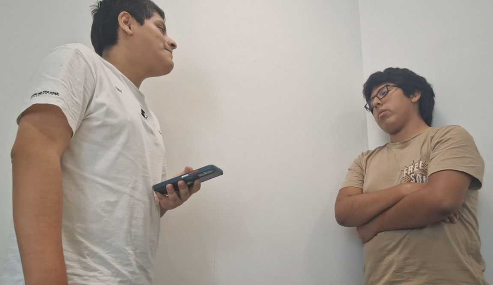
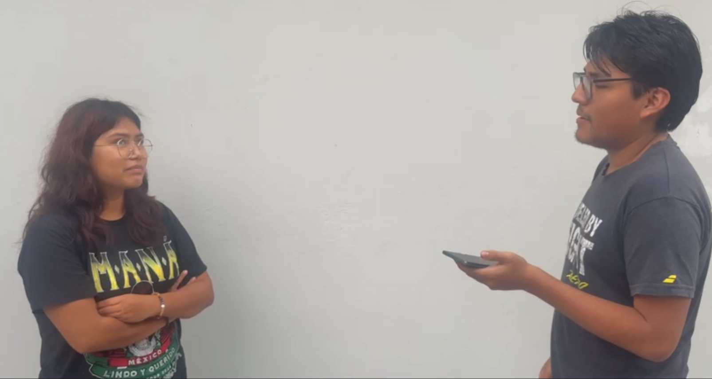
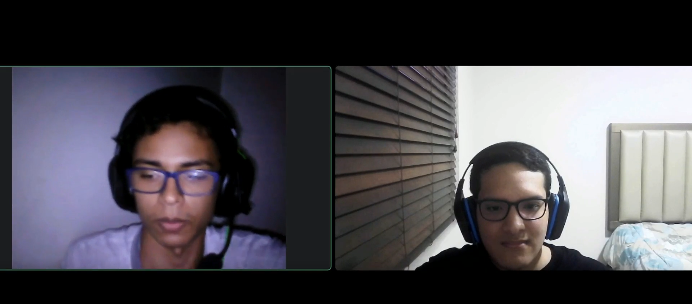

# CAPÍTULO II: REQUIREMENTS ELICITATION & ANALYSIS

## 2.1. Competidores

### 2.1.1. Análisis competitivo.
<table border="1" cellspacing="0" cellpadding="7" style="border-collapse: collapse; width: 100%; border: 2px solid black;"> <tr> <th colspan="6" align="left">Competitive Analysis Landscape</th> </tr> <tr> <td colspan="2" rowspan="2"><b>¿Por qué llevar a cabo este análisis?</b></td> <td colspan="4"><b>Identificar las características, fortalezas y debilidades de los principales servicios de alquiler de bicicletas en Lima, con el propósito de reconocer oportunidades de diferenciación y establecer una propuesta de valor competitiva para la startup.</b></td> </tr> <tr> <td colspan="4">&nbsp;  </td> </tr> <tr> <td colspan="2"><b>Competidores</b></td>   <th align="center">
     
    <b>biciGO</b>
  </th> <th align="center">
     
    <b>CityBike Lima</b>
  </th>
  <th align="center">
     
    <b>GOGO Biking</b>
  </th><th align="center">
     
    <b>Casco Urbano</b>
  </th>
</tr></tr> <tr> <td rowspan="2" align="center"><b>Perfil</b></td> <td><b>Overview</b></td>
<td>
  Startup enfocada en el alquiler de bicicletas para desplazamientos urbanos de corta duración. Los usuarios podrán localizar bicicletas, iniciar y finalizar alquileres, realizar pagos y gestionar sus viajes mediante una plataforma web y móvil.
</td>

<td>
  Sistema de bicicletas compartidas que funciona mediante una red de bicicletas y estaciones ubicadas principalmente en Miraflores.
</td>

<td>
  Empresa dedicada al alquiler de bicicletas y a la realización de recorridos turísticos por diferentes zonas de Lima.
</td>

<td>
  Negocio especializado en bicicletas que ofrece alquiler, mantenimiento, reparación, tours y otros servicios relacionados.
</td>
</tr> <tr> <td> <b>Ventaja competitiva  ¿Qué valor ofrece a los clientes?</b> </td>
<td>
  Servicio digital sencillo y flexible, alquiler por tiempo, consulta de disponibilidad y posibilidad de implementar puntos mediante alianzas con universidades, empresas y establecimientos.
</td>

<td>
  Infraestructura ya implementada, estaciones establecidas, tarifas accesibles y reconocimiento dentro de Miraflores.
</td>

<td>
  Atención personalizada, experiencia en alquiler de bicicletas y recorridos turísticos especializados.
</td>

<td>
  Combina el alquiler de bicicletas con servicios de mantenimiento, reparación y otros servicios especializados.
</td>
</tr> <tr> <td align="center"><b>Perfil de Marketing</b></td> <td><b>Mercado objetivo</b></td>
<td>
  Estudiantes, jóvenes, trabajadores, residentes y turistas que necesiten realizar desplazamientos urbanos cortos de manera práctica, económica y sostenible.
</td>

<td>
  Residentes, trabajadores y visitantes de Miraflores que realizan desplazamientos de corta distancia.
</td>

<td>
  Principalmente turistas nacionales y extranjeros interesados en recorridos recreativos y turísticos en bicicleta.
</td>

<td>
  Ciclistas, turistas y personas interesadas en alquiler, mantenimiento o reparación de bicicletas.
</td>
</tr> <tr> <td>&nbsp;</td> <td><b>Estrategias de marketing</b></td>
<td>
  Redes sociales, descuentos para estudiantes y nuevos usuarios, programas de referidos y alianzas con universidades, empresas, hoteles, gimnasios, cafeterías y comercios.
</td>

<td>
  Promoción de la movilidad sostenible mediante página web, aplicación móvil y presencia de estaciones en espacios urbanos.
</td>

<td>
  Marketing enfocado en turismo, redes sociales, recomendaciones, promociones y difusión de tours.
</td>

<td>
  Promoción digital de sus servicios de alquiler, mantenimiento, reparación y productos relacionados.
</td>
</tr> <tr> <td rowspan="3" align="center"><b>Perfil del Producto</b></td> <td><b>Productos &amp; Servicios</b></td>
<td>
  Alquiler por tiempo, consulta de disponibilidad, inicio y finalización del alquiler, pagos digitales, historial de viajes, reporte de averías y planes para usuarios frecuentes.
</td>

<td>
  Bicicletas compartidas mediante estaciones, diferentes tipos de pases y gestión mediante aplicación y página web.
</td>

<td>
  Alquiler de bicicletas y tours guiados por diferentes zonas de Lima.
</td>

<td>
  Alquiler de bicicletas, mantenimiento, reparación, tours y accesorios.
</td>
</tr> <tr> <td><b>Precios &amp; Costos</b></td>
<td>
  Pago según el tiempo utilizado, planes diarios o mensuales y descuentos para estudiantes o usuarios frecuentes. Los principales costos corresponden a bicicletas, mantenimiento, desarrollo tecnológico, soporte e infraestructura básica.
</td>

<td>
  Diferentes tipos de pases con tarifas accesibles. Sus principales costos corresponden a bicicletas, estaciones, mantenimiento e infraestructura.
</td>

<td>
  Precios principalmente por tiempo de alquiler y servicios turísticos. Sus costos incluyen bicicletas, mantenimiento, locales, personal y guías.
</td>

<td>
  Precios según alquiler y servicios adicionales. Sus principales costos corresponden a mantenimiento, herramientas, personal, inventario y establecimiento físico.
</td>
</tr> <tr> <td> <b>Canales de distribución  (Web y/o Móvil)</b> </td>
<td>
  Plataforma web responsive, aplicación móvil y puntos físicos asociados para recoger y devolver bicicletas. También contará con un dashboard administrativo.
</td>

<td>
  Página web, aplicación móvil y estaciones físicas.
</td>

<td>
  Página web, redes sociales, contacto directo y establecimientos físicos.
</td>

<td>
  Página web, redes sociales y establecimiento físico.
</td>
</tr> <tr> <td rowspan="5" align="center"><b>Análisis SWOT</b></td>
<td colspan="5">
  <b>Realice esto para su startup y sus competidores. Sus fortalezas deberían apoyar sus oportunidades y contribuir a lo que ustedes definen como su posible ventaja competitiva.</b>
</td>
</tr> <tr> <td><b>Fortalezas</b></td>
<td>
  Plataforma web y móvil, modelo flexible, posibilidad de expansión mediante alianzas, gestión digital y enfoque en recorridos urbanos cortos.
</td>

<td>
  Infraestructura implementada, estaciones disponibles, tarifas accesibles y reconocimiento dentro de Miraflores.
</td>

<td>
  Experiencia en alquiler, atención personalizada y conocimiento del mercado turístico.
</td>

<td>
  Experiencia técnica, mantenimiento, reparación y variedad de servicios relacionados con bicicletas.
</td>
</tr> <tr> <td><b>Debilidades</b></td>
<td>
  Marca nueva, cantidad inicial limitada de bicicletas, capital reducido y dependencia inicial de alianzas para ampliar cobertura.
</td>

<td>
  Dependencia de estaciones determinadas y necesidad de nueva infraestructura para ampliar la cobertura.
</td>

<td>
  Dependencia de locales y horarios y orientación principalmente turística.
</td>

<td>
  Dependencia de un establecimiento físico y menor automatización del proceso de alquiler.
</td>
</tr> <tr> <td><b>Oportunidades</b></td>
<td>
  Crecimiento de la movilidad sostenible, congestión vehicular, alianzas con universidades y empresas y expansión hacia zonas con menor cobertura.
</td>

<td>
  Expansión hacia nuevos distritos, crecimiento del uso de bicicletas y desarrollo de nuevas ciclovías.
</td>

<td>
  Crecimiento del turismo urbano, nuevas rutas y alianzas con hoteles y agencias.
</td>

<td>
  Crecimiento del ciclismo urbano y mayor demanda de servicios de mantenimiento y reparación.
</td>
</tr> <tr> <td><b>Amenazas</b></td>
<td>
  Robo o vandalismo, costos de mantenimiento, accidentes, regulaciones municipales, nuevos competidores y otras alternativas de micromovilidad.
</td>

<td>
  Nuevos competidores, costos de expansión, daños y vandalismo de las bicicletas.
</td>

<td>
  Reducción del turismo, otros servicios turísticos y sistemas automatizados de alquiler.
</td>

<td>
  Competencia de talleres, plataformas digitales y sistemas de bicicletas compartidas.
</td>
</tr> <tr> <td>&nbsp;</td> <td>&nbsp;</td> <td>&nbsp;</td> <td>&nbsp;</td> <td>&nbsp;</td> <td>&nbsp;</td> </tr> </table>

### 2.1.2 Estrategias y tácticas frente a competidores

Se plantean estrategias y tácticas preliminares que permitan a **biciGO** afrontar las fortalezas de sus competidores, aprovechar sus debilidades y responder a las oportunidades y amenazas presentes en el mercado de alquiler de bicicletas.

| **Aspecto** | **biciGO** | **CityBike Lima** | **GOGO Biking** | **Casco Urbano** | **Acciones de biciGO** |
|---|---|---|---|---|---|
| **Fortalezas a afrontar** | Plataforma digital orientada a alquileres rápidos, flexibles y recorridos urbanos cortos. | Cuenta con infraestructura implementada, estaciones establecidas, tarifas accesibles y reconocimiento en Miraflores. | Posee experiencia en alquiler de bicicletas, atención personalizada y presencia en el mercado turístico. | Cuenta con experiencia técnica, mantenimiento, reparación y conocimiento especializado en bicicletas. | biciGO buscará diferenciarse mediante facilidad de uso, digitalización, flexibilidad y puntos de alquiler estratégicos, evitando competir únicamente por precio. |
| **Debilidades a aprovechar** | Al ser una startup nueva puede adaptar su plataforma y modelo de negocio desde el inicio según las necesidades de los usuarios. | Depende de estaciones específicas y necesita infraestructura adicional para ampliar su cobertura. | Su servicio está orientado principalmente al turismo y depende de locales y horarios determinados. | Su operación depende principalmente de un establecimiento físico y presenta menor automatización del alquiler. | Implementar puntos mediante alianzas con universidades, empresas, hoteles, estacionamientos y comercios, evitando depender de un único establecimiento o de grandes estaciones. |
| **Oportunidades** | Crecimiento de la movilidad sostenible, mayor uso de servicios digitales y necesidad de alternativas para recorridos urbanos cortos. | El uso de bicicletas compartidas demuestra que existe interés por este tipo de movilidad. | La existencia de alquileres turísticos demuestra que existe demanda por servicios de bicicletas. | El crecimiento del ciclismo urbano genera mayor interés por bicicletas y servicios relacionados. | Crear alianzas con universidades y empresas, promociones para estudiantes, planes para usuarios frecuentes y expansión hacia zonas con menor cobertura. |
| **Amenazas** | Robo, vandalismo, costos de mantenimiento, accidentes, regulaciones municipales y aparición de nuevos competidores. | Puede ampliar su infraestructura o mejorar su plataforma y competir en nuevas zonas. | Puede ampliar sus servicios hacia alquileres urbanos de corta duración. | Puede incorporar herramientas digitales y aumentar su presencia en el mercado de alquiler. | Implementar registro obligatorio de usuarios, historial de alquileres, reporte de daños, mantenimiento preventivo y expansión progresiva para reducir riesgos. |
| **Estrategia competitiva** | Ofrecer un servicio digital, sencillo, flexible y orientado a desplazamientos urbanos de corta duración. | Competir mediante mayor flexibilidad y presencia en zonas donde CityBike tenga menor cobertura. | Diferenciarse mediante alquileres urbanos rápidos y autoservicio digital en lugar de centrarse principalmente en tours. | Diferenciarse mediante automatización del alquiler y disponibilidad desde diferentes puntos. | Posicionar a biciGO como una alternativa de movilidad urbana práctica, digital y accesible. |
| **Tácticas preliminares** | Plataforma web y móvil, alquiler por tiempo, pagos digitales, historial de viajes, reportes y dashboard administrativo. | Implementar puntos en universidades y establecimientos privados, ofrecer descuentos para estudiantes y simplificar el proceso de alquiler. | Ofrecer alquileres de 30 minutos, 1 hora o varias horas y promociones para usuarios frecuentes. | Permitir localizar bicicletas, iniciar y finalizar alquileres y reportar problemas desde la plataforma. | Redes sociales, programa de referidos, descuentos iniciales, alianzas estratégicas, planes mensuales, mantenimiento preventivo y expansión según la demanda. |

##  Estrategia general

La estrategia competitiva de **biciGO** estará basada en ofrecer un servicio de alquiler de bicicletas **digital, flexible y accesible**, orientado principalmente a desplazamientos urbanos de corta duración.

La startup buscará aprovechar las limitaciones de los competidores mediante una mayor facilidad de uso, puntos de alquiler estratégicos y alianzas con universidades, empresas y establecimientos privados.

## Principales tácticas

- Implementar una plataforma web y móvil sencilla.
- Permitir consultar bicicletas disponibles.
- Facilitar el inicio y finalización de los alquileres.
- Incorporar pagos digitales.
- Ofrecer descuentos para estudiantes y nuevos usuarios.
- Implementar programas de referidos.
- Crear planes para usuarios frecuentes.
- Establecer alianzas con universidades, empresas y comercios.
- Implementar reportes de daños y averías.
- Gestionar el mantenimiento preventivo de las bicicletas.
- Expandir progresivamente los puntos de alquiler según la demanda.

## 2.2. Entrevistas

### 2.2.1. Diseño de entrevistas

A continuación, se presentan las preguntas principales y complementarias diseñadas para cada segmento objetivo.

#### Segmento 1: Ciudadanos urbanos que realizan trayectos cortos

Este segmento está compuesto por estudiantes, trabajadores y profesionales jóvenes que residen en Lima Metropolitana y requieren desplazamientos frecuentes en zonas congestionadas.

##### Preguntas principales
| N° | Pregunta |
|---|---|
| 1 | ¿Cuál es su edad, distrito de residencia, ocupación actual y estado civil? |
| 2 | ¿Con qué frecuencia realiza desplazamientos cortos dentro de la ciudad y en qué horarios? |
| 3 | ¿Qué medio de transporte utiliza con mayor frecuencia para recorridos cortos y por qué? |
| 4 | ¿Qué tan cómodo o frustrado se siente al usar transporte público o taxis para trayectos cortos? |
| 5 | ¿Qué factores influyen en su decisión al elegir un medio de transporte para desplazamientos diarios? |
| 6 | ¿Ha considerado alguna vez usar bicicletas como alternativa para moverse por la ciudad? ¿Por qué sí o por qué no? |
| 7 | ¿Qué aspectos serían decisivos para que usted adopte un servicio de bicicletas compartidas? |
| 8 | ¿Cuál sería su nivel de aceptación frente a una app que permita registrar bicicletas, consultar disponibilidad y desbloquearlas mediante código QR? |
| 9 | ¿Está dispuesto a pagar por un servicio de bicicletas compartidas y qué tipo de tarifa le resultaría más atractiva? |
| 10 | ¿Qué tan importante es para usted la seguridad, la sostenibilidad y la rapidez al momento de desplazarse? |

##### Preguntas complementarias
- ¿Qué tan frecuente usa aplicaciones móviles para transporte o pago digital?
- ¿Qué tan seguro se siente al usar bicicletas en la ciudad y qué factores lo afectan?
- ¿Qué tan recomendable sería para usted desplazarse en bicicleta durante la mañana o la tarde en su zona?
- ¿Qué mejoras le gustaría ver en un servicio de bicicletas compartidas?
- ¿Qué tan importante es contar con estaciones cercanas a su hogar, universidad o trabajo?
- ¿Cuánto tiempo está dispuesto a invertir en buscar una bicicleta o station point antes de iniciar un viaje?
- ¿Se sentiría motivado a usar este servicio si existiera un plan mensual para usuarios frecuentes?
- ¿Qué tan útil considera que sería un servicio pensado para recorridos de 10 a 30 minutos?

#### Segmento 2: Instituciones que desean promover el uso de la bicicleta

Este segmento incluye universidades, municipalidades, empresas y otras organizaciones interesadas en fomentar la movilidad sostenible entre sus miembros, estudiantes o trabajadores.

##### Preguntas principales
| N° | Pregunta |
|---|---|
| 1 | ¿Qué tipo de institución representa y cuál es su rol en la promoción de la movilidad sostenible? |
| 2 | ¿Qué tipo de población atiende la institución y qué necesidades de movilidad presenta? |
| 3 | ¿Actualmente se promueve alguna iniciativa relacionada con la bicicleta o con medios de transporte sostenibles? |
| 4 | ¿Qué limitaciones tienen los empleados o estudiantes para desplazarse en bicicleta dentro de la ciudad? |
| 5 | ¿Considera que la movilidad sostenible es una prioridad dentro de la institución o comunidad que representa? |
| 6 | ¿Qué beneficios esperaría obtener una institución si implementa un servicio de bicicletas compartidas para sus usuarios? |
| 7 | ¿Qué tan viable sería para su institución contar con puntos de acceso o BikePoints dentro de sus instalaciones? |
| 8 | ¿Qué condiciones deberían cumplirse para que una alianza con una startup de micromovilidad sea atractiva para su organización? |
| 9 | ¿Qué indicadores permitirían medir el éxito de una iniciativa de movilidad sostenible dentro de la institución? |
| 10 | ¿Estaría dispuesto a participar en una estrategia de promoción del uso de bicicleta mediante beneficios, incentivos o convenios? |

##### Preguntas complementarias
- ¿Qué tan importante es para la institución reducir la congestión, mejorar la movilidad o mejorar la imagen sostenible de la organización?
- ¿Qué tan factible sería implementar bicicletas compartidas en espacios universitarios, corporativos o municipales?
- ¿Qué nivel de apoyo administrativo o financiero podría ofrecer la institución para una iniciativa de este tipo?
- ¿Qué tipo de usuarios serían los principales beneficiarios de una solución de movilidad sostenible?
- ¿Qué tan relevante es para la institución la seguridad del usuario, el mantenimiento de la flota y la digitalización del servicio?
- ¿Qué tipo de servicios adicionales complementarios podrían ser valorados por la institución?
- ¿Qué barreras percibe para la adopción de bicicletas como opción de transporte institucional?
- ¿Qué tan viable es establecer alianzas con empresas o universidades para ampliar los puntos de uso del servicio?

### 2.2.2. Registro de entrevistas

#### Primer Segmento objetivo: Estudiantes y profesionales

<table style="width: 100%" align="center">
  <tr>
    <th>Entrevistado 1</th>
    <th>Entrevistado 2</th>
    <th>Entrevistado 3</th>
  </tr>
  <tr>
    <td align="center">
      
    </td>
    <td align="center">
      
    </td>
    <td align="center">
      
    </td>
  </tr>
  <tr>
    <td valign="top">
      <b>Entrevistador:</b> Juan David Ayllon Pauccar 
      <b>Entrevistado:</b> Fernando Güere Calero 
      <b>Edad:</b> 19 años  
      <b>Distrito:</b> Chaclacayo  
      <b>Estado civil:</b> Soltero  
      <b>Ocupación:</b> Estudiante de ingeniería  
      <b>Inicio de la entrevista:</b> 0:00   
      <b>Resumen:</b> El entrevistado usa principalmente la bicicleta para desplazamientos cortos porque la considera cómoda, económica y útil para hacer ejercicio. Considera incómodo y costoso utilizar transporte público o taxis para estos trayectos. Muestra interés en un servicio de bicicletas compartidas con una aplicación para consultar disponibilidad y desbloquear bicicletas mediante código QR, siempre que tenga tarifas razonables y condiciones de seguridad adecuadas.  
      <b>Perfil del entrevistado:</b> Fernando Güere Calero es un hombre de 19 años, soltero, residente en el distrito de Chaclacayo y estudiante de ingeniería. Forma parte del grupo de jóvenes que realiza desplazamientos cotidianos dentro de la ciudad y tiene experiencia utilizando la bicicleta como medio de transporte para recorridos cortos. Su perfil corresponde al de un usuario que busca alternativas prácticas para movilizarse en sus actividades diarias.
    </td>
    <td valign="top">
      <b>Entrevistador:</b>  
      <b>Entrevistado:</b>  
      <b>Edad:</b>  
      <b>Distrito:</b>  
      <b>Inicio de la entrevista:</b>   
      <b>Resumen:</b>   
      <b>Perfil del entrevistado:</b>
    </td>
    <td valign="top">
      <b>Entrevistador:</b>  
      <b>Entrevistado:</b>  
      <b>Edad:</b>  
      <b>Distrito:</b>  
      <b>Inicio de la entrevista:</b>   
      <b>Resumen:</b>   
      <b>Perfil del entrevistado:</b>
    </td>
  </tr>
</table>

#### Segundo Segmento objetivo: Transeuntes

<table style="width: 100%" align='center'>
  <tr>
    <th>Entrevistado 1</th>
    <th>Entrevistado 2</th>
    <th>Entrevistado 3</th>
  </tr>
  <tr>
    <td align='center'>
      
    </td>
    <td align='center'>
      
    </td>
    <td align='center'>
      
    </td>
  </tr>
  <tr>
    <td valign="top">
      <b>Entrevistador:</b> Eduardo Manuel Aguirre Ramos  
      <b>Entrevistado:</b> Antony Rodrigo Quito Ancasy 
      <b>Edad:</b> 20 años  
      <b>Distrito:</b> Chorrillos  
      <b>Inicio de la entrevista:</b> 1:18   
      <b>Resumen:</b> El entrevistado, joven de 20 años relató su experiencia sobre las mototaxis en la zona de Chorrillos,en el cual compartio sus dificultades tanto por el lado del precio como tambien el de no saber si el conductor pueda tener precaución al conducir además de ello aclaro que lo que priorizaria en una app de transporte seria ver el perfil del conductor para no tomar riesgos al pedir un viaje.
        
      <b>Perfil del entrevistado:</b>Hombre de 20 años que reside en Lima por el distrito de Chorrillos, ha vivido toda su vida alli y menciona que mayormente para transportarse a diferentes zonas pide mototaxi regularmente, además menciona problemas que le sucede dia a dia como el tener que "regatear" precios ademas de miedo por tener que subirse a una mototaxi la cual el conductor para ahorrar tiempo se metio en contra de la ruta y puso en peligro al pasajero.
    </td>
    <td valign="top">
      <b>Entrevistador:</b> Eduardo Manuel Aguirre Ramos  
      <b>Entrevistado:</b>   
      <b>Edad:</b>  años  
      <b>Distrito:</b> Carhuaz  
      <b>Inicio de la entrevista:</b>    
      <b>Resumen:</b> .
        
      <b>Perfil del entrevistado:</b>como pasajero.
    </td>
    <td valign="top">
      <b>Entrevistador:</b> Dalila Torres  
      <b>Entrevistado:</b> Ario Chavez  
      <b>Edad:</b> 22 años  
      <b>Distrito:</b> Huaraz  
      <b>Inicio de la entrevista:</b> 1:49   
      <b>Resumen:</b> El entrevista Ario indica que en Huaraz si hay muchas mototaxis y que la mayoría de personas las utilizan para transporte público, que existen grupos de WhatsApp donde se coordinan los viajes y que los conductores son independientes.  
       
      <b>Perfil del entrevistado:</b> Es un hombre de 22 años que reside en el distrito de Huaraz, donde menciona que es una ciudad turística y que hay mucha afluencia de personas, además menciona que las mototaxis son el principal medio de transporte público y que la mayoría de personas las utilizan para desplazarse a diferentes zonas y resalta los problemas diarios a los que se enfrenta, como la necesidad de "regatear" las tarifas. Asimismo, expresa el temor que le genera subir a este tipo de transporte, recordando ocasiones en las que el conductor, por intentar ahorrar tiempo, manejó en sentido contrario a la ruta permitida, poniendo en riesgo su seguridad como pasajero.
    </td>
  </tr>
</table>

### 2.2.3. Análisis de entrevistas

## 2.3. Needfinding

### 2.3.1. User Personas

### 2.3.2. User Task Matrix

### 2.3.3. User Journey Mapping

### 2.3.4. Empathy Mapping

## 2.4. Big Picture EventStorming

## 2.5. Ubiquitous Language