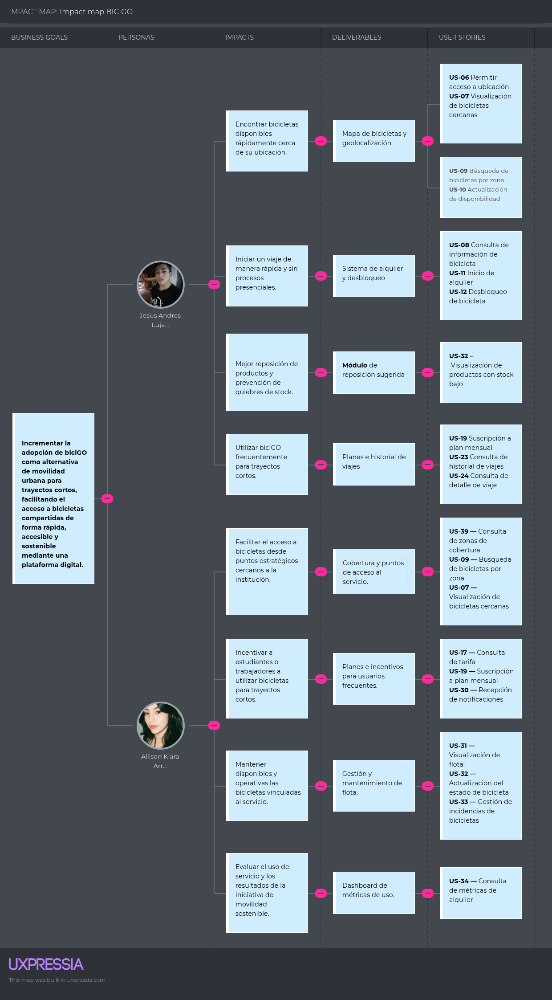

# CAPÍTULO III: REQUIREMENTS SPECIFICATION
## 3.1. User Stories

### Epics

Los siguientes Epics agrupan las User Stories y Technical Stories de biciGO según las principales capacidades funcionales del sistema.

<table border="1" cellspacing="0" cellpadding="7" style="border-collapse: collapse; width: 100%; border: 2px solid black;">
  <tr>
    <th align="center">Epic ID</th>
    <th align="center">Título</th>
    <th align="center">Descripción</th>
    <th align="center">Historias relacionadas</th>
  </tr>
  <tr>
    <td valign="top"><b>EP-01</b></td>
    <td valign="top">Gestión de cuentas y autenticación</td>
    <td valign="top">Agrupa las funcionalidades relacionadas con el registro, inicio de sesión, verificación, recuperación de contraseña y seguridad de acceso de los usuarios en biciGO.</td>
    <td valign="top">US-01 a US-05, TS-01 a TS-04</td>
  </tr>
  <tr>
    <td valign="top"><b>EP-02</b></td>
    <td valign="top">Localización y disponibilidad de bicicletas</td>
    <td valign="top">Incluye las funcionalidades que permiten consultar la ubicación, disponibilidad, información y cobertura de las bicicletas dentro de las zonas donde opera biciGO.</td>
    <td valign="top">US-06 a US-10, US-39, TS-05 a TS-07</td>
  </tr>
  <tr>
    <td valign="top"><b>EP-03</b></td>
    <td valign="top">Gestión de alquileres y viajes</td>
    <td valign="top">Reúne las funcionalidades necesarias para iniciar, desbloquear, consultar y finalizar alquileres, así como controlar la información del recorrido y su costo.</td>
    <td valign="top">US-11 a US-15, TS-08 a TS-11</td>
  </tr>
  <tr>
    <td valign="top"><b>EP-04</b></td>
    <td valign="top">Pagos, tarifas y suscripciones</td>
    <td valign="top">Comprende la gestión de métodos de pago, tarifas, cobros, comprobantes y planes de suscripción para usuarios frecuentes de biciGO.</td>
    <td valign="top">US-16 a US-20, US-36, US-37, TS-12 a TS-14</td>
  </tr>
  <tr>
    <td valign="top"><b>EP-05</b></td>
    <td valign="top">Perfil, historial y gestión personal</td>
    <td valign="top">Agrupa las funcionalidades que permiten al usuario consultar y actualizar su perfil, revisar viajes anteriores, gestionar su contraseña y desactivar su cuenta.</td>
    <td valign="top">US-21 a US-25, US-40, TS-15 y TS-16</td>
  </tr>
  <tr>
    <td valign="top"><b>EP-06</b></td>
    <td valign="top">Incidencias, soporte y notificaciones</td>
    <td valign="top">Incluye el reporte y seguimiento de problemas, la comunicación con soporte y la gestión de notificaciones relacionadas con alquileres, pagos e incidencias.</td>
    <td valign="top">US-26 a US-30, US-38, TS-17 y TS-18</td>
  </tr>
  <tr>
    <td valign="top"><b>EP-07</b></td>
    <td valign="top">Administración y gestión operativa</td>
    <td valign="top">Reúne las funcionalidades administrativas necesarias para supervisar la flota, gestionar usuarios e incidencias y consultar métricas operativas del servicio.</td>
    <td valign="top">US-31 a US-35, TS-19 y TS-20</td>
  </tr>
</table>

<table border="1" cellspacing="0" cellpadding="7" style="border-collapse: collapse; width: 100%; border: 2px solid black;">
    <tr>
      <th align="center">Epic / Story ID</th>
      <th align="center">Título</th>
      <th align="center">Descripción</th>
      <th align="center">Criterios de Aceptación</th>
      <th align="center">Relacionado con (Epic ID)</th>
    </tr>
    <tr>
      <td valign="top"><b>US-01</b></td>
      <td valign="top">Registro de usuario</td>
      <td valign="top"><b>Como visitante</b>, quiero registrarme en biciGO proporcionando mis datos personales y credenciales, para poder acceder a los servicios de alquiler de bicicletas.</td>
      <td valign="top"><b>Escenario 1: Registro exitoso</b>  <b>Dado</b> que el visitante no posee una cuenta registrada <b>Cuando</b> completa todos los campos obligatorios con información válida <b>Entonces</b> el sistema crea la cuenta correctamente <b>Y</b> permite al usuario acceder a la plataforma.  <b>Escenario 2: Correo electrónico ya registrado</b>  <b>Dado</b> que existe una cuenta asociada al correo proporcionado <b>Cuando</b> el visitante intenta registrarse utilizando dicho correo <b>Entonces</b> el sistema rechaza el registro <b>Y</b> informa que el correo ya se encuentra registrado.  <b>Escenario 3: Datos obligatorios incompletos</b>  <b>Dado</b> que el visitante se encuentra en el formulario de registro <b>Cuando</b> intenta registrarse sin completar todos los campos obligatorios <b>Entonces</b> el sistema no crea la cuenta <b>Y</b> indica qué información debe completar.</td>
      <td valign="top"><b>EP-01</b></td>
    </tr>
    <tr>
      <td valign="top"><b>US-02</b></td>
      <td valign="top">Inicio de sesión</td>
      <td valign="top"><b>Como usuario registrado</b>, quiero iniciar sesión con mis credenciales, para acceder de forma segura a las funcionalidades de biciGO.</td>
      <td valign="top"><b>Escenario 1: Inicio de sesión exitoso</b>  <b>Dado</b> que el usuario posee una cuenta activa <b>Cuando</b> ingresa un correo electrónico y una contraseña válidos <b>Entonces</b> el sistema autentica al usuario <b>Y</b> permite acceder a la pantalla principal.  <b>Escenario 2: Contraseña incorrecta</b>  <b>Dado</b> que el correo pertenece a una cuenta registrada <b>Cuando</b> el usuario proporciona una contraseña incorrecta <b>Entonces</b> el sistema rechaza el acceso <b>Y</b> informa que las credenciales son incorrectas.  <b>Escenario 3: Cuenta inexistente</b>  <b>Dado</b> que el usuario se encuentra en la pantalla de inicio de sesión <b>Cuando</b> proporciona un correo no registrado <b>Entonces</b> el sistema no inicia sesión <b>Y</b> informa que no existe una cuenta asociada al correo.</td>
      <td valign="top"><b>EP-01</b></td>
    </tr>
    <tr>
      <td valign="top"><b>US-03</b></td>
      <td valign="top">Recuperación de contraseña</td>
      <td valign="top"><b>Como usuario registrado</b>, quiero recuperar el acceso a mi cuenta cuando olvide mi contraseña, para poder continuar utilizando biciGO.</td>
      <td valign="top"><b>Escenario 1: Solicitud válida</b>  <b>Dado</b> que el usuario posee una cuenta registrada <b>Cuando</b> solicita recuperar su contraseña utilizando su correo <b>Entonces</b> el sistema inicia el proceso de recuperación <b>Y</b> envía las instrucciones correspondientes.  <b>Escenario 2: Correo no registrado</b>  <b>Dado</b> que el usuario se encuentra en la opción de recuperación de contraseña <b>Cuando</b> ingresa un correo no asociado a ninguna cuenta <b>Entonces</b> el sistema no inicia el proceso <b>Y</b> informa que el correo no está registrado.  <b>Escenario 3: Nueva contraseña válida</b>  <b>Dado</b> que el usuario accedió correctamente al proceso de recuperación <b>Cuando</b> establece una nueva contraseña que cumple los requisitos <b>Entonces</b> el sistema actualiza sus credenciales <b>Y</b> permite iniciar sesión con la nueva contraseña.</td>
      <td valign="top"><b>EP-01</b></td>
    </tr>
    <tr>
      <td valign="top"><b>US-04</b></td>
      <td valign="top">Verificación de cuenta</td>
      <td valign="top"><b>Como usuario recién registrado</b>, quiero verificar mi cuenta, para confirmar mis datos y habilitar el acceso completo a los servicios de biciGO.</td>
      <td valign="top"><b>Escenario 1: Verificación exitosa</b>  <b>Dado</b> que el usuario posee una cuenta pendiente de verificación <b>Cuando</b> realiza correctamente el proceso de validación <b>Entonces</b> el sistema marca la cuenta como verificada <b>Y</b> habilita las funcionalidades correspondientes.  <b>Escenario 2: Verificación inválida</b>  <b>Dado</b> que el usuario intenta validar su cuenta <b>Cuando</b> utiliza información o un código de verificación inválido <b>Entonces</b> el sistema rechaza la verificación <b>Y</b> solicita realizar nuevamente el proceso.  <b>Escenario 3: Cuenta previamente verificada</b>  <b>Dado</b> que la cuenta ya fue verificada <b>Cuando</b> el usuario intenta repetir el proceso <b>Entonces</b> el sistema mantiene el estado de la cuenta <b>Y</b> informa que la verificación ya fue realizada.</td>
      <td valign="top"><b>EP-01</b></td>
    </tr>
    <tr>
      <td valign="top"><b>US-05</b></td>
      <td valign="top">Cierre de sesión</td>
      <td valign="top"><b>Como usuario autenticado</b>, quiero cerrar mi sesión, para evitar que otras personas accedan a mi cuenta desde el mismo dispositivo.</td>
      <td valign="top"><b>Escenario 1: Cierre exitoso</b>  <b>Dado</b> que el usuario mantiene una sesión activa <b>Cuando</b> selecciona la opción de cerrar sesión <b>Entonces</b> el sistema finaliza la sesión <b>Y</b> redirige al usuario a la pantalla de acceso.  <b>Escenario 2: Acceso posterior al cierre</b>  <b>Dado</b> que la sesión fue finalizada <b>Cuando</b> el usuario intenta acceder a una funcionalidad restringida <b>Entonces</b> el sistema bloquea el acceso <b>Y</b> solicita iniciar sesión nuevamente.  <b>Escenario 3: Sesión expirada</b>  <b>Dado</b> que la sesión del usuario ha expirado <b>Cuando</b> intenta realizar una operación protegida <b>Entonces</b> el sistema impide continuar <b>Y</b> solicita nuevamente sus credenciales.</td>
      <td valign="top"><b>EP-01</b></td>
    </tr>
    <tr>
      <td valign="top"><b>US-06</b></td>
      <td valign="top">Permitir acceso a ubicación</td>
      <td valign="top"><b>Como usuario registrado</b>, quiero permitir que biciGO acceda a mi ubicación, para identificar bicicletas disponibles cercanas.</td>
      <td valign="top"><b>Escenario 1: Permiso concedido</b>  <b>Dado</b> que el usuario accede por primera vez al mapa <b>Cuando</b> concede permiso para utilizar su ubicación <b>Entonces</b> el sistema obtiene su ubicación aproximada <b>Y</b> centra el mapa en la zona correspondiente.  <b>Escenario 2: Permiso rechazado</b>  <b>Dado</b> que el sistema solicita acceso a la ubicación <b>Cuando</b> el usuario rechaza el permiso <b>Entonces</b> la plataforma continúa funcionando <b>Y</b> permite consultar manualmente otras zonas.  <b>Escenario 3: Ubicación no disponible</b>  <b>Dado</b> que el usuario permitió el acceso a su ubicación <b>Cuando</b> el dispositivo no puede determinarla <b>Entonces</b> el sistema informa la situación <b>Y</b> permite buscar una ubicación manualmente.</td>
      <td valign="top"><b>EP-02</b></td>
    </tr>
    <tr>
      <td valign="top"><b>US-07</b></td>
      <td valign="top">Visualización de bicicletas cercanas</td>
      <td valign="top"><b>Como usuario registrado</b>, quiero visualizar las bicicletas disponibles cerca de mi ubicación, para elegir una alternativa conveniente para mi viaje.</td>
      <td valign="top"><b>Escenario 1: Bicicletas disponibles</b>  <b>Dado</b> que existen bicicletas disponibles cerca del usuario <b>Cuando</b> accede al mapa principal <b>Entonces</b> el sistema muestra las bicicletas disponibles <b>Y</b> indica su ubicación aproximada.  <b>Escenario 2: Sin bicicletas disponibles</b>  <b>Dado</b> que no existen bicicletas disponibles en la zona consultada <b>Cuando</b> el usuario visualiza el mapa <b>Entonces</b> el sistema informa que no existen unidades disponibles <b>Y</b> mantiene visible el mapa para consultar otras zonas.  <b>Escenario 3: Cambio de disponibilidad</b>  <b>Dado</b> que una bicicleta cambia de estado <b>Cuando</b> el usuario actualiza la información del mapa <b>Entonces</b> el sistema refleja el nuevo estado <b>Y</b> evita mostrar información obsoleta.</td>
      <td valign="top"><b>EP-02</b></td>
    </tr>
    <tr>
      <td valign="top"><b>US-08</b></td>
      <td valign="top">Consulta de información de bicicleta</td>
      <td valign="top"><b>Como usuario registrado</b>, quiero consultar la información de una bicicleta, para verificar su disponibilidad y condición antes de alquilarla.</td>
      <td valign="top"><b>Escenario 1: Consulta exitosa</b>  <b>Dado</b> que el usuario observa una bicicleta en el mapa <b>Cuando</b> selecciona dicha bicicleta <b>Entonces</b> el sistema muestra su información disponible <b>Y</b> indica si puede ser alquilada.  <b>Escenario 2: Bicicleta no disponible</b>  <b>Dado</b> que la bicicleta seleccionada dejó de estar disponible <b>Cuando</b> el usuario consulta su información <b>Entonces</b> el sistema muestra su estado actualizado <b>Y</b> impide iniciar un alquiler.  <b>Escenario 3: Bicicleta fuera de servicio</b>  <b>Dado</b> que una bicicleta fue marcada para mantenimiento <b>Cuando</b> el usuario intenta consultarla para alquilarla <b>Entonces</b> el sistema informa que se encuentra fuera de servicio <b>Y</b> no permite seleccionarla para alquiler.</td>
      <td valign="top"><b>EP-02</b></td>
    </tr>
    <tr>
      <td valign="top"><b>US-09</b></td>
      <td valign="top">Búsqueda de bicicletas por zona</td>
      <td valign="top"><b>Como usuario registrado</b>, quiero buscar bicicletas en una zona específica, para planificar un desplazamiento aunque no me encuentre actualmente en ese lugar.</td>
      <td valign="top"><b>Escenario 1: Zona encontrada</b>  <b>Dado</b> que el usuario desea consultar otra ubicación <b>Cuando</b> ingresa una zona válida <b>Entonces</b> el sistema posiciona el mapa en esa zona <b>Y</b> muestra las bicicletas disponibles.  <b>Escenario 2: Zona sin disponibilidad</b>  <b>Dado</b> que la ubicación ingresada es válida <b>Cuando</b> no existen bicicletas disponibles en ella <b>Entonces</b> el sistema informa que no existen unidades disponibles.  <b>Escenario 3: Ubicación inválida</b>  <b>Dado</b> que el usuario utiliza el buscador <b>Cuando</b> ingresa una ubicación que no puede ser identificada <b>Entonces</b> el sistema informa que la ubicación no fue encontrada <b>Y</b> permite realizar una nueva búsqueda.</td>
      <td valign="top"><b>EP-02</b></td>
    </tr>
    <tr>
      <td valign="top"><b>US-10</b></td>
      <td valign="top">Actualización de disponibilidad</td>
      <td valign="top"><b>Como usuario registrado</b>, quiero actualizar la disponibilidad de bicicletas mostrada, para consultar información reciente antes de seleccionar una unidad.</td>
      <td valign="top"><b>Escenario 1: Actualización exitosa</b>  <b>Dado</b> que el usuario se encuentra visualizando el mapa <b>Cuando</b> solicita actualizar la información <b>Entonces</b> el sistema obtiene los estados más recientes <b>Y</b> actualiza las bicicletas mostradas.  <b>Escenario 2: Bicicleta recientemente ocupada</b>  <b>Dado</b> que una bicicleta estaba disponible anteriormente <b>Cuando</b> otro usuario inicia su alquiler <b>Entonces</b> el sistema actualiza su estado <b>Y</b> deja de mostrarla como disponible.  <b>Escenario 3: Error al actualizar</b>  <b>Dado</b> que existe un problema de comunicación <b>Cuando</b> el usuario solicita actualizar el mapa <b>Entonces</b> el sistema informa que no pudo obtener datos recientes <b>Y</b> permite intentar nuevamente.</td>
      <td valign="top"><b>EP-02</b></td>
    </tr>
    <tr>
      <td valign="top"><b>US-11</b></td>
      <td valign="top">Inicio de alquiler</td>
      <td valign="top"><b>Como usuario registrado</b>, quiero iniciar el alquiler de una bicicleta disponible, para utilizarla durante mi desplazamiento.</td>
      <td valign="top"><b>Escenario 1: Inicio exitoso</b>  <b>Dado</b> que el usuario se encuentra autenticado y la bicicleta está disponible <b>Cuando</b> solicita iniciar el alquiler <b>Entonces</b> el sistema registra el inicio del servicio <b>Y</b> asigna la bicicleta al usuario.  <b>Escenario 2: Bicicleta no disponible</b>  <b>Dado</b> que la bicicleta seleccionada ya está siendo utilizada <b>Cuando</b> el usuario intenta alquilarla <b>Entonces</b> el sistema rechaza la solicitud <b>Y</b> informa que la bicicleta no está disponible.  <b>Escenario 3: Alquiler previamente activo</b>  <b>Dado</b> que el usuario ya posee un alquiler activo <b>Cuando</b> intenta iniciar otro alquiler <b>Entonces</b> el sistema rechaza la operación <b>Y</b> solicita finalizar primero el alquiler actual.</td>
      <td valign="top"><b>EP-03</b></td>
    </tr>
    <tr>
      <td valign="top"><b>US-12</b></td>
      <td valign="top">Desbloqueo de bicicleta</td>
      <td valign="top"><b>Como usuario con un alquiler autorizado</b>, quiero desbloquear la bicicleta mediante el mecanismo proporcionado por biciGO, para comenzar mi recorrido.</td>
      <td valign="top"><b>Escenario 1: Desbloqueo exitoso</b>  <b>Dado</b> que existe un alquiler válido asociado a la bicicleta <b>Cuando</b> el usuario utiliza correctamente el código de desbloqueo <b>Entonces</b> el sistema autoriza el desbloqueo <b>Y</b> habilita el inicio del recorrido.  <b>Escenario 2: Código incorrecto</b>  <b>Dado</b> que el usuario intenta desbloquear una bicicleta <b>Cuando</b> introduce un código inválido <b>Entonces</b> el sistema rechaza la operación <b>Y</b> informa que el código no es válido.  <b>Escenario 3: Código asociado a otra bicicleta</b>  <b>Dado</b> que el usuario posee un alquiler activo <b>Cuando</b> intenta utilizar el código en una bicicleta diferente <b>Entonces</b> el sistema impide el desbloqueo <b>Y</b> indica la bicicleta correspondiente.</td>
      <td valign="top"><b>EP-03</b></td>
    </tr>
    <tr>
      <td valign="top"><b>US-13</b></td>
      <td valign="top">Consulta del viaje activo</td>
      <td valign="top"><b>Como usuario con un alquiler activo</b>, quiero consultar la información de mi recorrido, para conocer el estado actual de mi viaje.</td>
      <td valign="top"><b>Escenario 1: Viaje activo</b>  <b>Dado</b> que el usuario posee un alquiler en curso <b>Cuando</b> accede al detalle del viaje <b>Entonces</b> el sistema muestra la información disponible del recorrido <b>Y</b> mantiene visible el estado activo.  <b>Escenario 2: Sin viaje activo</b>  <b>Dado</b> que el usuario no posee un alquiler vigente <b>Cuando</b> intenta consultar un viaje activo <b>Entonces</b> el sistema informa que actualmente no existe uno.  <b>Escenario 3: Información actualizada</b>  <b>Dado</b> que el recorrido continúa en ejecución <b>Cuando</b> el usuario actualiza la pantalla <b>Entonces</b> el sistema presenta los datos más recientes del viaje.</td>
      <td valign="top"><b>EP-03</b></td>
    </tr>
    <tr>
      <td valign="top"><b>US-14</b></td>
      <td valign="top">Consulta de costo durante el viaje</td>
      <td valign="top"><b>Como usuario con un alquiler activo</b>, quiero consultar el costo acumulado del recorrido, para controlar cuánto estoy gastando mientras utilizo la bicicleta.</td>
      <td valign="top"><b>Escenario 1: Costo disponible</b>  <b>Dado</b> que existe un alquiler activo <b>Cuando</b> el usuario consulta la información del viaje <b>Entonces</b> el sistema calcula el costo acumulado <b>Y</b> lo muestra al usuario.  <b>Escenario 2: Actualización del recorrido</b>  <b>Dado</b> que el usuario continúa desplazándose <b>Cuando</b> aumenta la distancia registrada <b>Entonces</b> el sistema recalcula el costo correspondiente <b>Y</b> muestra el nuevo importe acumulado.  <b>Escenario 3: Error temporal de cálculo</b>  <b>Dado</b> que no puede obtenerse temporalmente la información necesaria <b>Cuando</b> el usuario consulta el costo <b>Entonces</b> el sistema informa que el cálculo no está disponible momentáneamente <b>Y</b> permite actualizarlo posteriormente.</td>
      <td valign="top"><b>EP-03</b></td>
    </tr>
    <tr>
      <td valign="top"><b>US-15</b></td>
      <td valign="top">Finalización de alquiler</td>
      <td valign="top"><b>Como usuario con un alquiler activo</b>, quiero finalizar correctamente mi alquiler, para detener el cobro y liberar la bicicleta para otros usuarios.</td>
      <td valign="top"><b>Escenario 1: Finalización exitosa</b>  <b>Dado</b> que el usuario posee un alquiler activo <b>Cuando</b> solicita finalizarlo correctamente <b>Entonces</b> el sistema registra la hora de finalización <b>Y</b> calcula el importe total correspondiente.  <b>Escenario 2: Bicicleta liberada</b>  <b>Dado</b> que el alquiler fue finalizado correctamente <b>Cuando</b> el sistema confirma el cierre <b>Entonces</b> la bicicleta cambia a estado disponible <b>Y</b> puede ser consultada por otros usuarios cuando corresponda.  <b>Escenario 3: Error durante la finalización</b>  <b>Dado</b> que existe un problema al procesar el cierre <b>Cuando</b> el usuario intenta finalizar el alquiler <b>Entonces</b> el sistema informa que la operación no pudo completarse <b>Y</b> evita registrar un cierre incorrecto.</td>
      <td valign="top"><b>EP-03</b></td>
    </tr>
    <tr>
      <td valign="top"><b>US-16</b></td>
      <td valign="top">Registro de método de pago</td>
      <td valign="top"><b>Como usuario registrado</b>, quiero registrar un método de pago, para poder pagar los servicios utilizados en biciGO.</td>
      <td valign="top"><b>Escenario 1: Método válido</b>  <b>Dado</b> que el usuario se encuentra gestionando sus métodos de pago <b>Cuando</b> proporciona información válida <b>Entonces</b> el sistema registra el método correctamente <b>Y</b> lo deja disponible para futuros cobros.  <b>Escenario 2: Información inválida</b>  <b>Dado</b> que el usuario intenta registrar un método de pago <b>Cuando</b> proporciona información incorrecta o incompleta <b>Entonces</b> el sistema rechaza el registro <b>Y</b> solicita corregir la información.  <b>Escenario 3: Error en validación</b>  <b>Dado</b> que el método de pago no puede ser validado <b>Cuando</b> se intenta completar el registro <b>Entonces</b> el sistema no lo almacena como válido <b>Y</b> informa el inconveniente.</td>
      <td valign="top"><b>EP-04</b></td>
    </tr>
    <tr>
      <td valign="top"><b>US-17</b></td>
      <td valign="top">Consulta de tarifa</td>
      <td valign="top"><b>Como usuario registrado</b>, quiero consultar la tarifa aplicable al alquiler, para conocer las condiciones de cobro antes de utilizar una bicicleta.</td>
      <td valign="top"><b>Escenario 1: Tarifa disponible</b>  <b>Dado</b> que el usuario consulta una bicicleta disponible <b>Cuando</b> revisa las condiciones del servicio <b>Entonces</b> el sistema muestra la tarifa vigente.  <b>Escenario 2: Usuario con suscripción</b>  <b>Dado</b> que el usuario posee un plan activo <b>Cuando</b> consulta la tarifa <b>Entonces</b> el sistema muestra las condiciones correspondientes a su plan.  <b>Escenario 3: Cambio de tarifa</b>  <b>Dado</b> que las condiciones de precio fueron actualizadas <b>Cuando</b> el usuario consulta un nuevo alquiler <b>Entonces</b> el sistema presenta la tarifa vigente actualizada.</td>
      <td valign="top"><b>EP-04</b></td>
    </tr>
    <tr>
      <td valign="top"><b>US-18</b></td>
      <td valign="top">Pago del alquiler</td>
      <td valign="top"><b>Como usuario</b>, quiero pagar el importe generado por mi alquiler, para completar correctamente la transacción del servicio utilizado.</td>
      <td valign="top"><b>Escenario 1: Pago exitoso</b>  <b>Dado</b> que el alquiler fue finalizado y existe un importe pendiente <b>Cuando</b> el sistema procesa un método de pago válido <b>Entonces</b> registra el pago correctamente <b>Y</b> marca la transacción como completada.  <b>Escenario 2: Pago rechazado</b>  <b>Dado</b> que existe un importe pendiente <b>Cuando</b> el método de pago es rechazado <b>Entonces</b> el sistema registra el pago como pendiente <b>Y</b> informa que debe utilizarse otro método.  <b>Escenario 3: Reintento de pago</b>  <b>Dado</b> que existe un pago pendiente <b>Cuando</b> el usuario proporciona un método válido y vuelve a intentarlo <b>Entonces</b> el sistema procesa nuevamente la transacción <b>Y</b> actualiza su estado si fue aprobada.</td>
      <td valign="top"><b>EP-04</b></td>
    </tr>
    <tr>
      <td valign="top"><b>US-19</b></td>
      <td valign="top">Suscripción a plan mensual</td>
      <td valign="top"><b>Como usuario frecuente</b>, quiero contratar un plan mensual de biciGO, para acceder a condiciones de uso más convenientes.</td>
      <td valign="top"><b>Escenario 1: Suscripción exitosa</b>  <b>Dado</b> que el usuario no posee una suscripción activa <b>Cuando</b> selecciona un plan disponible y completa el pago <b>Entonces</b> el sistema activa la suscripción <b>Y</b> muestra su periodo de vigencia.  <b>Escenario 2: Pago rechazado</b>  <b>Dado</b> que el usuario intenta contratar un plan <b>Cuando</b> el pago no puede ser procesado <b>Entonces</b> el sistema no activa la suscripción <b>Y</b> informa el resultado al usuario.  <b>Escenario 3: Suscripción ya activa</b>  <b>Dado</b> que el usuario ya posee el mismo plan vigente <b>Cuando</b> intenta contratarlo nuevamente <b>Entonces</b> el sistema evita generar una suscripción duplicada <b>Y</b> muestra la información del plan actual.</td>
      <td valign="top"><b>EP-04</b></td>
    </tr>
    <tr>
      <td valign="top"><b>US-20</b></td>
      <td valign="top">Cancelación de suscripción</td>
      <td valign="top"><b>Como usuario suscrito</b>, quiero cancelar mi suscripción mensual, para evitar futuras renovaciones cuando ya no desee utilizar el plan.</td>
      <td valign="top"><b>Escenario 1: Cancelación exitosa</b>  <b>Dado</b> que el usuario posee una suscripción activa <b>Cuando</b> solicita cancelarla <b>Entonces</b> el sistema registra la cancelación <b>Y</b> evita futuras renovaciones.  <b>Escenario 2: Vigencia restante</b>  <b>Dado</b> que el usuario cancela una suscripción antes de finalizar su periodo <b>Cuando</b> la cancelación es confirmada <b>Entonces</b> el sistema conserva los beneficios hasta la fecha establecida <b>Y</b> informa cuándo finalizarán.  <b>Escenario 3: Sin suscripción activa</b>  <b>Dado</b> que el usuario no posee una suscripción vigente <b>Cuando</b> intenta cancelarla <b>Entonces</b> el sistema informa que no existe un plan activo.</td>
      <td valign="top"><b>EP-04</b></td>
    </tr>
    <tr>
      <td valign="top"><b>US-21</b></td>
      <td valign="top">Consulta de perfil</td>
      <td valign="top"><b>Como usuario registrado</b>, quiero consultar la información de mi perfil, para verificar los datos asociados a mi cuenta.</td>
      <td valign="top"><b>Escenario 1: Consulta exitosa</b>  <b>Dado</b> que el usuario se encuentra autenticado <b>Cuando</b> accede a su perfil <b>Entonces</b> el sistema muestra la información registrada en su cuenta.  <b>Escenario 2: Sesión inválida</b>  <b>Dado</b> que la sesión dejó de ser válida <b>Cuando</b> el usuario intenta acceder al perfil <b>Entonces</b> el sistema impide el acceso <b>Y</b> solicita iniciar sesión nuevamente.  <b>Escenario 3: Información actualizada</b>  <b>Dado</b> que el usuario modificó previamente sus datos <b>Cuando</b> consulta nuevamente el perfil <b>Entonces</b> el sistema muestra la información actualizada.</td>
      <td valign="top"><b>EP-05</b></td>
    </tr>
    <tr>
      <td valign="top"><b>US-22</b></td>
      <td valign="top">Edición de perfil</td>
      <td valign="top"><b>Como usuario registrado</b>, quiero modificar mis datos personales, para mantener actualizada la información de mi cuenta.</td>
      <td valign="top"><b>Escenario 1: Actualización exitosa</b>  <b>Dado</b> que el usuario accede a la edición de perfil <b>Cuando</b> modifica sus datos utilizando información válida <b>Entonces</b> el sistema guarda los cambios <b>Y</b> muestra la información actualizada.  <b>Escenario 2: Información inválida</b>  <b>Dado</b> que el usuario está modificando sus datos <b>Cuando</b> proporciona información con un formato incorrecto <b>Entonces</b> el sistema rechaza los cambios <b>Y</b> indica qué datos deben corregirse.  <b>Escenario 3: Campos obligatorios vacíos</b>  <b>Dado</b> que existen campos necesarios para mantener la cuenta <b>Cuando</b> el usuario intenta dejarlos vacíos <b>Entonces</b> el sistema impide guardar los cambios <b>Y</b> solicita completar la información requerida.</td>
      <td valign="top"><b>EP-05</b></td>
    </tr>
    <tr>
      <td valign="top"><b>US-23</b></td>
      <td valign="top">Consulta de historial de viajes</td>
      <td valign="top"><b>Como usuario registrado</b>, quiero consultar mis viajes anteriores, para revisar el uso que he realizado de biciGO.</td>
      <td valign="top"><b>Escenario 1: Historial disponible</b>  <b>Dado</b> que el usuario realizó alquileres anteriormente <b>Cuando</b> accede a su historial <b>Entonces</b> el sistema muestra sus viajes registrados <b>Y</b> los organiza para facilitar su consulta.  <b>Escenario 2: Sin viajes previos</b>  <b>Dado</b> que el usuario todavía no ha utilizado ninguna bicicleta <b>Cuando</b> consulta el historial <b>Entonces</b> el sistema informa que aún no existen viajes registrados.  <b>Escenario 3: Selección de viaje</b>  <b>Dado</b> que existen varios viajes en el historial <b>Cuando</b> el usuario selecciona uno <b>Entonces</b> el sistema permite acceder a su información detallada.</td>
      <td valign="top"><b>EP-05</b></td>
    </tr>
    <tr>
      <td valign="top"><b>US-24</b></td>
      <td valign="top">Consulta de detalle de viaje</td>
      <td valign="top"><b>Como usuario registrado</b>, quiero consultar el detalle de un viaje realizado, para conocer su duración, distancia y costo final.</td>
      <td valign="top"><b>Escenario 1: Detalle disponible</b>  <b>Dado</b> que el viaje pertenece al historial del usuario <b>Cuando</b> selecciona dicho registro <b>Entonces</b> el sistema muestra la información disponible del viaje <b>Y</b> presenta el costo correspondiente.  <b>Escenario 2: Registro inexistente</b>  <b>Dado</b> que el viaje solicitado no existe <b>Cuando</b> el usuario intenta consultarlo <b>Entonces</b> el sistema informa que no puede encontrarse.  <b>Escenario 3: Protección de información</b>  <b>Dado</b> que un viaje pertenece a otro usuario <b>Cuando</b> se intenta acceder a su información <b>Entonces</b> el sistema rechaza la solicitud <b>Y</b> protege los datos asociados.</td>
      <td valign="top"><b>EP-05</b></td>
    </tr>
    <tr>
      <td valign="top"><b>US-25</b></td>
      <td valign="top">Cambio de contraseña</td>
      <td valign="top"><b>Como usuario registrado</b>, quiero cambiar mi contraseña desde mi perfil, para mantener segura mi cuenta.</td>
      <td valign="top"><b>Escenario 1: Cambio exitoso</b>  <b>Dado</b> que el usuario conoce su contraseña actual <b>Cuando</b> proporciona la contraseña actual y una nueva contraseña válida <b>Entonces</b> el sistema actualiza sus credenciales <b>Y</b> confirma que el cambio fue realizado.  <b>Escenario 2: Contraseña actual incorrecta</b>  <b>Dado</b> que el usuario intenta modificar sus credenciales <b>Cuando</b> proporciona una contraseña actual incorrecta <b>Entonces</b> el sistema rechaza el cambio <b>Y</b> mantiene la contraseña existente.  <b>Escenario 3: Nueva contraseña inválida</b>  <b>Dado</b> que el usuario está realizando el cambio <b>Cuando</b> proporciona una nueva contraseña que no cumple los requisitos <b>Entonces</b> el sistema impide actualizarla <b>Y</b> informa los requisitos correspondientes.</td>
      <td valign="top"><b>EP-05</b></td>
    </tr>
    <tr>
      <td valign="top"><b>US-26</b></td>
      <td valign="top">Reporte de bicicleta dañada</td>
      <td valign="top"><b>Como usuario</b>, quiero reportar una bicicleta que presente daños, para evitar que otros usuarios utilicen una unidad potencialmente insegura.</td>
      <td valign="top"><b>Escenario 1: Reporte exitoso</b>  <b>Dado</b> que el usuario identifica un problema en una bicicleta <b>Cuando</b> registra una descripción válida del daño <b>Entonces</b> el sistema crea el reporte <b>Y</b> lo asocia con la bicicleta correspondiente.  <b>Escenario 2: Información insuficiente</b>  <b>Dado</b> que el usuario intenta generar un reporte <b>Cuando</b> no proporciona la información requerida <b>Entonces</b> el sistema no registra la incidencia <b>Y</b> solicita completar los datos necesarios.  <b>Escenario 3: Bicicleta marcada para revisión</b>  <b>Dado</b> que se registra una incidencia relevante <b>Cuando</b> el sistema procesa el reporte <b>Entonces</b> la bicicleta queda marcada para revisión <b>Y</b> deja de ofrecerse como disponible cuando corresponda.</td>
      <td valign="top"><b>EP-06</b></td>
    </tr>
    <tr>
      <td valign="top"><b>US-27</b></td>
      <td valign="top">Reporte de problema durante un viaje</td>
      <td valign="top"><b>Como usuario con un alquiler activo</b>, quiero reportar un problema ocurrido durante mi recorrido, para recibir asistencia y dejar constancia del incidente.</td>
      <td valign="top"><b>Escenario 1: Reporte registrado</b>  <b>Dado</b> que el usuario posee un viaje activo <b>Cuando</b> describe el problema y envía el reporte <b>Entonces</b> el sistema registra la incidencia <b>Y</b> la relaciona con el alquiler actual.  <b>Escenario 2: Información incompleta</b>  <b>Dado</b> que el usuario intenta reportar una incidencia <b>Cuando</b> no proporciona una descripción suficiente <b>Entonces</b> el sistema solicita completar la información <b>Y</b> no registra el reporte hasta contar con los datos requeridos.  <b>Escenario 3: Incidencia crítica</b>  <b>Dado</b> que el problema puede impedir continuar el viaje <b>Cuando</b> el usuario lo reporta <b>Entonces</b> el sistema registra la incidencia como prioritaria <b>Y</b> proporciona las opciones de asistencia disponibles.</td>
      <td valign="top"><b>EP-06</b></td>
    </tr>
    <tr>
      <td valign="top"><b>US-28</b></td>
      <td valign="top">Contacto con soporte</td>
      <td valign="top"><b>Como usuario</b>, quiero comunicarme con soporte desde la plataforma, para obtener ayuda ante problemas relacionados con mi cuenta o alquileres.</td>
      <td valign="top"><b>Escenario 1: Solicitud enviada</b>  <b>Dado</b> que el usuario accede al apartado de soporte <b>Cuando</b> describe su consulta y la envía <b>Entonces</b> el sistema registra la solicitud <b>Y</b> confirma que fue recibida.  <b>Escenario 2: Información incompleta</b>  <b>Dado</b> que el usuario está creando una solicitud <b>Cuando</b> intenta enviarla sin describir el problema <b>Entonces</b> el sistema impide el envío <b>Y</b> solicita completar la información.  <b>Escenario 3: Solicitud asociada a alquiler</b>  <b>Dado</b> que el problema corresponde a un viaje específico <b>Cuando</b> el usuario selecciona dicho viaje <b>Entonces</b> el sistema relaciona la solicitud con el alquiler correspondiente.</td>
      <td valign="top"><b>EP-06</b></td>
    </tr>
    <tr>
      <td valign="top"><b>US-29</b></td>
      <td valign="top">Seguimiento de incidencias</td>
      <td valign="top"><b>Como usuario</b>, quiero consultar el estado de mis incidencias reportadas, para conocer si están pendientes, en revisión o resueltas.</td>
      <td valign="top"><b>Escenario 1: Incidencias disponibles</b>  <b>Dado</b> que el usuario posee reportes registrados <b>Cuando</b> accede a la sección de incidencias <b>Entonces</b> el sistema muestra sus reportes <b>Y</b> presenta el estado de cada uno.  <b>Escenario 2: Sin incidencias</b>  <b>Dado</b> que el usuario nunca realizó un reporte <b>Cuando</b> consulta esta sección <b>Entonces</b> el sistema informa que no existen incidencias registradas.  <b>Escenario 3: Incidencia actualizada</b>  <b>Dado</b> que soporte modificó el estado de un reporte <b>Cuando</b> el usuario vuelve a consultarlo <b>Entonces</b> el sistema muestra su estado actualizado.</td>
      <td valign="top"><b>EP-06</b></td>
    </tr>
    <tr>
      <td valign="top"><b>US-30</b></td>
      <td valign="top">Recepción de notificaciones</td>
      <td valign="top"><b>Como usuario</b>, quiero recibir notificaciones relacionadas con mis alquileres, pagos e incidencias, para mantenerme informado sobre eventos importantes de mi cuenta.</td>
      <td valign="top"><b>Escenario 1: Alquiler iniciado</b>  <b>Dado</b> que el usuario inicia correctamente un alquiler <b>Cuando</b> el sistema confirma la operación <b>Entonces</b> genera una notificación informativa <b>Y</b> comunica que el viaje fue iniciado.  <b>Escenario 2: Pago procesado</b>  <b>Dado</b> que se completa el cobro de un alquiler <b>Cuando</b> la transacción obtiene un resultado <b>Entonces</b> el sistema informa al usuario si fue aprobada o rechazada.  <b>Escenario 3: Incidencia actualizada</b>  <b>Dado</b> que existe una incidencia registrada <b>Cuando</b> cambia su estado <b>Entonces</b> el sistema notifica al usuario sobre la actualización.</td>
      <td valign="top"><b>EP-06</b></td>
    </tr>
    <tr>
      <td valign="top"><b>US-31</b></td>
      <td valign="top">Visualización de flota</td>
      <td valign="top"><b>Como administrador</b>, quiero consultar el estado de las bicicletas de la plataforma, para supervisar la disponibilidad general de la flota.</td>
      <td valign="top"><b>Escenario 1: Consulta exitosa</b>  <b>Dado</b> que el administrador se encuentra autenticado <b>Cuando</b> accede a la gestión de bicicletas <b>Entonces</b> el sistema muestra las unidades registradas <b>Y</b> presenta su estado actual.  <b>Escenario 2: Bicicleta en uso</b>  <b>Dado</b> que una bicicleta se encuentra asociada a un alquiler activo <b>Cuando</b> el administrador consulta la flota <b>Entonces</b> el sistema la muestra como ocupada.  <b>Escenario 3: Bicicleta fuera de servicio</b>  <b>Dado</b> que una bicicleta requiere mantenimiento <b>Cuando</b> el administrador revisa la flota <b>Entonces</b> el sistema la muestra como fuera de servicio.</td>
      <td valign="top"><b>EP-07</b></td>
    </tr>
    <tr>
      <td valign="top"><b>US-32</b></td>
      <td valign="top">Actualización del estado de bicicleta</td>
      <td valign="top"><b>Como administrador</b>, quiero modificar el estado operativo de una bicicleta, para controlar qué unidades pueden ser alquiladas por los usuarios.</td>
      <td valign="top"><b>Escenario 1: Cambio a mantenimiento</b>  <b>Dado</b> que una bicicleta presenta un problema <b>Cuando</b> el administrador la marca como en mantenimiento <b>Entonces</b> el sistema actualiza su estado <b>Y</b> evita nuevos alquileres.  <b>Escenario 2: Retorno al servicio</b>  <b>Dado</b> que una bicicleta fue reparada <b>Cuando</b> el administrador la marca nuevamente como disponible <b>Entonces</b> el sistema actualiza su estado <b>Y</b> permite que vuelva a mostrarse a los usuarios.  <b>Escenario 3: Bicicleta con alquiler activo</b>  <b>Dado</b> que una bicicleta está actualmente alquilada <b>Cuando</b> se intenta modificar su estado de forma incompatible <b>Entonces</b> el sistema rechaza la operación <b>Y</b> informa que existe un alquiler activo.</td>
      <td valign="top"><b>EP-07</b></td>
    </tr>
    <tr>
      <td valign="top"><b>US-33</b></td>
      <td valign="top">Gestión de incidencias de bicicletas</td>
      <td valign="top"><b>Como administrador</b>, quiero revisar los reportes relacionados con bicicletas dañadas, para priorizar su mantenimiento y mantener segura la flota.</td>
      <td valign="top"><b>Escenario 1: Reportes disponibles</b>  <b>Dado</b> que existen incidencias registradas por los usuarios <b>Cuando</b> el administrador accede a la gestión de incidencias <b>Entonces</b> el sistema muestra los reportes pendientes.  <b>Escenario 2: Cambio de estado</b>  <b>Dado</b> que una incidencia está pendiente <b>Cuando</b> el administrador inicia su revisión <b>Entonces</b> el sistema permite actualizar su estado <b>Y</b> registra el cambio realizado.  <b>Escenario 3: Incidencia resuelta</b>  <b>Dado</b> que el problema de una bicicleta fue solucionado <b>Cuando</b> el administrador marca la incidencia como resuelta <b>Entonces</b> el sistema registra su resolución <b>Y</b> conserva el reporte en el historial.</td>
      <td valign="top"><b>EP-07</b></td>
    </tr>
    <tr>
      <td valign="top"><b>US-34</b></td>
      <td valign="top">Consulta de métricas de alquiler</td>
      <td valign="top"><b>Como administrador</b>, quiero visualizar métricas de uso de las bicicletas, para analizar el comportamiento del servicio y apoyar decisiones operativas.</td>
      <td valign="top"><b>Escenario 1: Datos disponibles</b>  <b>Dado</b> que existen alquileres registrados <b>Cuando</b> el administrador accede al dashboard <b>Entonces</b> el sistema muestra las métricas disponibles <b>Y</b> presenta información sobre el uso de la plataforma.  <b>Escenario 2: Periodo seleccionado</b>  <b>Dado</b> que existen datos correspondientes a distintos periodos <b>Cuando</b> el administrador selecciona un rango de fechas <b>Entonces</b> el sistema actualiza las métricas <b>Y</b> utiliza únicamente los datos del periodo indicado.  <b>Escenario 3: Sin información</b>  <b>Dado</b> que no existen alquileres para el periodo seleccionado <b>Cuando</b> se realiza la consulta <b>Entonces</b> el sistema informa que no existen datos suficientes para mostrar resultados.</td>
      <td valign="top"><b>EP-07</b></td>
    </tr>
    <tr>
      <td valign="top"><b>US-35</b></td>
      <td valign="top">Gestión de usuarios</td>
      <td valign="top"><b>Como administrador</b>, quiero consultar y gestionar las cuentas de los usuarios, para atender situaciones que puedan afectar la seguridad o el correcto funcionamiento de biciGO.</td>
      <td valign="top"><b>Escenario 1: Consulta de usuarios</b>  <b>Dado</b> que el administrador posee los permisos correspondientes <b>Cuando</b> accede al listado de usuarios <b>Entonces</b> el sistema muestra las cuentas registradas <b>Y</b> permite consultar su estado.  <b>Escenario 2: Restricción de cuenta</b>  <b>Dado</b> que existe una razón válida para restringir una cuenta <b>Cuando</b> el administrador aplica la restricción <b>Entonces</b> el sistema actualiza su estado <b>Y</b> impide iniciar nuevos alquileres según corresponda.  <b>Escenario 3: Reactivación de cuenta</b>  <b>Dado</b> que una cuenta se encuentra restringida <b>Cuando</b> el administrador determina que puede reactivarse <b>Entonces</b> el sistema elimina la restricción <b>Y</b> restablece las funcionalidades correspondientes.</td>
      <td valign="top"><b>EP-07</b></td>
    </tr>
    <tr>
      <td valign="top"><b>US-36</b></td>
      <td valign="top">Eliminación de método de pago</td>
      <td valign="top"><b>Como usuario registrado</b>, quiero eliminar un método de pago que ya no utilizo, para mantener actualizadas mis opciones de cobro.</td>
      <td valign="top"><b>Escenario 1: Eliminación exitosa</b>  <b>Dado</b> que el usuario posee un método de pago registrado que no está asociado a una operación pendiente <b>Cuando</b> selecciona dicho método y confirma su eliminación <b>Entonces</b> el sistema elimina el método seleccionado <b>Y</b> actualiza la lista de métodos disponibles.  <b>Escenario 2: Método asociado a un pago pendiente</b>  <b>Dado</b> que el método seleccionado está vinculado a una transacción pendiente <b>Cuando</b> el usuario intenta eliminarlo <b>Entonces</b> el sistema rechaza temporalmente la eliminación <b>Y</b> informa que primero debe resolverse la transacción pendiente.  <b>Escenario 3: Método inexistente</b>  <b>Dado</b> que el método de pago ya fue eliminado o no pertenece al usuario <b>Cuando</b> se intenta procesar nuevamente su eliminación <b>Entonces</b> el sistema no realiza cambios <b>Y</b> informa que el método no está disponible.</td>
      <td valign="top"><b>EP-04</b></td>
    </tr>
    <tr>
      <td valign="top"><b>US-37</b></td>
      <td valign="top">Consulta de comprobantes de pago</td>
      <td valign="top"><b>Como usuario registrado</b>, quiero consultar los comprobantes de mis pagos realizados, para revisar los cargos asociados a mis alquileres y suscripciones.</td>
      <td valign="top"><b>Escenario 1: Comprobantes disponibles</b>  <b>Dado</b> que el usuario posee pagos completados <b>Cuando</b> accede a la sección de comprobantes <b>Entonces</b> el sistema muestra los comprobantes registrados <b>Y</b> permite consultar su información principal.  <b>Escenario 2: Sin comprobantes</b>  <b>Dado</b> que el usuario aún no ha realizado pagos <b>Cuando</b> accede a la sección de comprobantes <b>Entonces</b> el sistema informa que no existen comprobantes disponibles.  <b>Escenario 3: Consulta de un comprobante</b>  <b>Dado</b> que existe un comprobante asociado al usuario <b>Cuando</b> selecciona dicho registro <b>Entonces</b> el sistema muestra el detalle del pago correspondiente <b>Y</b> relaciona el comprobante con el servicio pagado.</td>
      <td valign="top"><b>EP-04</b></td>
    </tr>
    <tr>
      <td valign="top"><b>US-38</b></td>
      <td valign="top">Configuración de notificaciones</td>
      <td valign="top"><b>Como usuario registrado</b>, quiero configurar qué notificaciones deseo recibir, para controlar los avisos enviados por biciGO.</td>
      <td valign="top"><b>Escenario 1: Actualización exitosa</b>  <b>Dado</b> que el usuario accede a la configuración de notificaciones <b>Cuando</b> activa o desactiva una categoría disponible <b>Entonces</b> el sistema guarda la nueva preferencia <b>Y</b> la aplica a futuras notificaciones opcionales.  <b>Escenario 2: Configuración sin cambios</b>  <b>Dado</b> que el usuario mantiene las preferencias actuales <b>Cuando</b> sale de la configuración sin modificar opciones <b>Entonces</b> el sistema conserva la configuración existente.  <b>Escenario 3: Aviso operativo obligatorio</b>  <b>Dado</b> que ocurre un evento crítico que requiere informar al usuario <b>Cuando</b> la plataforma genera la notificación correspondiente <b>Entonces</b> el sistema envía el aviso operativo <b>Y</b> mantiene informada a la persona sobre la operación crítica.</td>
      <td valign="top"><b>EP-06</b></td>
    </tr>
    <tr>
      <td valign="top"><b>US-39</b></td>
      <td valign="top">Consulta de zonas de cobertura</td>
      <td valign="top"><b>Como usuario</b>, quiero consultar las zonas donde opera biciGO, para saber si el servicio está disponible en el lugar donde deseo utilizar una bicicleta.</td>
      <td valign="top"><b>Escenario 1: Zona con cobertura</b>  <b>Dado</b> que el usuario consulta una ubicación incluida en el área de operación <b>Cuando</b> selecciona o busca dicha zona <b>Entonces</b> el sistema indica que existe cobertura <b>Y</b> permite visualizar las bicicletas disponibles en el área.  <b>Escenario 2: Zona sin cobertura</b>  <b>Dado</b> que el usuario consulta una ubicación fuera del área de operación <b>Cuando</b> realiza la búsqueda <b>Entonces</b> el sistema informa que biciGO aún no opera en esa zona.  <b>Escenario 3: Cobertura actualizada</b>  <b>Dado</b> que se incorpora una nueva zona de operación <b>Cuando</b> el usuario vuelve a consultar el mapa de cobertura <b>Entonces</b> el sistema muestra la nueva zona disponible.</td>
      <td valign="top"><b>EP-02</b></td>
    </tr>
    <tr>
      <td valign="top"><b>US-40</b></td>
      <td valign="top">Desactivación de cuenta</td>
      <td valign="top"><b>Como usuario registrado</b>, quiero desactivar mi cuenta cuando ya no desee utilizar biciGO, para dejar de acceder a los servicios de la plataforma.</td>
      <td valign="top"><b>Escenario 1: Desactivación exitosa</b>  <b>Dado</b> que el usuario no posee alquileres ni pagos pendientes <b>Cuando</b> solicita desactivar su cuenta y confirma la acción <b>Entonces</b> el sistema cambia la cuenta a estado inactivo <b>Y</b> finaliza las sesiones activas.  <b>Escenario 2: Alquiler activo</b>  <b>Dado</b> que el usuario mantiene un alquiler en curso <b>Cuando</b> intenta desactivar su cuenta <b>Entonces</b> el sistema rechaza temporalmente la solicitud <b>Y</b> indica que primero debe finalizar el alquiler.  <b>Escenario 3: Pago pendiente</b>  <b>Dado</b> que el usuario posee una transacción pendiente <b>Cuando</b> solicita desactivar su cuenta <b>Entonces</b> el sistema impide completar la desactivación <b>Y</b> informa que primero debe resolver el pago pendiente.</td>
      <td valign="top"><b>EP-05</b></td>
    </tr>
    <tr>
      <td valign="top"><b>TS-01</b></td>
      <td valign="top">Register Passenger</td>
      <td valign="top"><b>Como desarrollador</b>, quiero implementar el endpoint de registro de usuario, para permitir la creación de cuentas en la plataforma.</td>
      <td valign="top"><b>Escenario 1: Registro exitoso</b>  <b>Dado</b> que un cliente envía una petición con correo válido, contraseña y datos obligatorios <b>Cuando</b> el endpoint <code>POST /api/auth/register</code> procesa la solicitud <b>Entonces</b> el sistema crea el usuario con estado activo <b>Y</b> retorna <code>201 Created</code> con el identificador y correo del usuario.  <b>Escenario 2: Correo duplicado</b>  <b>Dado</b> que un cliente envía una petición con un correo ya registrado <b>Cuando</b> el endpoint <code>POST /api/auth/register</code> procesa la solicitud <b>Entonces</b> el sistema retorna <code>409 Conflict</code> <b>Y</b> no crea un nuevo registro.  <b>Escenario 3: Datos inválidos</b>  <b>Dado</b> que la solicitud contiene campos obligatorios vacíos o con formato inválido <b>Cuando</b> el endpoint valida el cuerpo de la petición <b>Entonces</b> el sistema retorna <code>400 Bad Request</code> <b>Y</b> informa los campos que deben corregirse.</td>
      <td valign="top"><b>EP-01</b></td>
    </tr>
    <tr>
      <td valign="top"><b>TS-02</b></td>
      <td valign="top">Login User</td>
      <td valign="top"><b>Como desarrollador</b>, quiero implementar el endpoint de inicio de sesión, para autenticar usuarios y permitir el acceso seguro a las funciones privadas.</td>
      <td valign="top"><b>Escenario 1: Autenticación exitosa</b>  <b>Dado</b> que el cliente envía un correo registrado y una contraseña válida <b>Cuando</b> el endpoint <code>POST /api/auth/login</code> procesa las credenciales <b>Entonces</b> el sistema autentica al usuario y genera un token de acceso <b>Y</b> retorna <code>200 OK</code> con la información necesaria para la sesión.  <b>Escenario 2: Credenciales incorrectas</b>  <b>Dado</b> que el correo existe pero la contraseña no coincide <b>Cuando</b> el endpoint procesa la solicitud <b>Entonces</b> el sistema rechaza la autenticación <b>Y</b> retorna <code>401 Unauthorized</code>.  <b>Escenario 3: Usuario inexistente</b>  <b>Dado</b> que el cliente envía un correo no registrado <b>Cuando</b> el endpoint intenta autenticar la cuenta <b>Entonces</b> el sistema rechaza el acceso <b>Y</b> retorna <code>401 Unauthorized</code> sin exponer información sensible.</td>
      <td valign="top"><b>EP-01</b></td>
    </tr>
    <tr>
      <td valign="top"><b>TS-03</b></td>
      <td valign="top">Recover Password</td>
      <td valign="top"><b>Como desarrollador</b>, quiero implementar el proceso de recuperación de contraseña, para que un usuario pueda restablecer sus credenciales de forma segura.</td>
      <td valign="top"><b>Escenario 1: Solicitud válida</b>  <b>Dado</b> que el cliente envía un correo asociado a una cuenta <b>Cuando</b> el endpoint <code>POST /api/auth/password/recovery</code> procesa la solicitud <b>Entonces</b> el sistema genera un token temporal de recuperación <b>Y</b> retorna <code>200 OK</code> e inicia el flujo de restablecimiento.  <b>Escenario 2: Token inválido</b>  <b>Dado</b> que el usuario intenta cambiar la contraseña con un token inexistente o alterado <b>Cuando</b> el endpoint de restablecimiento valida el token <b>Entonces</b> el sistema rechaza la operación <b>Y</b> retorna <code>400 Bad Request</code>.  <b>Escenario 3: Token expirado</b>  <b>Dado</b> que el token superó su tiempo de vigencia <b>Cuando</b> el usuario intenta utilizarlo <b>Entonces</b> el sistema impide modificar la contraseña <b>Y</b> retorna <code>410 Gone</code> o una respuesta equivalente definida por la API.</td>
      <td valign="top"><b>EP-01</b></td>
    </tr>
    <tr>
      <td valign="top"><b>TS-04</b></td>
      <td valign="top">Verify Account</td>
      <td valign="top"><b>Como desarrollador</b>, quiero implementar la verificación de cuenta, para habilitar únicamente usuarios que hayan completado correctamente el proceso de validación.</td>
      <td valign="top"><b>Escenario 1: Verificación exitosa</b>  <b>Dado</b> que existe una cuenta pendiente y el cliente posee un código válido <b>Cuando</b> el endpoint <code>POST /api/auth/verify</code> procesa la solicitud <b>Entonces</b> el sistema actualiza la cuenta como verificada <b>Y</b> retorna <code>200 OK</code>.  <b>Escenario 2: Código inválido</b>  <b>Dado</b> que el código proporcionado no corresponde a la cuenta <b>Cuando</b> el endpoint valida la solicitud <b>Entonces</b> el sistema no modifica el estado del usuario <b>Y</b> retorna <code>400 Bad Request</code>.  <b>Escenario 3: Cuenta ya verificada</b>  <b>Dado</b> que la cuenta ya se encuentra verificada <b>Cuando</b> el cliente intenta repetir el proceso <b>Entonces</b> el sistema conserva el estado actual <b>Y</b> retorna una respuesta informativa sin duplicar la operación.</td>
      <td valign="top"><b>EP-01</b></td>
    </tr>
    <tr>
      <td valign="top"><b>TS-05</b></td>
      <td valign="top">Get Nearby Bikes</td>
      <td valign="top"><b>Como desarrollador</b>, quiero implementar la consulta de bicicletas cercanas, para mostrar al usuario las unidades disponibles según su ubicación.</td>
      <td valign="top"><b>Escenario 1: Bicicletas encontradas</b>  <b>Dado</b> que el cliente envía coordenadas válidas dentro de una zona con cobertura <b>Cuando</b> el endpoint <code>GET /api/bikes/nearby?lat={lat}&lng={lng}</code> procesa la consulta <b>Entonces</b> el sistema obtiene las bicicletas disponibles cercanas <b>Y</b> retorna <code>200 OK</code> con la lista de unidades.  <b>Escenario 2: Sin bicicletas disponibles</b>  <b>Dado</b> que la ubicación es válida pero no existen unidades disponibles <b>Cuando</b> el endpoint procesa la consulta <b>Entonces</b> el sistema devuelve una lista vacía <b>Y</b> retorna <code>200 OK</code>.  <b>Escenario 3: Coordenadas inválidas</b>  <b>Dado</b> que la latitud o longitud poseen un formato o rango incorrecto <b>Cuando</b> el endpoint valida los parámetros <b>Entonces</b> el sistema rechaza la consulta <b>Y</b> retorna <code>400 Bad Request</code>.</td>
      <td valign="top"><b>EP-02</b></td>
    </tr>
    <tr>
      <td valign="top"><b>TS-06</b></td>
      <td valign="top">Get Bike Detail</td>
      <td valign="top"><b>Como desarrollador</b>, quiero implementar el detalle de una bicicleta, para exponer su estado y datos necesarios antes de iniciar un alquiler.</td>
      <td valign="top"><b>Escenario 1: Bicicleta encontrada</b>  <b>Dado</b> que existe una bicicleta con el identificador solicitado <b>Cuando</b> el endpoint <code>GET /api/bikes/{bikeId}</code> procesa la consulta <b>Entonces</b> el sistema recupera la información de la bicicleta <b>Y</b> retorna <code>200 OK</code> con su estado actual.  <b>Escenario 2: Bicicleta inexistente</b>  <b>Dado</b> que no existe una bicicleta con el identificador recibido <b>Cuando</b> el endpoint procesa la solicitud <b>Entonces</b> el sistema no encuentra el recurso <b>Y</b> retorna <code>404 Not Found</code>.  <b>Escenario 3: Bicicleta en mantenimiento</b>  <b>Dado</b> que la bicicleta existe pero está fuera de servicio <b>Cuando</b> el usuario consulta su detalle <b>Entonces</b> el sistema retorna la información con estado de mantenimiento <b>Y</b> impide que sea tratada como disponible.</td>
      <td valign="top"><b>EP-02</b></td>
    </tr>
    <tr>
      <td valign="top"><b>TS-07</b></td>
      <td valign="top">Search Coverage Zone</td>
      <td valign="top"><b>Como desarrollador</b>, quiero implementar la consulta de zonas de cobertura, para indicar si biciGO opera en una ubicación determinada.</td>
      <td valign="top"><b>Escenario 1: Zona con cobertura</b>  <b>Dado</b> que el cliente envía una ubicación válida dentro del área de operación <b>Cuando</b> el endpoint <code>GET /api/coverage</code> procesa la consulta <b>Entonces</b> el sistema identifica la zona como cubierta <b>Y</b> retorna <code>200 OK</code> con la información de cobertura.  <b>Escenario 2: Zona sin cobertura</b>  <b>Dado</b> que la ubicación consultada está fuera del área de operación <b>Cuando</b> el endpoint procesa la solicitud <b>Entonces</b> el sistema indica que no existe cobertura <b>Y</b> retorna <code>200 OK</code> con el estado correspondiente.  <b>Escenario 3: Parámetros inválidos</b>  <b>Dado</b> que la consulta no contiene la información mínima requerida <b>Cuando</b> el endpoint valida los parámetros <b>Entonces</b> el sistema rechaza la solicitud <b>Y</b> retorna <code>400 Bad Request</code>.</td>
      <td valign="top"><b>EP-02</b></td>
    </tr>
    <tr>
      <td valign="top"><b>TS-08</b></td>
      <td valign="top">Start Rental</td>
      <td valign="top"><b>Como desarrollador</b>, quiero implementar el endpoint para iniciar un alquiler, para asociar una bicicleta disponible con un usuario autenticado.</td>
      <td valign="top"><b>Escenario 1: Alquiler iniciado</b>  <b>Dado</b> que el usuario está autenticado, no posee otro alquiler activo y la bicicleta está disponible <b>Cuando</b> el endpoint <code>POST /api/rentals</code> procesa la solicitud <b>Entonces</b> el sistema crea el alquiler y cambia la bicicleta a estado ocupado <b>Y</b> retorna <code>201 Created</code> con el identificador del alquiler.  <b>Escenario 2: Bicicleta no disponible</b>  <b>Dado</b> que la bicicleta ya está alquilada o fuera de servicio <b>Cuando</b> el cliente intenta iniciar el alquiler <b>Entonces</b> el sistema rechaza la operación <b>Y</b> retorna <code>409 Conflict</code>.  <b>Escenario 3: Usuario con alquiler activo</b>  <b>Dado</b> que el usuario ya posee un alquiler en curso <b>Cuando</b> el endpoint procesa una nueva solicitud <b>Entonces</b> el sistema impide crear otro alquiler <b>Y</b> retorna <code>409 Conflict</code>.</td>
      <td valign="top"><b>EP-03</b></td>
    </tr>
    <tr>
      <td valign="top"><b>TS-09</b></td>
      <td valign="top">Unlock Bike</td>
      <td valign="top"><b>Como desarrollador</b>, quiero implementar la validación del código de desbloqueo, para autorizar únicamente la apertura de la bicicleta asociada al alquiler vigente.</td>
      <td valign="top"><b>Escenario 1: Código válido</b>  <b>Dado</b> que existe un alquiler activo y el código corresponde a la bicicleta asignada <b>Cuando</b> el endpoint <code>POST /api/rentals/{rentalId}/unlock</code> procesa la solicitud <b>Entonces</b> el sistema valida el código y autoriza el desbloqueo <b>Y</b> retorna <code>200 OK</code>.  <b>Escenario 2: Código incorrecto</b>  <b>Dado</b> que el código enviado no coincide con el alquiler <b>Cuando</b> el endpoint valida la solicitud <b>Entonces</b> el sistema rechaza el desbloqueo <b>Y</b> retorna <code>400 Bad Request</code>.  <b>Escenario 3: Alquiler inexistente</b>  <b>Dado</b> que el identificador de alquiler no existe o no pertenece al usuario <b>Cuando</b> el cliente solicita el desbloqueo <b>Entonces</b> el sistema rechaza la operación <b>Y</b> retorna <code>404 Not Found</code> o <code>403 Forbidden</code> según corresponda.</td>
      <td valign="top"><b>EP-03</b></td>
    </tr>
    <tr>
      <td valign="top"><b>TS-10</b></td>
      <td valign="top">Get Active Rental</td>
      <td valign="top"><b>Como desarrollador</b>, quiero implementar la consulta del alquiler activo, para mostrar al usuario la información actual de su viaje.</td>
      <td valign="top"><b>Escenario 1: Viaje activo</b>  <b>Dado</b> que el usuario posee un alquiler en curso <b>Cuando</b> el endpoint <code>GET /api/rentals/active</code> procesa la consulta <b>Entonces</b> el sistema recupera los datos del alquiler vigente <b>Y</b> retorna <code>200 OK</code> con su información.  <b>Escenario 2: Sin viaje activo</b>  <b>Dado</b> que el usuario no posee ningún alquiler vigente <b>Cuando</b> el endpoint procesa la consulta <b>Entonces</b> el sistema no encuentra un alquiler activo <b>Y</b> retorna <code>204 No Content</code> o la respuesta definida por la API.  <b>Escenario 3: Usuario no autenticado</b>  <b>Dado</b> que la solicitud no contiene credenciales válidas <b>Cuando</b> el cliente intenta consultar el alquiler <b>Entonces</b> el sistema bloquea el acceso <b>Y</b> retorna <code>401 Unauthorized</code>.</td>
      <td valign="top"><b>EP-03</b></td>
    </tr>
    <tr>
      <td valign="top"><b>TS-11</b></td>
      <td valign="top">Finish Rental</td>
      <td valign="top"><b>Como desarrollador</b>, quiero implementar el endpoint de finalización de alquiler, para cerrar el viaje, calcular el importe y liberar la bicicleta.</td>
      <td valign="top"><b>Escenario 1: Finalización exitosa</b>  <b>Dado</b> que existe un alquiler activo válido <b>Cuando</b> el endpoint <code>POST /api/rentals/{rentalId}/finish</code> procesa la solicitud <b>Entonces</b> el sistema registra la hora final, calcula el costo y libera la bicicleta <b>Y</b> retorna <code>200 OK</code> con el resumen del viaje.  <b>Escenario 2: Alquiler ya finalizado</b>  <b>Dado</b> que el alquiler solicitado ya se encuentra cerrado <b>Cuando</b> el cliente intenta finalizarlo nuevamente <b>Entonces</b> el sistema evita duplicar el cierre <b>Y</b> retorna <code>409 Conflict</code>.  <b>Escenario 3: Alquiler inexistente</b>  <b>Dado</b> que no existe un alquiler con el identificador recibido <b>Cuando</b> el endpoint procesa la solicitud <b>Entonces</b> el sistema no encuentra el recurso <b>Y</b> retorna <code>404 Not Found</code>.</td>
      <td valign="top"><b>EP-03</b></td>
    </tr>
    <tr>
      <td valign="top"><b>TS-12</b></td>
      <td valign="top">Register Payment Method</td>
      <td valign="top"><b>Como desarrollador</b>, quiero implementar el registro de métodos de pago, para permitir que los usuarios dispongan de una opción válida para realizar cobros.</td>
      <td valign="top"><b>Escenario 1: Método registrado</b>  <b>Dado</b> que el usuario autenticado envía datos válidos de un método de pago <b>Cuando</b> el endpoint <code>POST /api/payments/methods</code> procesa la solicitud <b>Entonces</b> el sistema registra la referencia segura del método <b>Y</b> retorna <code>201 Created</code>.  <b>Escenario 2: Datos inválidos</b>  <b>Dado</b> que la información enviada no cumple las reglas del proveedor de pagos <b>Cuando</b> el endpoint intenta validar el método <b>Entonces</b> el sistema rechaza el registro <b>Y</b> retorna <code>400 Bad Request</code>.  <b>Escenario 3: Error del proveedor</b>  <b>Dado</b> que el servicio externo de pagos no puede validar el método <b>Cuando</b> el backend procesa la respuesta del proveedor <b>Entonces</b> el sistema no registra el método como válido <b>Y</b> retorna una respuesta de error controlada.</td>
      <td valign="top"><b>EP-04</b></td>
    </tr>
    <tr>
      <td valign="top"><b>TS-13</b></td>
      <td valign="top">Process Rental Payment</td>
      <td valign="top"><b>Como desarrollador</b>, quiero implementar el procesamiento del pago de un alquiler, para registrar el cobro correspondiente al servicio utilizado.</td>
      <td valign="top"><b>Escenario 1: Pago aprobado</b>  <b>Dado</b> que existe un alquiler finalizado con importe pendiente y un método de pago válido <b>Cuando</b> el endpoint <code>POST /api/payments/rentals/{rentalId}</code> procesa el cobro <b>Entonces</b> el sistema registra la transacción como aprobada <b>Y</b> retorna <code>200 OK</code> con el identificador de pago.  <b>Escenario 2: Pago rechazado</b>  <b>Dado</b> que el proveedor rechaza la transacción <b>Cuando</b> el backend recibe la respuesta <b>Entonces</b> el sistema mantiene el pago como pendiente o rechazado <b>Y</b> retorna una respuesta que informa el resultado sin marcar la deuda como pagada.  <b>Escenario 3: Reintento duplicado</b>  <b>Dado</b> que una solicitud de pago ya fue procesada con la misma clave de idempotencia <b>Cuando</b> el cliente reenvía la operación <b>Entonces</b> el sistema no realiza un segundo cobro <b>Y</b> retorna el resultado previamente registrado.</td>
      <td valign="top"><b>EP-04</b></td>
    </tr>
    <tr>
      <td valign="top"><b>TS-14</b></td>
      <td valign="top">Manage Subscription</td>
      <td valign="top"><b>Como desarrollador</b>, quiero implementar la gestión de suscripciones, para permitir activar y cancelar planes mensuales de biciGO.</td>
      <td valign="top"><b>Escenario 1: Suscripción activada</b>  <b>Dado</b> que el usuario no posee el mismo plan activo y el pago es aprobado <b>Cuando</b> el endpoint <code>POST /api/subscriptions</code> procesa la solicitud <b>Entonces</b> el sistema crea la suscripción con su periodo de vigencia <b>Y</b> retorna <code>201 Created</code>.  <b>Escenario 2: Suscripción duplicada</b>  <b>Dado</b> que el usuario ya posee el mismo plan activo <b>Cuando</b> intenta contratarlo nuevamente <b>Entonces</b> el sistema rechaza la operación <b>Y</b> retorna <code>409 Conflict</code>.  <b>Escenario 3: Cancelación exitosa</b>  <b>Dado</b> que existe una suscripción vigente <b>Cuando</b> el endpoint <code>DELETE /api/subscriptions/{subscriptionId}</code> procesa la solicitud <b>Entonces</b> el sistema desactiva la renovación automática <b>Y</b> retorna <code>200 OK</code> conservando la vigencia ya pagada.</td>
      <td valign="top"><b>EP-04</b></td>
    </tr>
    <tr>
      <td valign="top"><b>TS-15</b></td>
      <td valign="top">Get User Profile</td>
      <td valign="top"><b>Como desarrollador</b>, quiero implementar la consulta y actualización del perfil, para permitir que cada usuario gestione sus datos personales.</td>
      <td valign="top"><b>Escenario 1: Perfil obtenido</b>  <b>Dado</b> que el usuario se encuentra autenticado <b>Cuando</b> el endpoint <code>GET /api/users/me</code> procesa la consulta <b>Entonces</b> el sistema recupera únicamente la información del usuario autenticado <b>Y</b> retorna <code>200 OK</code>.  <b>Escenario 2: Perfil actualizado</b>  <b>Dado</b> que el usuario envía datos válidos <b>Cuando</b> el endpoint <code>PUT /api/users/me</code> procesa la solicitud <b>Entonces</b> el sistema actualiza la información permitida <b>Y</b> retorna <code>200 OK</code> con los datos actualizados.  <b>Escenario 3: Datos inválidos</b>  <b>Dado</b> que la solicitud contiene información con formato incorrecto <b>Cuando</b> el endpoint valida los campos <b>Entonces</b> el sistema rechaza la actualización <b>Y</b> retorna <code>400 Bad Request</code>.</td>
      <td valign="top"><b>EP-05</b></td>
    </tr>
    <tr>
      <td valign="top"><b>TS-16</b></td>
      <td valign="top">Get Travel History</td>
      <td valign="top"><b>Como desarrollador</b>, quiero implementar la consulta del historial de viajes, para mostrar únicamente los alquileres pertenecientes al usuario autenticado.</td>
      <td valign="top"><b>Escenario 1: Historial disponible</b>  <b>Dado</b> que el usuario posee alquileres finalizados <b>Cuando</b> el endpoint <code>GET /api/rentals/history</code> procesa la consulta <b>Entonces</b> el sistema recupera sus viajes registrados <b>Y</b> retorna <code>200 OK</code> con la lista correspondiente.  <b>Escenario 2: Historial vacío</b>  <b>Dado</b> que el usuario aún no ha realizado viajes <b>Cuando</b> el endpoint procesa la consulta <b>Entonces</b> el sistema devuelve una colección vacía <b>Y</b> retorna <code>200 OK</code>.  <b>Escenario 3: Acceso a viaje ajeno</b>  <b>Dado</b> que el usuario intenta consultar un alquiler que pertenece a otra cuenta <b>Cuando</b> el endpoint valida la propiedad del recurso <b>Entonces</b> el sistema rechaza el acceso <b>Y</b> retorna <code>403 Forbidden</code>.</td>
      <td valign="top"><b>EP-05</b></td>
    </tr>
    <tr>
      <td valign="top"><b>TS-17</b></td>
      <td valign="top">Create Incident</td>
      <td valign="top"><b>Como desarrollador</b>, quiero implementar el registro de incidencias, para almacenar reportes relacionados con bicicletas y viajes.</td>
      <td valign="top"><b>Escenario 1: Incidencia creada</b>  <b>Dado</b> que el usuario envía una descripción válida y una referencia de bicicleta o alquiler <b>Cuando</b> el endpoint <code>POST /api/incidents</code> procesa la solicitud <b>Entonces</b> el sistema crea el reporte con estado pendiente <b>Y</b> retorna <code>201 Created</code> con su identificador.  <b>Escenario 2: Datos incompletos</b>  <b>Dado</b> que la solicitud no incluye la información obligatoria <b>Cuando</b> el endpoint valida el cuerpo <b>Entonces</b> el sistema rechaza la creación <b>Y</b> retorna <code>400 Bad Request</code>.  <b>Escenario 3: Recurso relacionado inexistente</b>  <b>Dado</b> que la bicicleta o alquiler indicado no existe <b>Cuando</b> el endpoint procesa la solicitud <b>Entonces</b> el sistema no crea la incidencia <b>Y</b> retorna <code>404 Not Found</code>.</td>
      <td valign="top"><b>EP-06</b></td>
    </tr>
    <tr>
      <td valign="top"><b>TS-18</b></td>
      <td valign="top">Get Incident Status</td>
      <td valign="top"><b>Como desarrollador</b>, quiero implementar la consulta del estado de incidencias, para que el usuario pueda dar seguimiento a sus reportes.</td>
      <td valign="top"><b>Escenario 1: Incidencias encontradas</b>  <b>Dado</b> que el usuario posee reportes registrados <b>Cuando</b> el endpoint <code>GET /api/incidents</code> procesa la consulta <b>Entonces</b> el sistema devuelve únicamente las incidencias pertenecientes al usuario <b>Y</b> retorna <code>200 OK</code>.  <b>Escenario 2: Incidencia específica</b>  <b>Dado</b> que existe una incidencia perteneciente al usuario <b>Cuando</b> el endpoint <code>GET /api/incidents/{incidentId}</code> procesa la solicitud <b>Entonces</b> el sistema devuelve el detalle y estado actual <b>Y</b> retorna <code>200 OK</code>.  <b>Escenario 3: Incidencia ajena</b>  <b>Dado</b> que el identificador pertenece a otro usuario <b>Cuando</b> el cliente intenta consultarlo <b>Entonces</b> el sistema rechaza el acceso <b>Y</b> retorna <code>403 Forbidden</code>.</td>
      <td valign="top"><b>EP-06</b></td>
    </tr>
    <tr>
      <td valign="top"><b>TS-19</b></td>
      <td valign="top">Manage Bike Status</td>
      <td valign="top"><b>Como desarrollador</b>, quiero implementar endpoints administrativos para actualizar el estado de las bicicletas, para controlar disponibilidad y mantenimiento de la flota.</td>
      <td valign="top"><b>Escenario 1: Cambio a mantenimiento</b>  <b>Dado</b> que un administrador autenticado selecciona una bicicleta disponible <b>Cuando</b> el endpoint <code>PATCH /api/admin/bikes/{bikeId}/status</code> recibe el estado <code>MAINTENANCE</code> <b>Entonces</b> el sistema actualiza la bicicleta <b>Y</b> retorna <code>200 OK</code>.  <b>Escenario 2: Retorno a disponible</b>  <b>Dado</b> que una bicicleta en mantenimiento ya fue reparada <b>Cuando</b> el administrador cambia su estado a <code>AVAILABLE</code> <b>Entonces</b> el sistema actualiza la unidad <b>Y</b> retorna <code>200 OK</code>.  <b>Escenario 3: Usuario sin permisos</b>  <b>Dado</b> que un usuario sin rol administrativo intenta modificar el estado <b>Cuando</b> el endpoint valida su autorización <b>Entonces</b> el sistema rechaza la operación <b>Y</b> retorna <code>403 Forbidden</code>.</td>
      <td valign="top"><b>EP-07</b></td>
    </tr>
    <tr>
      <td valign="top"><b>TS-20</b></td>
      <td valign="top">Get Dashboard Metrics</td>
      <td valign="top"><b>Como desarrollador</b>, quiero implementar las consultas del dashboard administrativo, para obtener métricas de alquileres, usuarios y disponibilidad de bicicletas.</td>
      <td valign="top"><b>Escenario 1: Métricas disponibles</b>  <b>Dado</b> que existen datos registrados en el periodo solicitado <b>Cuando</b> el endpoint <code>GET /api/admin/metrics?from={date}&to={date}</code> procesa la consulta <b>Entonces</b> el sistema calcula y devuelve las métricas correspondientes <b>Y</b> retorna <code>200 OK</code>.  <b>Escenario 2: Periodo sin datos</b>  <b>Dado</b> que no existen registros en el rango indicado <b>Cuando</b> el endpoint procesa la consulta <b>Entonces</b> el sistema devuelve métricas vacías o con valor cero según corresponda <b>Y</b> retorna <code>200 OK</code>.  <b>Escenario 3: Rango inválido</b>  <b>Dado</b> que la fecha inicial es posterior a la fecha final <b>Cuando</b> el endpoint valida los parámetros <b>Entonces</b> el sistema rechaza la consulta <b>Y</b> retorna <code>400 Bad Request</code>.</td>
      <td valign="top"><b>EP-07</b></td>
    </tr>
</table>

## 3.2. Impact Mapping

  

## 3.3. Product Backlog

<table border="1" cellspacing="0" cellpadding="7" style="border-collapse: collapse; width: 100%; border: 2px solid black;">
  <tr>
    <th align="center"># Orden</th>
    <th align="center">User Story Id</th>
    <th align="center">Título</th>
    <th align="center">Descripción</th>
    <th align="center">Story Points (1 / 2 / 3 / 5 / 8)</th>
  </tr>
  <tr>
    <td valign="top" align="center"><b>1</b></td>
    <td valign="top" align="center"><b>US-39</b></td>
    <td valign="top">Consulta de zonas de cobertura</td>
    <td valign="top">Como usuario , quiero consultar las zonas donde opera biciGO, para saber si el servicio está disponible en el lugar donde deseo utilizar una bicicleta.</td>
    <td valign="top" align="center"><b>3</b></td>
  </tr>
  <tr>
    <td valign="top" align="center"><b>2</b></td>
    <td valign="top" align="center"><b>US-07</b></td>
    <td valign="top">Visualización de bicicletas cercanas</td>
    <td valign="top">Como usuario registrado , quiero visualizar las bicicletas disponibles cerca de mi ubicación, para elegir una alternativa conveniente para mi viaje.</td>
    <td valign="top" align="center"><b>5</b></td>
  </tr>
  <tr>
    <td valign="top" align="center"><b>3</b></td>
    <td valign="top" align="center"><b>US-08</b></td>
    <td valign="top">Consulta de información de bicicleta</td>
    <td valign="top">Como usuario registrado , quiero consultar la información de una bicicleta, para verificar su disponibilidad y condición antes de alquilarla.</td>
    <td valign="top" align="center"><b>3</b></td>
  </tr>
  <tr>
    <td valign="top" align="center"><b>4</b></td>
    <td valign="top" align="center"><b>US-17</b></td>
    <td valign="top">Consulta de tarifa</td>
    <td valign="top">Como usuario registrado , quiero consultar la tarifa aplicable al alquiler, para conocer las condiciones de cobro antes de utilizar una bicicleta.</td>
    <td valign="top" align="center"><b>2</b></td>
  </tr>
  <tr>
    <td valign="top" align="center"><b>5</b></td>
    <td valign="top" align="center"><b>US-01</b></td>
    <td valign="top">Registro de usuario</td>
    <td valign="top">Como visitante , quiero registrarme en biciGO proporcionando mis datos personales y credenciales, para poder acceder a los servicios de alquiler de bicicletas.</td>
    <td valign="top" align="center"><b>3</b></td>
  </tr>
  <tr>
    <td valign="top" align="center"><b>6</b></td>
    <td valign="top" align="center"><b>US-02</b></td>
    <td valign="top">Inicio de sesión</td>
    <td valign="top">Como usuario registrado , quiero iniciar sesión con mis credenciales, para acceder de forma segura a las funcionalidades de biciGO.</td>
    <td valign="top" align="center"><b>3</b></td>
  </tr>
  <tr>
    <td valign="top" align="center"><b>7</b></td>
    <td valign="top" align="center"><b>US-11</b></td>
    <td valign="top">Inicio de alquiler</td>
    <td valign="top">Como usuario registrado , quiero iniciar el alquiler de una bicicleta disponible, para utilizarla durante mi desplazamiento.</td>
    <td valign="top" align="center"><b>5</b></td>
  </tr>
  <tr>
    <td valign="top" align="center"><b>8</b></td>
    <td valign="top" align="center"><b>US-12</b></td>
    <td valign="top">Desbloqueo de bicicleta</td>
    <td valign="top">Como usuario con un alquiler autorizado , quiero desbloquear la bicicleta mediante el mecanismo proporcionado por biciGO, para comenzar mi recorrido.</td>
    <td valign="top" align="center"><b>5</b></td>
  </tr>
  <tr>
    <td valign="top" align="center"><b>9</b></td>
    <td valign="top" align="center"><b>US-13</b></td>
    <td valign="top">Consulta del viaje activo</td>
    <td valign="top">Como usuario con un alquiler activo , quiero consultar la información de mi recorrido, para conocer el estado actual de mi viaje.</td>
    <td valign="top" align="center"><b>3</b></td>
  </tr>
  <tr>
    <td valign="top" align="center"><b>10</b></td>
    <td valign="top" align="center"><b>US-14</b></td>
    <td valign="top">Consulta de costo durante el viaje</td>
    <td valign="top">Como usuario con un alquiler activo , quiero consultar el costo acumulado del recorrido, para controlar cuánto estoy gastando mientras utilizo la bicicleta.</td>
    <td valign="top" align="center"><b>3</b></td>
  </tr>
  <tr>
    <td valign="top" align="center"><b>11</b></td>
    <td valign="top" align="center"><b>US-15</b></td>
    <td valign="top">Finalización de alquiler</td>
    <td valign="top">Como usuario con un alquiler activo , quiero finalizar correctamente mi alquiler, para detener el cobro y liberar la bicicleta para otros usuarios.</td>
    <td valign="top" align="center"><b>5</b></td>
  </tr>
  <tr>
    <td valign="top" align="center"><b>12</b></td>
    <td valign="top" align="center"><b>US-16</b></td>
    <td valign="top">Registro de método de pago</td>
    <td valign="top">Como usuario registrado , quiero registrar un método de pago, para poder pagar los servicios utilizados en biciGO.</td>
    <td valign="top" align="center"><b>5</b></td>
  </tr>
  <tr>
    <td valign="top" align="center"><b>13</b></td>
    <td valign="top" align="center"><b>US-18</b></td>
    <td valign="top">Pago del alquiler</td>
    <td valign="top">Como usuario , quiero pagar el importe generado por mi alquiler, para completar correctamente la transacción del servicio utilizado.</td>
    <td valign="top" align="center"><b>5</b></td>
  </tr>
  <tr>
    <td valign="top" align="center"><b>14</b></td>
    <td valign="top" align="center"><b>US-37</b></td>
    <td valign="top">Consulta de comprobantes de pago</td>
    <td valign="top">Como usuario registrado , quiero consultar los comprobantes de mis pagos realizados, para revisar los cargos asociados a mis alquileres y suscripciones.</td>
    <td valign="top" align="center"><b>2</b></td>
  </tr>
  <tr>
    <td valign="top" align="center"><b>15</b></td>
    <td valign="top" align="center"><b>US-06</b></td>
    <td valign="top">Permitir acceso a ubicación</td>
    <td valign="top">Como usuario registrado , quiero permitir que biciGO acceda a mi ubicación, para identificar bicicletas disponibles cercanas.</td>
    <td valign="top" align="center"><b>2</b></td>
  </tr>
  <tr>
    <td valign="top" align="center"><b>16</b></td>
    <td valign="top" align="center"><b>US-09</b></td>
    <td valign="top">Búsqueda de bicicletas por zona</td>
    <td valign="top">Como usuario registrado , quiero buscar bicicletas en una zona específica, para planificar un desplazamiento aunque no me encuentre actualmente en ese lugar.</td>
    <td valign="top" align="center"><b>3</b></td>
  </tr>
  <tr>
    <td valign="top" align="center"><b>17</b></td>
    <td valign="top" align="center"><b>US-10</b></td>
    <td valign="top">Actualización de disponibilidad</td>
    <td valign="top">Como usuario registrado , quiero actualizar la disponibilidad de bicicletas mostrada, para consultar información reciente antes de seleccionar una unidad.</td>
    <td valign="top" align="center"><b>3</b></td>
  </tr>
  <tr>
    <td valign="top" align="center"><b>18</b></td>
    <td valign="top" align="center"><b>US-23</b></td>
    <td valign="top">Consulta de historial de viajes</td>
    <td valign="top">Como usuario registrado , quiero consultar mis viajes anteriores, para revisar el uso que he realizado de biciGO.</td>
    <td valign="top" align="center"><b>3</b></td>
  </tr>
  <tr>
    <td valign="top" align="center"><b>19</b></td>
    <td valign="top" align="center"><b>US-24</b></td>
    <td valign="top">Consulta de detalle de viaje</td>
    <td valign="top">Como usuario registrado , quiero consultar el detalle de un viaje realizado, para conocer su duración, distancia y costo final.</td>
    <td valign="top" align="center"><b>3</b></td>
  </tr>
  <tr>
    <td valign="top" align="center"><b>20</b></td>
    <td valign="top" align="center"><b>US-26</b></td>
    <td valign="top">Reporte de bicicleta dañada</td>
    <td valign="top">Como usuario , quiero reportar una bicicleta que presente daños, para evitar que otros usuarios utilicen una unidad potencialmente insegura.</td>
    <td valign="top" align="center"><b>3</b></td>
  </tr>
  <tr>
    <td valign="top" align="center"><b>21</b></td>
    <td valign="top" align="center"><b>US-27</b></td>
    <td valign="top">Reporte de problema durante un viaje</td>
    <td valign="top">Como usuario con un alquiler activo , quiero reportar un problema ocurrido durante mi recorrido, para recibir asistencia y dejar constancia del incidente.</td>
    <td valign="top" align="center"><b>3</b></td>
  </tr>
  <tr>
    <td valign="top" align="center"><b>22</b></td>
    <td valign="top" align="center"><b>US-28</b></td>
    <td valign="top">Contacto con soporte</td>
    <td valign="top">Como usuario , quiero comunicarme con soporte desde la plataforma, para obtener ayuda ante problemas relacionados con mi cuenta o alquileres.</td>
    <td valign="top" align="center"><b>3</b></td>
  </tr>
  <tr>
    <td valign="top" align="center"><b>23</b></td>
    <td valign="top" align="center"><b>US-29</b></td>
    <td valign="top">Seguimiento de incidencias</td>
    <td valign="top">Como usuario , quiero consultar el estado de mis incidencias reportadas, para conocer si están pendientes, en revisión o resueltas.</td>
    <td valign="top" align="center"><b>3</b></td>
  </tr>
  <tr>
    <td valign="top" align="center"><b>24</b></td>
    <td valign="top" align="center"><b>US-30</b></td>
    <td valign="top">Recepción de notificaciones</td>
    <td valign="top">Como usuario , quiero recibir notificaciones relacionadas con mis alquileres, pagos e incidencias, para mantenerme informado sobre eventos importantes de mi cuenta.</td>
    <td valign="top" align="center"><b>3</b></td>
  </tr>
  <tr>
    <td valign="top" align="center"><b>25</b></td>
    <td valign="top" align="center"><b>US-19</b></td>
    <td valign="top">Suscripción a plan mensual</td>
    <td valign="top">Como usuario frecuente , quiero contratar un plan mensual de biciGO, para acceder a condiciones de uso más convenientes.</td>
    <td valign="top" align="center"><b>5</b></td>
  </tr>
  <tr>
    <td valign="top" align="center"><b>26</b></td>
    <td valign="top" align="center"><b>US-20</b></td>
    <td valign="top">Cancelación de suscripción</td>
    <td valign="top">Como usuario suscrito , quiero cancelar mi suscripción mensual, para evitar futuras renovaciones cuando ya no desee utilizar el plan.</td>
    <td valign="top" align="center"><b>3</b></td>
  </tr>
  <tr>
    <td valign="top" align="center"><b>27</b></td>
    <td valign="top" align="center"><b>US-38</b></td>
    <td valign="top">Configuración de notificaciones</td>
    <td valign="top">Como usuario registrado , quiero configurar qué notificaciones deseo recibir, para controlar los avisos enviados por biciGO.</td>
    <td valign="top" align="center"><b>2</b></td>
  </tr>
  <tr>
    <td valign="top" align="center"><b>28</b></td>
    <td valign="top" align="center"><b>US-21</b></td>
    <td valign="top">Consulta de perfil</td>
    <td valign="top">Como usuario registrado , quiero consultar la información de mi perfil, para verificar los datos asociados a mi cuenta.</td>
    <td valign="top" align="center"><b>2</b></td>
  </tr>
  <tr>
    <td valign="top" align="center"><b>29</b></td>
    <td valign="top" align="center"><b>US-22</b></td>
    <td valign="top">Edición de perfil</td>
    <td valign="top">Como usuario registrado , quiero modificar mis datos personales, para mantener actualizada la información de mi cuenta.</td>
    <td valign="top" align="center"><b>3</b></td>
  </tr>
  <tr>
    <td valign="top" align="center"><b>30</b></td>
    <td valign="top" align="center"><b>US-25</b></td>
    <td valign="top">Cambio de contraseña</td>
    <td valign="top">Como usuario registrado , quiero cambiar mi contraseña desde mi perfil, para mantener segura mi cuenta.</td>
    <td valign="top" align="center"><b>3</b></td>
  </tr>
  <tr>
    <td valign="top" align="center"><b>31</b></td>
    <td valign="top" align="center"><b>US-36</b></td>
    <td valign="top">Eliminación de método de pago</td>
    <td valign="top">Como usuario registrado , quiero eliminar un método de pago que ya no utilizo, para mantener actualizadas mis opciones de cobro.</td>
    <td valign="top" align="center"><b>2</b></td>
  </tr>
  <tr>
    <td valign="top" align="center"><b>32</b></td>
    <td valign="top" align="center"><b>US-40</b></td>
    <td valign="top">Desactivación de cuenta</td>
    <td valign="top">Como usuario registrado , quiero desactivar mi cuenta cuando ya no desee utilizar biciGO, para dejar de acceder a los servicios de la plataforma.</td>
    <td valign="top" align="center"><b>3</b></td>
  </tr>
  <tr>
    <td valign="top" align="center"><b>33</b></td>
    <td valign="top" align="center"><b>US-31</b></td>
    <td valign="top">Visualización de flota</td>
    <td valign="top">Como administrador , quiero consultar el estado de las bicicletas de la plataforma, para supervisar la disponibilidad general de la flota.</td>
    <td valign="top" align="center"><b>5</b></td>
  </tr>
  <tr>
    <td valign="top" align="center"><b>34</b></td>
    <td valign="top" align="center"><b>US-32</b></td>
    <td valign="top">Actualización del estado de bicicleta</td>
    <td valign="top">Como administrador , quiero modificar el estado operativo de una bicicleta, para controlar qué unidades pueden ser alquiladas por los usuarios.</td>
    <td valign="top" align="center"><b>3</b></td>
  </tr>
  <tr>
    <td valign="top" align="center"><b>35</b></td>
    <td valign="top" align="center"><b>US-33</b></td>
    <td valign="top">Gestión de incidencias de bicicletas</td>
    <td valign="top">Como administrador , quiero revisar los reportes relacionados con bicicletas dañadas, para priorizar su mantenimiento y mantener segura la flota.</td>
    <td valign="top" align="center"><b>5</b></td>
  </tr>
  <tr>
    <td valign="top" align="center"><b>36</b></td>
    <td valign="top" align="center"><b>US-34</b></td>
    <td valign="top">Consulta de métricas de alquiler</td>
    <td valign="top">Como administrador , quiero visualizar métricas de uso de las bicicletas, para analizar el comportamiento del servicio y apoyar decisiones operativas.</td>
    <td valign="top" align="center"><b>5</b></td>
  </tr>
  <tr>
    <td valign="top" align="center"><b>37</b></td>
    <td valign="top" align="center"><b>US-35</b></td>
    <td valign="top">Gestión de usuarios</td>
    <td valign="top">Como administrador , quiero consultar y gestionar las cuentas de los usuarios, para atender situaciones que puedan afectar la seguridad o el correcto funcionamiento de biciGO.</td>
    <td valign="top" align="center"><b>5</b></td>
  </tr>
  <tr>
    <td valign="top" align="center"><b>38</b></td>
    <td valign="top" align="center"><b>US-03</b></td>
    <td valign="top">Recuperación de contraseña</td>
    <td valign="top">Como usuario registrado , quiero recuperar el acceso a mi cuenta cuando olvide mi contraseña, para poder continuar utilizando biciGO.</td>
    <td valign="top" align="center"><b>3</b></td>
  </tr>
  <tr>
    <td valign="top" align="center"><b>39</b></td>
    <td valign="top" align="center"><b>US-04</b></td>
    <td valign="top">Verificación de cuenta</td>
    <td valign="top">Como usuario recién registrado , quiero verificar mi cuenta, para confirmar mis datos y habilitar el acceso completo a los servicios de biciGO.</td>
    <td valign="top" align="center"><b>3</b></td>
  </tr>
  <tr>
    <td valign="top" align="center"><b>40</b></td>
    <td valign="top" align="center"><b>US-05</b></td>
    <td valign="top">Cierre de sesión</td>
    <td valign="top">Como usuario autenticado , quiero cerrar mi sesión, para evitar que otras personas accedan a mi cuenta desde el mismo dispositivo.</td>
    <td valign="top" align="center"><b>1</b></td>
  </tr>
  <tr>
    <td valign="top" align="center"><b>41</b></td>
    <td valign="top" align="center"><b>TS-05</b></td>
    <td valign="top">Get Nearby Bikes</td>
    <td valign="top">Como desarrollador , quiero implementar la consulta de bicicletas cercanas, para mostrar al usuario las unidades disponibles según su ubicación.</td>
    <td valign="top" align="center"><b>5</b></td>
  </tr>
  <tr>
    <td valign="top" align="center"><b>42</b></td>
    <td valign="top" align="center"><b>TS-06</b></td>
    <td valign="top">Get Bike Detail</td>
    <td valign="top">Como desarrollador , quiero implementar el detalle de una bicicleta, para exponer su estado y datos necesarios antes de iniciar un alquiler.</td>
    <td valign="top" align="center"><b>3</b></td>
  </tr>
  <tr>
    <td valign="top" align="center"><b>43</b></td>
    <td valign="top" align="center"><b>TS-07</b></td>
    <td valign="top">Search Coverage Zone</td>
    <td valign="top">Como desarrollador , quiero implementar la consulta de zonas de cobertura, para indicar si biciGO opera en una ubicación determinada.</td>
    <td valign="top" align="center"><b>3</b></td>
  </tr>
  <tr>
    <td valign="top" align="center"><b>44</b></td>
    <td valign="top" align="center"><b>TS-01</b></td>
    <td valign="top">Register Passenger</td>
    <td valign="top">Como desarrollador , quiero implementar el endpoint de registro de usuario, para permitir la creación de cuentas en la plataforma.</td>
    <td valign="top" align="center"><b>5</b></td>
  </tr>
  <tr>
    <td valign="top" align="center"><b>45</b></td>
    <td valign="top" align="center"><b>TS-02</b></td>
    <td valign="top">Login User</td>
    <td valign="top">Como desarrollador , quiero implementar el endpoint de inicio de sesión, para autenticar usuarios y permitir el acceso seguro a las funciones privadas.</td>
    <td valign="top" align="center"><b>5</b></td>
  </tr>
  <tr>
    <td valign="top" align="center"><b>46</b></td>
    <td valign="top" align="center"><b>TS-08</b></td>
    <td valign="top">Start Rental</td>
    <td valign="top">Como desarrollador , quiero implementar el endpoint para iniciar un alquiler, para asociar una bicicleta disponible con un usuario autenticado.</td>
    <td valign="top" align="center"><b>8</b></td>
  </tr>
  <tr>
    <td valign="top" align="center"><b>47</b></td>
    <td valign="top" align="center"><b>TS-09</b></td>
    <td valign="top">Unlock Bike</td>
    <td valign="top">Como desarrollador , quiero implementar la validación del código de desbloqueo, para autorizar únicamente la apertura de la bicicleta asociada al alquiler vigente.</td>
    <td valign="top" align="center"><b>5</b></td>
  </tr>
  <tr>
    <td valign="top" align="center"><b>48</b></td>
    <td valign="top" align="center"><b>TS-10</b></td>
    <td valign="top">Get Active Rental</td>
    <td valign="top">Como desarrollador , quiero implementar la consulta del alquiler activo, para mostrar al usuario la información actual de su viaje.</td>
    <td valign="top" align="center"><b>3</b></td>
  </tr>
  <tr>
    <td valign="top" align="center"><b>49</b></td>
    <td valign="top" align="center"><b>TS-11</b></td>
    <td valign="top">Finish Rental</td>
    <td valign="top">Como desarrollador , quiero implementar el endpoint de finalización de alquiler, para cerrar el viaje, calcular el importe y liberar la bicicleta.</td>
    <td valign="top" align="center"><b>8</b></td>
  </tr>
  <tr>
    <td valign="top" align="center"><b>50</b></td>
    <td valign="top" align="center"><b>TS-12</b></td>
    <td valign="top">Register Payment Method</td>
    <td valign="top">Como desarrollador , quiero implementar el registro de métodos de pago, para permitir que los usuarios dispongan de una opción válida para realizar cobros.</td>
    <td valign="top" align="center"><b>5</b></td>
  </tr>
  <tr>
    <td valign="top" align="center"><b>51</b></td>
    <td valign="top" align="center"><b>TS-13</b></td>
    <td valign="top">Process Rental Payment</td>
    <td valign="top">Como desarrollador , quiero implementar el procesamiento del pago de un alquiler, para registrar el cobro correspondiente al servicio utilizado.</td>
    <td valign="top" align="center"><b>8</b></td>
  </tr>
  <tr>
    <td valign="top" align="center"><b>52</b></td>
    <td valign="top" align="center"><b>TS-14</b></td>
    <td valign="top">Manage Subscription</td>
    <td valign="top">Como desarrollador , quiero implementar la gestión de suscripciones, para permitir activar y cancelar planes mensuales de biciGO.</td>
    <td valign="top" align="center"><b>5</b></td>
  </tr>
  <tr>
    <td valign="top" align="center"><b>53</b></td>
    <td valign="top" align="center"><b>TS-15</b></td>
    <td valign="top">Get User Profile</td>
    <td valign="top">Como desarrollador , quiero implementar la consulta y actualización del perfil, para permitir que cada usuario gestione sus datos personales.</td>
    <td valign="top" align="center"><b>5</b></td>
  </tr>
  <tr>
    <td valign="top" align="center"><b>54</b></td>
    <td valign="top" align="center"><b>TS-16</b></td>
    <td valign="top">Get Travel History</td>
    <td valign="top">Como desarrollador , quiero implementar la consulta del historial de viajes, para mostrar únicamente los alquileres pertenecientes al usuario autenticado.</td>
    <td valign="top" align="center"><b>3</b></td>
  </tr>
  <tr>
    <td valign="top" align="center"><b>55</b></td>
    <td valign="top" align="center"><b>TS-17</b></td>
    <td valign="top">Create Incident</td>
    <td valign="top">Como desarrollador , quiero implementar el registro de incidencias, para almacenar reportes relacionados con bicicletas y viajes.</td>
    <td valign="top" align="center"><b>5</b></td>
  </tr>
  <tr>
    <td valign="top" align="center"><b>56</b></td>
    <td valign="top" align="center"><b>TS-18</b></td>
    <td valign="top">Get Incident Status</td>
    <td valign="top">Como desarrollador , quiero implementar la consulta del estado de incidencias, para que el usuario pueda dar seguimiento a sus reportes.</td>
    <td valign="top" align="center"><b>3</b></td>
  </tr>
  <tr>
    <td valign="top" align="center"><b>57</b></td>
    <td valign="top" align="center"><b>TS-19</b></td>
    <td valign="top">Manage Bike Status</td>
    <td valign="top">Como desarrollador , quiero implementar endpoints administrativos para actualizar el estado de las bicicletas, para controlar disponibilidad y mantenimiento de la flota.</td>
    <td valign="top" align="center"><b>5</b></td>
  </tr>
  <tr>
    <td valign="top" align="center"><b>58</b></td>
    <td valign="top" align="center"><b>TS-20</b></td>
    <td valign="top">Get Dashboard Metrics</td>
    <td valign="top">Como desarrollador , quiero implementar las consultas del dashboard administrativo, para obtener métricas de alquileres, usuarios y disponibilidad de bicicletas.</td>
    <td valign="top" align="center"><b>5</b></td>
  </tr>
  <tr>
    <td valign="top" align="center"><b>59</b></td>
    <td valign="top" align="center"><b>TS-03</b></td>
    <td valign="top">Recover Password</td>
    <td valign="top">Como desarrollador , quiero implementar el proceso de recuperación de contraseña, para que un usuario pueda restablecer sus credenciales de forma segura.</td>
    <td valign="top" align="center"><b>5</b></td>
  </tr>
  <tr>
    <td valign="top" align="center"><b>60</b></td>
    <td valign="top" align="center"><b>TS-04</b></td>
    <td valign="top">Verify Account</td>
    <td valign="top">Como desarrollador , quiero implementar la verificación de cuenta, para habilitar únicamente usuarios que hayan completado correctamente el proceso de validación.</td>
    <td valign="top" align="center"><b>3</b></td>
  </tr>
</table>
