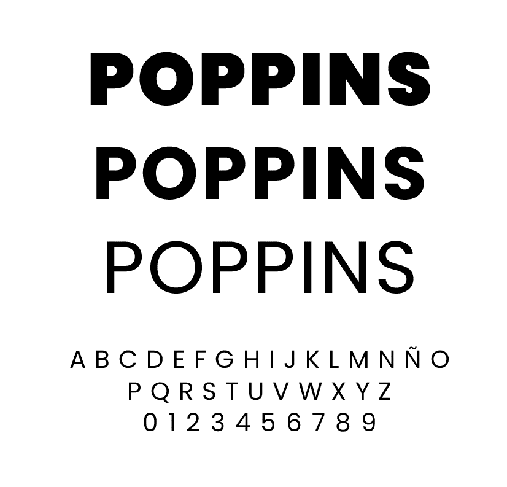
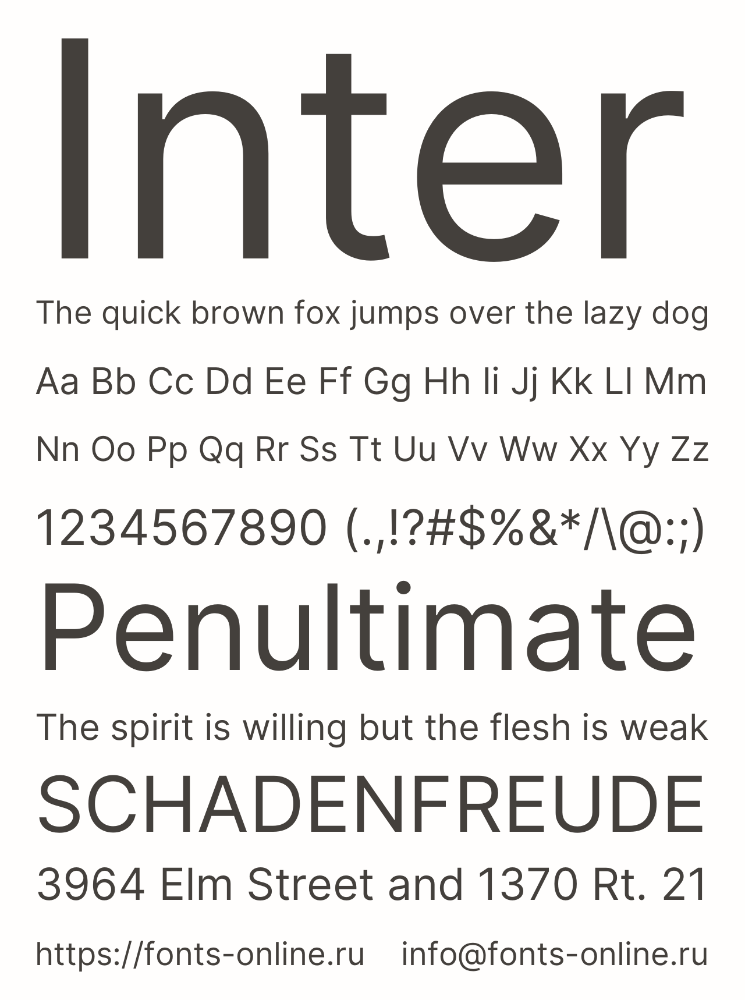

# CAPÍTULO IV: PRODUCT DESIGN

## 4.1. Style Guidelines

### 4.1.1. General Style Guidelines

La guía de estilos de biciGO establece los criterios visuales y comunicacionales que se aplicarán en la landing page, la aplicación web de los usuarios y el dashboard administrativo. Su objetivo es mantener una experiencia consistente, accesible y fácil de utilizar en los distintos dispositivos. Las decisiones se relacionan con la propuesta de valor del proyecto: ofrecer una alternativa de movilidad urbana práctica, flexible y sostenible para recorridos cortos en Lima.

#### Branding

La identidad de biciGO se construye alrededor de los conceptos de movimiento, rapidez, sostenibilidad y accesibilidad. El isotipo representa una persona desplazándose en bicicleta y las líneas horizontales comunican velocidad y continuidad del recorrido. El logotipo combina una palabra de apariencia cercana y moderna con un recurso visual que destaca la letra "GO", reforzando la idea de iniciar un viaje.

El lema de la marca es **"Muévete. Vive. Lima."**. Esta frase relaciona el uso de la bicicleta con una experiencia cotidiana de movilidad y con el contexto urbano en el que funcionará el servicio. La marca utilizará una versión principal del logotipo sobre fondos claros y una versión de alto contraste para fondos oscuros.

Figura 1: Logotipo e isotipo de biciGO.

El logotipo debe conservar un área libre alrededor para evitar que otros elementos compitan visualmente con él. No se debe deformar, rotar, cambiar sus colores principales ni colocarlo sobre fondos que dificulten su lectura.

#### Tipografía

Se utilizará una combinación de dos familias tipográficas sans serif. Esta decisión favorece la lectura en dispositivos móviles y permite diferenciar los títulos del contenido operativo de la plataforma.

- **Tipografía primaria: Poppins.** Se utilizará en el logotipo de apoyo, títulos, encabezados y llamados principales. Sus formas geométricas y redondeadas transmiten dinamismo, modernidad y cercanía, características relacionadas con la movilidad urbana.
- **Tipografía secundaria: Inter.** Se utilizará en párrafos, etiquetas, formularios, tablas, mensajes del sistema y botones. Está pensada para conservar una buena legibilidad en tamaños pequeños y en pantallas de distintas dimensiones.

Los pesos definidos son: **Poppins SemiBold y Bold** para títulos; **Inter Regular** para párrafos; e **Inter Medium y SemiBold** para etiquetas, botones y datos destacados.

| Elemento | Tipografía | Peso | Tamaño referencial |
|---|---|---|---:|
| Título principal H1 | Poppins | Bold | 32 px |
| Título de sección H2 | Poppins | SemiBold | 24 px |
| Subtítulo H3 | Poppins | SemiBold | 20 px |
| Texto principal | Inter | Regular | 16 px |
| Texto secundario | Inter | Regular | 14 px |
| Botones y etiquetas | Inter | SemiBold | 14-16 px |

Figura 2: Muestra tipográfica de la familia Poppins aplicada a encabezados y textos destacados.

Figura 3: Muestra tipográfica de la familia Inter aplicada a textos, botones y etiquetas de interfaz.

La selección tipográfica busca equilibrar personalidad visual y legibilidad. Poppins aporta una sensación moderna y dinámica, ideal para encabezados y llamados de atención, mientras que Inter mantiene claridad, estructura y lectura cómoda en párrafos, formularios y botones.

#### Paleta de colores

La paleta se inspira en los colores presentes en el logotipo de biciGO. El verde representa movilidad sostenible, crecimiento y energía; el gris grafito comunica estabilidad, seguridad y legibilidad; y los tonos neutros permiten que la información sea clara en la interfaz.

| Rol | Color | Código | Uso |
|---|---|---|---|
| Primary Brand | Verde biciGO | `#7BC617` | Marca, enlaces y elementos destacados |
| Primary Dark | Verde oscuro | `#4F850D` | Estados activos y contraste del color de marca |
| Neutral Dark | Grafito | `#263238` | Texto principal, navegación y encabezados |
| Neutral Medium | Gris | `#607078` | Texto secundario e íconos informativos |
| Neutral Light | Gris muy claro | `#F3F6F1` | Fondos secundarios y superficies |
| Neutral White | Blanco | `#FFFFFF` | Fondo principal y contenido |
| Warning | Amarillo | `#E6A817` | Advertencias, mantenimiento y pagos pendientes |
| Error | Rojo | `#C93C3C` | Errores, cancelaciones y reportes críticos |
| Success | Verde de confirmación | `#2E8B57` | Viajes iniciados, pagos y acciones completadas |

El verde biciGO se utilizará para reforzar la identidad, pero no será el único recurso para comunicar estados. Los mensajes de éxito, advertencia y error también incluirán texto o íconos para que la información sea comprensible para personas con dificultades para distinguir colores. En la lámina de colores se deben presentar los nombres, códigos hexadecimales y ejemplos de uso de cada muestra.

#### Principios de diseño

Las decisiones visuales se basan en los siguientes principios:

- **Claridad:** las acciones principales, como buscar, alquilar y finalizar un viaje, deben identificarse rápidamente.
- **Consistencia:** los mismos colores, tipografías, íconos y patrones de interacción deben mantenerse en todas las vistas.
- **Eficiencia:** el usuario debe poder encontrar una bicicleta e iniciar un alquiler con la menor cantidad posible de pasos.
- **Accesibilidad:** los textos, controles y contrastes deben ser legibles en diferentes tamaños de pantalla.
- **Retroalimentación:** cada acción debe mostrar un estado claro de carga, éxito, error o confirmación.
- **Confianza:** los pagos, tiempos de alquiler, tarifas y datos del viaje deben mostrarse de manera visible y comprensible.

#### Spacing y dimensiones

Se utilizará una escala de espaciado basada en múltiplos de 4 y 8 píxeles para mantener un ritmo visual uniforme.

| Token | Valor | Uso |
|---|---:|---|
| `space-xs` | 4 px | Separación entre íconos y texto |
| `space-sm` | 8 px | Separación entre elementos relacionados |
| `space-md` | 16 px | Espaciado interno de controles |
| `space-lg` | 24 px | Separación entre componentes |
| `space-xl` | 32 px | Separación entre bloques de contenido |
| `space-2xl` | 48 px | Separación entre secciones principales |

Los botones y campos de formulario tendrán una altura mínima de 44 px para facilitar la interacción táctil. Los bordes redondeados serán de 8 px como máximo, con el fin de conservar una apariencia moderna sin perder claridad visual. Para la lámina de spacing se deben ilustrar los valores de 4, 8, 16, 24, 32 y 48 px.

#### Tono de comunicación

El tono de biciGO será **casual, respetuoso, claro y entusiasta**, sin utilizar un lenguaje excesivamente técnico. La comunicación será dinámica en promociones y mensajes de bienvenida, pero directa y serena en situaciones relacionadas con pagos, seguridad, accidentes o errores.

| Dimensión | Decisión de biciGO |
|---|---|
| Divertido / Serio | Dinámico, pero responsable |
| Formal / Casual | Casual y profesional |
| Respetuoso / Irreverente | Respetuoso e inclusivo |
| Entusiasta / Sereno | Entusiasta en acciones y sereno en alertas |

Ejemplos de textos de interfaz son: **"Buscar bicicleta"**, **"Iniciar alquiler"**, **"Tu viaje está activo"**, **"Viaje finalizado correctamente"** y **"No pudimos iniciar el alquiler. Intenta nuevamente."**. Los mensajes deben indicar qué ocurrió y cuál es el siguiente paso disponible para el usuario.

### 4.1.2. Web Style Guidelines

Las reglas web aplican la identidad de biciGO a interfaces responsive. La prioridad será la experiencia móvil, ya que el usuario probablemente consultará el mapa, escaneará un código QR o finalizará un alquiler mientras se encuentra desplazándose por la ciudad.

#### Grid System

En móvil se utilizará una sola columna con márgenes laterales de 16 px para priorizar la lectura y la interacción táctil. En escritorio se empleará un sistema de **12 columnas**, con un gutter de **24 px** y un ancho máximo de contenido de aproximadamente **1200 px**. El contenido debe conservar alineaciones consistentes entre encabezados, tarjetas, formularios y botones.

| Dispositivo | Ancho referencial | Estructura |
|---|---:|---|
| Móvil | Menor a 768 px | Una columna y navegación compacta |
| Escritorio | Desde 1024 px | Grid de 12 columnas y contenido centrado |

#### Navegación

La navegación de la landing page de biciGO estará orientada a la conversión y a la comprensión del servicio. Su estructura principal será simple, clara y enfocada en comunicar valor al usuario de forma directa. En escritorio se utilizará una barra superior con el logotipo, enlaces de navegación y un botón principal para **"Alquilar bicicleta"**. En móvil se utilizará una navegación compacta con opciones esenciales y acceso directo a la acción principal.

La estructura sugerida de navegación es la siguiente: **Inicio**, **¿Cómo funciona?**, **Beneficios**, **Tarifas**, **FAQ** y **Contacto**. Este enfoque evita saturar la página con elementos operativos y prioriza la intención comercial de la landing page: explicar la propuesta de valor y motivar la acción de registro o alquiler.

#### Componentes y estados de interacción

Los componentes deben conservar el estilo definido en la guía general. Se considerarán botones primarios, secundarios y de peligro; campos de formulario; tarjetas de bicicletas; marcadores de mapa; modales de confirmación; alertas; indicadores de disponibilidad; y tarjetas de resumen del viaje.

Cada componente interactivo debe contemplar los estados **normal, hover, focus, deshabilitado, cargando, éxito y error**. El estado de focus tendrá un borde visible para facilitar la navegación mediante teclado. Los botones y controles táctiles tendrán un área mínima de 44 por 44 px.

## 4.2. Information Architecture

### 4.2.1. Organization Systems

### 4.2.2. Labeling Systems

### 4.2.3. SEO Tags and Meta Tags

### 4.2.4. Searching Systems

### 4.2.5. Navigation Systems

## 4.3. Landing Page UI Design

### 4.3.1. Landing Page Wireframe

### 4.3.2. Landing Page Mock-up

## 4.4. Web Applications UX/UI Design

### 4.4.1. Web Applications Wireframes

### 4.4.2. Web Applications Wireflow Diagrams

### 4.4.2. Web Applications Mock-ups

### 4.4.3. Web Applications User Flow Diagrams

## 4.5. Web Applications Prototyping

## 4.6. Domain-Driven Software Architecture

### 4.6.1. Design-Level EventStorming

### 4.6.2. Software Architecture Context Diagram

### 4.6.3. Software Architecture Container Diagrams

### 4.6.4. Software Architecture Components Diagrams

## 4.7. Software Object-Oriented Design

### 4.7.1. Class Diagrams

## 4.8. Database Design

### 4.8.1. Database Diagrams