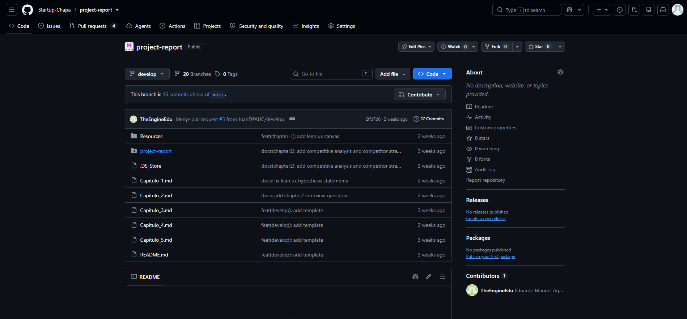
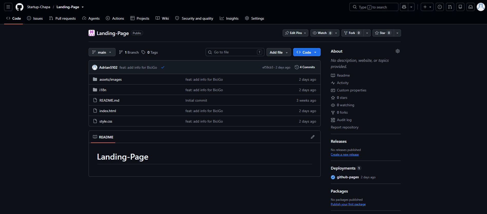

# CAPÍTULO V: Product Implementation, Validation & Deployment

## 5.1. Software Configuration Management

### 5.1.1. Software Development Environment Configuration
| Categoría | Herramienta | Propósito | Enlace |
|---|---|---|---|
| Diseño UX/UI | Figma | Elaboración de wireframes, mockups y prototipos utilizados para definir la interfaz y experiencia de usuario de biciGO. | [https://www.figma.com/design/FIUjx83bu9OhBxZ4EMqyfe/Sin-t%C3%ADtulo?node-id=0-1&t=2NPsUYYjUh7xKI3R-1](https://www.figma.com/design/FIUjx83bu9OhBxZ4EMqyfe/Sin-t%C3%ADtulo?node-id=0-1&t=2NPsUYYjUh7xKI3R-1) |
| Investigación UX | UXPressia | Herramienta utilizada para elaborar los User Personas de los segmentos objetivo de biciGO, permitiendo representar sus características, necesidades, frustraciones y objetivos. | [https://uxpressia.com/](https://uxpressia.com/) |
| Planeamiento del Producto | UXPressia | Herramienta utilizada para desarrollar el Impact Mapping de biciGO, relacionando el objetivo del negocio, actores, impactos esperados y entregables asociados. | [https://uxpressia.com/](https://uxpressia.com/) |
| Modelado de Base de Datos | Draw.io | Elaboración del diagrama de base de datos de biciGO, incluyendo entidades, atributos, claves y relaciones entre las tablas del sistema. | [https://drive.google.com/file/d/1frY_P-cg-4JuKiY2Jh8m85aaZD9V1CCT/view?usp=sharing](https://drive.google.com/file/d/1frY_P-cg-4JuKiY2Jh8m85aaZD9V1CCT/view?usp=sharing) |
| Modelado de Dominio | Canva | Desarrollo del Event Storming utilizado para identificar eventos, procesos y elementos principales del dominio de biciGO. | [https://canva.link/7coo689oj2nx3b7](https://canva.link/7coo689oj2nx3b7) |
| Desarrollo Web | GitHub Pages | Despliegue público de la Landing Page de biciGO. | [https://startup-chapa.github.io/Landing-Page/](https://startup-chapa.github.io/Landing-Page/) |
| Entorno de Desarrollo | WebStorm | Entorno utilizado para editar y organizar los archivos del proyecto, trabajar con Git y desarrollar los componentes web de biciGO. | [https://www.jetbrains.com/webstorm/](https://www.jetbrains.com/webstorm/) |
| Control de Versiones | Git | Sistema utilizado para registrar cambios, trabajar mediante ramas y mantener el historial del proyecto. | [https://git-scm.com/](https://git-scm.com/) |
| Repositorio Remoto | GitHub | Plataforma utilizada para almacenar el proyecto y facilitar el trabajo colaborativo entre los integrantes. | [https://github.com/](https://github.com/) |
| Documentación | Markdown | Formato utilizado para redactar y mantener los capítulos del informe, tablas, enlaces, imágenes y demás documentación del proyecto bajo un enfoque Docs-as-Code. | [https://www.markdownguide.org/](https://www.markdownguide.org/) |
| Gestión Ágil | Trello | Herramienta utilizada para organizar el Sprint Backlog, distribuir tareas y dar seguimiento al avance del equipo durante el Sprint. | [https://trello.com/invite/b/6aac96a6ce176e2f9d496d31/ATTI96186798f26dde57c47e51ca96f0fff04FDD51DF/sprint-web-1](https://trello.com/invite/b/6aac96a6ce176e2f9d496d31/ATTI96186798f26dde57c47e51ca96f0fff04FDD51DF/sprint-web-1) |
| Gestión del Producto | Product Backlog | Permite organizar y priorizar las User Stories y Technical Stories que forman parte del desarrollo de biciGO. | [https://trello.com/invite/b/6aac96a6ce176e2f9d496d31/ATTI96186798f26dde57c47e51ca96f0fff04FDD51DF/sprint-web-1](https://trello.com/invite/b/6aac96a6ce176e2f9d496d31/ATTI96186798f26dde57c47e51ca96f0fff04FDD51DF/sprint-web-1) |

### 5.1.2. Source Code Management
Para el control de versiones y la organización ordenada del código de nuestro proyecto BiciGo, el equipo utiliza GitHub como plataforma principal. GitHub nos permite almacenar código fuente de la Landing Page, Front-End, Back-End llevar un registro histórico de cambios, colaborar de manera estructurada y garantizar trazabilidad durante todo el ciclo de desarrollo. Por ende, creamos la organización Minex-Organization, que incluye los siguientes repositorios:
| Solución  | Nombre del repositorio  |  Enlace  |
|---|---|---|
| report | bicigo-report  | https://github.com/Startup-Chapa/project-report |
| website  | bicigo-website  |  https://github.com/Startup-Chapa/Landing-Page |
| webapp  |  bicigo-webapp  |  |
| platform  | bicigo-platform   |  |

Nuestro equipo de trabajo ha adoptado el flujo GitFlow, basado en el artículo “A successful Git branching model” de Vincent Driessen. La organización del repositorio se estructura en dos ramas principales y permanentes: master, que contiene las versiones estables listas para entrega, y develop, que funciona como la rama de integración continua del desarrollo. A partir de la rama develop, se crean ramas de tipo feature siguiendo la nomenclatura feature/chapter-#-description, por ejemplo: feature/chapter-ii-interviews. Estas ramas permiten que cada miembro del equipo desarrolle funcionalidades o secciones específicas de manera aislada. En casos donde un integrante desarrolla un capítulo completo, se utiliza una convención como feature/chapter-#-content. Una vez finalizado el trabajo, estas ramas se integran nuevamente en develop, asegurando una consolidación ordenada de los avances.

Cuando el producto se aproxima a una fecha de entrega, se genera una rama release a partir de develop. En esta etapa se realizan ajustes menores, como corrección de errores o mejoras finales. Posteriormente, la rama release se fusiona tanto en master como en develop, garantizando que los cambios aplicados se mantengan en futuras iteraciones del proyecto. En cuanto a la gestión de versiones, se utiliza Semantic Versioning mediante ramas con el formato release/vX.Y.Z. Asimismo, las correcciones críticas se gestionan a través de ramas hotfix, con la nomenclatura hotfix/vX.Y.Z, permitiendo resolver errores urgentes directamente sobre la versión en producción.

Adicionalmente, el equipo aplica la convención Conventional Commits, la cual estandariza los mensajes de confirmación para mejorar la trazabilidad y comprensión de los cambios. Cada commit sigue una estructura clara, por ejemplo:

git commit -m "docs(chapter-#): add ..."

Este enfoque facilita la generación automática de historiales de cambios y permite mantener un registro organizado y semántico del desarrollo.

En síntesis, cada nueva funcionalidad se desarrolla en una rama feature, las versiones listas para entrega se gestionan mediante release branches, y las correcciones urgentes a través de hotfix branches. Todo ello, junto con el uso de Conventional Commits, asegura un flujo de trabajo estructurado, colaborativo y alineado con buenas prácticas para el desarrollo del proyecto BiciGo.

**Repositorio report**

**Repositorio  website**

**Repositorio webapp**

**Repositorio platform**

### 5.1.3. Source Code Style Guide & Conventions

### 5.1.4. Software Deployment Configuration

## 5.2. Landing Page, Services & Applications Implementation

### 5.2.1. Sprint 1

El Sprint 1 corresponde a la primera entrega del proyecto (AV1 – Sprint Review) y tiene como alcance la implementación y el despliegue de la primera versión del **Landing Page** de BiciGO. El Landing Page presenta el modelo de negocio y el propósito de la plataforma a los visitantes de los segmentos objetivo (ciudadanos urbanos que realizan trayectos cortos e instituciones que desean promover el uso de la bicicleta), y es el punto de entrada hacia las aplicaciones. Los Web Services y las Frontend Web Applications se implementarán en los siguientes Sprints, según el cronograma de entregas del curso.

#### 5.2.1.1. Sprint Planning 1

El Sprint Planning Meeting del Sprint 1 definió el objetivo del Sprint, las tareas necesarias para publicar la primera versión del Landing Page y la distribución del trabajo entre los integrantes de Chapa. Como insumos se utilizaron los artefactos de los capítulos anteriores: el Lean UX Canvas (Capítulo I), los segmentos objetivo, las User Personas, el wireframe y el mock-up del Landing Page (Capítulo IV) y la guía de estilos general y web (sección 4.1).

| Sprint # | Sprint 1 |
|---|---|
| **Sprint Planning Background** | |
| Prepared By | Aguirre Ramos, Eduardo Manuel |
| Attendees (to planning meeting) | Aguirre Ramos, Eduardo Manuel / Armestar Felipa, Adrian Andres / Ayllon Pauccar, Juan David / Franco del Carpio, José María / Velasquez Velasquez, Rodrigo |
| Sprint 0 Review Summary | No aplica. El Sprint 1 es el primer Sprint del proyecto. Antes de iniciarlo, el equipo completó la documentación de los Capítulos I al IV (Startup Profile, Requirements Elicitation, Requirements Specification y diseño del Landing Page) y creó los repositorios `project-report` y `Landing-Page`. |
| Sprint 0 Retrospective Summary | No aplica. El Sprint 1 es el primer Sprint del proyecto. |
| **Sprint Goal & User Stories** | |
| Sprint 1 Goal | *Our focus is on publishing the first deployed version of the BiciGO Landing Page, available in English and Latin American Spanish and responsive on mobile and desktop screens.* *We believe it delivers a clear understanding of the service (mission, vision, benefits and how it works) and a direct way to get in touch with the team to urban citizens who make short trips and to institutions interested in promoting cycling.* *This will be confirmed when the Landing Page is publicly reachable at its GitHub Pages URL, every section can be read on a 390 px and on a 1440 px wide screen without horizontal scrolling, and a visitor can switch the whole interface between English and Spanish.* |
| Sprint 1 Velocity | No aplica en Story Points. Las tareas del Sprint 1 no provienen de User Stories del Product Backlog (que describen funcionalidades de las aplicaciones), sino de tareas asociadas a las restricciones del Landing Page. El esfuerzo se planifica en horas: **76 horas** en total (ver Sprint Backlog 1). |
| Sum of Story Points | 0 |

#### 5.2.1.2. Aspect Leaders and Collaborators

Para el Sprint 1 se identificaron seis aspectos dentro del alcance. La Leadership-and-Collaboration Matrix (LACX) indica, para cada aspecto, quién lidera y quiénes colaboran. La organización de líderes y colaboradores guarda relación con la selección de tareas del Sprint Backlog 1.

- **Landing Page Structure & Content (HTML):** estructura semántica de las secciones y redacción de los contenidos.
- **Visual Style & Responsive Design (CSS):** aplicación de la guía de estilos del Capítulo IV y diseño adaptable a móvil y escritorio.
- **Internationalization (i18n):** diccionarios en inglés y español, y selector de idioma.
- **Deployment (GitHub Pages):** publicación del Landing Page en un sitio público.
- **Landing Page UI Design (Figma):** wireframe y mock-up que guían la implementación.
- **Report Documentation:** redacción de las secciones del Capítulo V correspondientes al Sprint.

| Team Member (Last Name, First Name) | GitHub Username | Structure & Content (HTML) | Visual Style & Responsive (CSS) | Internationalization (i18n) | Deployment (GitHub Pages) | UI Design (Figma) | Report Documentation |
|---|---|:---:|:---:|:---:|:---:|:---:|:---:|
| Aguirre Ramos, Eduardo Manuel | TheEngineEdu | C | C | C | C | C | L |
| Armestar Felipa, Adrian Andres | Adrian5102 | L | L | L | L | L | C |
| Ayllon Pauccar, Juan David | JuanDPAUC | C | C | C | C | C | C |
| Franco del Carpio, José María | VoltTrd [POR CONFIRMAR] | C | C | C | C | C | C |
| Velasquez Velasquez, Rodrigo | Rodrigov233 | C | C | C | C | C | C |

*L = Leader, C = Collaborator.*

La asignación de líderes y colaboradores se definió a partir de la participación de cada integrante en los repositorios `Landing-Page` y `project-report`.

#### 5.2.1.3. Sprint Backlog 1

El objetivo principal del Sprint 1 es publicar la primera versión del Landing Page de BiciGO, en inglés y español y con diseño responsive, para presentar el modelo de negocio a los visitantes. El Sprint Backlog 1 se gestiona en un tablero de Trello con las columnas To-do, In-Process, To-Review y Done.

Las tareas no derivan de User Stories del Product Backlog, ya que estas describen funcionalidades de las aplicaciones. Por ese motivo se registran como tareas adicionales asociadas a las restricciones del Landing Page (responsive design, i18n, accesibilidad, SEO, términos y condiciones, y despliegue). Cada tarea está estimada en un rango de 4 a 8 horas.

**Sprint #: Sprint 1**

| Story Id | Story Title | Task Id | Task Title | Task Description | Estimation (Hours) | Assigned To | Status |
|---|---|---|---|---|:---:|---|---|
| N/A | Landing Page (tarea general) | T-01 | Landing content and structure | Definir las secciones y los contenidos del Landing Page a partir del wireframe y del mock-up del Capítulo IV: navegación, hero, misión y visión, beneficios, cómo funciona, contacto, FAQ y footer. | 6 | Armestar Felipa, Adrian Andres | Done |
| N/A | Landing Page (tarea general) | T-02 | HTML5 semantic structure | Implementar `index.html` con elementos semánticos y atributos `data-i18n` para todos los textos visibles. | 8 | Armestar Felipa, Adrian Andres | Done |
| N/A | Landing Page (tarea general) | T-03 | Style guide and responsive CSS | Implementar `style.css` con las variables de color, tipografía y espaciado de la guía de estilos, y con *media queries* para móvil y escritorio. | 8 | Armestar Felipa, Adrian Andres | Done |
| N/A | Landing Page (tarea general) | T-04 | i18n English and Spanish | Crear los diccionarios `en.json` y `es.json`, y el selector de idioma EN/ES con persistencia del idioma elegido. | 6 | Armestar Felipa, Adrian Andres | Done |
| N/A | Landing Page (tarea general) | T-05 | Accessible FAQ accordion | Implementar el acordeón de preguntas frecuentes con atributos ARIA y soporte de teclado (Enter y Espacio). | 4 | Armestar Felipa, Adrian Andres | Done |
| N/A | Landing Page (tarea general) | T-06 | Contact form UI | Implementar la interfaz del formulario de contacto (nombre, teléfono, correo, tipo de usuario y mensaje). El envío del formulario queda pendiente. | 4 | Armestar Felipa, Adrian Andres | Done |
| N/A | Landing Page (tarea general) | T-07 | Deploy to GitHub Pages | Publicar el Landing Page desde la rama `main` con GitHub Pages y verificar el acceso público. | 4 | Armestar Felipa, Adrian Andres | Done |
| N/A | Landing Page (tarea general) | T-08 | Pricing section and sign-up CTA | Agregar la sección de tarifas prevista en la navegación del Capítulo IV y conectar los llamados a la acción con el registro. | 6 | Sin asignar | To-do |
| N/A | Landing Page (tarea general) | T-09 | Terms and conditions and social links | Redactar los términos y condiciones, enlazarlos en el footer y reemplazar los íconos de redes sociales por los enlaces reales. | 4 | Sin asignar | To-do |
| N/A | Landing Page (tarea general) | T-10 | SEO and meta tags | Agregar las etiquetas meta (description, Open Graph) y traducir el título de la página con el diccionario i18n. | 4 | Sin asignar | To-do |
| N/A | Landing Page (tarea general) | T-11 | Accessibility review | Revisar contraste de colores, estados de foco, etiquetas de formulario y atributos ARIA del Landing Page. | 6 | Sin asignar | To-do |
| N/A | Landing Page (tarea general) | T-12 | Execution video | Grabar el video que muestra la navegación del Landing Page y publicarlo para enlazarlo en la sección 5.2.1.5. | 4 | Sin asignar | To-do |
| N/A | Sprint management | T-13 | Sprint board in Trello | Crear el tablero del Sprint 1 en Trello, cargar las tareas y hacerlo público. | 4 | Sin asignar | To-do |
| N/A | Sprint management | T-14 | Chapter V documentation | Redactar las secciones 5.1.1, 5.1.3 y 5.2.1 del informe con las evidencias del Sprint. | 8 | Aguirre Ramos, Eduardo Manuel | To-Review |

#### 5.2.1.4. Development Evidence for Sprint Review

Durante el Sprint 1 se implementó la primera versión del Landing Page en el repositorio `Startup-Chapa/Landing-Page`: la estructura HTML, los estilos CSS responsive, los diccionarios de traducción en inglés y español y las imágenes de las secciones. En paralelo, en el repositorio `Startup-Chapa/project-report` se documentaron el wireframe y el mock-up del Landing Page (Capítulo IV) y la gestión del código fuente (Capítulo V), que sirvieron de base para la implementación. Los commits siguen la convención Conventional Commits descrita en la sección 5.1.2.

| Repository | Branch | Commit Id | Commit Message | Commit Message Body | Commited on (Date) |
|---|---|---|---|---|---|
| Startup-Chapa/Landing-Page | main | ef218d4 | Initial commit | Creación del repositorio del Landing Page. | 30/08/2026 |
| Startup-Chapa/Landing-Page | main | aeca1f3 | feat: add index & css files | Se crean los archivos `index.html` y `style.css`. | 14/09/2026 |
| Startup-Chapa/Landing-Page | main | 615a806 | feat: add first version of Landing Page | Primera versión de `index.html` (311 líneas) y `style.css` (511 líneas), y el logotipo de BiciGO. | 14/09/2026 |
| Startup-Chapa/Landing-Page | main | ef59cb5 | feat: add info for BiciGo | Se agregan las imágenes del hero, misión, visión y contacto, y los diccionarios `i18n/en.json` e `i18n/es.json`. | 14/09/2026 |
| Startup-Chapa/project-report | feature/chapter-4-landing-page-wireframe | e62842e | feat(chapter-4): add landing page wireframe | Se agrega la imagen del wireframe del Landing Page. | 16/09/2026 |
| Startup-Chapa/project-report | feature/chapter-4-landing-page-wireframe | 2caad89 | feat(chapter-4): add landing page Wireframe in report | Se incorpora el wireframe en la sección 4.3.1 del informe. | 16/09/2026 |
| Startup-Chapa/project-report | feature/chapter-4-landing-page-mockup | 8c32eb6 | feat(chapter-4): add landing page Mockup | Se agrega la imagen del mock-up del Landing Page. | 16/09/2026 |
| Startup-Chapa/project-report | feature/chapter-4-landing-page-mockup | e845f4f | feat(chapter-4): add landing page Mockup in report | Se incorpora el mock-up en la sección 4.3.2 del informe. | 16/09/2026 |
| Startup-Chapa/project-report | feature/source-code-management | 5c22418 | feat(chapter-5): add source code management | Se documenta la sección 5.1.2 Source Code Management. | 16/09/2026 |
| Startup-Chapa/project-report | feature/source-code-management | 44581d4 | feat(chapter-5): add source code management justification | Se agrega la justificación del flujo GitFlow y de Conventional Commits. | 16/09/2026 |

*Figura: historial de commits del repositorio Landing-Page en GitHub.*

#### 5.2.1.5. Execution Evidence for Sprint Review

El Landing Page de BiciGO está publicado y accesible en https://startup-chapa.github.io/Landing-Page/. La primera versión incluye las siguientes vistas:

- **Barra de navegación:** logotipo, enlaces a Home, About Us, Benefits, How does it work?, FAQs y Contact, selector de idioma EN/ES y botones Login y Sign Up.
- **Hero:** lema de la marca "MOVE | LIVE | LIMA", mensaje principal y botón de llamado a la acción *Get Started*.
- **Misión y visión:** textos de la propuesta de valor con fotografías de movilidad en Lima.
- **Beneficios:** seis tarjetas con los beneficios del servicio.
- **How does it work?:** explicación del recorrido del usuario, desde encontrar una bicicleta hasta finalizar el viaje.
- **Contacto:** formulario con nombre, teléfono, correo, tipo de usuario (estudiante, trabajador o ciudadano) y mensaje.
- **FAQs:** cinco preguntas frecuentes en formato acordeón, operables con el teclado.
- **Footer:** logotipo, íconos de redes sociales y aviso de derechos.

La interfaz está disponible en inglés (idioma por defecto) y en español latinoamericano, y se adapta a móvil y escritorio. En la verificación realizada, el ancho de la página coincide con el ancho de la pantalla tanto en 390 px como en 1440 px, es decir, sin desplazamiento horizontal.

**Vista de escritorio (1440 px)**

**Página completa en escritorio (1440 px)**

**Página completa en móvil (390 px)**

#### 5.2.1.6. Services Documentation Evidence for Sprint Review

En el Sprint 1 no se implementaron Web Services. El alcance de este Sprint se limitó al Landing Page, tal como establece la primera entrega del trabajo final, por lo que no existen endpoints documentados con OpenAPI ni commits de documentación de API en este Sprint.

Los endpoints que se implementarán en los siguientes Sprints están especificados como Technical Stories en el Capítulo III (por ejemplo, `GET /api/coverage` para la consulta de zonas de cobertura). Su documentación con OpenAPI (Swagger) se presentará en esta sección a partir del Sprint en que se implementen los Web Services.

#### 5.2.1.7. Software Deployment Evidence for Sprint Review

En el Sprint 1 se desplegó el Landing Page en **GitHub Pages**, directamente desde el repositorio `Startup-Chapa/Landing-Page`. Como el Landing Page es un sitio estático (HTML, CSS, JavaScript y archivos JSON), no requiere una etapa de compilación, y la publicación se realiza a partir del contenido de la rama `main`.

Los pasos realizados fueron los siguientes:

1. Se creó el repositorio `Landing-Page` en la organización Startup-Chapa de GitHub.
2. Se subieron a la rama `main` el archivo `index.html`, la hoja de estilos `style.css`, la carpeta `assets/images` y los diccionarios de la carpeta `i18n`.
3. En la configuración del repositorio (*Settings > Pages*) se habilitó GitHub Pages con la publicación desde la rama `main`.
4. GitHub ejecutó el flujo `pages build and deployment`, que finalizó correctamente el 14/09/2026 a las 23:42 (GMT-5), con una duración de 38 segundos, para el commit `ef59cb5`.
5. Se verificó el acceso público al sitio en https://startup-chapa.github.io/Landing-Page/.

| Producto | Plataforma | URL | Estado |
|---|---|---|---|
| Landing Page | GitHub Pages | https://startup-chapa.github.io/Landing-Page/ | Desplegado |
| Web Applications | Por definir (sección 5.1.4) | Sin desplegar en el Sprint 1 | No incluido en el alcance |
| Web Services | Por definir (sección 5.1.4) | Sin desplegar en el Sprint 1 | No incluido en el alcance |

*Figura: ejecución del flujo pages build and deployment en GitHub Actions.*

#### 5.2.1.8. Team Collaboration Insights during Sprint

Las actividades del Sprint 1 se organizaron con el flujo GitFlow descrito en la sección 5.1.2: el trabajo del informe se realizó en ramas `feature/*` creadas a partir de `develop` e integradas mediante Pull Requests. La implementación del Landing Page se realizó en el repositorio `Landing-Page`. La siguiente tabla resume los commits de cada integrante, sin contar los commits de fusión (*merge*), en la rama `develop` al cierre de este informe.

| Integrante | Usuario de GitHub | Commits en Landing-Page | Commits en project-report |
|---|---|:---:|:---:|
| Aguirre Ramos, Eduardo Manuel | TheEngineEdu | 1 | 9 |
| Armestar Felipa, Adrian Andres | Adrian5102 | 3 | 18 |
| Ayllon Pauccar, Juan David | JuanDPAUC | 0 | 7 |
| Franco del Carpio, José María | VoltTrd | 0 | 1 |
| Velasquez Velasquez, Rodrigo | Rodrigov233 | 0 | 4 |