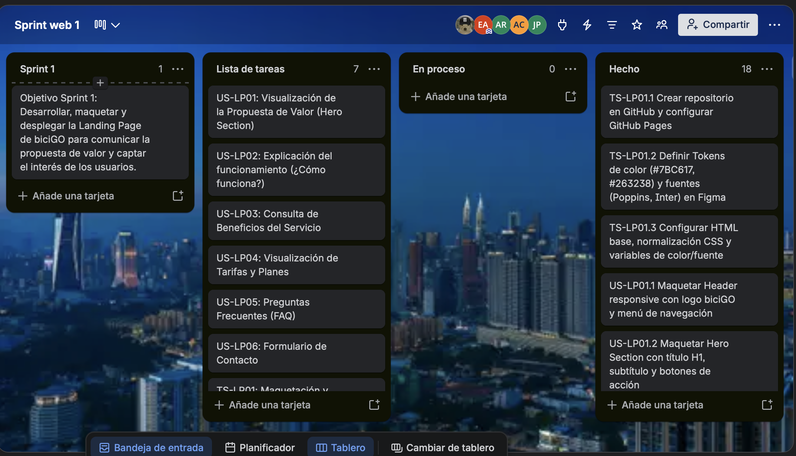
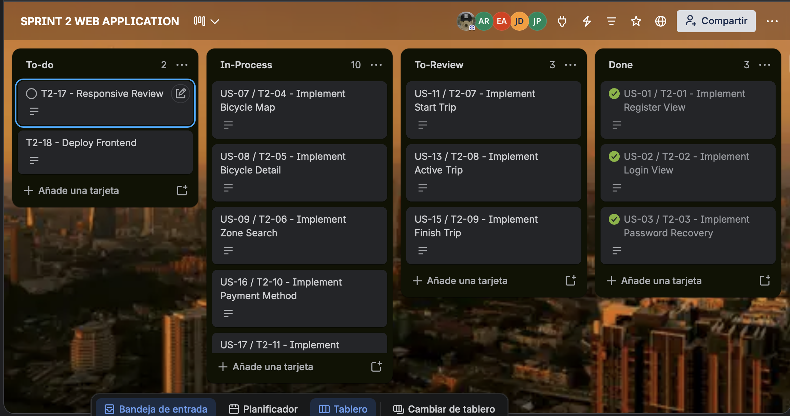
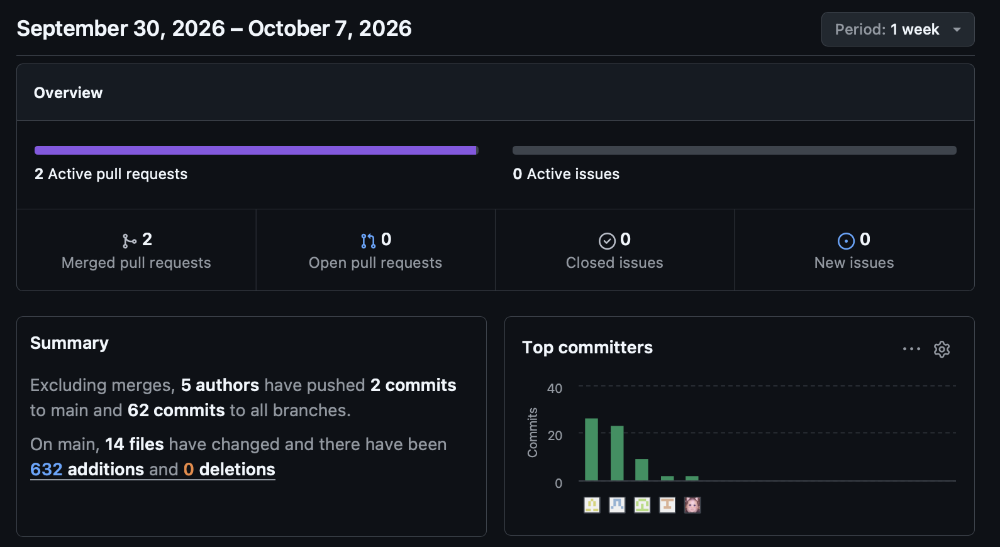
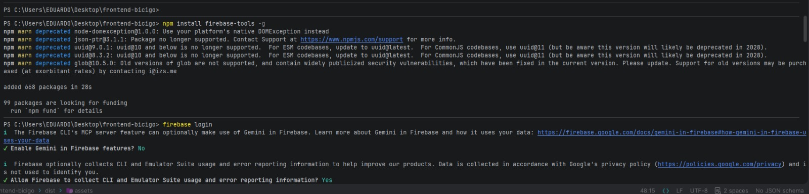
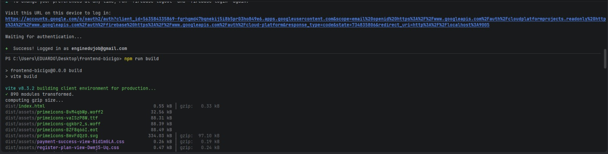
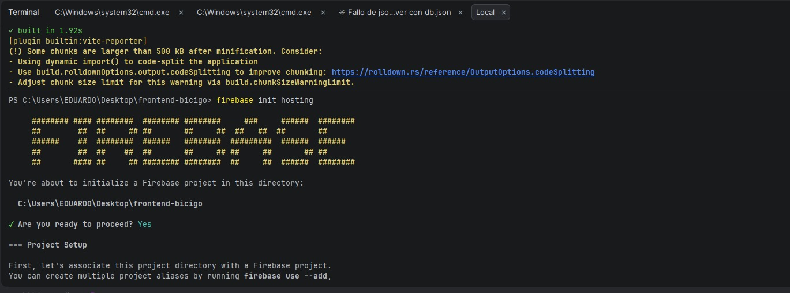
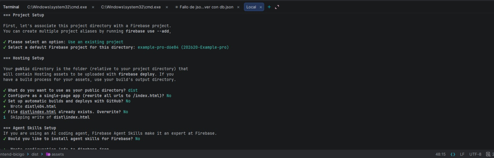
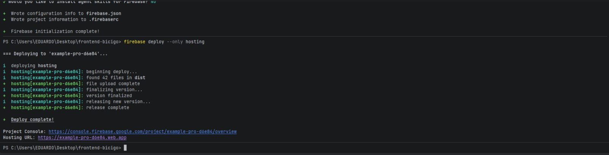
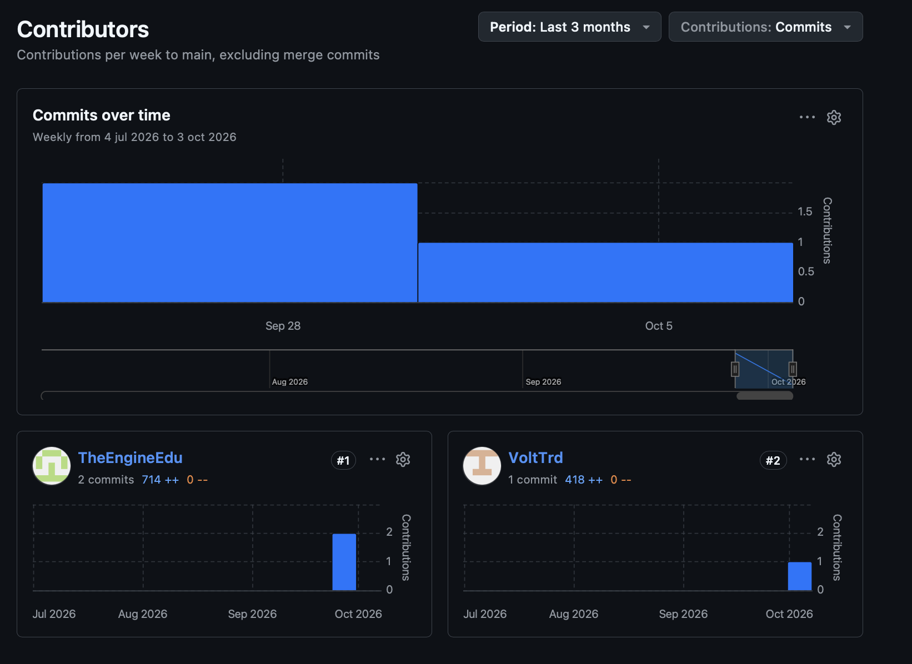

# CAPÍTULO V: Product Implementation, Validation & Deployment

## 5.1. Software Configuration Management

### 5.1.1. Software Development Environment Configuration

| Categoría | Herramienta | Propósito | Enlace |
|---|---|---|---|
| Diseño UX/UI | Figma | Elaboración de wireframes, mockups y prototipos utilizados para definir la interfaz y experiencia de usuario de biciGO. | [https://www.figma.com/design/FIUjx83bu9OhBxZ4EMqyfe/Sin-t%C3%ADtulo?node-id=0-1&t=2NPsUYYjUh7xKI3R-1](https://www.figma.com/design/FIUjx83bu9OhBxZ4EMqyfe/Sin-t%C3%ADtulo?node-id=0-1&t=2NPsUYYjUh7xKI3R-1) |
| Investigación UX | UXPressia | Herramienta utilizada para elaborar los User Personas de los segmentos objetivo de biciGO, permitiendo representar sus características, necesidades, frustraciones y objetivos. | [https://uxpressia.com/](https://uxpressia.com/) |
| Planeamiento del Producto | UXPressia | Herramienta utilizada para desarrollar el Impact Mapping de biciGO, relacionando el objetivo del negocio, actores, impactos esperados y entregables asociados. | [https://uxpressia.com/](https://uxpressia.com/) |
| Modelado de Base de Datos | Draw.io | Elaboración del diagrama de base de datos de biciGO, incluyendo entidades, atributos, claves y relaciones entre las tablas del sistema. | [https://drive.google.com/file/d/1frY_P-cg-4JuKiY2Jh8m85aaZD9V1CCT/view?usp=sharing](https://drive.google.com/file/d/1frY_P-cg-4JuKiY2Jh8m85aaZD9V1CCT/view?usp=sharing) |
| Modelado de Dominio | Canva | Desarrollo del Event Storming utilizado para identificar eventos, procesos y elementos principales del dominio de biciGO. | [https://canva.link/7coo689oj2nx3b7](https://canva.link/7coo689oj2nx3b7) |
| Desarrollo Web | GitHub Pages | Despliegue público de la Landing Page de biciGO. | [https://startup-chapa.github.io/Landing-Page/](https://startup-chapa.github.io/Landing-Page/) |
| Frontend Deployment | Firebase Hosting | Plataforma utilizada para publicar la Frontend Web Application de biciGO y proporcionar acceso mediante una URL pública. | [https://firebase.google.com/](https://firebase.google.com/) |
| Entorno de Desarrollo | WebStorm | Entorno utilizado para editar y organizar los archivos del proyecto, trabajar con Git y desarrollar los componentes web de biciGO. | [https://www.jetbrains.com/webstorm/](https://www.jetbrains.com/webstorm/) |
| Control de Versiones | Git | Sistema utilizado para registrar cambios, trabajar mediante ramas y mantener el historial del proyecto. | [https://git-scm.com/](https://git-scm.com/) |
| Repositorio Remoto | GitHub | Plataforma utilizada para almacenar el proyecto y facilitar el trabajo colaborativo entre los integrantes. | [https://github.com/](https://github.com/) |
| Documentación | Markdown | Formato utilizado para redactar y mantener los capítulos del informe, tablas, enlaces, imágenes y demás documentación del proyecto bajo un enfoque Docs-as-Code. | [https://www.markdownguide.org/](https://www.markdownguide.org/) |
| Gestión Ágil | Trello | Herramienta utilizada para organizar el Sprint Backlog, distribuir tareas y dar seguimiento al avance del equipo durante el Sprint. | [https://trello.com/invite/b/6aac96a6ce176e2f9d496d31/ATTI96186798f26dde57c47e51ca96f0fff04FDD51DF/sprint-web-1](https://trello.com/invite/b/6aac96a6ce176e2f9d496d31/ATTI96186798f26dde57c47e51ca96f0fff04FDD51DF/sprint-web-1) |
| Gestión del Producto | Product Backlog | Permite organizar y priorizar las User Stories y Technical Stories que forman parte del desarrollo de biciGO. | [https://trello.com/invite/b/6aac96a6ce176e2f9d496d31/ATTI96186798f26dde57c47e51ca96f0fff04FDD51DF/sprint-web-1](https://trello.com/invite/b/6aac96a6ce176e2f9d496d31/ATTI96186798f26dde57c47e51ca96f0fff04FDD51DF/sprint-web-1) |

### 5.1.2. Source Code Management

Para el control de versiones y la organización ordenada del código de nuestro proyecto BiciGo, el equipo utiliza GitHub como plataforma principal. GitHub nos permite almacenar código fuente de la Landing Page, Front-End, Back-End llevar un registro histórico de cambios, colaborar de manera estructurada y garantizar trazabilidad durante todo el ciclo de desarrollo. Por ende, creamos la organización Minex-Organization, que incluye los siguientes repositorios:

| Solución | Nombre del repositorio | Enlace |
|---|---|---|
| report | bicigo-report | https://github.com/Startup-Chapa/project-report |
| website | bicigo-website | https://github.com/Startup-Chapa/Landing-Page |
| webapp | bicigo-webapp | https://github.com/Startup-Chapa/frontend-bicigo |
| platform | bicigo-platform | |

Nuestro equipo de trabajo ha adoptado el flujo GitFlow, basado en el artículo “A successful Git branching model” de Vincent Driessen. La organización del repositorio se estructura en dos ramas principales y permanentes: master, que contiene las versiones estables listas para entrega, y develop, que funciona como la rama de integración continua del desarrollo. A partir de la rama develop, se crean ramas de tipo feature siguiendo la nomenclatura feature/chapter-#-description, por ejemplo: feature/chapter-ii-interviews. Estas ramas permiten que cada miembro del equipo desarrolle funcionalidades o secciones específicas de manera aislada. En casos donde un integrante desarrolla un capítulo completo, se utiliza una convención como feature/chapter-#-content. Una vez finalizado el trabajo, estas ramas se integran nuevamente en develop, asegurando una consolidación ordenada de los avances.

Cuando el producto se aproxima a una fecha de entrega, se genera una rama release a partir de develop. En esta etapa se realizan ajustes menores, como corrección de errores o mejoras finales. Posteriormente, la rama release se fusiona tanto en master como en develop, garantizando que los cambios aplicados se mantengan en futuras iteraciones del proyecto. En cuanto a la gestión de versiones, se utiliza Semantic Versioning mediante ramas con el formato release/vX.Y.Z. Asimismo, las correcciones críticas se gestionan a través de ramas hotfix, con la nomenclatura hotfix/vX.Y.Z, permitiendo resolver errores urgentes directamente sobre la versión en producción.

Adicionalmente, el equipo aplica la convención Conventional Commits, la cual estandariza los mensajes de confirmación para mejorar la trazabilidad y comprensión de los cambios. Cada commit sigue una estructura clara, por ejemplo:

```text
git commit -m "docs(chapter-#): add ..."
```

Este enfoque facilita la generación automática de historiales de cambios y permite mantener un registro organizado y semántico del desarrollo.

En síntesis, cada nueva funcionalidad se desarrolla en una rama feature, las versiones listas para entrega se gestionan mediante release branches, y las correcciones urgentes a través de hotfix branches. Todo ello, junto con el uso de Conventional Commits, asegura un flujo de trabajo estructurado, colaborativo y alineado con buenas prácticas para el desarrollo del proyecto BiciGo.

**Repositorio report**


**Repositorio website**


**Repositorio webapp**


**Repositorio platform**


## 5.1.4. Software Deployment Configuration

## Descripción

La configuración de despliegue de software describe cómo se distribuyen los componentes de la **Plataforma Web de Alquiler de Bicicletas** en los diferentes nodos necesarios para su funcionamiento.

La solución utiliza una arquitectura cliente-servidor. El usuario accede a la plataforma mediante un navegador web, mientras que el servidor de aplicación procesa las solicitudes y ejecuta la lógica de negocio.

El servidor de aplicación se comunica con el servidor de base de datos y con los servicios externos de geolocalización y procesamiento de pagos.

---

## Nodos de despliegue

### 1. Dispositivo del Usuario

Corresponde al dispositivo utilizado por el usuario para acceder a la plataforma.

Dentro de este nodo se encuentran:

- Navegador web.
- Interfaz de la plataforma.
- Componentes de presentación.

El usuario puede utilizar este dispositivo para registrarse, iniciar sesión, consultar bicicletas, realizar viajes y gestionar su cuenta.

La comunicación con el servidor se realiza mediante **HTTPS**.

---

### 2. Servidor de Aplicación

El servidor de aplicación contiene la aplicación web y la lógica de negocio del sistema.

Entre sus principales responsabilidades se encuentran:

- Gestionar usuarios.
- Gestionar bicicletas.
- Gestionar zonas.
- Gestionar viajes.
- Gestionar suscripciones Premium.
- Registrar kilómetros recorridos.
- Calcular las tarifas.
- Verificar el estado Premium.
- Comunicarse con la base de datos.
- Comunicarse con el servicio de geolocalización.
- Comunicarse con la pasarela de pagos.

Este servidor recibe las solicitudes provenientes del cliente web, procesa la información y devuelve las respuestas correspondientes.

---

### 3. Servidor de Base de Datos

El servidor de base de datos almacena la información persistente necesaria para el funcionamiento de la plataforma.

Entre los principales datos almacenados se encuentran:

- Usuarios.
- Bicicletas.
- Zonas.
- Puntos de recogida.
- Puntos de devolución.
- Viajes.
- Kilómetros recorridos.
- Tarifas.
- Pagos.
- Suscripciones Premium.

El servidor de aplicación es el encargado de realizar las consultas y actualizaciones sobre la base de datos.

---

### 4. Servicio de Geolocalización

El servicio de geolocalización corresponde a un servicio externo utilizado por la plataforma.

Su función principal es proporcionar información relacionada con:

- Ubicación de las bicicletas.
- Ubicación durante el viaje.
- Distancia recorrida.
- Información necesaria para determinar los kilómetros del recorrido.

La información obtenida puede ser utilizada posteriormente por la lógica de negocio para calcular la tarifa del viaje.

---

### 5. Pasarela de Pagos

La pasarela de pagos corresponde a un servicio externo encargado de procesar las operaciones económicas.

Se utiliza para:

- Procesar pagos de los viajes.
- Procesar pagos de las suscripciones Premium.
- Confirmar el resultado de las operaciones.
- Informar si una operación fue procesada correctamente.

La plataforma no ejecuta directamente el procesamiento financiero, sino que delega esta responsabilidad a la pasarela correspondiente.

---

## Diagrama de Despliegue

```Plaintext
@startuml
title 5.1.4. Software Deployment Configuration

node "Dispositivo del Usuario" {
    artifact "Navegador Web" as Browser
    artifact "Interfaz de la Plataforma" as Frontend
}

node "Servidor de Aplicación" {
    artifact "Aplicación Web" as App
    artifact "Lógica de Negocio" as Business
}

database "Servidor de Base de Datos" as DB

node "Servicio de Geolocalización" as Geo

node "Pasarela de Pagos" as Payment

Browser --> Frontend : HTTPS
Frontend --> App : Solicitudes HTTPS

App --> Business : Procesamiento

Business --> DB : Consultas y actualización
DB --> Business : Datos

Business --> Geo : Solicitar ubicación\ny distancia
Geo --> Business : Ubicación y distancia

Business --> Payment : Solicitar pago
Payment --> Business : Resultado del pago

@enduml
```

## 5.2. Landing Page, Services & Applications Implementation

### 5.2.1. Sprint 1

El Sprint 1 corresponde a la primera entrega del proyecto (AV1 – Sprint Review) y tiene como alcance la implementación y el despliegue de la primera versión del **Landing Page** de BiciGO. El Landing Page presenta el modelo de negocio y el propósito de la plataforma a los visitantes de los segmentos objetivo (ciudadanos urbanos que realizan trayectos cortos e instituciones que desean promover el uso de la bicicleta), y es el punto de entrada hacia las aplicaciones. Los Web Services y las Frontend Web Applications se implementarán en los siguientes Sprints, según el cronograma de entregas del curso.

#### 5.2.1.1. Sprint Planning 1

La planificación del Sprint 1 organiza la primera versión de la Landing Page de biciGO, tomando como insumos el Lean UX Canvas, los segmentos objetivo, las User Personas, el wireframe, el mock-up y la guía de estilos. Se consideran las seis historias de usuario y la historia técnica identificadas en el Sprint Backlog 1.

**Base de planificación:** la fecha y la hora se proponen para completar el registro; los story points y la velocidad planificada son estimaciones de referencia, no mediciones históricas.

**Sprint Planning Background**

| Campo | Sprint 1 |
|---|---|
| Sprint # | Sprint 1 |
| Date | 07/09/2026 (propuesta) |
| Time | 20:00–21:00 (hora de Lima; propuesta) |
| Location | Reunión virtual |
| Prepared By | Aguirre Ramos, Eduardo Manuel |
| Attendees (to planning meeting) | Aguirre Ramos, Eduardo Manuel / Armestar Felipa, Adrian Andres / Ayllon Pauccar, Juan David / Franco del Carpio, José María / Velasquez Velasquez, Rodrigo |
| Sprint 0 Review Summary | No aplica: este es el primer Sprint. Como antecedentes se consideran los artefactos de investigación, requisitos y diseño de los Capítulos I al IV, además de los repositorios del informe y de la Landing Page. |
| Sprint 0 Retrospective Summary | No aplica: no hubo un Sprint anterior. Como acuerdos iniciales de planificación se propone distribuir tareas por sección, registrar avances en Trello y revisar los cambios antes de integrarlos. |

**Sprint Goal & User Stories**

| Campo | Sprint 1 |
|---|---|
| Sprint 1 Goal | *Our focus is on publishing the first deployed version of the BiciGO Landing Page, available in English and Latin American Spanish and responsive on mobile and desktop screens.*<br>*We believe it delivers a clear understanding of the service (mission, vision, benefits and how it works) and a direct way to get in touch with the team to urban citizens who make short trips and to institutions interested in promoting cycling.*<br>*This will be confirmed when the Landing Page is publicly reachable at its GitHub Pages URL, every section can be read on a 390 px and on a 1440 px wide screen without horizontal scrolling, and a visitor can switch the whole interface between English and Spanish.* |
| Selected User Stories | US-LP01: navegación y presentación principal; US-LP02: funcionamiento del servicio; US-LP03: beneficios y métricas; US-LP04: tarifas y planes; US-LP05: preguntas frecuentes; US-LP06: contacto y validación del formulario. |
| Selected Technical Stories | TS-LP01: configuración del repositorio, despliegue en GitHub Pages y revisión responsive. |
| Sprint 1 Velocity | 16 story points por sprint (velocidad planificada inicial, sin historial previo). |
| Sum of Story Points | 16 story points: 13 de historias de usuario y 3 de la historia técnica. |
| Task Estimation | 38 horas, correspondientes a las 16 microtareas del Sprint Backlog 1. |

**Distribución estimada de Story Points**

| Story Id | Story Title | Story Points |
|---|---|---:|
| US-LP01 | Navegación y presentación principal (Navbar & Hero) | 3 |
| US-LP02 | Explicación del funcionamiento del servicio | 2 |
| US-LP03 | Presentación de beneficios y métricas | 2 |
| US-LP04 | Comparación de tarifas y planes | 2 |
| US-LP05 | Consulta de preguntas frecuentes | 2 |
| US-LP06 | Formulario de contacto y validación | 2 |
| TS-LP01 | Despliegue y revisión responsive | 3 |
| **Total** | **6 User Stories y 1 Technical Story** | **16** |

Los puntos se asignan a cada historia una sola vez; sus microtareas conservan las estimaciones en horas del backlog. La velocidad real requiere validar las historias terminadas frente a sus criterios de aceptación. La internacionalización se mantiene como condición transversal del Sprint Goal y requiere reflejar su trabajo en las tareas de las historias correspondientes, ya que el backlog disponible no la desglosa como tarea independiente.

#### 5.2.1.2. Aspect Leaders and Collaborators

Para el Sprint 1 se identificaron seis aspectos dentro del alcance. La Leadership-and-Collaboration Matrix (LACX) indica, para cada aspecto, quién lidera y quiénes colaboran. La organización de líderes y colaboradores guarda relación con la selección de tareas del Sprint Backlog 1.

- **Landing Page Structure & Content (HTML):** estructura semántica de las secciones y redacción de los contenidos.
- **Visual Style & Responsive Design (CSS):** aplicación de la guía de estilos del Capítulo IV y diseño adaptable a móvil y escritorio.
- **Internationalization (i18n):** diccionarios en inglés y español, y selector de idioma.
- **Deployment (GitHub Pages):** publicación del Landing Page en un sitio público.
- **Landing Page UI Design (Figma):** wireframe y mock-up que guían la implementación.
- **Report Documentation:** redacción de las secciones del Capítulo V correspondientes al Sprint.

| Team Member (Last Name, First Name) | GitHub Username | Structure & Content (HTML) | Visual Style & Responsive (CSS) | Internationalization (i18n) | Deployment (GitHub Pages) | UI Design (Figma) | Report Documentation |
|---|---|:---:|:---:|:---:|:---:|:---:|:---:|
| Aguirre Ramos, Eduardo Manuel | TheEngineEdu | C | C | C | C | C | L |
| Armestar Felipa, Adrian Andres | Adrian5102 | L | L | L | L | L | C |
| Ayllon Pauccar, Juan David | JuanDPAUC | C | C | C | C | C | C |
| Franco del Carpio, José María | VoltTrd [POR CONFIRMAR] | C | C | C | C | C | C |
| Velasquez Velasquez, Rodrigo | Rodrigov233 | C | C | C | C | C | C |

*L = Leader, C = Collaborator.*

La asignación de líderes y colaboradores se definió a partir de la participación de cada integrante en los repositorios `Landing-Page` y `project-report`.

#### 5.2.1.3. Sprint Backlog 1

El objetivo principal del Sprint 1 es publicar la primera versión del Landing Page de BiciGO, en inglés y español y con diseño responsive, para presentar el modelo de negocio a los visitantes. El Sprint Backlog 1 se gestiona en un tablero de Trello con las columnas To-do, In-Process, To-Review y Done.

Las tareas se agrupan bajo seis historias específicas de la Landing Page (US-LP01 a US-LP06) y una historia técnica (TS-LP01), diferenciadas de las historias de la aplicación web. El backlog disponible contiene 16 microtareas de 2 a 3 horas cada una, con una estimación total de **38 horas**. La estimación de referencia de sus historias suma **16 story points**, como se detalla en Sprint Planning 1.

**Trello del AV1**



[https://trello.com/invite/b/6aac96a6ce176e2f9d496d31/ATTI96186798f26dde57c47e51ca96f0fff04FDD51DF/sprint-web-1](https://trello.com/invite/b/6aac96a6ce176e2f9d496d31/ATTI96186798f26dde57c47e51ca96f0fff04FDD51DF/sprint-web-1)

**Sprint #: Sprint 1**

| Epic / Story ID | Task ID | Título de la Microtarea | Descripción y Alcance Técnico | Estimación (Horas) | Asignado a | Estado |
| :--- | :--- | :--- | :--- | :---: | :--- | :---: |
| **US-LP01** | T-01.1 | `[US-LP01]` `[UI/UX]` Navbar & Hero Design | Diseñar el componente del Navbar con el isotipo biciGO y la sección Hero en Figma aplicando contraste de marca. | 2 h | Ayllon Pauccar, Juan David | Done |
| **US-LP01** | T-01.2 | `[US-LP01]` `[FRONT]` Navbar responsive layout | Maquetar el menú superior responsive con el logo de biciGO, enlaces de navegación y menú hamburguesa para móviles. | 3 h | Armestar Felipa, Adrian Andres | Done |
| **US-LP01** | T-01.3 | `[US-LP01]` `[FRONT]` Hero section CTA & Overlay | Construir el Hero Section con el título H1, subtítulo, imagen de fondo con overlay oscuro (#263238) y botones principales de acción (CTA). | 3 h | Armestar Felipa, Adrian Andres | Done |
| **US-LP02** | T-02.1 | `[US-LP02]` `[UI/UX]` "How it Works" Icons | Seleccionar y optimizar los 4 íconos SVG representativos del proceso (*Busca, Escanea, Muévete, Devuelve*). | 2 h | Velasquez Velasquez, Rodrigo | Done |
| **US-LP02** | T-02.2 | `[US-LP02]` `[FRONT]` "How it Works" 4-step grid | Maquetar el grid responsive de 4 pasos secuenciales aplicando la escala de espaciado `space-md` (16px) y textos explicativos. | 3 h | Ayllon Pauccar, Juan David | Done |
| **US-LP03** | T-03.1 | `[US-LP03]` `[FRONT]` Benefits cards layout | Maquetar las tarjetas de beneficios (Ahorro, Ecología, Rapidez) con bordes redondeados de 8px y sombras suaves. | 3 h | Velasquez Velasquez, Rodrigo | Done |
| **US-LP03** | T-03.2 | `[US-LP03]` `[FRONT]` Key metrics counter bar | Maquetar la barra de métricas destacadas (100+ estaciones, 500+ bicis, 100% ecofriendly) con números en Verde biciGO (#7BC617). | 2 h | Velasquez Velasquez, Rodrigo | Done |
| **US-LP04** | T-04.1 | `[US-LP04]` `[FRONT]` Pricing cards comparison | Maquetar la comparativa de tarifas (Pago por uso vs. Suscripción Pro) con la tabla de precios transparente. | 3 h | Franco Del Carpio, José María | Done |
| **US-LP04** | T-04.2 | `[US-LP04]` `[FRONT]` Pro plan highlight & CTA | Aplicar el estilo destacado (Fondo #263238, tag 'Recomendado' y botón #7BC617) a la tarjeta de suscripción mensual. | 2 h | Franco Del Carpio, José María | Done |
| **US-LP05** | T-05.1 | `[US-LP05]` `[FRONT]` FAQ accordion HTML/CSS | Maquetar la estructura de acordeón para las preguntas frecuentes sobre zonas de cobertura y métodos de pago. | 2 h | Armestar Felipa, Adrian Andres | Done |
| **US-LP05** | T-05.2 | `[US-LP05]` `[JS]` Accessible accordion logic | Implementar la interacción JavaScript para abrir/cerrar preguntas con soporte de teclado y atributos ARIA de accesibilidad. | 2 h | Armestar Felipa, Adrian Andres | Done |
| **US-LP06** | T-06.1 | `[US-LP06]` `[FRONT]` Contact form UI | Maquetar los campos del formulario (Nombre, Correo, Mensaje) asegurando una altura táctil mínima de 44px. | 2 h | Armestar Felipa, Adrian Andres | Done |
| **US-LP06** | T-06.2 | `[US-LP06]` `[JS]` Form validation & feedback | Implementar la validación básica de campos obligatorios e indicador de confirmación de envío en verde (#2E8B57). | 2 h | Armestar Felipa, Adrian Andres | Done |
| **TS-LP01** | T-07.1 | `[TS-LP01]` `[DEVOPS]` Git repo & GitHub Pages setup | Crear el repositorio en GitHub, configurar la rama `main` y habilitar el despliegue automático en GitHub Pages. | 2 h | Armestar Felipa, Adrian Andres | Done |
| **TS-LP01** | T-07.2 | `[TS-LP01]` `[DEVOPS]` Public URL & Domain check | Verificar el despliegue correcto de la URL pública (`https://startup-chapa.github.io/Landing-Page/`) y ruta de assets. | 2 h | Armestar Felipa, Adrian Andres | Done |
| **TS-LP01** | T-11.1 | `[TS-LP01]` `[QA]` Cross-device responsive test | Probar la adaptabilidad en resoluciones móviles (393x852px), tablets y monitores de escritorio (1200px max-width). | 3 h | Aguirre Ramos, Eduardo Manuel | Done |

#### 5.2.1.4. Development Evidence for Sprint Review

Durante el Sprint 1 se implementó la primera versión del Landing Page en el repositorio `Startup-Chapa/Landing-Page`: la estructura HTML, los estilos CSS responsive, los diccionarios de traducción en inglés y español y las imágenes de las secciones. En paralelo, en el repositorio `Startup-Chapa/project-report` se documentaron el wireframe y el mock-up del Landing Page (Capítulo IV) y la gestión del código fuente (Capítulo V), que sirvieron de base para la implementación. Los commits siguen la convención Conventional Commits descrita en la sección 5.1.2.

| Commit | Autor | Email | Fecha | Mensaje |
|---|---|---|---|---|
| `ef59cb5` | Adrian5102 | u202410084@upc.edu.pe | 2026-09-14 | feat: add info for BiciGo |
| `615a806` | Adrian5102 | u202410084@upc.edu.pe | 2026-09-14 | feat: add first version of Landing Page |
| `aeca1f3` | Adrian5102 | u202410084@upc.edu.pe | 2026-09-14 | feat: add index & css files |
| `ef218d4` | Eduardo Manuel Aguirre | enginedujob@gmail.com | 2026-08-30 | Initial commit |


*Figura: historial de commits del repositorio Landing-Page en GitHub.*

#### 5.2.1.5. Execution Evidence for Sprint Review

El Landing Page de BiciGO está publicado y accesible en https://startup-chapa.github.io/Landing-Page/. La primera versión incluye las siguientes vistas:

- **Barra de navegación:** logotipo, enlaces a Home, About Us, Benefits, How does it work?, FAQs y Contact, selector de idioma EN/ES y botones Login y Sign Up.
- **Hero:** lema de la marca "MOVE | LIVE | LIMA", mensaje principal y botón de llamado a la acción *Get Started*.
- **Misión y visión:** textos de la propuesta de valor con fotografías de movilidad en Lima.
- **Beneficios:** seis tarjetas con los beneficios del servicio.
- **How does it work?:** explicación del recorrido del usuario, desde encontrar una bicicleta hasta finalizar el viaje.
- **Contacto:** formulario con nombre, teléfono, correo, tipo de usuario (estudiante, trabajador o ciudadano) y mensaje.
- **FAQs:** cinco preguntas frecuentes en formato acordeón, operables con el teclado.
- **Footer:** logotipo, íconos de redes sociales y aviso de derechos.

La interfaz está disponible en inglés (idioma por defecto) y en español latinoamericano, y se adapta a móvil y escritorio. En la verificación realizada, el ancho de la página coincide con el ancho de la pantalla tanto en 390 px como en 1440 px, es decir, sin desplazamiento horizontal.

**Vista de escritorio (1440 px)**


**Página completa en escritorio (1440 px)**


**Página completa en móvil (390 px)**


#### 5.2.1.6. Services Documentation Evidence for Sprint Review

En el Sprint 1 no se implementaron Web Services. El alcance de este Sprint se limitó al Landing Page, tal como establece la primera entrega del trabajo final, por lo que no existen endpoints documentados con OpenAPI ni commits de documentación de API en este Sprint.

Los endpoints que se implementarán en los siguientes Sprints están especificados como Technical Stories en el Capítulo III (por ejemplo, `GET /api/coverage` para la consulta de zonas de cobertura). Su documentación con OpenAPI (Swagger) se presentará en esta sección a partir del Sprint en que se implementen los Web Services.

#### 5.2.1.7. Software Deployment Evidence for Sprint Review

En el Sprint 1 se desplegó el Landing Page en **GitHub Pages**, directamente desde el repositorio `Startup-Chapa/Landing-Page`. Como el Landing Page es un sitio estático (HTML, CSS, JavaScript y archivos JSON), no requiere una etapa de compilación, y la publicación se realiza a partir del contenido de la rama `main`.

Los pasos realizados fueron los siguientes:

1. Se creó el repositorio `Landing-Page` en la organización Startup-Chapa de GitHub.
2. Se subieron a la rama `main` el archivo `index.html`, la hoja de estilos `style.css`, la carpeta `assets/images` y los diccionarios de la carpeta `i18n`.
3. En la configuración del repositorio (*Settings > Pages*) se habilitó GitHub Pages con la publicación desde la rama `main`.
4. GitHub ejecutó el flujo `pages build and deployment`, que finalizó correctamente el 14/09/2026 a las 23:42 (GMT-5), con una duración de 38 segundos, para el commit `ef59cb5`.
5. Se verificó el acceso público al sitio en https://startup-chapa.github.io/Landing-Page/.

| Producto | Plataforma | URL | Estado |
|---|---|---|---|
| Landing Page | GitHub Pages | https://startup-chapa.github.io/Landing-Page/ | Desplegado |
| Web Applications | Por definir (sección 5.1.4) | Sin desplegar en el Sprint 1 | No incluido en el alcance |
| Web Services | Por definir (sección 5.1.4) | Sin desplegar en el Sprint 1 | No incluido en el alcance |


*Figura: ejecución del flujo pages build and deployment en GitHub Actions.*

#### 5.2.1.8. Team Collaboration Insights during Sprint

Las actividades del Sprint 1 se organizaron con el flujo GitFlow descrito en la sección 5.1.2: el trabajo del informe se realizó en ramas `feature/*` creadas a partir de `develop` e integradas mediante Pull Requests. La implementación del Landing Page se realizó en el repositorio `Landing-Page`. La siguiente tabla resume los commits de cada integrante, sin contar los commits de fusión (*merge*), en la rama `develop` al cierre de este informe.

| Integrante | Usuario de GitHub | Commits en Landing-Page | Commits en project-report |
|---|---|:---:|:---:|
| Aguirre Ramos, Eduardo Manuel | TheEngineEdu | 1 | 9 |
| Armestar Felipa, Adrian Andres | Adrian5102 | 3 | 18 |
| Ayllon Pauccar, Juan David | JuanDPAUC | 0 | 7 |
| Franco del Carpio, José María | VoltTrd | 0 | 1 |
| Velasquez Velasquez, Rodrigo | Rodrigov233 | 0 | 4 |

### 5.2.2. Sprint 2

### 5.2.2.1. Sprint Planning 2

La planificación del Sprint 2 contempla 15 User Stories relacionadas con los principales flujos de usuario de biciGO, distribuidas entre los cinco Bounded Contexts. El alcance comprende interfaces, navegación y validaciones del frontend con datos simulados; la implementación de RESTful Web Services corresponde a una iteración posterior.

**Base de planificación:** la fecha y la hora son propuestas para documentar esta planificación; los story points y la velocidad son estimaciones, no mediciones históricas ni resultados de cierre.

**Sprint Planning Background**

| Campo | Sprint 2 |
|---|---|
| Sprint # | Sprint 2 |
| Date | 28/09/2026 (propuesta) |
| Time | 20:00–21:00 (hora de Lima; propuesta) |
| Location | Reunión virtual |
| Prepared By | Chapa Technologies |
| Attendees | Aguirre Ramos, Eduardo Manuel / Armestar Felipa, Adrian Andres / Ayllon Pauccar, Juan David / Franco del Carpio, José María / Velasquez Velasquez, Rodrigo |
| Sprint 1 Review Summary | Sprint 1 permitió implementar y desplegar la primera versión de la Landing Page, incluyendo contenido informativo, Responsive Web Design e internacionalización. |
| Sprint 1 Retrospective Summary | Se identificó la necesidad de distribuir de manera más equilibrada el trabajo de implementación, mantener actualizado el tablero del Sprint y garantizar evidencia individual de desarrollo en GitHub. |

**Sprint Goal & User Stories**

| Campo | Sprint 2 |
|---|---|
| Sprint 2 Goal | *Our focus is on delivering the first usable version of the BiciGO Frontend Web Application. We believe it delivers an initial digital mobility experience by allowing users to access the principal interfaces related to account management, bicycle discovery, trip management, billing and incident reporting. This will be confirmed when the implemented frontend is publicly accessible, responsive and allows navigation through the principal user flows included in the Sprint.* |
| Selected User Stories | IAM: US-01, US-02 y US-03; Fleet & Station Management: US-07, US-08 y US-09; Trip Management: US-11, US-13 y US-15; Billing & Subscriptions: US-16, US-17 y US-19; Maintenance: US-26, US-29 y US-33. |
| Supporting Tasks | T2-16: integración del frontend; T2-17: revisión responsive; T2-18: despliegue público. Incluidas en el esfuerzo del Sprint, sin puntos adicionales. |
| Sprint 2 Velocity | 30 story points por sprint (velocidad planificada). Se estima según el alcance frontend seleccionado; no se deriva de una velocidad real verificada del Sprint 1. |
| Sum of Story Points | 30 story points, correspondientes a las 15 User Stories seleccionadas. |
| Task Estimation | 70 horas, correspondientes a las 18 tareas del Sprint Backlog 2. |

#### Estimación de las User Stories seleccionadas

Se utiliza una escala de 1, 2 y 3 puntos según la complejidad relativa de las interfaces, sus estados y validaciones. Estas estimaciones se limitan al alcance frontend del Sprint.

| Story Id | Story Title | Story Points |
|---|---|---:|
| US-01 | Registro de usuario | 2 |
| US-02 | Inicio de sesión | 2 |
| US-03 | Recuperación de contraseña | 1 |
| US-07 | Visualización de bicicletas cercanas | 3 |
| US-08 | Consulta de información de bicicleta | 1 |
| US-09 | Búsqueda de bicicletas por zona | 2 |
| US-11 | Inicio de alquiler | 3 |
| US-13 | Consulta del viaje activo | 2 |
| US-15 | Finalización de alquiler | 3 |
| US-16 | Registro de método de pago | 2 |
| US-17 | Consulta de tarifa | 1 |
| US-19 | Suscripción a plan mensual | 2 |
| US-26 | Reporte de bicicleta dañada | 2 |
| US-29 | Seguimiento de incidencias | 2 |
| US-33 | Gestión de incidencias de bicicletas | 2 |
| **Total** | **15 User Stories** | **30** |

Las tareas de integración, revisión responsive y despliegue forman parte de la capacidad prevista del equipo y se mantienen dentro de las **70 horas** del Sprint Backlog 2. No se añaden puntos independientes a estas tareas para evitar duplicar la estimación del trabajo necesario para entregar las historias. Los story points expresan complejidad relativa y no se convierten directamente en horas.

La velocidad real se determinará al cierre, sumando únicamente los puntos de las historias que cumplan los criterios de aceptación y la Definition of Done.

---

### 5.2.2.2. Aspect Leaders and Collaborators

La organización del Sprint 2 se encuentra basada en los cinco Bounded Contexts definidos durante el diseño de arquitectura.

Cada integrante lidera un contexto y participa como colaborador en los demás.

| Team Member | GitHub Username | IAM | Trip Management | Billing & Subscriptions | Fleet & Station Management | Maintenance |
|---|---|:---:|:---:|:---:|:---:|:---:|
| Armestar Felipa, Adrian Andres | Adrian5102 | L | C | C | C | C |
| Franco del Carpio, José María | VoltTrd | C | L | C | C | C |
| Ayllon Pauccar, Juan David | JuanDPAUC | C | C | L | C | C |
| Aguirre Ramos, Eduardo Manuel | TheEngineEdu | C | C | C | L | C |
| Velasquez Velasquez, Rodrigo | Rodrigov233 | C | C | C | C | L |

**L:** Leader  
**C:** Collaborator

La distribución permite desarrollar funcionalidades en paralelo y posteriormente integrarlas en una versión común del Frontend Web Application.

---

### 5.2.2.3. Sprint Backlog 2

El objetivo del Sprint Backlog 2 es organizar las tareas necesarias para construir la primera versión navegable de la Frontend Web Application.

El trabajo se gestionará mediante Trello utilizando los estados:

```text
To-do
In-Process
To-Review
Done
```

[https://trello.com/invite/b/6ac5b1a35529b83a03b51a0b/ATTI93c275e0a7f8461177850a9425f1680415930B03/sprint-2-web-application](https://trello.com/invite/b/6ac5b1a35529b83a03b51a0b/ATTI93c275e0a7f8461177850a9425f1680415930B03/sprint-2-web-application)

#### Evidencia del tablero



*Figura: tablero utilizado para organizar y dar seguimiento a Sprint 2.*

| Story Id | Story Title | Task Id | Task Title | Task Description | Estimation | Assigned To | Status |
|---|---|---|---|---|---:|---|---|
| US-01 | Registro de usuario | T2-01 | Implement Register View | Crear la interfaz responsive correspondiente al registro de nuevos usuarios. | 3 h | Adrian Armestar | To-do |
| US-02 | Inicio de sesión | T2-02 | Implement Login View | Crear la pantalla de inicio de sesión y las validaciones visuales. | 3 h | Adrian Armestar | To-do |
| US-03 | Recuperación de contraseña | T2-03 | Implement Password Recovery | Crear el flujo visual correspondiente a recuperación de contraseña. | 3 h | Adrian Armestar | To-do |
| US-07 | Visualización de bicicletas cercanas | T2-04 | Implement Bicycle Map | Crear la vista principal para visualizar bicicletas cercanas. | 5 h | Eduardo Aguirre | To-do |
| US-08 | Consulta de información de bicicleta | T2-05 | Implement Bicycle Detail | Crear la vista que presenta información y estado de una bicicleta. | 3 h | Eduardo Aguirre | To-do |
| US-09 | Búsqueda de bicicletas por zona | T2-06 | Implement Zone Search | Crear la búsqueda y selección de zonas. | 3 h | Eduardo Aguirre | To-do |
| US-11 | Inicio de alquiler | T2-07 | Implement Start Trip | Crear la interfaz necesaria para iniciar un alquiler. | 5 h | José María Franco | To-do |
| US-13 | Consulta del viaje activo | T2-08 | Implement Active Trip | Crear la interfaz correspondiente a un viaje activo. | 5 h | José María Franco | To-do |
| US-15 | Finalización de alquiler | T2-09 | Implement Finish Trip | Crear la vista para finalizar el alquiler y mostrar el resumen. | 5 h | José María Franco | To-do |
| US-16 | Registro de método de pago | T2-10 | Implement Payment Method | Crear la interfaz de gestión de métodos de pago. | 3 h | Juan David Ayllon | To-do |
| US-17 | Consulta de tarifa | T2-11 | Implement Pricing View | Mostrar las condiciones y tarifas aplicables al servicio. | 3 h | Juan David Ayllon | To-do |
| US-19 | Suscripción a plan mensual | T2-12 | Implement Subscription View | Crear la interfaz para consultar y seleccionar planes. | 5 h | Juan David Ayllon | To-do |
| US-26 | Reporte de bicicleta dañada | T2-13 | Implement Damage Report | Crear el formulario para reportar una bicicleta dañada. | 3 h | Rodrigo Velasquez | To-do |
| US-29 | Seguimiento de incidencias | T2-14 | Implement Incident Tracking | Crear una interfaz para visualizar el estado de los reportes realizados. | 5 h | Rodrigo Velasquez | To-do |
| US-33 | Gestión de incidencias de bicicletas | T2-15 | Implement Incident Management | Crear la vista administrativa para revisar las incidencias de bicicletas. | 5 h | Rodrigo Velasquez | To-do |
| N/A | Frontend Integration | T2-16 | Integrate Frontend | Integrar las funcionalidades desarrolladas dentro de la rama `develop`. | 5 h | Todo el equipo | To-do |
| N/A | Quality Assurance | T2-17 | Responsive Review | Verificar navegación y visualización en Desktop y Mobile Web Browser. | 3 h | Todo el equipo | To-do |
| N/A | Deployment | T2-18 | Deploy Frontend | Publicar la primera versión de la Frontend Web Application. | 3 h | Todo el equipo | To-do |

La estimación total de las tareas seleccionadas para Sprint 2 es de **70 horas**.

Los estados deberán actualizarse de acuerdo con el avance real del equipo durante el Sprint.

---

### 5.2.2.4. Development Evidence for Sprint Review

Durante Sprint 2 se desarrolla la primera versión de la Frontend Web Application de **biciGO**.

El repositorio utilizado es:

[https://github.com/Startup-Chapa/frontend-bicigo](https://github.com/Startup-Chapa/frontend-bicigo)

El trabajo se encuentra distribuido según los Bounded Contexts definidos por el equipo.

| Bounded Context | Development Branch |
|---|---|
| Identity & Access Management | `feature/iam` |
| Trip Management | `feature/trip-management` |
| Billing & Subscriptions | `feature/billing-subscriptions` |
| Fleet & Station Management | `feature/fleet-station-management` |
| Maintenance | `feature/maintenance` |

Al finalizar cada funcionalidad, los cambios son integrados dentro de `develop`.

La siguiente tabla transcribe las entradas del historial de `develop` proporcionado como evidencia. Se conservan los mensajes tal como aparecen y las fechas de los encabezados de GitHub, en lugar de convertir las referencias relativas como “yesterday” o “4 days ago”.

La columna **Branch** identifica la rama cuyo historial se consultó; no determina en qué rama se creó originalmente cada commit. El extracto no incluye los códigos SHA ni el cuerpo de los mensajes, por lo que esos campos se registran como **No proporcionado**. Las entradas con mensajes repetidos se mantienen porque aparecen por separado en el historial suministrado.

| Repository | Branch | Commit Id | Commit Message | Commit Message Body | Committed on | GitHub User |
|---|---|---|---|---|---|---|
| Startup-Chapa/frontend-bicigo | `develop` | No proporcionado | fix: modify db.json | No proporcionado | 07/10/2026 | TheEngineEdu |
| Startup-Chapa/frontend-bicigo | `develop` | No proporcionado | Merge branch 'develop' of https://github.com/Startup-Chapa/frontend-bicigo into develop | No proporcionado | 07/10/2026 | TheEngineEdu |
| Startup-Chapa/frontend-bicigo | `develop` | No proporcionado | Refactor JSON structure in db.json | No proporcionado | 07/10/2026 | Adrian5102 |
| Startup-Chapa/frontend-bicigo | `develop` | No proporcionado | Change localStorage key from 'bicigo_user' to 'users' | No proporcionado | 07/10/2026 | Adrian5102 |
| Startup-Chapa/frontend-bicigo | `develop` | No proporcionado | Merge branch 'develop' of https://github.com/Startup-Chapa/frontend-bicigo into develop | No proporcionado | 07/10/2026 | TheEngineEdu |
| Startup-Chapa/frontend-bicigo | `develop` | No proporcionado | db.json | No proporcionado | 06/10/2026 | VoltTrd |
| Startup-Chapa/frontend-bicigo | `develop` | No proporcionado | feat: integrate BiciGO frontend modules | No proporcionado | 06/10/2026 | Rodrigov233 |
| Startup-Chapa/frontend-bicigo | `develop` | No proporcionado | feat:add configuration to the page | No proporcionado | 06/10/2026 | TheEngineEdu |
| Startup-Chapa/frontend-bicigo | `develop` | No proporcionado | Merge pull request #2 from Startup-Chapa/feature/iam | No proporcionado | 06/10/2026 | TheEngineEdu |
| Startup-Chapa/frontend-bicigo | `develop` | No proporcionado | feat(iam): add forgot password view | No proporcionado | 02/10/2026 | Adrian5102 |
| Startup-Chapa/frontend-bicigo | `develop` | No proporcionado | feat(iam): add final details for i18n | No proporcionado | 02/10/2026 | Adrian5102 |
| Startup-Chapa/frontend-bicigo | `develop` | No proporcionado | feat(iam): fixed great part of iam | No proporcionado | 02/10/2026 | Adrian5102 |
| Startup-Chapa/frontend-bicigo | `develop` | No proporcionado | feat(iam): trying to fix everything pls maybe hopefully | No proporcionado | 02/10/2026 | Adrian5102 |
| Startup-Chapa/frontend-bicigo | `develop` | No proporcionado | feat(iam): update layout | No proporcionado | 02/10/2026 | Adrian5102 |
| Startup-Chapa/frontend-bicigo | `develop` | No proporcionado | fix iam requirements | No proporcionado | 02/10/2026 | Adrian5102 |
| Startup-Chapa/frontend-bicigo | `develop` | No proporcionado | feat(iam): add iam routes | No proporcionado | 02/10/2026 | Adrian5102 |
| Startup-Chapa/frontend-bicigo | `develop` | No proporcionado | feat(iam): add authentication section component | No proporcionado | 02/10/2026 | Adrian5102 |
| Startup-Chapa/frontend-bicigo | `develop` | No proporcionado | feat(iam): add reset password view | No proporcionado | 02/10/2026 | Adrian5102 |
| Startup-Chapa/frontend-bicigo | `develop` | No proporcionado | feat(iam): add forgot password view | No proporcionado | 02/10/2026 | Adrian5102 |
| Startup-Chapa/frontend-bicigo | `develop` | No proporcionado | feat(iam): add register view | No proporcionado | 02/10/2026 | Adrian5102 |
| Startup-Chapa/frontend-bicigo | `develop` | No proporcionado | feat(iam): add login view | No proporcionado | 02/10/2026 | Adrian5102 |
| Startup-Chapa/frontend-bicigo | `develop` | No proporcionado | feat(iam): add pinia start | No proporcionado | 02/10/2026 | Adrian5102 |
| Startup-Chapa/frontend-bicigo | `develop` | No proporcionado | feat(iam): add i18n start | No proporcionado | 02/10/2026 | Adrian5102 |
| Startup-Chapa/frontend-bicigo | `develop` | No proporcionado | feat(iam): add iam store | No proporcionado | 02/10/2026 | Adrian5102 |
| Startup-Chapa/frontend-bicigo | `develop` | No proporcionado | feat(iam): add mock api for iam | No proporcionado | 02/10/2026 | Adrian5102 |
| Startup-Chapa/frontend-bicigo | `develop` | No proporcionado | feat(iam): add user assembler | No proporcionado | 01/10/2026 | Adrian5102 |
| Startup-Chapa/frontend-bicigo | `develop` | No proporcionado | feat(iam): add iam interceptor | No proporcionado | 01/10/2026 | Adrian5102 |
| Startup-Chapa/frontend-bicigo | `develop` | No proporcionado | feat(iam): add iam storage | No proporcionado | 01/10/2026 | Adrian5102 |
| Startup-Chapa/frontend-bicigo | `develop` | No proporcionado | feat(iam): add user entity | No proporcionado | 01/10/2026 | Adrian5102 |
| Startup-Chapa/frontend-bicigo | `develop` | No proporcionado | feat: add base entity | No proporcionado | 01/10/2026 | Adrian5102 |
| Startup-Chapa/frontend-bicigo | `develop` | No proporcionado | feat:add shared context to src | No proporcionado | 30/09/2026 | TheEngineEdu |
| Startup-Chapa/frontend-bicigo | `develop` | No proporcionado | feat:initial commit | No proporcionado | 27/09/2026 | TheEngineEdu |

El extracto contiene **32 entradas**, incluidas **3 entradas de fusión**. No constituye por sí solo un conteo completo de contribuciones del Sprint ni de todas las ramas. La entrada inicial del 27/09/2026 se conserva como antecedente del repositorio; su inclusión dentro del Sprint requiere confirmar las fechas de este.

#### Evidencia visual de actividad e integración

La captura de GitHub Pulse presenta la actividad del repositorio consultado entre el **30 de septiembre y el 7 de octubre de 2026**. En ese período se registran **5 autores**, **62 commits en todas las ramas** y **2 commits en `main`**, excluyendo los commits de fusión según el resumen mostrado.

| Indicador | Valor mostrado en GitHub Pulse |
|---|---:|
| Autores con actividad | 5 |
| Commits en todas las ramas | 62 |
| Commits en `main` | 2 |
| Pull requests fusionados | 2 |
| Pull requests abiertos | 0 |
| Archivos modificados en `main` | 14 |
| Líneas añadidas en `main` | 632 |
| Líneas eliminadas en `main` | 0 |

La captura también muestra los pull requests **#2, `Feature/iam`**, y **#1, `Feature/trip management`**, ambos fusionados. Esta evidencia respalda la actividad de desarrollo y la integración de cambios durante el período consultado.



*Figura: resumen de GitHub Pulse con actividad en todas las ramas y dos pull requests fusionados.*

**Alcance de la evidencia:** Pulse ofrece un resumen de actividad; no muestra los identificadores, mensajes completos, cuerpos ni fechas de cada commit. La tabla anterior se completó con los mensajes, usuarios y fechas del historial suministrado; quedan pendientes los códigos SHA y los cuerpos de los mensajes, si los hubiera. Las cifras corresponden al período seleccionado y no necesariamente a toda la duración del Sprint 2.

---

### 5.2.2.5. Execution Evidence for Sprint Review

Durante Sprint 2 se implementa la primera versión navegable de la Frontend Web Application.

La aplicación está organizada según las funcionalidades de los diferentes Bounded Contexts.

#### Identity & Access Management

Entre las vistas contempladas se encuentran:

- Register View.
- Login View.
- Password Recovery View.


*Figura: interfaces correspondientes a Identity & Access Management.*

#### Fleet & Station Management

Incluye:

- Visualización de bicicletas cercanas.
- Detalle de bicicleta.
- Búsqueda de bicicletas por zona.


*Figura: interfaces correspondientes a Fleet & Station Management.*

#### Trip Management

Incluye:

- Inicio de alquiler.
- Visualización del viaje activo.
- Finalización del alquiler.


*Figura: interfaces correspondientes a Trip Management.*

#### Billing & Subscriptions

Incluye:

- Gestión de método de pago.
- Consulta de tarifa.
- Visualización de planes de suscripción.


*Figura: interfaces correspondientes a Billing & Subscriptions.*

#### Maintenance

Incluye:

- Reporte de bicicleta dañada.
- Seguimiento de incidencias.
- Gestión de incidencias de bicicletas.


*Figura: interfaces correspondientes a Maintenance.*

#### Video de ejecución

El video correspondiente a Sprint 2 debe presentar la navegación a través de las principales vistas desarrolladas.

```text
Microsoft Stream URL:
REEMPLAZAR CON URL REAL

Timing:
REEMPLAZAR
```

---

### 5.2.2.6. Services Documentation Evidence for Sprint Review

Durante Sprint 2 el alcance principal corresponde a la implementación de la primera versión de la **Frontend Web Application**.

Los RESTful Web Services todavía no forman parte del alcance de implementación de TB1.

Por esta razón no se presentan endpoints implementados ni documentación OpenAPI/Swagger correspondiente a esta iteración.

Las Technical Stories especificadas en el Capítulo III serán utilizadas posteriormente como base para implementar y documentar los Web Services de biciGO.

---

### 5.2.2.7. Software Deployment Evidence for Sprint Review

Durante Sprint 2 se realizó el despliegue público de la primera versión de la **Frontend Web Application de biciGO** mediante **Firebase Hosting**.

Para realizar el despliegue se utilizó Firebase CLI. El proceso incluyó la instalación y autenticación de Firebase, la compilación del proyecto mediante Vite, la inicialización y configuración de Firebase Hosting y finalmente la publicación de la aplicación.

El proceso general de despliegue fue el siguiente:

```text
Frontend Web Application
        ↓
Firebase CLI
        ↓
Firebase Login
        ↓
npm run build
        ↓
dist/
        ↓
Firebase Hosting Configuration
        ↓
firebase deploy --only hosting
        ↓
Public Frontend Web Application
```

Antes de realizar el despliegue se verificaron los siguientes aspectos:

- Correcta compilación de la Frontend Web Application.
- Generación del directorio `dist`.
- Correcta configuración de Firebase Hosting.
- Funcionamiento de las rutas de la aplicación.
- Publicación de los archivos generados para producción.
- Acceso público a la aplicación mediante HTTPS.

| Producto | Plataforma | URL | Estado |
|---|---|---|---|
| Landing Page | GitHub Pages | [https://startup-chapa.github.io/Landing-Page/](https://startup-chapa.github.io/Landing-Page/) | Deployed |
| Frontend Web Application | Firebase Hosting | [https://example-pro-d6e84.web.app](https://example-pro-d6e84.web.app) | Deployed |
| RESTful Web Services | No aplica | No incluidos en TB1 | Not included |

#### Evidencia de despliegue

A continuación se presenta la evidencia correspondiente al proceso realizado para publicar la Frontend Web Application mediante Firebase Hosting.

#### 1. Instalación de Firebase CLI e inicio de autenticación

Primero se instaló Firebase CLI de manera global mediante `npm`.

Posteriormente se ejecutó `firebase login` para iniciar el proceso de autenticación con Firebase.

```text
npm install firebase-tools -g
firebase login
```



*Figura: instalación de Firebase CLI e inicio del proceso de autenticación.*

#### 2. Autenticación exitosa y compilación de la aplicación

Una vez realizada la autenticación, Firebase confirmó el inicio de sesión correctamente.

Posteriormente se ejecutó:

```text
npm run build
```

Este comando utiliza Vite para generar la versión optimizada de producción de la Frontend Web Application.



*Figura: autenticación exitosa en Firebase e inicio de la compilación de la Frontend Web Application.*

#### 3. Finalización del build e inicialización de Firebase Hosting

La aplicación fue compilada correctamente mediante Vite.

Después de finalizar el proceso de build se ejecutó:

```text
firebase init hosting
```

Este comando inicia la configuración de Firebase Hosting dentro del proyecto `frontend-bicigo`.



*Figura: compilación exitosa de la Frontend Web Application e inicialización de Firebase Hosting.*

#### 4. Configuración de Firebase Hosting

Durante la configuración se seleccionó un proyecto existente de Firebase.

Asimismo, se estableció el directorio:

```text
dist
```

como directorio público de Firebase Hosting, ya que este contiene los archivos generados mediante el proceso de compilación de Vite.

La configuración realizada fue:

```text
Use an existing project
Public directory: dist
Configure as a single-page app: No
Set up automatic builds and deploys with GitHub: No
Overwrite dist/index.html: No
```



*Figura: configuración de Firebase Hosting y selección del directorio `dist` como directorio de publicación.*

#### 5. Despliegue de la Frontend Web Application

Una vez finalizada la configuración se ejecutó:

```text
firebase deploy --only hosting
```

Firebase inició el proceso de publicación, encontró los archivos contenidos dentro del directorio `dist`, creó una nueva versión y la publicó mediante Firebase Hosting.

El proceso finalizó correctamente con el mensaje:

```text
Deploy complete!
```

La URL pública obtenida fue:

[https://example-pro-d6e84.web.app](https://example-pro-d6e84.web.app)



*Figura: despliegue exitoso de la Frontend Web Application de biciGO mediante Firebase Hosting.*

Con esta publicación se dispone de una primera versión públicamente accesible de la Frontend Web Application desarrollada durante Sprint 2.

---

### 5.2.2.8. Team Collaboration Insights during Sprint

Durante Sprint 2 el equipo utiliza un modelo de liderazgo distribuido basado en los Bounded Contexts.

Cada integrante lidera la implementación de un contexto específico.

| Integrante | GitHub Username | Bounded Context | Development Branch |
|---|---|---|---|
| Adrian Andres Armestar Felipa | Adrian5102 | Identity & Access Management | `feature/iam` |
| José María Franco del Carpio | VoltTrd | Trip Management | `feature/trip-management` |
| Juan David Ayllon Pauccar | JuanDPAUC | Billing & Subscriptions | `feature/billing-subscriptions` |
| Eduardo Manuel Aguirre Ramos | TheEngineEdu | Fleet & Station Management | `feature/fleet-station-management` |
| Rodrigo Velasquez Velasquez | Rodrigov233 | Maintenance | `feature/maintenance` |

Además del trabajo individual, los integrantes participan en actividades de revisión, integración y validación de la Frontend Web Application.

La evidencia de colaboración se presenta mediante GitHub Contributors y se complementa con GitHub Pulse, incluido en la sección 5.2.2.4.

#### GitHub Collaboration Evidence

La captura de **Contributors** muestra contribuciones semanales a la rama **`main`**, con el filtro **Last 3 months** y excluyendo los commits de fusión. En la parte visible aparecen las siguientes contribuciones:


*Figura: vista de GitHub Contributors filtrada por los últimos tres meses, correspondiente a la rama `main` y sin commits de fusión.*

| Integrante | GitHub Username | Commits visibles en `main` | Líneas añadidas | Líneas eliminadas |
|---|---|---:|---:|---:|
| Eduardo Manuel Aguirre Ramos | TheEngineEdu | 2 | 714 | 0 |
| José María Franco del Carpio | VoltTrd | 1 | 418 | 0 |

**Interpretación:** estos conteos corresponden al alcance de la vista mostrada. No representan todos los commits del equipo en las ramas de desarrollo ni permiten concluir que los integrantes que no aparecen en la captura no hayan contribuido.

La captura de **Pulse** de la sección 5.2.2.4 registra **5 autores y 62 commits en todas las ramas** entre el 30 de septiembre y el 7 de octubre de 2026, además de **2 pull requests fusionados**. Este resumen complementa la evidencia de participación del equipo. Las cifras de Contributors y Pulse no deben sumarse ni compararse directamente, porque utilizan distintos períodos y alcances de ramas.

Las capturas no muestran el número exacto de commits de cada uno de los cinco integrantes en todas las ramas, ni la distribución individual de los pull requests. Ese desglose queda pendiente de verificar con el historial de GitHub; no se asignan valores cero a los integrantes que no aparecen en Contributors.

El uso de Git, GitHub, Trello y un modelo de liderazgo distribuido permite mantener trazabilidad sobre las contribuciones, facilitar la integración de las funcionalidades y coordinar el cumplimiento del Sprint Goal establecido para TB1.
