<div align="center">


# Universidad Peruana de Ciencias Aplicadas

## Carrera de Ingeniería de Software

**1ASI0730**

**Aplicaciones Web**

NRC:

**8168**

**Informe del Trabajo Final**

Docente:

**Sánchez Ponce, Alex Humberto**

Start Up:

**Chapa Technologies**

Proyecto:

**BiciGo**

**Integrantes**

| **Código** | **Apellidos y Nombres**         |
| ---------- | ------------------------------- |
| U20241A911 | Aguirre Ramos, Eduardo Manuel   |
| U202410084 | Armestar Felipa, Adrian Andres  |
| U20241A860 | Ayllon Pauccar, Juan David      |
| U202319178 | Franco Del Carpio, José María   |
| U202222074 | Velasquez Velasquez, Rodrigo    |

**Período 202620**

**Septiembre 2026**

</div>
<div style="page-break-after: always;"></div>

## **Registro de versiones del Informe**

| Version | Fecha      | Autor                                                       | Descripción de modificación                                                               |
| ------- | ---------- | ----------------------------------------------------------- | ----------------------------------------------------------------------------------------- |
| 1.0     |  |                              |                                   |
| 1.1     |  |                              |                                   |
| 1.2     |  |                              |                                   |
| 1.3     |  |                              |                                   |
| 1.4     |  |                              |                                   |
| 1.5     |  |                              |                                   |
| 1.6     |  |                              |                                   |


<div style="page-break-after: always;"></div>

## Project Report Collaboration Insights

Para el desarrollo del Project Report, se utilizó un repositorio dentro de la organización del equipo en GitHub. A continuación, se presenta la evidencia de colaboración correspondiente, en coherencia con el Registro de Versiones del Informe.

Repositorio del informe del proyecto: <a href="https://github.com/Startup-Chapa/project-report.git">https://github.com/Startup-Chapa/project-report.git</a>

## AV1

Durante esta fase, el equipo elaboró el informe base del proyecto, abarcando la definición del problema, justificación, objetivos, marco teórico y todas las secciones correspondientes al primer entregable.

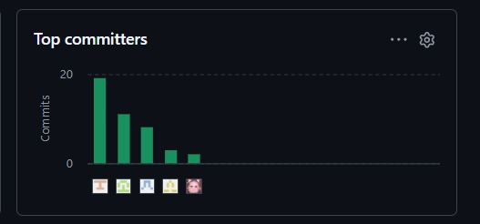

Figura 1: Gráfico de contribuciones del repositorio del informe del proyecto para AV1, mostrando la actividad de colaboración de todos los miembros del equipo durante la elaboración del informe inicial.


Esta distribución evidencia un esfuerzo colaborativo y la participación activa de todos los integrantes en la elaboración y redacción de la documentación del proyecto.


<div style="page-break-after: always;"></div>

# Tabla de contenidos

## [Capítulo I: Introducción](Capitulo_1.md)

- [1.1 Startup Profile](Capitulo_1.md#11-startup-profile)
  - [1.1.1 Descripción de la Startup](Capitulo_1.md#111-descripción-de-la-startup)
  - [1.1.2 Perfiles de integrantes del equipo](Capitulo_1.md#112-perfiles-de-integrantes-del-equipo)
- [1.2 Solution Profile](Capitulo_1.md#12-solution-profile)
  - [1.2.1 Antecedentes y problemática](Capitulo_1.md#121-antecedentes-y-problemática)
  - [1.2.2 Lean UX Process](Capitulo_1.md#122-lean-ux-process)
    - [1.2.2.1 Lean UX Problem Statements](Capitulo_1.md#1221-lean-ux-problem-statements)
    - [1.2.2.2 Lean UX Assumptions](Capitulo_1.md#1222-lean-ux-assumptions)
    - [1.2.2.3 Lean UX Hypothesis Statements](Capitulo_1.md#1223-lean-ux-hypothesis-statements)
    - [1.2.2.4 Lean UX Canvas](Capitulo_1.md#1224-lean-ux-canvas)
- [1.3 Segmentos Objetivos](Capitulo_1.md#13-segmentos-objetivo)

## [Capítulo II: Requirements Elicitation & Analysis](Capitulo_2.md)

- [2.1 Competidores](Capitulo_2.md#21-competidores)
  - [2.1.1 Análisis competitivo](Capitulo_2.md#211-análisis-competitivo)
  - [2.1.2 Estrategias y tácticas frente a competidores](Capitulo_2.md#212-estrategias-y-tácticas-frente-a-competidores)
- [2.2 Entrevistas](Capitulo_2.md#22-entrevistas)
  - [2.2.1 Diseño de entrevistas](Capitulo_2.md#221-diseño-de-entrevistas)
  - [2.2.2 Registro de entrevistas](Capitulo_2.md#222-registro-de-entrevistas)
  - [2.2.3 Análisis de entrevistas](Capitulo_2.md#223-análisis-de-entrevistas)
- [2.3 Needfinding](Capitulo_2.md#23-needfinding)
  - [2.3.1 User Personas](Capitulo_2.md#231-user-personas)
  - [2.3.2 User Task Matrix](Capitulo_2.md#232-user-task-matrix)
  - [2.3.3 User Journey Mapping](Capitulo_2.md#233-user-journey-mapping)
  - [2.3.4 Empathy Mapping](Capitulo_2.md#234-empathy-mapping)
- [2.4 Big Picture EventStorming](Capitulo_2.md#24-big-picture-eventstorming)
- [2.5 Ubiquitous Language](Capitulo_2.md#25-ubiquitous-language)

## [Capítulo III: Requirements Specification](Capitulo_3.md)

- [3.1 User Stories](Capitulo_3.md#31-user-stories)
- [3.2 Impact Mapping](Capitulo_3.md#32-impact-mapping)
- [3.3 Product Backlog](Capitulo_3.md#33-product-backlog)

## [Capítulo IV: Product Design](Capitulo_4.md)

- [4.1 Style Guidelines](Capitulo_4.md#41-style-guidelines)
  - [4.1.1 General Style Guidelines](Capitulo_4.md#411-general-style-guidelines)
  - [4.1.2 Web Style Guidelines](Capitulo_4.md#412-web-style-guidelines)
- [4.2 Information Architecture](Capitulo_4.md#42-information-architecture)
  - [4.2.1 Organization Systems](Capitulo_4.md#421-organization-systems)
  - [4.2.2 Labeling Systems](Capitulo_4.md#422-labeling-systems)
  - [4.2.3 SEO Tags and Meta Tags](Capitulo_4.md#423-seo-tags-and-meta-tags)
  - [4.2.4 Searching Systems](Capitulo_4.md#424-searching-systems)
  - [4.2.5 Navigation Systems](Capitulo_4.md#425-navigation-systems)
- [4.3 Landing Page UI Design](Capitulo_4.md#43-landing-page-ui-design)
  - [4.3.1 Landing Page Wireframe](Capitulo_4.md#431-landing-page-wireframe)
  - [4.3.2 Landing Page Mock-up](Capitulo_4.md#432-landing-page-mock-up)
- [4.4 Web Applications UX/UI Design](Capitulo_4.md#44-web-applications-uxui-design)
  - [4.4.1 Web Applications Wireframes](Capitulo_4.md#441-web-applications-wireframes)
  - [4.4.2 Web Applications Wireflow Diagrams](Capitulo_4.md#442-web-applications-wireflow-diagrams)
  - [4.4.3 Web Applications Mock-ups](Capitulo_4.md#443-web-applications-mock-ups)
  - [4.4.4 Web Applications User Flow Diagrams](Capitulo_4.md#444-web-applications-user-flow-diagrams)
- [4.5 Web Applications Prototyping](Capitulo_4.md#45-web-applications-prototyping)
- [4.6 Domain-Driven Software Architecture](Capitulo_4.md#46-domain-driven-software-architecture)
  - [4.6.1 Design-Level EventStorming](Capitulo_4.md#461-design-level-eventstorming)
  - [4.6.2 Software Architecture Context Diagram](Capitulo_4.md#462-software-architecture-context-diagram)
  - [4.6.3 Software Architecture Container Diagrams](Capitulo_4.md#463-software-architecture-container-diagrams)
  - [4.6.4 Software Architecture Components Diagrams](Capitulo_4.md#464-software-architecture-components-diagrams)
- [4.7 Software Object-Oriented Design](Capitulo_4.md#47-software-object-oriented-design)
  - [4.7.1 Class Diagrams](Capitulo_4.md#471-class-diagrams)
  - [4.7.2 Class Dictionary](Capitulo_4.md#472-class-dictionary)
- [4.8 Database Design](Capitulo_4.md#48-database-design)
  - [4.8.1 Database Diagrams](Capitulo_4.md#481-database-diagrams)
- [4.9 DDD Estratégico](Capitulo_4.md#49-ddd-estratégico)

## [Capítulo V: Product Implementation, Validation & Deployment](Capitulo_5.md)

- [5.1 Software Configuration Management](Capitulo_5.md#51-software-configuration-management)
  - [5.1.1 Software Development Environment Configuration](Capitulo_5.md#511-software-development-environment-configuration)
  - [5.1.2 Source Code Management](Capitulo_5.md#512-source-code-management)
  - [5.1.3 Source Code Style Guide & Conventions](Capitulo_5.md#513-source-code-style-guide--conventions)
  - [5.1.4 Software Deployment Configuration](Capitulo_5.md#514-software-deployment-configuration)
- [5.2 Landing Page, Services & Applications Implementation](Capitulo_5.md#52-landing-page-services--applications-implementation)
  - [5.2.1 Sprint 1](Capitulo_5.md#521-sprint-1)
    - [5.2.1.1 Sprint Planning 1](Capitulo_5.md#5211-sprint-planning-1)
    - [5.2.1.2 Aspect Leaders and Collaborators](Capitulo_5.md#5212-aspect-leaders-and-collaborators)
    - [5.2.1.3 Sprint Backlog 1](Capitulo_5.md#5213-sprint-backlog-1)
    - [5.2.1.4 Development Evidence for Sprint Review](Capitulo_5.md#5214-development-evidence-for-sprint-review)
    - [5.2.1.5 Execution Evidence for Sprint Review](Capitulo_5.md#5215-execution-evidence-for-sprint-review)
    - [5.2.1.6 Services Documentation Evidence for Sprint Review](Capitulo_5.md#5216-services-documentation-evidence-for-sprint-review)
    - [5.2.1.7 Software Deployment Evidence for Sprint Review](Capitulo_5.md#5217-software-deployment-evidence-for-sprint-review)
    - [5.2.1.8 Team Collaboration Insights during Sprint](Capitulo_5.md#5218-team-collaboration-insights-during-sprint)
  - [5.2.2 Sprint 2](Capitulo_5.md#522-sprint-2)
    - [5.2.2.1 Sprint Planning 2](Capitulo_5.md#5221-sprint-planning-2)
    - [5.2.2.2 Aspect Leaders and Collaborators](Capitulo_5.md#5222-aspect-leaders-and-collaborators)
    - [5.2.2.3 Sprint Backlog 2](Capitulo_5.md#5223-sprint-backlog-2)
    - [5.2.2.4 Development Evidence for Sprint Review](Capitulo_5.md#5224-development-evidence-for-sprint-review)
    - [5.2.2.5 Execution Evidence for Sprint Review](Capitulo_5.md#5225-execution-evidence-for-sprint-review)
    - [5.2.2.6 Services Documentation Evidence for Sprint Review](Capitulo_5.md#5226-services-documentation-evidence-for-sprint-review)
    - [5.2.2.7 Software Deployment Evidence for Sprint Review](Capitulo_5.md#5227-software-deployment-evidence-for-sprint-review)
    - [5.2.2.8 Team Collaboration Insights during Sprint](Capitulo_5.md#5228-team-collaboration-insights-during-sprint)
  - [5.2.3 Sprint 3](Capitulo_5.md#523-sprint-3)
    - [5.2.3.1 Sprint Planning 3](Capitulo_5.md#5231-sprint-planning-3)
    - [5.2.3.2 Aspect Leaders and Collaborators](Capitulo_5.md#5232-aspect-leaders-and-collaborators)
    - [5.2.3.3 Sprint Backlog 3](Capitulo_5.md#5233-sprint-backlog-3)
    - [5.2.3.4 Development Evidence for Sprint Review](Capitulo_5.md#5234-development-evidence-for-sprint-review)
    - [5.2.3.5 Execution Evidence for Sprint Review](Capitulo_5.md#5235-execution-evidence-for-sprint-review)
    - [5.2.3.6 Services Documentation Evidence for Sprint Review](Capitulo_5.md#5236-services-documentation-evidence-for-sprint-review)
    - [5.2.3.7 Software Deployment Evidence for Sprint Review](Capitulo_5.md#5237-software-deployment-evidence-for-sprint-review)
    - [5.2.3.8 Team Collaboration Insights during Sprint](Capitulo_5.md#5238-team-collaboration-insights-during-sprint)
- [5.3 Validation Interviews](Capitulo_5.md#53-validation-interviews)
  - [5.3.1 Diseño de Entrevistas](Capitulo_5.md#531-diseño-de-entrevistas)
  - [5.3.2 Registro de Entrevistas](Capitulo_5.md#532-registro-de-entrevistas)
  - [5.3.3 Evaluaciones según heurísticas](Capitulo_5.md#533-evaluaciones-según-heurísticas)
- [5.4 About-the-Product](Capitulo_5.md#54-about-the-product)

## [Conclusiones](Conclusiones_bibliografica.md#conclusiones)

- [Conclusiones y recomendaciones](Conclusiones_bibliografica.md#conclusiones-y-recomendaciones)
- [Video About-the-Team](Conclusiones_bibliografica.md#video-about-the-team)

## [Bibliografía](Conclusiones_bibliografica.md#bibliografía)

## [Anexos](Conclusiones_bibliografica.md#anexos)

<div style="page-break-after: always;"></div>

## Student Outcome

*ABET - EAC - Student Outcome 5*  
*Criterio:* La capacidad de funcionar efectivamente en un equipo cuyos miembros juntos proporcionan liderazgo, crean un entorno de colaboración e inclusivo, establecen objetivos, planifican tareas y cumplen objetivos.

En el siguiente cuadro se describen las acciones realizadas y las conclusiones del grupo que sustentan el logro del ABET - EAC - Student Outcome 5:

| Criterio específico | Acciones realizadas | Conclusiones |
| :--- | :--- | :--- |
| *5.c.1 Trabaja en equipo para proporcionar liderazgo en forma conjunta* | **Aguirre, Eduardo**<br>**AV1:** Apoyó la planificación del trabajo y orientó al equipo en la resolución de los problemas que surgieron durante el desarrollo de los entregables.<br>**TB1:** Lideró el desarrollo del frontend del bounded context Fleet & Station Management, guiando las decisiones de implementación de sus vistas y asegurando su coherencia con el resto de la aplicación. Además, lideró la finalización de las entrevistas y la mejora del perfil demográfico, orientando al equipo en la comprensión de los usuarios.<br>**Franco, José**<br>**AV1:** Coordinó al equipo en la organización de tareas y en la revisión de avances, facilitando que los entregables avanzaran de forma ordenada.<br>**TB1:** Lideró el desarrollo del frontend del bounded context Trip Management, coordinando la implementación de sus vistas con los demás módulos. Asimismo, guio la mejora de la resolución de los diagramas de clases y de base de datos asegurando una comunicación clara del trabajo del equipo.<br>**Velasquez, Rodrigo**<br>**AV1:** Colaboró en la estructuración del contenido y orientó el análisis de la información, aportando coherencia a los documentos del proyecto.<br>**TB1:** Lideró el desarrollo del frontend del bounded context Maintenance y coordinó la elaboración del Reporte de Participación. Además, guio la corrección del apartado de Open Source por Aplicaciones Web y la reorganización del README, asegurando que el repositorio fuera claro y estuviera correctamente presentado.<br>**Ayllon, Juan**<br>**AV1:** Guio las decisiones de diseño de la landing page y la web app, la definición de las style guidelines y la arquitectura del sistema mediante EventStorming.<br>**TB1:** Lideró el desarrollo del frontend del bounded context Billing & Subscription y guio la corrección de las historias de usuario de 8 story points, descomponiéndolas para facilitar su planificación. También coordinó la finalización de la sección 4.4 Web Applications UX/UI Design, manteniendo la consistencia visual del producto.<br>**Armestar, Adrian**<br>**AV1:** Lideró la elaboración de Antecedentes y problemática, Lean UX Canvas, Segmentos objetivo, Big Picture EventStorming, Software Architecture Container Diagrams y Source Code Management, orientando las decisiones técnicas y de producto del equipo.<br>**TB1:** Lideró el desarrollo del frontend del bounded context IAM, estableciendo la base de identidad y acceso sobre la que se integran los demás módulos. Asimismo, lideró la mejora de este Student Outcome y la edición del video del proyecto, asegurando una presentación coherente del trabajo del equipo. | **AV1:** El equipo demostró liderazgo conjunto al distribuir responsabilidades según las áreas del proyecto, apoyar a sus integrantes y coordinar las decisiones importantes. Cada integrante asumió la conducción de una parte del trabajo, lo que permitió avanzar de forma estructurada.<br>**TB1:** En el TB1, el liderazgo se distribuyó por bounded context del frontend (IAM, Trip Management, Billing & Subscription, Fleet & Station Management y Maintenance), y cada integrante asumió además la conducción de un frente de corrección o documentación. Esto consolidó un avance técnico ordenado y alineado con los objetivos del producto. |
| *5.c.2 Crea un entorno colaborativo e inclusivo, establece metas, planifica tareas y cumple objetivos* | **Aguirre, Eduardo**<br>**AV1:** Colaboró en la descripción del equipo y en el needfinding, y cumplió con el maquetado del frontend en Figma dentro del plazo establecido para el Sprint 1.<br>**TB1:** Completó las entrevistas pendientes, mejoró el perfil demográfico, agregó la potencialidad del proyecto y completó los precios del Benchmark, además de cumplir con la implementación del módulo Fleet & Station Management dentro del plazo del TB1.<br>**Franco, José**<br>**AV1:** Participó en la planificación y revisión de avances, contribuyendo a mantener las tareas ordenadas y orientadas a los objetivos del Sprint 1.<br>**TB1:** Colaboró en el desarrollo del módulo Trip Management y cumplió con la elaboración del PPT de la exposición y la mejora de los diagramas de clases y de base de datos, apoyando la entrega final del equipo.<br>**Velasquez, Rodrigo**<br>**AV1:** Aportó a la organización del contenido y a la coordinación del trabajo grupal, favoreciendo que todos los integrantes pudieran contribuir de manera equilibrada.<br>**TB1:** Participó en el desarrollo del módulo Maintenance y cumplió con el Reporte de Participación y la reorganización del README.<br>**Ayllon, Juan**<br>**AV1:** Colaboró en la definición de tareas y en la mejora de la estructura del proyecto, contribuyendo a una planificación más clara del Sprint 1.<br>**TB1:** Colaboró en el desarrollo del módulo Billing & Subscription y cumplió con agregar la evidencia de Trello del Sprint 1, corregir los Story Points de 8 y completar la sección de las Web Applications UX/UI Design, mejorando la trazabilidad de la planificación del equipo.<br>**Armestar, Adrian**<br>**AV1:** Contribuyó a la definición de la Landing Page UI Design, los wireframes y los mockups, cumpliendo con sus entregables dentro del plazo del Sprint 1.<br>**TB1:** Colaboró en el desarrollo del módulo IAM y cumplió con la mejora del Student Outcome, contribuyendo al cumplimiento de los objetivos del TB1 dentro del plazo establecido. | **AV1:** El equipo mantuvo un ambiente colaborativo e incluso estableció metas claras, con el objetivo de planificar las tareas y revisar el progreso de forma continua. Esto permitió cumplir los objetivos y consolidar una propuesta de valor estructurada para BiciGo.<br>**TB1:** En el TB1 se combinó el desarrollo del frontend por módulos con la corrección de los entregables del AV1, manteniendo una distribución equitativa de tareas, seguimiento constante del avance y cumplimiento de los entregables dentro de los plazos definidos. |

</div>


# CAPÍTULO I: INTRODUCCIÓN

## 1.1. Startup Profile

### 1.1.1. Descripción del Startup

Chapa es una startup de movilidad urbana sostenible que transforma la forma en que las personas se desplazan en Lima Metropolitana. Digitalizamos y optimizamos el transporte en zonas de alto tránsito como San Isidro, Miraflores y Santiago de Surco a través de BiciGo: una plataforma de micro-movilidad que conecta a los usuarios con una red inteligente de bicicletas y estaciones estratégicas (paradas), permitiendo trayectos rápidos, ecológicos y eficientes por la red de ciclovías.

Misión: Facilitar un transporte accesible, ecológico y digitalizado mediante soluciones de micro-movilidad inteligente, mejorando la calidad de vida urbana y reduciendo la huella de carbono en Lima Metropolitana.

Visión: Convertirnos en la plataforma líder de movilidad sostenible e intermodal en el Perú, transformando las ciudades en espacios más conectados, eficientes y libres de congestión vehicular.

### 1.1.2. Perfiles de integrantes del equipo

| Integrantes | Descripción |
| :--- | :--- |
|  | **Nombres y Apellidos:** Eduardo Manuel Aguirre Ramos <br> **Código:** U20241A911 <br> **Edad:** 19 años <br> **Ciclo:** Sexto ciclo <br> **Carrera:** Ingeniería de Software - UPC <br> Me gusta aprender de las vivencias de las demás personas y siento curiosidad por conocer sus historias. Tengo conocimientos sobre HTML, CSS, JavaScript, React, Python y MySQL, además de dominar Scrum. Como aporte fundamental, me especializo en habilidades blandas y en la colaboración constante con mis compañeros, facilitando así la comunicación entre los miembros del equipo. |
|  | **Nombres y Apellidos:** Adrian Andres Armestar Felipa <br> **Código:** U202410084 <br> **Carrera:** Ingenieria de Software <br> Soy una persona confiable, adaptable y responsable en cuanto a las entregas de los trabajos. Me especializo en el lenguaje C++ pero también tengo conocimientos acerca de base de datos y JavaScript. Poseo una mentalidad de mejora continua, donde busco aprender y mejorar mis habilidades. Del mismo modo, busco trabajar de manera constante y con una adecuada gestión del tiempo. |
|  | **Nombres y Apellidos:** José María Franco del Carpio <br> **Edad:** 21 años <br> **Ciclo:** Quinto ciclo <br> **Carrera:** Ingeniería de Software <br> Soy una persona creativa y apasionada por la tecnología. Entre mis hobbies se encuentran jugar videojuegos, dibujar y crear historias, además del desarrollo de videojuegos. Tengo conocimientos en los lenguajes de programación C++ y Python, y busco seguir desarrollando mis habilidades en el área de la ingeniería de software. |
|  | **Nombres y Apellidos:** Juan David Ayllon Pauccar <br> **Código:** U20241A860 <br> **Carrera:** Ingeniería de Software <br> Estudiante de sexto ciclo de Ingeniería de Software en la UPC. Cuento con conocimientos técnicos avanzados en desarrollo con C++, SQL, Python intermedio, HTML y CSS. Me distingo por ser un integrante responsable y con gran capacidad de comunicación, facilitando la coordinación y el flujo de trabajo dentro del equipo. |
|  | **Nombres y Apellidos:** Rodrigo Velasquez Velasquez <br> **Código:** U202222074 <br> **Ciclo:** Sexto ciclo <br> **Carrera:** Ingeniería de Software <br> Me interesa el desarrollo de aplicaciones web, las bases de datos y el diseño de software. Participo activamente en proyectos académicos colaborativos, donde aplico buenas prácticas de desarrollo, documentación y control de versiones. |


## 1.2. Solution Profile

### 1.2.1. Antecedentes y problemática
#### What?
En Lima Metropolitana existen pocas alternativas para movilizarse en rutas cortas sin atraer problemas, siendo que los ciudadanos tienden a usar taxis o transporte público. A largo plazo, esto genera congestion vehicular y algunos de estos vehiculos llegan a contaminar el medio ambiente.
#### Why?
Según un informe hecho por Lima Como Vamos (2026) ha habido un incremento en la población insatisfecha con el servicio de mobilidad que recibe, siendo que respecto al 2024 la cifra aumento de 11.5% a 27.7% en servicios de taxi y 18.7% a 37.6% en el Metro de Lima.
#### Where?
El problema ocurre en Lima Metropolitana, sobre todo en distritos con altas cantidades de transito y actividad urbana como Santiago de Surco, Miraflores y San Isidro.
#### When?
Esta problematica sucede diariamente, especialmente en horas de mayor transito.
#### Who?
Los afectados por dicho problema son los trabajadores, estudiantes y ciudadanos en general que necesitan realizar desplazamientos cortos de manera seguida en la ciudad de Lima.
#### How?
La problematica se evidencia cuando los ciudadanos utilizan un metodo de transporte convencional para trayectos cortos, metodo el cual no es sostenible debido al incremento en el transito o la emisión de gases.
#### How much?
Segun el grupo Banco Mundial, los costos relacionados al trafico en Lima equivalen al 1,8% del Producto Bruto Interno (2024). Esto evidencia que el impacto de esta problematica es significativo.
### 1.2.2. Lean UX Process

#### 1.2.2.1. Lean UX Problem Statements

El estado actual de la movilidad urbana en Lima Metropolitana se caracteriza por un uso intensivo del transporte privado y del servicio público para recorridos cortos, especialmente en distritos con alta densidad poblacional y congestionamiento, como San Isidro, Miraflores y Santiago de Surco. La mayoría de los usuarios realiza desplazamientos breves entre su hogar, trabajo, universidad o centros comerciales, pero enfrenta tiempos de espera prolongados, dificultades para encontrar opciones eficientes y altos niveles de frustración por la congestión vial y la falta de alternativas sostenibles.

Lo que los productos y servicios actuales no logran resolver de manera efectiva es la combinación entre rapidez, accesibilidad, seguridad y sostenibilidad en recorridos cortos dentro de la ciudad. En muchos casos, los usuarios deben depender de taxis, transporte público o movilidad privada, lo que incrementa el tráfico, aumenta los costos del desplazamiento y no responde adecuadamente a la necesidad de una solución ecológica y práctica.

Nuestra propuesta, BiciGo, busca resolver esta brecha a través de una plataforma de micro-movilidad inteligente que conecta a los usuarios con bicicletas disponibles en estaciones estratégicas y con una experiencia de uso digital, rápida y conveniente. La solución integrará una red de bicicletas, puntos de acceso (BikePoints), un sistema de desbloqueo por código QR y un modelo de acceso adaptable a distintos tipos de usuarios.

Nuestro enfoque inicial estará dirigido a trabajadores, estudiantes y ciudadanos urbanos que requieren traslados cortos, frecuentes y de alta repetición dentro de Lima Metropolitana, así como a instituciones interesadas en promover movilidad sostenible. Esta audiencia es la más sensible a los problemas de congestión, tiempo de viaje y costos de traslado.

Sabremos que hemos tenido éxito cuando observemos un aumento significativo en la adopción de la solución, una reducción en los tiempos de inicio de viaje y una mejora en la retención de usuarios. En términos medibles, esto se reflejará en un mayor número de recorridos diarios por usuario, un volumen de uso sostenido en horas pico y una reducción en la pérdida o uso ineficiente de bicicletas.

#### 1.2.2.2. Lean UX Assumptions


A continuación se presentan los assumptions definidos para el proyecto, organizados según los cinco tipos recomendados por Lean UX:

##### Business Assumptions
- Chapa puede posicionarse como una startup competitiva en el mercado de movilidad urbana sostenible, aprovechando la demanda creciente por soluciones de transporte alternativas en Lima.
- La implementación de bicicletas como servicio tendrá viabilidad económica si se logra una alta frecuencia de uso y una operación eficiente en zonas de alta demanda.
- La adopción del servicio dependerá de la capacidad de la empresa para establecer alianzas estratégicas con instituciones, municipios y usuarios frecuentes.
- Un modelo de negocio basado en suscripción mensual y pago por uso puede generar ingresos sostenibles y mejorar la retención de clientes.
- La operación de BiciGo puede escalarse en distritos con alta densidad poblacional, siempre que se mida correctamente la demanda y la logística de estaciones y bicicletas.

##### Business Outcome Assumptions
- Si la solución genera valor real para los usuarios, la empresa logrará aumentar la cantidad de viajes registrados por usuario al mes.
- La reducción en el tiempo de inicio del viaje y la mejora en la experiencia del usuario impulsará la retención y la frecuencia de uso.
- Un mejor control de la flota y una política de devoluciones más organizada disminuirá la pérdida y el daño de bicicletas.
- La organización podrá optimizar sus costos operativos si mantiene una proporción equilibrada entre demanda, inventario y mantenimiento.
- El crecimiento de la base de usuarios permitirá mejorar la rentabilidad del servicio a través de economías de escala.

##### User Assumptions
- Los usuarios principales son estudiantes, trabajadores y profesionales que realizan recorridos cortos dentro de la ciudad y buscan un transporte rápido y eficiente.
- El segmento urbano valorará mucho la conveniencia, la rapidez y la reducción del tiempo de desplazamiento durante las horas pico.
- Los usuarios estarán más dispuestos a utilizar la solución si la plataforma ofrece una experiencia simple, clara y accesible desde dispositivos móviles.
- Las personas que usan transporte público frecuentemente buscan alternativas más cómodas, menos congestionadas y con mayor control del tiempo de viaje.
- Las instituciones, universidades y empresas pueden actuar como aliados para ampliar la cobertura del servicio y fomentar la movilidad sostenible.

##### User Outcome and Benefit Assumptions
- Los usuarios esperan poder iniciar un viaje en segundos y evitar tiempos de espera prolongados.
- Los usuarios desean reducir la dependencia del transporte privado o del transporte público para recorridos cortos.
- El servicio debe ofrecer una experiencia de viaje accesible, segura y sostenible para el usuario cotidiano.
- Los clientes perciben valor cuando el costo del desplazamiento es menor o comparable con otros medios de transporte.
- Los usuarios valoran la posibilidad de recorrer distancias cortas de forma rápida, sin esfuerzo adicional y con menor impacto ambiental.

##### Feature Assumptions
- Un sistema de desbloqueo mediante código QR permitirá a los usuarios iniciar sus viajes de manera más rápida y sin fricción.
- La restricción de devoluciones únicamente a BikePoints autorizados reducirá la pérdida, el robo y el mal uso de las bicicletas.
- Una suscripción mensual con viajes de hasta 30 minutos incentivará la fidelización y la frecuencia de uso.
- La ubicación estratégica de estaciones en zonas de mayor demanda facilitará la accesibilidad y el uso cotidiano del servicio.
- Una app móvil con información de estaciones, disponibilidad y recorrido permitirá mejorar la comprensión del servicio y la experiencia de usuario.

#### 1.2.2.3. Lean UX Hypothesis Statements
A partir de los assumptions definidos, se establecen las hipótesis de valor del producto. Cada una de ellas refleja una relación entre la propuesta de valor, el segmento objetivo y la funcionalidad clave del sistema.

- Creemos que lograremos aumentar la adopción del servicio si los usuarios urbanos pueden desbloquear bicicletas mediante código QR de forma rápida y sencilla, porque esto les permitirá iniciar sus viajes con menor esfuerzo y menos tiempo de espera. Sabremos que hemos tenido éxito cuando más del 80% de los usuarios pueda iniciar su recorrido en menos de 30 segundos.

- Creemos que lograremos disminuir la pérdida y el robo de bicicletas si los usuarios solo pueden devolverlas en BikePoints autorizados, porque esto permitirá un control más eficiente de la flota y una operación más segura. Sabremos que hemos tenido éxito cuando la cantidad de bicicletas reportadas como perdidas o no devueltas sea menor al 5% del total de bicicletas.

- Creemos que fomentaremos la fidelidad del servicio si ofrecemos una suscripción mensual con viajes de hasta 30 minutos, porque muchos usuarios de uso frecuente preferirán un plan claro y económico frente al pago por uso. Sabremos que hemos tenido éxito cuando más del 75% de los usuarios recurrentes se suscriba al plan mensual.

- Creemos que lograremos aumentar la frecuencia de uso del servicio si ubicamos estaciones estratégicamente en zonas con mayor flujo cotidiano, porque esto reducirá la fricción de acceso y mejorará la experiencia de los usuarios en sus desplazamientos diarios. Sabremos que hemos tenido éxito cuando la demanda de viajes en horas pico aumente de forma sostenida en los distritos con mayor cobertura.

- Creemos que mejoraremos la experiencia del usuario si incorporamos una aplicación móvil con información en tiempo real sobre disponibilidad de bicicletas y estaciones, porque los usuarios podrán planificar mejor sus viajes y reducir la incertidumbre al momento de desplazarse. Sabremos que hemos tenido éxito cuando más del 70% de los usuarios utilicen la aplicación al menos una vez por viaje o al menos una vez por semana.


#### 1.2.2.4. Lean UX Canvas
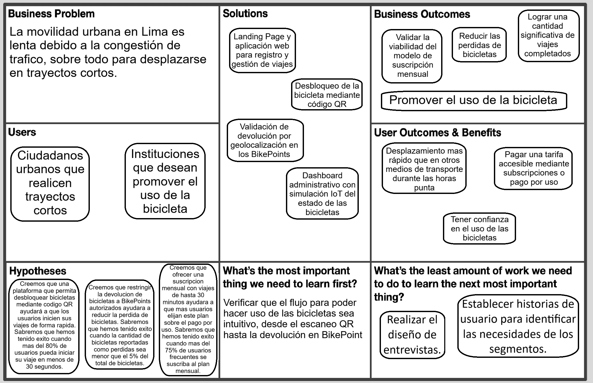

## 1.3. Segmentos Objetivo
### Segmento 1: Ciudadanos urbanos que realicen trayectos cortos
#### Descripción general:
Se refiere a personas que necesitan recorrer trayectos cortos dentro de la ciudad y que busquen una alternativa accesible a comparación del transporte público actual.
#### Perfil demográfico:
Incluye a estudiantes y trabajadores jovenes de entre 18 a 40 años que residen en Lima Metropolitana.
#### Dato del sector:
Según ComexPerú (2024), los limeños pierden aproximadamente 157 horas al año debido al tránsito en las horas punta. Lo cual evidencia que el segmento se traslada con mayor lentitud a comparación de las bicicletas.
#### Necesidad:
Este segmento necesita una alternativa de movilidad rápida y accesible para los trayectos cortos, la cual no influya en la congestion vehicular ni del transporte informal.

### Segmento 2: Instituciones que desean promover el uso de la bicicleta
#### Descripción general:
Se refiere a instituciones que podrían albergar BikePoints de manera que se facilitan puntos de acceso al servicio dentro de sus instalaciones.
#### Perfil demográfico:
Incluye universidades, municipalidades o empresas interesadas en impulsar el transporte no motorizado.
#### Dato del sector:
La Ley 29593 promueve el uso de la bicicleta como medio de transporte sostenible. Esta ley, que declara de interés nacional el uso de la bicicleta, impulsa a las instituciones, sobre todo a las nacionales, a fomentar su uso.
#### Necesidad:
Este segmento necesita soluciones de bajo costo que les permita ofrecer una movilidad sostenible a sus trabajadores.


# CAPÍTULO II: REQUIREMENTS ELICITATION & ANALYSIS

## 2.1. Competidores


### 2.1.1. Análisis competitivo.
<table border="1" cellspacing="0" cellpadding="7" style="border-collapse: collapse; width: 100%; border: 2px solid black;"> <tr> <th colspan="6" align="left">Competitive Analysis Landscape</th> </tr> <tr> <td colspan="2" rowspan="2"><b>¿Por qué llevar a cabo este análisis?</b></td> <td colspan="4"><b>Identificar las características, fortalezas y debilidades de los principales servicios de alquiler de bicicletas en Lima, con el propósito de reconocer oportunidades de diferenciación y establecer una propuesta de valor competitiva para la startup.</b></td> </tr> <tr> <td colspan="4">&nbsp;<br><br></td> </tr> <tr> <td colspan="2"><b>Competidores</b></td>   <th align="center">
    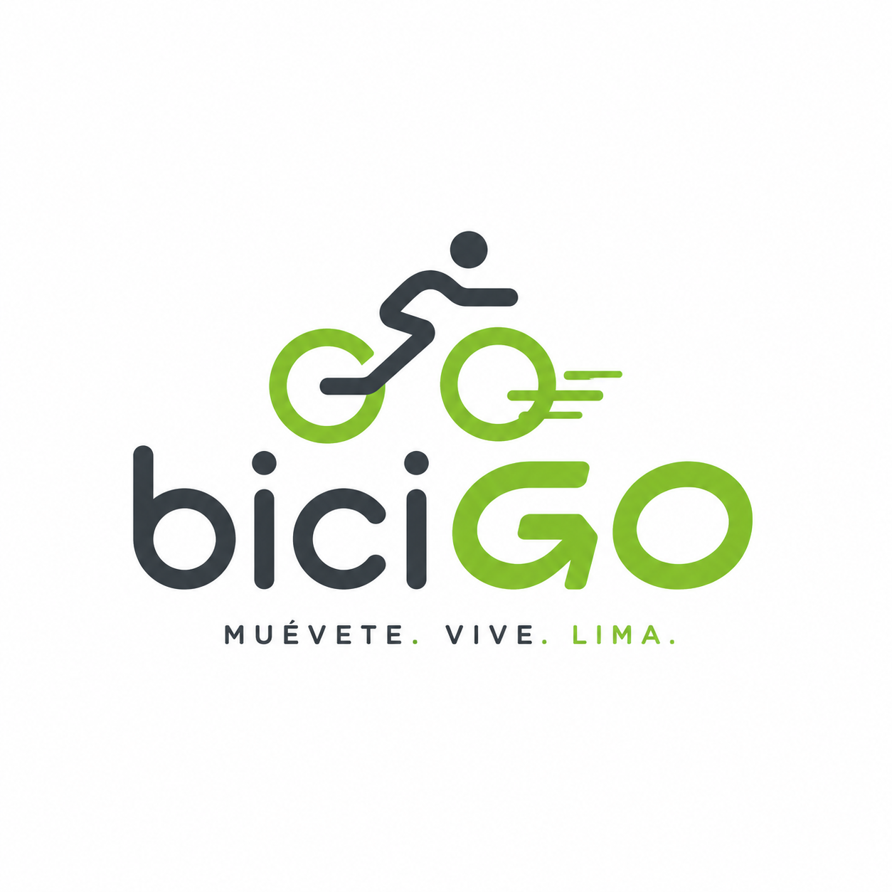<br>
    <b>biciGO</b>
  </th> <th align="center">
    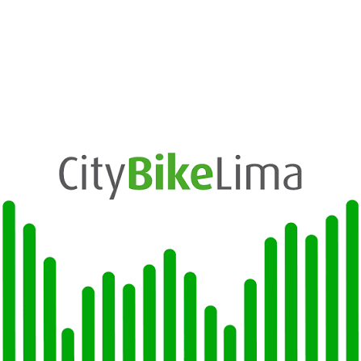<br>
    <b>CityBike Lima</b>
  </th>
  <th align="center">
    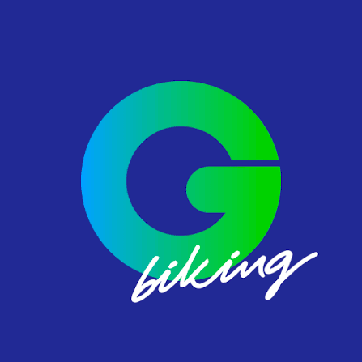<br>
    <b>GOGO Biking</b>
  </th><th align="center">
    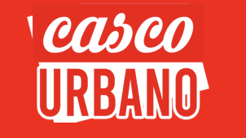<br>
    <b>Casco Urbano</b>
  </th>
</tr></tr> <tr> <td rowspan="2" align="center"><b>Perfil</b></td> <td><b>Overview</b></td>
<td>
  Startup enfocada en el alquiler de bicicletas para desplazamientos urbanos de corta duración. Los usuarios podrán localizar bicicletas, iniciar y finalizar alquileres, realizar pagos y gestionar sus viajes mediante una plataforma web y móvil.
</td>

<td>
  Sistema de bicicletas compartidas que funciona mediante una red de bicicletas y estaciones ubicadas principalmente en Miraflores.
</td>

<td>
  Empresa dedicada al alquiler de bicicletas y a la realización de recorridos turísticos por diferentes zonas de Lima.
</td>

<td>
  Negocio especializado en bicicletas que ofrece alquiler, mantenimiento, reparación, tours y otros servicios relacionados.
</td>
</tr> <tr> <td> <b>Ventaja competitiva<br> ¿Qué valor ofrece a los clientes?</b> </td>
<td>
  Servicio digital sencillo y flexible, alquiler por tiempo, consulta de disponibilidad y posibilidad de implementar puntos mediante alianzas con universidades, empresas y establecimientos.
</td>

<td>
  Infraestructura ya implementada, estaciones establecidas, tarifas accesibles y reconocimiento dentro de Miraflores.
</td>

<td>
  Atención personalizada, experiencia en alquiler de bicicletas y recorridos turísticos especializados.
</td>

<td>
  Combina el alquiler de bicicletas con servicios de mantenimiento, reparación y otros servicios especializados.
</td>
</tr> <tr> <td align="center"><b>Perfil de Marketing</b></td> <td><b>Mercado objetivo</b></td>
<td>
  Estudiantes, jóvenes, trabajadores, residentes y turistas que necesiten realizar desplazamientos urbanos cortos de manera práctica, económica y sostenible.
</td>

<td>
  Residentes, trabajadores y visitantes de Miraflores que realizan desplazamientos de corta distancia.
</td>

<td>
  Principalmente turistas nacionales y extranjeros interesados en recorridos recreativos y turísticos en bicicleta.
</td>

<td>
  Ciclistas, turistas y personas interesadas en alquiler, mantenimiento o reparación de bicicletas.
</td>
</tr> <tr> <td>&nbsp;</td> <td><b>Estrategias de marketing</b></td>
<td>
  Redes sociales, descuentos para estudiantes y nuevos usuarios, programas de referidos y alianzas con universidades, empresas, hoteles, gimnasios, cafeterías y comercios.
</td>

<td>
  Promoción de la movilidad sostenible mediante página web, aplicación móvil y presencia de estaciones en espacios urbanos.
</td>

<td>
  Marketing enfocado en turismo, redes sociales, recomendaciones, promociones y difusión de tours.
</td>

<td>
  Promoción digital de sus servicios de alquiler, mantenimiento, reparación y productos relacionados.
</td>
</tr> <tr> <td rowspan="3" align="center"><b>Perfil del Producto</b></td> <td><b>Productos &amp; Servicios</b></td>
<td>
  Alquiler por tiempo, consulta de disponibilidad, inicio y finalización del alquiler, pagos digitales, historial de viajes, reporte de averías y planes para usuarios frecuentes.
</td>

<td>
  Bicicletas compartidas mediante estaciones, diferentes tipos de pases y gestión mediante aplicación y página web.
</td>

<td>
  Alquiler de bicicletas y tours guiados por diferentes zonas de Lima.
</td>

<td>
  Alquiler de bicicletas, mantenimiento, reparación, tours y accesorios.
</td>
</tr> <tr> <td><b>Precios &amp; Costos</b></td>
<td>
  Pago según el tiempo utilizado, planes diarios o mensuales y descuentos para estudiantes o usuarios frecuentes. Los principales costos corresponden a bicicletas, mantenimiento, desarrollo tecnológico, soporte e infraestructura básica.
</td>

<td>
  Diferentes tipos de pases con tarifas accesibles. Sus principales costos corresponden a bicicletas, estaciones, mantenimiento e infraestructura.
</td>

<td>
  Precios principalmente por tiempo de alquiler y servicios turísticos. Sus costos incluyen bicicletas, mantenimiento, locales, personal y guías.
</td>

<td>
  Precios según alquiler y servicios adicionales. Sus principales costos corresponden a mantenimiento, herramientas, personal, inventario y establecimiento físico.
</td>
</tr> <tr> <td> <b>Canales de distribución<br> (Web y/o Móvil)</b> </td>
<td>
  Plataforma web responsive, aplicación móvil y puntos físicos asociados para recoger y devolver bicicletas. También contará con un dashboard administrativo.
</td>

<td>
  Página web, aplicación móvil y estaciones físicas.
</td>

<td>
  Página web, redes sociales, contacto directo y establecimientos físicos.
</td>

<td>
  Página web, redes sociales y establecimiento físico.
</td>
</tr> <tr> <td rowspan="5" align="center"><b>Análisis SWOT</b></td>
<td colspan="5">
  <b>Realice esto para su startup y sus competidores. Sus fortalezas deberían apoyar sus oportunidades y contribuir a lo que ustedes definen como su posible ventaja competitiva.</b>
</td>
</tr> <tr> <td><b>Fortalezas</b></td>
<td>
  Plataforma web y móvil, modelo flexible, posibilidad de expansión mediante alianzas, gestión digital y enfoque en recorridos urbanos cortos.
</td>

<td>
  Infraestructura implementada, estaciones disponibles, tarifas accesibles y reconocimiento dentro de Miraflores.
</td>

<td>
  Experiencia en alquiler, atención personalizada y conocimiento del mercado turístico.
</td>

<td>
  Experiencia técnica, mantenimiento, reparación y variedad de servicios relacionados con bicicletas.
</td>
</tr> <tr> <td><b>Debilidades</b></td>
<td>
  Marca nueva, cantidad inicial limitada de bicicletas, capital reducido y dependencia inicial de alianzas para ampliar cobertura.
</td>

<td>
  Dependencia de estaciones determinadas y necesidad de nueva infraestructura para ampliar la cobertura.
</td>

<td>
  Dependencia de locales y horarios y orientación principalmente turística.
</td>

<td>
  Dependencia de un establecimiento físico y menor automatización del proceso de alquiler.
</td>
</tr> <tr> <td><b>Oportunidades</b></td>
<td>
  Crecimiento de la movilidad sostenible, congestión vehicular, alianzas con universidades y empresas y expansión hacia zonas con menor cobertura.
</td>

<td>
  Expansión hacia nuevos distritos, crecimiento del uso de bicicletas y desarrollo de nuevas ciclovías.
</td>

<td>
  Crecimiento del turismo urbano, nuevas rutas y alianzas con hoteles y agencias.
</td>

<td>
  Crecimiento del ciclismo urbano y mayor demanda de servicios de mantenimiento y reparación.
</td>
</tr> <tr> <td><b>Amenazas</b></td>
<td>
  Robo o vandalismo, costos de mantenimiento, accidentes, regulaciones municipales, nuevos competidores y otras alternativas de micromovilidad.
</td>

<td>
  Nuevos competidores, costos de expansión, daños y vandalismo de las bicicletas.
</td>

<td>
  Reducción del turismo, otros servicios turísticos y sistemas automatizados de alquiler.
</td>

<td>
  Competencia de talleres, plataformas digitales y sistemas de bicicletas compartidas.
</td>
</tr> <tr> <td>&nbsp;</td> <td>&nbsp;</td> <td>&nbsp;</td> <td>&nbsp;</td> <td>&nbsp;</td> <td>&nbsp;</td> </tr> </table>


### 2.1.2 Estrategias y tácticas frente a competidores

Se plantean estrategias y tácticas preliminares que permitan a **biciGO** afrontar las fortalezas de sus competidores, aprovechar sus debilidades y responder a las oportunidades y amenazas presentes en el mercado de alquiler de bicicletas.

| **Aspecto** | **biciGO** | **CityBike Lima** | **GOGO Biking** | **Casco Urbano** | **Acciones de biciGO** |
|---|---|---|---|---|---|
| **Fortalezas a afrontar** | Plataforma digital orientada a alquileres rápidos, flexibles y recorridos urbanos cortos. | Cuenta con infraestructura implementada, estaciones establecidas, tarifas accesibles y reconocimiento en Miraflores. | Posee experiencia en alquiler de bicicletas, atención personalizada y presencia en el mercado turístico. | Cuenta con experiencia técnica, mantenimiento, reparación y conocimiento especializado en bicicletas. | biciGO buscará diferenciarse mediante facilidad de uso, digitalización, flexibilidad y puntos de alquiler estratégicos, evitando competir únicamente por precio. |
| **Debilidades a aprovechar** | Al ser una startup nueva puede adaptar su plataforma y modelo de negocio desde el inicio según las necesidades de los usuarios. | Depende de estaciones específicas y necesita infraestructura adicional para ampliar su cobertura. | Su servicio está orientado principalmente al turismo y depende de locales y horarios determinados. | Su operación depende principalmente de un establecimiento físico y presenta menor automatización del alquiler. | Implementar puntos mediante alianzas con universidades, empresas, hoteles, estacionamientos y comercios, evitando depender de un único establecimiento o de grandes estaciones. |
| **Oportunidades** | Crecimiento de la movilidad sostenible, mayor uso de servicios digitales y necesidad de alternativas para recorridos urbanos cortos. | El uso de bicicletas compartidas demuestra que existe interés por este tipo de movilidad. | La existencia de alquileres turísticos demuestra que existe demanda por servicios de bicicletas. | El crecimiento del ciclismo urbano genera mayor interés por bicicletas y servicios relacionados. | Crear alianzas con universidades y empresas, promociones para estudiantes, planes para usuarios frecuentes y expansión hacia zonas con menor cobertura. |
| **Amenazas** | Robo, vandalismo, costos de mantenimiento, accidentes, regulaciones municipales y aparición de nuevos competidores. | Puede ampliar su infraestructura o mejorar su plataforma y competir en nuevas zonas. | Puede ampliar sus servicios hacia alquileres urbanos de corta duración. | Puede incorporar herramientas digitales y aumentar su presencia en el mercado de alquiler. | Implementar registro obligatorio de usuarios, historial de alquileres, reporte de daños, mantenimiento preventivo y expansión progresiva para reducir riesgos. |
| **Estrategia competitiva** | Ofrecer un servicio digital, sencillo, flexible y orientado a desplazamientos urbanos de corta duración. | Competir mediante mayor flexibilidad y presencia en zonas donde CityBike tenga menor cobertura. | Diferenciarse mediante alquileres urbanos rápidos y autoservicio digital en lugar de centrarse principalmente en tours. | Diferenciarse mediante automatización del alquiler y disponibilidad desde diferentes puntos. | Posicionar a biciGO como una alternativa de movilidad urbana práctica, digital y accesible. |
| **Tácticas preliminares** | Plataforma web y móvil, alquiler por tiempo, pagos digitales, historial de viajes, reportes y dashboard administrativo. | Implementar puntos en universidades y establecimientos privados, ofrecer descuentos para estudiantes y simplificar el proceso de alquiler. | Ofrecer alquileres de 30 minutos, 1 hora o varias horas y promociones para usuarios frecuentes. | Permitir localizar bicicletas, iniciar y finalizar alquileres y reportar problemas desde la plataforma. | Redes sociales, programa de referidos, descuentos iniciales, alianzas estratégicas, planes mensuales, mantenimiento preventivo y expansión según la demanda. |

##  Estrategia general

La estrategia competitiva de **biciGO** estará basada en ofrecer un servicio de alquiler de bicicletas **digital, flexible y accesible**, orientado principalmente a desplazamientos urbanos de corta duración.

La startup buscará aprovechar las limitaciones de los competidores mediante una mayor facilidad de uso, puntos de alquiler estratégicos y alianzas con universidades, empresas y establecimientos privados.

## Principales tácticas

- Implementar una plataforma web y móvil sencilla.
- Permitir consultar bicicletas disponibles.
- Facilitar el inicio y finalización de los alquileres.
- Incorporar pagos digitales.
- Ofrecer descuentos para estudiantes y nuevos usuarios.
- Implementar programas de referidos.
- Crear planes para usuarios frecuentes.
- Establecer alianzas con universidades, empresas y comercios.
- Implementar reportes de daños y averías.
- Gestionar el mantenimiento preventivo de las bicicletas.
- Expandir progresivamente los puntos de alquiler según la demanda.

## 2.2. Entrevistas

### 2.2.1. Diseño de entrevistas

A continuación, se presentan las preguntas principales y complementarias diseñadas para cada segmento objetivo.

#### Segmento 1: Ciudadanos urbanos que realizan trayectos cortos

Este segmento está compuesto por estudiantes, trabajadores y profesionales jóvenes que residen en Lima Metropolitana y requieren desplazamientos frecuentes en zonas congestionadas.

##### Preguntas principales
| N° | Pregunta |
|---|---|
| 1 | ¿Cuál es su edad, distrito de residencia, ocupación actual y estado civil? |
| 2 | ¿Con qué frecuencia realiza desplazamientos cortos dentro de la ciudad y en qué horarios? |
| 3 | ¿Qué medio de transporte utiliza con mayor frecuencia para recorridos cortos y por qué? |
| 4 | ¿Qué tan cómodo o frustrado se siente al usar transporte público o taxis para trayectos cortos? |
| 5 | ¿Qué factores influyen en su decisión al elegir un medio de transporte para desplazamientos diarios? |
| 6 | ¿Ha considerado alguna vez usar bicicletas como alternativa para moverse por la ciudad? ¿Por qué sí o por qué no? |
| 7 | ¿Qué aspectos serían decisivos para que usted adopte un servicio de bicicletas compartidas? |
| 8 | ¿Cuál sería su nivel de aceptación frente a una app que permita registrar bicicletas, consultar disponibilidad y desbloquearlas mediante código QR? |
| 9 | ¿Está dispuesto a pagar por un servicio de bicicletas compartidas y qué tipo de tarifa le resultaría más atractiva? |
| 10 | ¿Qué tan importante es para usted la seguridad, la sostenibilidad y la rapidez al momento de desplazarse? |

##### Preguntas complementarias
- ¿Qué tan frecuente usa aplicaciones móviles para transporte o pago digital?
- ¿Qué tan seguro se siente al usar bicicletas en la ciudad y qué factores lo afectan?
- ¿Qué tan recomendable sería para usted desplazarse en bicicleta durante la mañana o la tarde en su zona?
- ¿Qué mejoras le gustaría ver en un servicio de bicicletas compartidas?
- ¿Qué tan importante es contar con estaciones cercanas a su hogar, universidad o trabajo?
- ¿Cuánto tiempo está dispuesto a invertir en buscar una bicicleta o station point antes de iniciar un viaje?
- ¿Se sentiría motivado a usar este servicio si existiera un plan mensual para usuarios frecuentes?
- ¿Qué tan útil considera que sería un servicio pensado para recorridos de 10 a 30 minutos?

#### Segmento 2: Instituciones que desean promover el uso de la bicicleta

Este segmento incluye universidades, municipalidades, empresas y otras organizaciones interesadas en fomentar la movilidad sostenible entre sus miembros, estudiantes o trabajadores.

##### Preguntas principales
| N° | Pregunta |
|---|---|
| 1 | ¿Qué tipo de institución representa y cuál es su rol en la promoción de la movilidad sostenible? |
| 2 | ¿Qué tipo de población atiende la institución y qué necesidades de movilidad presenta? |
| 3 | ¿Actualmente se promueve alguna iniciativa relacionada con la bicicleta o con medios de transporte sostenibles? |
| 4 | ¿Qué limitaciones tienen los empleados o estudiantes para desplazarse en bicicleta dentro de la ciudad? |
| 5 | ¿Considera que la movilidad sostenible es una prioridad dentro de la institución o comunidad que representa? |
| 6 | ¿Qué beneficios esperaría obtener una institución si implementa un servicio de bicicletas compartidas para sus usuarios? |
| 7 | ¿Qué tan viable sería para su institución contar con puntos de acceso o BikePoints dentro de sus instalaciones? |
| 8 | ¿Qué condiciones deberían cumplirse para que una alianza con una startup de micromovilidad sea atractiva para su organización? |
| 9 | ¿Qué indicadores permitirían medir el éxito de una iniciativa de movilidad sostenible dentro de la institución? |
| 10 | ¿Estaría dispuesto a participar en una estrategia de promoción del uso de bicicleta mediante beneficios, incentivos o convenios? |

##### Preguntas complementarias
- ¿Qué tan importante es para la institución reducir la congestión, mejorar la movilidad o mejorar la imagen sostenible de la organización?
- ¿Qué tan factible sería implementar bicicletas compartidas en espacios universitarios, corporativos o municipales?
- ¿Qué nivel de apoyo administrativo o financiero podría ofrecer la institución para una iniciativa de este tipo?
- ¿Qué tipo de usuarios serían los principales beneficiarios de una solución de movilidad sostenible?
- ¿Qué tan relevante es para la institución la seguridad del usuario, el mantenimiento de la flota y la digitalización del servicio?
- ¿Qué tipo de servicios adicionales complementarios podrían ser valorados por la institución?
- ¿Qué barreras percibe para la adopción de bicicletas como opción de transporte institucional?
- ¿Qué tan viable es establecer alianzas con empresas o universidades para ampliar los puntos de uso del servicio?


### 2.2.2. Registro de entrevistas
#### Primer Segmento objetivo: Estudiantes y profesionales

<table style="width: 100%" align="center">
  <tr>
    <th>Entrevistado 1</th>
    <th>Entrevistado 2</th>
    <th>Entrevistado 3</th>
  </tr>
  <tr>
    <td align="center">
      <a href="https://upcedupe-my.sharepoint.com/:v:/g/personal/u20241a911_upc_edu_pe/IQDxZUCIUMf8RpBSZ5jmNJTWAe3OcVVZVYDUP-SV0bk5Pu8?e=DMd2bO" target="_blank">
        
      </a>
    </td>
    <td align="center">
      <a href="ENLACE_VIDEO_2" target="_blank">
        
      </a>
    </td>
    <td align="center">
      <a href="ENLACE_VIDEO_3" target="_blank">
        
      </a>
    </td>
  </tr>
  <tr>
    <td valign="top">
      <b>Entrevistador:</b> Juan David Ayllon Pauccar<br>
      <b>Entrevistado:</b> Fernando Güere Calero<br>
      <b>Edad:</b> 19 años <br>
      <b>Distrito:</b> Chaclacayo <br>
      <b>Estado civil:</b> Soltero <br>
      <b>Ocupación:</b> Estudiante de ingeniería <br>
      <b>Inicio de la entrevista:</b> 0:00 <br><br>
      <b>Resumen:</b> El entrevistado usa principalmente la bicicleta para desplazamientos cortos porque la considera cómoda, económica y útil para hacer ejercicio. Considera incómodo y costoso utilizar transporte público o taxis para estos trayectos. Muestra interés en un servicio de bicicletas compartidas con una aplicación para consultar disponibilidad y desbloquear bicicletas mediante código QR, siempre que tenga tarifas razonables y condiciones de seguridad adecuadas.<br><br>
      <b>Perfil del entrevistado:</b> Fernando Güere Calero es un hombre de 19 años, soltero, residente en el distrito de Chaclacayo y estudiante de ingeniería. Forma parte del grupo de jóvenes que realiza desplazamientos cotidianos dentro de la ciudad y tiene experiencia utilizando la bicicleta como medio de transporte para recorridos cortos. Su perfil corresponde al de un usuario que busca alternativas prácticas para movilizarse en sus actividades diarias.
    </td>
    <td valign="top">
      <b>Entrevistador:</b> <br>
      <b>Entrevistado:</b> <br>
      <b>Edad:</b> <br>
      <b>Distrito:</b> <br>
      <b>Inicio de la entrevista:</b> <br><br>
      <b>Resumen:</b> <br><br>
      <b>Perfil del entrevistado:</b>
    </td>
    <td valign="top">
      <b>Entrevistador:</b> <br>
      <b>Entrevistado:</b> <br>
      <b>Edad:</b> <br>
      <b>Distrito:</b> <br>
      <b>Inicio de la entrevista:</b> <br><br>
      <b>Resumen:</b> <br><br>
      <b>Perfil del entrevistado:</b>
    </td>
  </tr>
</table>


#### Segundo Segmento objetivo: Transeuntes

<table style="width: 100%" align='center'>
  <tr>
    <th>Entrevistado 1</th>
    <th>Entrevistado 2</th>
    <th>Entrevistado 3</th>
  </tr>
  <tr>
    <td align='center'>
      <a href="https://upcedupe-my.sharepoint.com/:v:/g/personal/u202322952_upc_edu_pe/IQCmXEuLne2lTZsZnWYzY_9gAUFseCBoR-M_F5l_kv8R3z0?nav=eyJyZWZlcnJhbEluZm8iOnsicmVmZXJyYWxBcHAiOiJPbmVEcml2ZUZvckJ1c2luZXNzIiwicmVmZXJyYWxBcHBQbGF0Zm9ybSI6IldlYiIsInJlZmVycmFsTW9kZSI6InZpZXciLCJyZWZlcnJhbFZpZXciOiJNeUZpbGVzTGlua0NvcHkifX0&e=PqFbEC" target="_blank">
        
      </a>
    </td>
    <td align='center'>
      <a href="https://upcedupe-my.sharepoint.com/:v:/g/personal/u20241a911_upc_edu_pe/IQCfnIQowgWEQKxTcK51KNwUAeiVUFnDUoG8urSVMs6EWMg?e=Hh2UL8" target="_blank">
        
      </a>
    </td>
    <td align='center'>
      <a href="https://upcedupe-my.sharepoint.com/:v:/g/personal/u20241a911_upc_edu_pe/IQArqY5miSBMTq7c8R2ZrekrAX2BczGjyQ_9jew8pat2KDo?e=aWA2gK" target="_blank">
        
      </a>
    </td>
  </tr>
  <tr>
    <td valign="top">
      <b>Entrevistador:</b> Eduardo Manuel Aguirre Ramos <br>
      <b>Entrevistado:</b> Antony Rodrigo Quito Ancasy<br>
      <b>Edad:</b> 20 años <br>
      <b>Distrito:</b> Chorrillos <br>
      <b>Inicio de la entrevista:</b> 1:18 <br><br>
      <b>Resumen:</b> El entrevistado, joven de 20 años relató su experiencia sobre las mototaxis en la zona de Chorrillos,en el cual compartio sus dificultades tanto por el lado del precio como tambien el de no saber si el conductor pueda tener precaución al conducir además de ello aclaro que lo que priorizaria en una app de transporte seria ver el perfil del conductor para no tomar riesgos al pedir un viaje.
      <br><br>
      <b>Perfil del entrevistado:</b>Hombre de 20 años que reside en Lima por el distrito de Chorrillos, ha vivido toda su vida alli y menciona que mayormente para transportarse a diferentes zonas pide mototaxi regularmente, además menciona problemas que le sucede dia a dia como el tener que "regatear" precios ademas de miedo por tener que subirse a una mototaxi la cual el conductor para ahorrar tiempo se metio en contra de la ruta y puso en peligro al pasajero.
    </td>
    <td valign="top">
      <b>Entrevistador:</b> Eduardo Manuel Aguirre Ramos <br>
      <b>Entrevistado:</b>  <br>
      <b>Edad:</b>  años <br>
      <b>Distrito:</b> Carhuaz <br>
      <b>Inicio de la entrevista:</b>  <br><br>
      <b>Resumen:</b> .
      <br><br>
      <b>Perfil del entrevistado:</b>como pasajero.
    </td>
    <td valign="top">
      <b>Entrevistador:</b> Adrian Armestar <br>
      <b>Entrevistado:</b> Mauricio <br>
      <b>Edad:</b> 23 años <br>
      <b>Distrito:</b> Miraflores <br>
      <b>Inicio de la entrevista:</b> 00:01 <br><br>
      <b>Resumen:</b> El entrevistado Mauricio indica que realiza trayectos cortos muy pocas veces pero tiende a optar por el transporte publica cuando necesita ahorrar tiempo
      aunque se suele frustrar con los tiempos de espera y el trafico que se genera.<br>
      <br>
      <b>Perfil del entrevistado:</b> Es un hombre de 23 años que reside en el distrito de Miraflores
    </td>
  </tr>
</table>

### 2.2.3. Análisis de entrevistas

#### Segmento 2
##### Entrevistado 3:
Mauricio nos menciona que el no suele recorrer trayectos cortos, pero cuando los hace, prefiere utilizar el transporte publico pues piensa en ahorrar su tiempo. Sin embargo, tiene en cuenta los tiempos de espera, la falta de horarios establecidos y la congestión de trafico en general, lo cual lo frustra puesto que el considera que la comodidad y la rapidez son factores importantes para decidir como movilizarse. Él conoce las bicicletas de alquiler, aunque no las ha utilizado debido a la falta de claridad sobre el proceso de pago. Considera que usar una bicicleta para desplazamientos cortos es bueno siempre y cuando el tiempo de alquiler sea rentable, prefiriendo pagar por minutos en lugar de adquirir una suscripción. Destaca el método de desbloqueo de las bicicletas mediante QR por su comodidad y rapidez las cuales satisface sus necesidades. Del mismo modo, considera razonable devolver las bicicletas en estaciones especificas aunque le gustaría que se le destaque cuales son las estaciones más cercanas. Finalmente, considera indispensable que la aplicación muestre un mapa de estaciones y bicicletas disponibles, además del costo estimado por uso y las rutas por ciclovías, destacando las ultimas dos como elementos importantes para garantizar un buen uso hacia el usuario.

## 2.3. Needfinding

### 2.3.1. User Personas
Para comprender mejor las necesidades y comportamientos de los usuarios, se elaboraron dos User Personas basados en los segmentos objetivo identificados en el proyecto.

Andres representa al segmento de Rider que realiza trayectos cortos cotidianos hacia la universidad o trabajo. Busca una alternativa rápida, económica y sostenible para evitar el tráfico y la dependencia del transporte público.

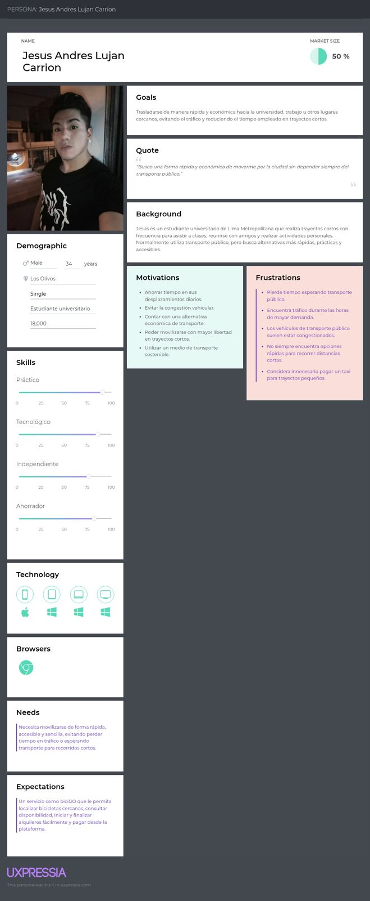

Claudia representa al segmento ciudado el cual realiza trayectos con poca frecuencia para cosas puntuales  orientado a la eficiencia en el uso del tiempo y presupuesto. Realiza trayectos breves para compras, trámites y reuniones, buscando evitar las altas tarifas de taxi y el tráfico, valorando la predictibilidad, la seguridad y la facilidad de pago.

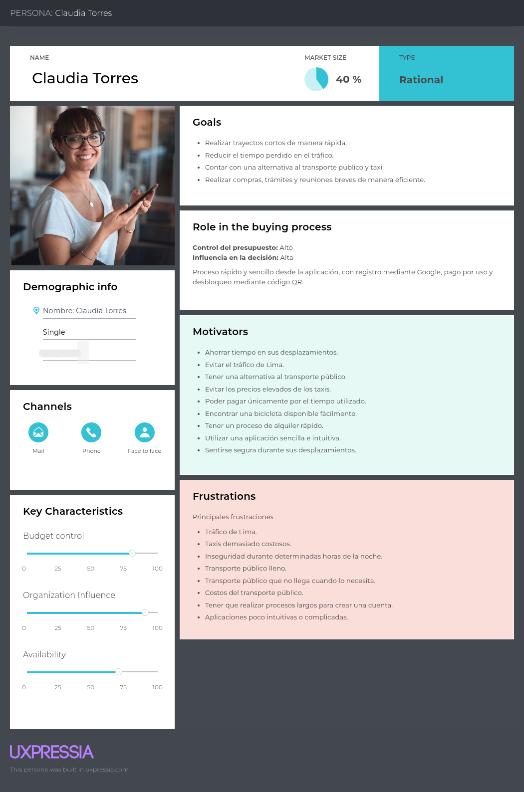


### 2.3.2. User Task Matrix

La User Task Matrix nos permite descomponer las actividades y tareas que nuestros usuarios realizan al utilizar la solución propuesta. Estas tareas, al clasificarse por su frecuencia e importancia, nos ayudan a priorizar qué funcionalidades de BiciGo deben desarrollarse con mayor énfasis para optimizar la experiencia de cada segmento.

Los segmentos considerados para este análisis son:

- **Estudiante (Jesús Andrés)**
- **Ciudadano (Claudia Torres)**

| Tarea | Jesús Andrés Luján (Rider / Commuter - 34) | | Claudia Torres (Rational - 21) | |
| :--- | :--- | :--- | :--- | :--- |
| | **Frecuencia** | **Importancia** | **Frecuencia** | **Importancia** |
| Consultar disponibilidad de bicicletas y BikePoints cercanos | Always | High | Always | High |
| Desbloquear bicicleta mediante código QR | Always | High | Always | High |
| Iniciar y finalizar el alquiler de la bicicleta | Always | High | Always | High |
| Consultar tarifa estimada y métodos de pago | Always | High | Always | High |
| Visualizar rutas y mapa de ciclovías en tiempo real | Often | Medium | Often | Medium |
| Adquirir o gestionar plan de suscripción mensual | Sometimes | Medium | Sometimes | Medium |
| Consultar historial de viajes y pagos | Sometimes | Medium | Sometimes | Medium |
| Monitorear disponibilidad y estado de flota en BikePoints | Never | — | Never | — |
| Registrar incidencias o fallas mecánicas en bicicletas | Rarely | High | Rarely | High |
| Consultar métricas de uso e impacto ambiental | Rarely | Low | Rarely | Low |
| Gestionar datos del perfil personal / cuenta | Sometimes | Medium | Sometimes | Medium |
### 2.3.3. User Journey Mapping

.png)

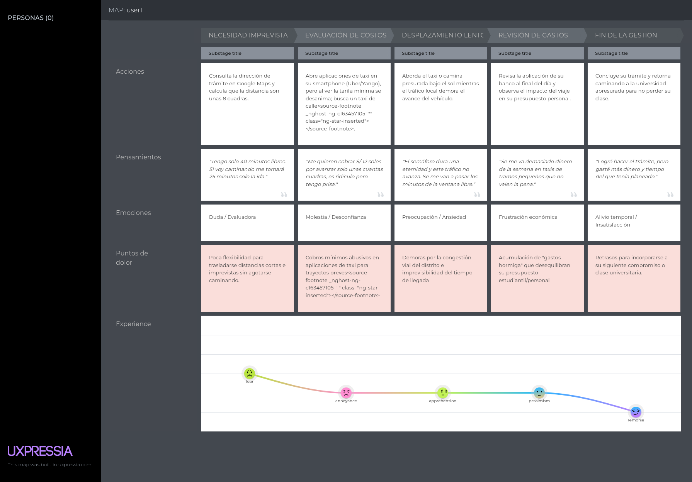
### 2.3.4. Empathy Mapping

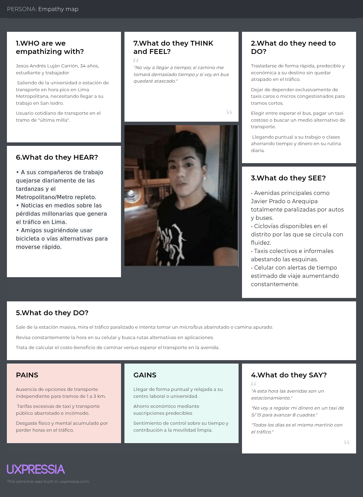

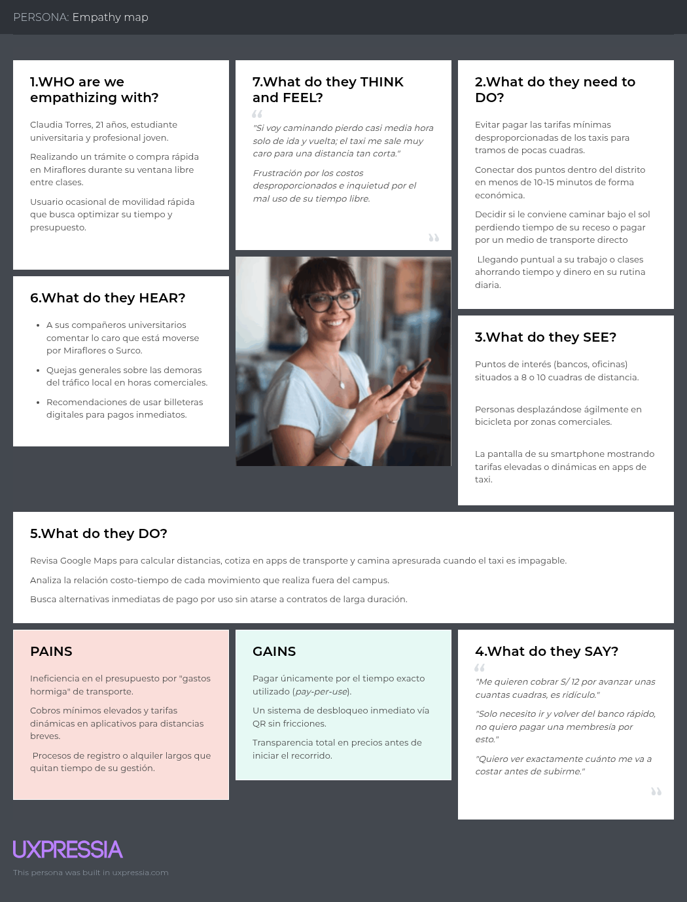

## 2.4. Big Picture EventStorming
En la sesión de Big Picture Event Storming, el equipo exploró de forma visual el panorama general del dominio de movilidad urbana sostenible y gestión de bicicletas compartidas de Chapa. Se identificaron los eventos significativos del ciclo de vida de un viaje, desde el registro del usuario y la disponibilidad de una bicicleta hasta el inicio, seguimiento y finalización del recorrido en un BikePoint autorizado. Integrando los actores que interactuan con la plataforma y exponiendo los problemas, dudas y oportunidades de mejora detectados durante la sesión. Esta primera aproximación permitió alinear el entendimiento del equipo y sentar las bases para el diseño detallado de la solución.

**Primera fase: Eventos**
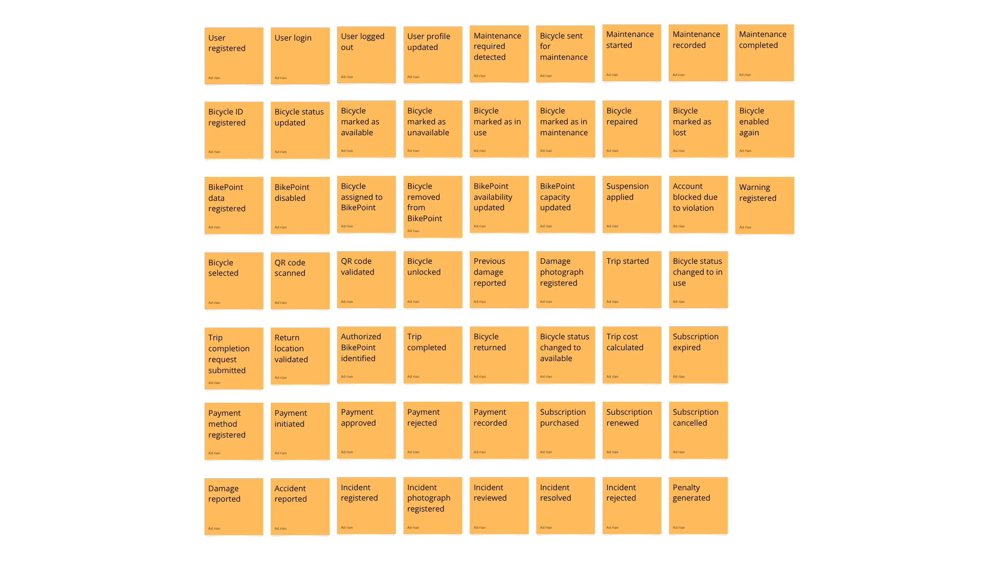

**Mapa General:** https://canva.link/7coo689oj2nx3b7

## 2.5. Ubiquitous Language

El **Ubiquitous Language** establece un lenguaje común para todos los participantes del proyecto **BiciGo**, permitiendo que los conceptos relacionados con el servicio de alquiler de bicicletas sean comprendidos de la misma manera por el equipo de desarrollo, los usuarios y demás participantes.

Los siguientes términos representan los principales conceptos utilizados dentro del dominio de BiciGo.

## Términos del dominio

| Término                      | Definición                                                                                                                                                             |
| ---------------------------- | ---------------------------------------------------------------------------------------------------------------------------------------------------------------------- |
| **BiciGo**                   | Servicio de alquiler de bicicletas que permite a los usuarios realizar desplazamientos mediante bicicletas disponibles en puntos de estacionamiento establecidos.      |
| **Usuario**                  | Persona que se registra en BiciGo y utiliza el servicio de alquiler de bicicletas.                                                                                     |
| **Registro**                 | Proceso mediante el cual una persona crea una cuenta en BiciGo para poder acceder al servicio.                                                                         |
| **Bicicleta**                | Medio de transporte proporcionado por BiciGo para que los usuarios puedan realizar sus desplazamientos.                                                                |
| **Punto de estacionamiento** | Zona fija establecida por BiciGo donde los usuarios pueden recoger o dejar una bicicleta.                                                                              |
| **Disponibilidad**           | Estado que indica si una bicicleta se encuentra disponible para ser utilizada.                                                                                         |
| **Alquiler**                 | Acción mediante la cual un usuario obtiene una bicicleta de BiciGo para realizar un recorrido.                                                                         |
| **Viaje**                    | Recorrido realizado por un usuario desde que inicia el uso de una bicicleta hasta que finaliza y la devuelve en un punto habilitado.                                   |
| **Kilometraje**              | Distancia recorrida durante un viaje y utilizada como referencia para calcular la tarifa del servicio.                                                                 |
| **Tarifa**                   | Monto correspondiente al pago de un viaje de acuerdo con los kilómetros recorridos.                                                                                    |
| **Cobro**                    | Proceso mediante el cual BiciGo determina y realiza el pago correspondiente al viaje del usuario.                                                                      |
| **Suscripción Premium**      | Modalidad de suscripción de BiciGo que permite al usuario utilizar el servicio sin pagar la tarifa correspondiente al kilometraje, según las condiciones establecidas. |
| **Usuario Premium**          | Usuario que posee una suscripción Premium activa y cuenta con los beneficios asociados a dicha modalidad.                                                              |
| **Inicio de viaje**          | Momento en que el usuario comienza a utilizar una bicicleta disponible.                                                                                                |
| **Fin de viaje**             | Momento en que el usuario termina su recorrido y deja la bicicleta en un punto de estacionamiento habilitado.                                                          |
| **Recorrido**                | Trayecto realizado entre el punto donde el usuario recoge la bicicleta y el punto donde la devuelve.                                                                   |
| **Punto de recogida**        | Punto de estacionamiento en el que el usuario obtiene una bicicleta disponible para iniciar un viaje.                                                                  |
| **Punto de devolución**      | Punto de estacionamiento en el que el usuario finaliza su viaje y deja la bicicleta.                                                                                   |

## Flujo principal del servicio

El funcionamiento principal de BiciGo se puede representar mediante el siguiente flujo:

```text
Usuario
   ↓
Registro
   ↓
Bicicleta disponible
   ↓
Punto de recogida
   ↓
Inicio de viaje
   ↓
Recorrido
   ↓
Kilometraje
   ↓
Punto de devolución
   ↓
Fin de viaje
   ↓
Cobro
```

En el caso de un **Usuario Premium**, el sistema mantiene el registro del viaje y del kilometraje recorrido. Sin embargo, el usuario no realiza el cobro asociado a los kilómetros recorridos debido al beneficio proporcionado por su **Suscripción Premium**.

## Uso del lenguaje común

La terminología definida en este apartado será utilizada como referencia durante las siguientes etapas del desarrollo de BiciGo. Esto permitirá mantener una comunicación consistente entre los integrantes del equipo y evitar diferencias en la interpretación de los conceptos del sistema.

Los términos definidos serán considerados posteriormente en:

* Historias de usuario.
* EventStorming.
* Arquitectura de software.
* Arquitectura de información.
* Diseño de la base de datos.
* Diseño de interfaces.
* Implementación de la aplicación.


# CAPÍTULO III: REQUIREMENTS SPECIFICATION
## 3.1. User Stories

### Epics

Los siguientes Epics agrupan las User Stories y Technical Stories de biciGO según las principales capacidades funcionales del sistema.

<table border="1" cellspacing="0" cellpadding="7" style="border-collapse: collapse; width: 100%; border: 2px solid black;">
  <tr>
    <th align="center">Epic ID</th>
    <th align="center">Título</th>
    <th align="center">Descripción</th>
    <th align="center">Historias relacionadas</th>
  </tr>
  <tr>
    <td valign="top"><b>EP-01</b></td>
    <td valign="top">Gestión de cuentas y autenticación</td>
    <td valign="top">Agrupa las funcionalidades relacionadas con el registro, inicio de sesión, verificación, recuperación de contraseña y seguridad de acceso de los usuarios en biciGO.</td>
    <td valign="top">US-01 a US-05, TS-01 a TS-04</td>
  </tr>
  <tr>
    <td valign="top"><b>EP-02</b></td>
    <td valign="top">Localización y disponibilidad de bicicletas</td>
    <td valign="top">Incluye las funcionalidades que permiten consultar la ubicación, disponibilidad, información y cobertura de las bicicletas dentro de las zonas donde opera biciGO.</td>
    <td valign="top">US-06 a US-10, US-39, TS-05 a TS-07</td>
  </tr>
  <tr>
    <td valign="top"><b>EP-03</b></td>
    <td valign="top">Gestión de alquileres y viajes</td>
    <td valign="top">Reúne las funcionalidades necesarias para iniciar, desbloquear, consultar y finalizar alquileres, así como controlar la información del recorrido y su costo.</td>
    <td valign="top">US-11 a US-15, TS-08 a TS-11</td>
  </tr>
  <tr>
    <td valign="top"><b>EP-04</b></td>
    <td valign="top">Pagos, tarifas y suscripciones</td>
    <td valign="top">Comprende la gestión de métodos de pago, tarifas, cobros, comprobantes y planes de suscripción para usuarios frecuentes de biciGO.</td>
    <td valign="top">US-16 a US-20, US-36, US-37, TS-12 a TS-14</td>
  </tr>
  <tr>
    <td valign="top"><b>EP-05</b></td>
    <td valign="top">Perfil, historial y gestión personal</td>
    <td valign="top">Agrupa las funcionalidades que permiten al usuario consultar y actualizar su perfil, revisar viajes anteriores, gestionar su contraseña y desactivar su cuenta.</td>
    <td valign="top">US-21 a US-25, US-40, TS-15 y TS-16</td>
  </tr>
  <tr>
    <td valign="top"><b>EP-06</b></td>
    <td valign="top">Incidencias, soporte y notificaciones</td>
    <td valign="top">Incluye el reporte y seguimiento de problemas, la comunicación con soporte y la gestión de notificaciones relacionadas con alquileres, pagos e incidencias.</td>
    <td valign="top">US-26 a US-30, US-38, TS-17 y TS-18</td>
  </tr>
  <tr>
    <td valign="top"><b>EP-07</b></td>
    <td valign="top">Administración y gestión operativa</td>
    <td valign="top">Reúne las funcionalidades administrativas necesarias para supervisar la flota, gestionar usuarios e incidencias y consultar métricas operativas del servicio.</td>
    <td valign="top">US-31 a US-35, TS-19 y TS-20</td>
  </tr>
</table>


<table border="1" cellspacing="0" cellpadding="7" style="border-collapse: collapse; width: 100%; border: 2px solid black;">
    <tr>
      <th align="center">Epic / Story ID</th>
      <th align="center">Título</th>
      <th align="center">Descripción</th>
      <th align="center">Criterios de Aceptación</th>
      <th align="center">Relacionado con (Epic ID)</th>
    </tr>
    <tr>
      <td valign="top"><b>US-01</b></td>
      <td valign="top">Registro de usuario</td>
      <td valign="top"><b>Como visitante</b>, quiero registrarme en biciGO proporcionando mis datos personales y credenciales, para poder acceder a los servicios de alquiler de bicicletas.</td>
      <td valign="top"><b>Escenario 1: Registro exitoso</b><br><br><b>Dado</b> que el visitante no posee una cuenta registrada<br><b>Cuando</b> completa todos los campos obligatorios con información válida<br><b>Entonces</b> el sistema crea la cuenta correctamente<br><b>Y</b> permite al usuario acceder a la plataforma.<br><br><b>Escenario 2: Correo electrónico ya registrado</b><br><br><b>Dado</b> que existe una cuenta asociada al correo proporcionado<br><b>Cuando</b> el visitante intenta registrarse utilizando dicho correo<br><b>Entonces</b> el sistema rechaza el registro<br><b>Y</b> informa que el correo ya se encuentra registrado.<br><br><b>Escenario 3: Datos obligatorios incompletos</b><br><br><b>Dado</b> que el visitante se encuentra en el formulario de registro<br><b>Cuando</b> intenta registrarse sin completar todos los campos obligatorios<br><b>Entonces</b> el sistema no crea la cuenta<br><b>Y</b> indica qué información debe completar.</td>
      <td valign="top"><b>EP-01</b></td>
    </tr>
    <tr>
      <td valign="top"><b>US-02</b></td>
      <td valign="top">Inicio de sesión</td>
      <td valign="top"><b>Como usuario registrado</b>, quiero iniciar sesión con mis credenciales, para acceder de forma segura a las funcionalidades de biciGO.</td>
      <td valign="top"><b>Escenario 1: Inicio de sesión exitoso</b><br><br><b>Dado</b> que el usuario posee una cuenta activa<br><b>Cuando</b> ingresa un correo electrónico y una contraseña válidos<br><b>Entonces</b> el sistema autentica al usuario<br><b>Y</b> permite acceder a la pantalla principal.<br><br><b>Escenario 2: Contraseña incorrecta</b><br><br><b>Dado</b> que el correo pertenece a una cuenta registrada<br><b>Cuando</b> el usuario proporciona una contraseña incorrecta<br><b>Entonces</b> el sistema rechaza el acceso<br><b>Y</b> informa que las credenciales son incorrectas.<br><br><b>Escenario 3: Cuenta inexistente</b><br><br><b>Dado</b> que el usuario se encuentra en la pantalla de inicio de sesión<br><b>Cuando</b> proporciona un correo no registrado<br><b>Entonces</b> el sistema no inicia sesión<br><b>Y</b> informa que no existe una cuenta asociada al correo.</td>
      <td valign="top"><b>EP-01</b></td>
    </tr>
    <tr>
      <td valign="top"><b>US-03</b></td>
      <td valign="top">Recuperación de contraseña</td>
      <td valign="top"><b>Como usuario registrado</b>, quiero recuperar el acceso a mi cuenta cuando olvide mi contraseña, para poder continuar utilizando biciGO.</td>
      <td valign="top"><b>Escenario 1: Solicitud válida</b><br><br><b>Dado</b> que el usuario posee una cuenta registrada<br><b>Cuando</b> solicita recuperar su contraseña utilizando su correo<br><b>Entonces</b> el sistema inicia el proceso de recuperación<br><b>Y</b> envía las instrucciones correspondientes.<br><br><b>Escenario 2: Correo no registrado</b><br><br><b>Dado</b> que el usuario se encuentra en la opción de recuperación de contraseña<br><b>Cuando</b> ingresa un correo no asociado a ninguna cuenta<br><b>Entonces</b> el sistema no inicia el proceso<br><b>Y</b> informa que el correo no está registrado.<br><br><b>Escenario 3: Nueva contraseña válida</b><br><br><b>Dado</b> que el usuario accedió correctamente al proceso de recuperación<br><b>Cuando</b> establece una nueva contraseña que cumple los requisitos<br><b>Entonces</b> el sistema actualiza sus credenciales<br><b>Y</b> permite iniciar sesión con la nueva contraseña.</td>
      <td valign="top"><b>EP-01</b></td>
    </tr>
    <tr>
      <td valign="top"><b>US-04</b></td>
      <td valign="top">Verificación de cuenta</td>
      <td valign="top"><b>Como usuario recién registrado</b>, quiero verificar mi cuenta, para confirmar mis datos y habilitar el acceso completo a los servicios de biciGO.</td>
      <td valign="top"><b>Escenario 1: Verificación exitosa</b><br><br><b>Dado</b> que el usuario posee una cuenta pendiente de verificación<br><b>Cuando</b> realiza correctamente el proceso de validación<br><b>Entonces</b> el sistema marca la cuenta como verificada<br><b>Y</b> habilita las funcionalidades correspondientes.<br><br><b>Escenario 2: Verificación inválida</b><br><br><b>Dado</b> que el usuario intenta validar su cuenta<br><b>Cuando</b> utiliza información o un código de verificación inválido<br><b>Entonces</b> el sistema rechaza la verificación<br><b>Y</b> solicita realizar nuevamente el proceso.<br><br><b>Escenario 3: Cuenta previamente verificada</b><br><br><b>Dado</b> que la cuenta ya fue verificada<br><b>Cuando</b> el usuario intenta repetir el proceso<br><b>Entonces</b> el sistema mantiene el estado de la cuenta<br><b>Y</b> informa que la verificación ya fue realizada.</td>
      <td valign="top"><b>EP-01</b></td>
    </tr>
    <tr>
      <td valign="top"><b>US-05</b></td>
      <td valign="top">Cierre de sesión</td>
      <td valign="top"><b>Como usuario autenticado</b>, quiero cerrar mi sesión, para evitar que otras personas accedan a mi cuenta desde el mismo dispositivo.</td>
      <td valign="top"><b>Escenario 1: Cierre exitoso</b><br><br><b>Dado</b> que el usuario mantiene una sesión activa<br><b>Cuando</b> selecciona la opción de cerrar sesión<br><b>Entonces</b> el sistema finaliza la sesión<br><b>Y</b> redirige al usuario a la pantalla de acceso.<br><br><b>Escenario 2: Acceso posterior al cierre</b><br><br><b>Dado</b> que la sesión fue finalizada<br><b>Cuando</b> el usuario intenta acceder a una funcionalidad restringida<br><b>Entonces</b> el sistema bloquea el acceso<br><b>Y</b> solicita iniciar sesión nuevamente.<br><br><b>Escenario 3: Sesión expirada</b><br><br><b>Dado</b> que la sesión del usuario ha expirado<br><b>Cuando</b> intenta realizar una operación protegida<br><b>Entonces</b> el sistema impide continuar<br><b>Y</b> solicita nuevamente sus credenciales.</td>
      <td valign="top"><b>EP-01</b></td>
    </tr>
    <tr>
      <td valign="top"><b>US-06</b></td>
      <td valign="top">Permitir acceso a ubicación</td>
      <td valign="top"><b>Como usuario registrado</b>, quiero permitir que biciGO acceda a mi ubicación, para identificar bicicletas disponibles cercanas.</td>
      <td valign="top"><b>Escenario 1: Permiso concedido</b><br><br><b>Dado</b> que el usuario accede por primera vez al mapa<br><b>Cuando</b> concede permiso para utilizar su ubicación<br><b>Entonces</b> el sistema obtiene su ubicación aproximada<br><b>Y</b> centra el mapa en la zona correspondiente.<br><br><b>Escenario 2: Permiso rechazado</b><br><br><b>Dado</b> que el sistema solicita acceso a la ubicación<br><b>Cuando</b> el usuario rechaza el permiso<br><b>Entonces</b> la plataforma continúa funcionando<br><b>Y</b> permite consultar manualmente otras zonas.<br><br><b>Escenario 3: Ubicación no disponible</b><br><br><b>Dado</b> que el usuario permitió el acceso a su ubicación<br><b>Cuando</b> el dispositivo no puede determinarla<br><b>Entonces</b> el sistema informa la situación<br><b>Y</b> permite buscar una ubicación manualmente.</td>
      <td valign="top"><b>EP-02</b></td>
    </tr>
    <tr>
      <td valign="top"><b>US-07</b></td>
      <td valign="top">Visualización de bicicletas cercanas</td>
      <td valign="top"><b>Como usuario registrado</b>, quiero visualizar las bicicletas disponibles cerca de mi ubicación, para elegir una alternativa conveniente para mi viaje.</td>
      <td valign="top"><b>Escenario 1: Bicicletas disponibles</b><br><br><b>Dado</b> que existen bicicletas disponibles cerca del usuario<br><b>Cuando</b> accede al mapa principal<br><b>Entonces</b> el sistema muestra las bicicletas disponibles<br><b>Y</b> indica su ubicación aproximada.<br><br><b>Escenario 2: Sin bicicletas disponibles</b><br><br><b>Dado</b> que no existen bicicletas disponibles en la zona consultada<br><b>Cuando</b> el usuario visualiza el mapa<br><b>Entonces</b> el sistema informa que no existen unidades disponibles<br><b>Y</b> mantiene visible el mapa para consultar otras zonas.<br><br><b>Escenario 3: Cambio de disponibilidad</b><br><br><b>Dado</b> que una bicicleta cambia de estado<br><b>Cuando</b> el usuario actualiza la información del mapa<br><b>Entonces</b> el sistema refleja el nuevo estado<br><b>Y</b> evita mostrar información obsoleta.</td>
      <td valign="top"><b>EP-02</b></td>
    </tr>
    <tr>
      <td valign="top"><b>US-08</b></td>
      <td valign="top">Consulta de información de bicicleta</td>
      <td valign="top"><b>Como usuario registrado</b>, quiero consultar la información de una bicicleta, para verificar su disponibilidad y condición antes de alquilarla.</td>
      <td valign="top"><b>Escenario 1: Consulta exitosa</b><br><br><b>Dado</b> que el usuario observa una bicicleta en el mapa<br><b>Cuando</b> selecciona dicha bicicleta<br><b>Entonces</b> el sistema muestra su información disponible<br><b>Y</b> indica si puede ser alquilada.<br><br><b>Escenario 2: Bicicleta no disponible</b><br><br><b>Dado</b> que la bicicleta seleccionada dejó de estar disponible<br><b>Cuando</b> el usuario consulta su información<br><b>Entonces</b> el sistema muestra su estado actualizado<br><b>Y</b> impide iniciar un alquiler.<br><br><b>Escenario 3: Bicicleta fuera de servicio</b><br><br><b>Dado</b> que una bicicleta fue marcada para mantenimiento<br><b>Cuando</b> el usuario intenta consultarla para alquilarla<br><b>Entonces</b> el sistema informa que se encuentra fuera de servicio<br><b>Y</b> no permite seleccionarla para alquiler.</td>
      <td valign="top"><b>EP-02</b></td>
    </tr>
    <tr>
      <td valign="top"><b>US-09</b></td>
      <td valign="top">Búsqueda de bicicletas por zona</td>
      <td valign="top"><b>Como usuario registrado</b>, quiero buscar bicicletas en una zona específica, para planificar un desplazamiento aunque no me encuentre actualmente en ese lugar.</td>
      <td valign="top"><b>Escenario 1: Zona encontrada</b><br><br><b>Dado</b> que el usuario desea consultar otra ubicación<br><b>Cuando</b> ingresa una zona válida<br><b>Entonces</b> el sistema posiciona el mapa en esa zona<br><b>Y</b> muestra las bicicletas disponibles.<br><br><b>Escenario 2: Zona sin disponibilidad</b><br><br><b>Dado</b> que la ubicación ingresada es válida<br><b>Cuando</b> no existen bicicletas disponibles en ella<br><b>Entonces</b> el sistema informa que no existen unidades disponibles.<br><br><b>Escenario 3: Ubicación inválida</b><br><br><b>Dado</b> que el usuario utiliza el buscador<br><b>Cuando</b> ingresa una ubicación que no puede ser identificada<br><b>Entonces</b> el sistema informa que la ubicación no fue encontrada<br><b>Y</b> permite realizar una nueva búsqueda.</td>
      <td valign="top"><b>EP-02</b></td>
    </tr>
    <tr>
      <td valign="top"><b>US-10</b></td>
      <td valign="top">Actualización de disponibilidad</td>
      <td valign="top"><b>Como usuario registrado</b>, quiero actualizar la disponibilidad de bicicletas mostrada, para consultar información reciente antes de seleccionar una unidad.</td>
      <td valign="top"><b>Escenario 1: Actualización exitosa</b><br><br><b>Dado</b> que el usuario se encuentra visualizando el mapa<br><b>Cuando</b> solicita actualizar la información<br><b>Entonces</b> el sistema obtiene los estados más recientes<br><b>Y</b> actualiza las bicicletas mostradas.<br><br><b>Escenario 2: Bicicleta recientemente ocupada</b><br><br><b>Dado</b> que una bicicleta estaba disponible anteriormente<br><b>Cuando</b> otro usuario inicia su alquiler<br><b>Entonces</b> el sistema actualiza su estado<br><b>Y</b> deja de mostrarla como disponible.<br><br><b>Escenario 3: Error al actualizar</b><br><br><b>Dado</b> que existe un problema de comunicación<br><b>Cuando</b> el usuario solicita actualizar el mapa<br><b>Entonces</b> el sistema informa que no pudo obtener datos recientes<br><b>Y</b> permite intentar nuevamente.</td>
      <td valign="top"><b>EP-02</b></td>
    </tr>
    <tr>
      <td valign="top"><b>US-11</b></td>
      <td valign="top">Inicio de alquiler</td>
      <td valign="top"><b>Como usuario registrado</b>, quiero iniciar el alquiler de una bicicleta disponible, para utilizarla durante mi desplazamiento.</td>
      <td valign="top"><b>Escenario 1: Inicio exitoso</b><br><br><b>Dado</b> que el usuario se encuentra autenticado y la bicicleta está disponible<br><b>Cuando</b> solicita iniciar el alquiler<br><b>Entonces</b> el sistema registra el inicio del servicio<br><b>Y</b> asigna la bicicleta al usuario.<br><br><b>Escenario 2: Bicicleta no disponible</b><br><br><b>Dado</b> que la bicicleta seleccionada ya está siendo utilizada<br><b>Cuando</b> el usuario intenta alquilarla<br><b>Entonces</b> el sistema rechaza la solicitud<br><b>Y</b> informa que la bicicleta no está disponible.<br><br><b>Escenario 3: Alquiler previamente activo</b><br><br><b>Dado</b> que el usuario ya posee un alquiler activo<br><b>Cuando</b> intenta iniciar otro alquiler<br><b>Entonces</b> el sistema rechaza la operación<br><b>Y</b> solicita finalizar primero el alquiler actual.</td>
      <td valign="top"><b>EP-03</b></td>
    </tr>
    <tr>
      <td valign="top"><b>US-12</b></td>
      <td valign="top">Desbloqueo de bicicleta</td>
      <td valign="top"><b>Como usuario con un alquiler autorizado</b>, quiero desbloquear la bicicleta mediante el mecanismo proporcionado por biciGO, para comenzar mi recorrido.</td>
      <td valign="top"><b>Escenario 1: Desbloqueo exitoso</b><br><br><b>Dado</b> que existe un alquiler válido asociado a la bicicleta<br><b>Cuando</b> el usuario utiliza correctamente el código de desbloqueo<br><b>Entonces</b> el sistema autoriza el desbloqueo<br><b>Y</b> habilita el inicio del recorrido.<br><br><b>Escenario 2: Código incorrecto</b><br><br><b>Dado</b> que el usuario intenta desbloquear una bicicleta<br><b>Cuando</b> introduce un código inválido<br><b>Entonces</b> el sistema rechaza la operación<br><b>Y</b> informa que el código no es válido.<br><br><b>Escenario 3: Código asociado a otra bicicleta</b><br><br><b>Dado</b> que el usuario posee un alquiler activo<br><b>Cuando</b> intenta utilizar el código en una bicicleta diferente<br><b>Entonces</b> el sistema impide el desbloqueo<br><b>Y</b> indica la bicicleta correspondiente.</td>
      <td valign="top"><b>EP-03</b></td>
    </tr>
    <tr>
      <td valign="top"><b>US-13</b></td>
      <td valign="top">Consulta del viaje activo</td>
      <td valign="top"><b>Como usuario con un alquiler activo</b>, quiero consultar la información de mi recorrido, para conocer el estado actual de mi viaje.</td>
      <td valign="top"><b>Escenario 1: Viaje activo</b><br><br><b>Dado</b> que el usuario posee un alquiler en curso<br><b>Cuando</b> accede al detalle del viaje<br><b>Entonces</b> el sistema muestra la información disponible del recorrido<br><b>Y</b> mantiene visible el estado activo.<br><br><b>Escenario 2: Sin viaje activo</b><br><br><b>Dado</b> que el usuario no posee un alquiler vigente<br><b>Cuando</b> intenta consultar un viaje activo<br><b>Entonces</b> el sistema informa que actualmente no existe uno.<br><br><b>Escenario 3: Información actualizada</b><br><br><b>Dado</b> que el recorrido continúa en ejecución<br><b>Cuando</b> el usuario actualiza la pantalla<br><b>Entonces</b> el sistema presenta los datos más recientes del viaje.</td>
      <td valign="top"><b>EP-03</b></td>
    </tr>
    <tr>
      <td valign="top"><b>US-14</b></td>
      <td valign="top">Consulta de costo durante el viaje</td>
      <td valign="top"><b>Como usuario con un alquiler activo</b>, quiero consultar el costo acumulado del recorrido, para controlar cuánto estoy gastando mientras utilizo la bicicleta.</td>
      <td valign="top"><b>Escenario 1: Costo disponible</b><br><br><b>Dado</b> que existe un alquiler activo<br><b>Cuando</b> el usuario consulta la información del viaje<br><b>Entonces</b> el sistema calcula el costo acumulado<br><b>Y</b> lo muestra al usuario.<br><br><b>Escenario 2: Actualización del recorrido</b><br><br><b>Dado</b> que el usuario continúa desplazándose<br><b>Cuando</b> aumenta la distancia registrada<br><b>Entonces</b> el sistema recalcula el costo correspondiente<br><b>Y</b> muestra el nuevo importe acumulado.<br><br><b>Escenario 3: Error temporal de cálculo</b><br><br><b>Dado</b> que no puede obtenerse temporalmente la información necesaria<br><b>Cuando</b> el usuario consulta el costo<br><b>Entonces</b> el sistema informa que el cálculo no está disponible momentáneamente<br><b>Y</b> permite actualizarlo posteriormente.</td>
      <td valign="top"><b>EP-03</b></td>
    </tr>
    <tr>
      <td valign="top"><b>US-15</b></td>
      <td valign="top">Finalización de alquiler</td>
      <td valign="top"><b>Como usuario con un alquiler activo</b>, quiero finalizar correctamente mi alquiler, para detener el cobro y liberar la bicicleta para otros usuarios.</td>
      <td valign="top"><b>Escenario 1: Finalización exitosa</b><br><br><b>Dado</b> que el usuario posee un alquiler activo<br><b>Cuando</b> solicita finalizarlo correctamente<br><b>Entonces</b> el sistema registra la hora de finalización<br><b>Y</b> calcula el importe total correspondiente.<br><br><b>Escenario 2: Bicicleta liberada</b><br><br><b>Dado</b> que el alquiler fue finalizado correctamente<br><b>Cuando</b> el sistema confirma el cierre<br><b>Entonces</b> la bicicleta cambia a estado disponible<br><b>Y</b> puede ser consultada por otros usuarios cuando corresponda.<br><br><b>Escenario 3: Error durante la finalización</b><br><br><b>Dado</b> que existe un problema al procesar el cierre<br><b>Cuando</b> el usuario intenta finalizar el alquiler<br><b>Entonces</b> el sistema informa que la operación no pudo completarse<br><b>Y</b> evita registrar un cierre incorrecto.</td>
      <td valign="top"><b>EP-03</b></td>
    </tr>
    <tr>
      <td valign="top"><b>US-16</b></td>
      <td valign="top">Registro de método de pago</td>
      <td valign="top"><b>Como usuario registrado</b>, quiero registrar un método de pago, para poder pagar los servicios utilizados en biciGO.</td>
      <td valign="top"><b>Escenario 1: Método válido</b><br><br><b>Dado</b> que el usuario se encuentra gestionando sus métodos de pago<br><b>Cuando</b> proporciona información válida<br><b>Entonces</b> el sistema registra el método correctamente<br><b>Y</b> lo deja disponible para futuros cobros.<br><br><b>Escenario 2: Información inválida</b><br><br><b>Dado</b> que el usuario intenta registrar un método de pago<br><b>Cuando</b> proporciona información incorrecta o incompleta<br><b>Entonces</b> el sistema rechaza el registro<br><b>Y</b> solicita corregir la información.<br><br><b>Escenario 3: Error en validación</b><br><br><b>Dado</b> que el método de pago no puede ser validado<br><b>Cuando</b> se intenta completar el registro<br><b>Entonces</b> el sistema no lo almacena como válido<br><b>Y</b> informa el inconveniente.</td>
      <td valign="top"><b>EP-04</b></td>
    </tr>
    <tr>
      <td valign="top"><b>US-17</b></td>
      <td valign="top">Consulta de tarifa</td>
      <td valign="top"><b>Como usuario registrado</b>, quiero consultar la tarifa aplicable al alquiler, para conocer las condiciones de cobro antes de utilizar una bicicleta.</td>
      <td valign="top"><b>Escenario 1: Tarifa disponible</b><br><br><b>Dado</b> que el usuario consulta una bicicleta disponible<br><b>Cuando</b> revisa las condiciones del servicio<br><b>Entonces</b> el sistema muestra la tarifa vigente.<br><br><b>Escenario 2: Usuario con suscripción</b><br><br><b>Dado</b> que el usuario posee un plan activo<br><b>Cuando</b> consulta la tarifa<br><b>Entonces</b> el sistema muestra las condiciones correspondientes a su plan.<br><br><b>Escenario 3: Cambio de tarifa</b><br><br><b>Dado</b> que las condiciones de precio fueron actualizadas<br><b>Cuando</b> el usuario consulta un nuevo alquiler<br><b>Entonces</b> el sistema presenta la tarifa vigente actualizada.</td>
      <td valign="top"><b>EP-04</b></td>
    </tr>
    <tr>
      <td valign="top"><b>US-18</b></td>
      <td valign="top">Pago del alquiler</td>
      <td valign="top"><b>Como usuario</b>, quiero pagar el importe generado por mi alquiler, para completar correctamente la transacción del servicio utilizado.</td>
      <td valign="top"><b>Escenario 1: Pago exitoso</b><br><br><b>Dado</b> que el alquiler fue finalizado y existe un importe pendiente<br><b>Cuando</b> el sistema procesa un método de pago válido<br><b>Entonces</b> registra el pago correctamente<br><b>Y</b> marca la transacción como completada.<br><br><b>Escenario 2: Pago rechazado</b><br><br><b>Dado</b> que existe un importe pendiente<br><b>Cuando</b> el método de pago es rechazado<br><b>Entonces</b> el sistema registra el pago como pendiente<br><b>Y</b> informa que debe utilizarse otro método.<br><br><b>Escenario 3: Reintento de pago</b><br><br><b>Dado</b> que existe un pago pendiente<br><b>Cuando</b> el usuario proporciona un método válido y vuelve a intentarlo<br><b>Entonces</b> el sistema procesa nuevamente la transacción<br><b>Y</b> actualiza su estado si fue aprobada.</td>
      <td valign="top"><b>EP-04</b></td>
    </tr>
    <tr>
      <td valign="top"><b>US-19</b></td>
      <td valign="top">Suscripción a plan mensual</td>
      <td valign="top"><b>Como usuario frecuente</b>, quiero contratar un plan mensual de biciGO, para acceder a condiciones de uso más convenientes.</td>
      <td valign="top"><b>Escenario 1: Suscripción exitosa</b><br><br><b>Dado</b> que el usuario no posee una suscripción activa<br><b>Cuando</b> selecciona un plan disponible y completa el pago<br><b>Entonces</b> el sistema activa la suscripción<br><b>Y</b> muestra su periodo de vigencia.<br><br><b>Escenario 2: Pago rechazado</b><br><br><b>Dado</b> que el usuario intenta contratar un plan<br><b>Cuando</b> el pago no puede ser procesado<br><b>Entonces</b> el sistema no activa la suscripción<br><b>Y</b> informa el resultado al usuario.<br><br><b>Escenario 3: Suscripción ya activa</b><br><br><b>Dado</b> que el usuario ya posee el mismo plan vigente<br><b>Cuando</b> intenta contratarlo nuevamente<br><b>Entonces</b> el sistema evita generar una suscripción duplicada<br><b>Y</b> muestra la información del plan actual.</td>
      <td valign="top"><b>EP-04</b></td>
    </tr>
    <tr>
      <td valign="top"><b>US-20</b></td>
      <td valign="top">Cancelación de suscripción</td>
      <td valign="top"><b>Como usuario suscrito</b>, quiero cancelar mi suscripción mensual, para evitar futuras renovaciones cuando ya no desee utilizar el plan.</td>
      <td valign="top"><b>Escenario 1: Cancelación exitosa</b><br><br><b>Dado</b> que el usuario posee una suscripción activa<br><b>Cuando</b> solicita cancelarla<br><b>Entonces</b> el sistema registra la cancelación<br><b>Y</b> evita futuras renovaciones.<br><br><b>Escenario 2: Vigencia restante</b><br><br><b>Dado</b> que el usuario cancela una suscripción antes de finalizar su periodo<br><b>Cuando</b> la cancelación es confirmada<br><b>Entonces</b> el sistema conserva los beneficios hasta la fecha establecida<br><b>Y</b> informa cuándo finalizarán.<br><br><b>Escenario 3: Sin suscripción activa</b><br><br><b>Dado</b> que el usuario no posee una suscripción vigente<br><b>Cuando</b> intenta cancelarla<br><b>Entonces</b> el sistema informa que no existe un plan activo.</td>
      <td valign="top"><b>EP-04</b></td>
    </tr>
    <tr>
      <td valign="top"><b>US-21</b></td>
      <td valign="top">Consulta de perfil</td>
      <td valign="top"><b>Como usuario registrado</b>, quiero consultar la información de mi perfil, para verificar los datos asociados a mi cuenta.</td>
      <td valign="top"><b>Escenario 1: Consulta exitosa</b><br><br><b>Dado</b> que el usuario se encuentra autenticado<br><b>Cuando</b> accede a su perfil<br><b>Entonces</b> el sistema muestra la información registrada en su cuenta.<br><br><b>Escenario 2: Sesión inválida</b><br><br><b>Dado</b> que la sesión dejó de ser válida<br><b>Cuando</b> el usuario intenta acceder al perfil<br><b>Entonces</b> el sistema impide el acceso<br><b>Y</b> solicita iniciar sesión nuevamente.<br><br><b>Escenario 3: Información actualizada</b><br><br><b>Dado</b> que el usuario modificó previamente sus datos<br><b>Cuando</b> consulta nuevamente el perfil<br><b>Entonces</b> el sistema muestra la información actualizada.</td>
      <td valign="top"><b>EP-05</b></td>
    </tr>
    <tr>
      <td valign="top"><b>US-22</b></td>
      <td valign="top">Edición de perfil</td>
      <td valign="top"><b>Como usuario registrado</b>, quiero modificar mis datos personales, para mantener actualizada la información de mi cuenta.</td>
      <td valign="top"><b>Escenario 1: Actualización exitosa</b><br><br><b>Dado</b> que el usuario accede a la edición de perfil<br><b>Cuando</b> modifica sus datos utilizando información válida<br><b>Entonces</b> el sistema guarda los cambios<br><b>Y</b> muestra la información actualizada.<br><br><b>Escenario 2: Información inválida</b><br><br><b>Dado</b> que el usuario está modificando sus datos<br><b>Cuando</b> proporciona información con un formato incorrecto<br><b>Entonces</b> el sistema rechaza los cambios<br><b>Y</b> indica qué datos deben corregirse.<br><br><b>Escenario 3: Campos obligatorios vacíos</b><br><br><b>Dado</b> que existen campos necesarios para mantener la cuenta<br><b>Cuando</b> el usuario intenta dejarlos vacíos<br><b>Entonces</b> el sistema impide guardar los cambios<br><b>Y</b> solicita completar la información requerida.</td>
      <td valign="top"><b>EP-05</b></td>
    </tr>
    <tr>
      <td valign="top"><b>US-23</b></td>
      <td valign="top">Consulta de historial de viajes</td>
      <td valign="top"><b>Como usuario registrado</b>, quiero consultar mis viajes anteriores, para revisar el uso que he realizado de biciGO.</td>
      <td valign="top"><b>Escenario 1: Historial disponible</b><br><br><b>Dado</b> que el usuario realizó alquileres anteriormente<br><b>Cuando</b> accede a su historial<br><b>Entonces</b> el sistema muestra sus viajes registrados<br><b>Y</b> los organiza para facilitar su consulta.<br><br><b>Escenario 2: Sin viajes previos</b><br><br><b>Dado</b> que el usuario todavía no ha utilizado ninguna bicicleta<br><b>Cuando</b> consulta el historial<br><b>Entonces</b> el sistema informa que aún no existen viajes registrados.<br><br><b>Escenario 3: Selección de viaje</b><br><br><b>Dado</b> que existen varios viajes en el historial<br><b>Cuando</b> el usuario selecciona uno<br><b>Entonces</b> el sistema permite acceder a su información detallada.</td>
      <td valign="top"><b>EP-05</b></td>
    </tr>
    <tr>
      <td valign="top"><b>US-24</b></td>
      <td valign="top">Consulta de detalle de viaje</td>
      <td valign="top"><b>Como usuario registrado</b>, quiero consultar el detalle de un viaje realizado, para conocer su duración, distancia y costo final.</td>
      <td valign="top"><b>Escenario 1: Detalle disponible</b><br><br><b>Dado</b> que el viaje pertenece al historial del usuario<br><b>Cuando</b> selecciona dicho registro<br><b>Entonces</b> el sistema muestra la información disponible del viaje<br><b>Y</b> presenta el costo correspondiente.<br><br><b>Escenario 2: Registro inexistente</b><br><br><b>Dado</b> que el viaje solicitado no existe<br><b>Cuando</b> el usuario intenta consultarlo<br><b>Entonces</b> el sistema informa que no puede encontrarse.<br><br><b>Escenario 3: Protección de información</b><br><br><b>Dado</b> que un viaje pertenece a otro usuario<br><b>Cuando</b> se intenta acceder a su información<br><b>Entonces</b> el sistema rechaza la solicitud<br><b>Y</b> protege los datos asociados.</td>
      <td valign="top"><b>EP-05</b></td>
    </tr>
    <tr>
      <td valign="top"><b>US-25</b></td>
      <td valign="top">Cambio de contraseña</td>
      <td valign="top"><b>Como usuario registrado</b>, quiero cambiar mi contraseña desde mi perfil, para mantener segura mi cuenta.</td>
      <td valign="top"><b>Escenario 1: Cambio exitoso</b><br><br><b>Dado</b> que el usuario conoce su contraseña actual<br><b>Cuando</b> proporciona la contraseña actual y una nueva contraseña válida<br><b>Entonces</b> el sistema actualiza sus credenciales<br><b>Y</b> confirma que el cambio fue realizado.<br><br><b>Escenario 2: Contraseña actual incorrecta</b><br><br><b>Dado</b> que el usuario intenta modificar sus credenciales<br><b>Cuando</b> proporciona una contraseña actual incorrecta<br><b>Entonces</b> el sistema rechaza el cambio<br><b>Y</b> mantiene la contraseña existente.<br><br><b>Escenario 3: Nueva contraseña inválida</b><br><br><b>Dado</b> que el usuario está realizando el cambio<br><b>Cuando</b> proporciona una nueva contraseña que no cumple los requisitos<br><b>Entonces</b> el sistema impide actualizarla<br><b>Y</b> informa los requisitos correspondientes.</td>
      <td valign="top"><b>EP-05</b></td>
    </tr>
    <tr>
      <td valign="top"><b>US-26</b></td>
      <td valign="top">Reporte de bicicleta dañada</td>
      <td valign="top"><b>Como usuario</b>, quiero reportar una bicicleta que presente daños, para evitar que otros usuarios utilicen una unidad potencialmente insegura.</td>
      <td valign="top"><b>Escenario 1: Reporte exitoso</b><br><br><b>Dado</b> que el usuario identifica un problema en una bicicleta<br><b>Cuando</b> registra una descripción válida del daño<br><b>Entonces</b> el sistema crea el reporte<br><b>Y</b> lo asocia con la bicicleta correspondiente.<br><br><b>Escenario 2: Información insuficiente</b><br><br><b>Dado</b> que el usuario intenta generar un reporte<br><b>Cuando</b> no proporciona la información requerida<br><b>Entonces</b> el sistema no registra la incidencia<br><b>Y</b> solicita completar los datos necesarios.<br><br><b>Escenario 3: Bicicleta marcada para revisión</b><br><br><b>Dado</b> que se registra una incidencia relevante<br><b>Cuando</b> el sistema procesa el reporte<br><b>Entonces</b> la bicicleta queda marcada para revisión<br><b>Y</b> deja de ofrecerse como disponible cuando corresponda.</td>
      <td valign="top"><b>EP-06</b></td>
    </tr>
    <tr>
      <td valign="top"><b>US-27</b></td>
      <td valign="top">Reporte de problema durante un viaje</td>
      <td valign="top"><b>Como usuario con un alquiler activo</b>, quiero reportar un problema ocurrido durante mi recorrido, para recibir asistencia y dejar constancia del incidente.</td>
      <td valign="top"><b>Escenario 1: Reporte registrado</b><br><br><b>Dado</b> que el usuario posee un viaje activo<br><b>Cuando</b> describe el problema y envía el reporte<br><b>Entonces</b> el sistema registra la incidencia<br><b>Y</b> la relaciona con el alquiler actual.<br><br><b>Escenario 2: Información incompleta</b><br><br><b>Dado</b> que el usuario intenta reportar una incidencia<br><b>Cuando</b> no proporciona una descripción suficiente<br><b>Entonces</b> el sistema solicita completar la información<br><b>Y</b> no registra el reporte hasta contar con los datos requeridos.<br><br><b>Escenario 3: Incidencia crítica</b><br><br><b>Dado</b> que el problema puede impedir continuar el viaje<br><b>Cuando</b> el usuario lo reporta<br><b>Entonces</b> el sistema registra la incidencia como prioritaria<br><b>Y</b> proporciona las opciones de asistencia disponibles.</td>
      <td valign="top"><b>EP-06</b></td>
    </tr>
    <tr>
      <td valign="top"><b>US-28</b></td>
      <td valign="top">Contacto con soporte</td>
      <td valign="top"><b>Como usuario</b>, quiero comunicarme con soporte desde la plataforma, para obtener ayuda ante problemas relacionados con mi cuenta o alquileres.</td>
      <td valign="top"><b>Escenario 1: Solicitud enviada</b><br><br><b>Dado</b> que el usuario accede al apartado de soporte<br><b>Cuando</b> describe su consulta y la envía<br><b>Entonces</b> el sistema registra la solicitud<br><b>Y</b> confirma que fue recibida.<br><br><b>Escenario 2: Información incompleta</b><br><br><b>Dado</b> que el usuario está creando una solicitud<br><b>Cuando</b> intenta enviarla sin describir el problema<br><b>Entonces</b> el sistema impide el envío<br><b>Y</b> solicita completar la información.<br><br><b>Escenario 3: Solicitud asociada a alquiler</b><br><br><b>Dado</b> que el problema corresponde a un viaje específico<br><b>Cuando</b> el usuario selecciona dicho viaje<br><b>Entonces</b> el sistema relaciona la solicitud con el alquiler correspondiente.</td>
      <td valign="top"><b>EP-06</b></td>
    </tr>
    <tr>
      <td valign="top"><b>US-29</b></td>
      <td valign="top">Seguimiento de incidencias</td>
      <td valign="top"><b>Como usuario</b>, quiero consultar el estado de mis incidencias reportadas, para conocer si están pendientes, en revisión o resueltas.</td>
      <td valign="top"><b>Escenario 1: Incidencias disponibles</b><br><br><b>Dado</b> que el usuario posee reportes registrados<br><b>Cuando</b> accede a la sección de incidencias<br><b>Entonces</b> el sistema muestra sus reportes<br><b>Y</b> presenta el estado de cada uno.<br><br><b>Escenario 2: Sin incidencias</b><br><br><b>Dado</b> que el usuario nunca realizó un reporte<br><b>Cuando</b> consulta esta sección<br><b>Entonces</b> el sistema informa que no existen incidencias registradas.<br><br><b>Escenario 3: Incidencia actualizada</b><br><br><b>Dado</b> que soporte modificó el estado de un reporte<br><b>Cuando</b> el usuario vuelve a consultarlo<br><b>Entonces</b> el sistema muestra su estado actualizado.</td>
      <td valign="top"><b>EP-06</b></td>
    </tr>
    <tr>
      <td valign="top"><b>US-30</b></td>
      <td valign="top">Recepción de notificaciones</td>
      <td valign="top"><b>Como usuario</b>, quiero recibir notificaciones relacionadas con mis alquileres, pagos e incidencias, para mantenerme informado sobre eventos importantes de mi cuenta.</td>
      <td valign="top"><b>Escenario 1: Alquiler iniciado</b><br><br><b>Dado</b> que el usuario inicia correctamente un alquiler<br><b>Cuando</b> el sistema confirma la operación<br><b>Entonces</b> genera una notificación informativa<br><b>Y</b> comunica que el viaje fue iniciado.<br><br><b>Escenario 2: Pago procesado</b><br><br><b>Dado</b> que se completa el cobro de un alquiler<br><b>Cuando</b> la transacción obtiene un resultado<br><b>Entonces</b> el sistema informa al usuario si fue aprobada o rechazada.<br><br><b>Escenario 3: Incidencia actualizada</b><br><br><b>Dado</b> que existe una incidencia registrada<br><b>Cuando</b> cambia su estado<br><b>Entonces</b> el sistema notifica al usuario sobre la actualización.</td>
      <td valign="top"><b>EP-06</b></td>
    </tr>
    <tr>
      <td valign="top"><b>US-31</b></td>
      <td valign="top">Visualización de flota</td>
      <td valign="top"><b>Como administrador</b>, quiero consultar el estado de las bicicletas de la plataforma, para supervisar la disponibilidad general de la flota.</td>
      <td valign="top"><b>Escenario 1: Consulta exitosa</b><br><br><b>Dado</b> que el administrador se encuentra autenticado<br><b>Cuando</b> accede a la gestión de bicicletas<br><b>Entonces</b> el sistema muestra las unidades registradas<br><b>Y</b> presenta su estado actual.<br><br><b>Escenario 2: Bicicleta en uso</b><br><br><b>Dado</b> que una bicicleta se encuentra asociada a un alquiler activo<br><b>Cuando</b> el administrador consulta la flota<br><b>Entonces</b> el sistema la muestra como ocupada.<br><br><b>Escenario 3: Bicicleta fuera de servicio</b><br><br><b>Dado</b> que una bicicleta requiere mantenimiento<br><b>Cuando</b> el administrador revisa la flota<br><b>Entonces</b> el sistema la muestra como fuera de servicio.</td>
      <td valign="top"><b>EP-07</b></td>
    </tr>
    <tr>
      <td valign="top"><b>US-32</b></td>
      <td valign="top">Actualización del estado de bicicleta</td>
      <td valign="top"><b>Como administrador</b>, quiero modificar el estado operativo de una bicicleta, para controlar qué unidades pueden ser alquiladas por los usuarios.</td>
      <td valign="top"><b>Escenario 1: Cambio a mantenimiento</b><br><br><b>Dado</b> que una bicicleta presenta un problema<br><b>Cuando</b> el administrador la marca como en mantenimiento<br><b>Entonces</b> el sistema actualiza su estado<br><b>Y</b> evita nuevos alquileres.<br><br><b>Escenario 2: Retorno al servicio</b><br><br><b>Dado</b> que una bicicleta fue reparada<br><b>Cuando</b> el administrador la marca nuevamente como disponible<br><b>Entonces</b> el sistema actualiza su estado<br><b>Y</b> permite que vuelva a mostrarse a los usuarios.<br><br><b>Escenario 3: Bicicleta con alquiler activo</b><br><br><b>Dado</b> que una bicicleta está actualmente alquilada<br><b>Cuando</b> se intenta modificar su estado de forma incompatible<br><b>Entonces</b> el sistema rechaza la operación<br><b>Y</b> informa que existe un alquiler activo.</td>
      <td valign="top"><b>EP-07</b></td>
    </tr>
    <tr>
      <td valign="top"><b>US-33</b></td>
      <td valign="top">Gestión de incidencias de bicicletas</td>
      <td valign="top"><b>Como administrador</b>, quiero revisar los reportes relacionados con bicicletas dañadas, para priorizar su mantenimiento y mantener segura la flota.</td>
      <td valign="top"><b>Escenario 1: Reportes disponibles</b><br><br><b>Dado</b> que existen incidencias registradas por los usuarios<br><b>Cuando</b> el administrador accede a la gestión de incidencias<br><b>Entonces</b> el sistema muestra los reportes pendientes.<br><br><b>Escenario 2: Cambio de estado</b><br><br><b>Dado</b> que una incidencia está pendiente<br><b>Cuando</b> el administrador inicia su revisión<br><b>Entonces</b> el sistema permite actualizar su estado<br><b>Y</b> registra el cambio realizado.<br><br><b>Escenario 3: Incidencia resuelta</b><br><br><b>Dado</b> que el problema de una bicicleta fue solucionado<br><b>Cuando</b> el administrador marca la incidencia como resuelta<br><b>Entonces</b> el sistema registra su resolución<br><b>Y</b> conserva el reporte en el historial.</td>
      <td valign="top"><b>EP-07</b></td>
    </tr>
    <tr>
      <td valign="top"><b>US-34</b></td>
      <td valign="top">Consulta de métricas de alquiler</td>
      <td valign="top"><b>Como administrador</b>, quiero visualizar métricas de uso de las bicicletas, para analizar el comportamiento del servicio y apoyar decisiones operativas.</td>
      <td valign="top"><b>Escenario 1: Datos disponibles</b><br><br><b>Dado</b> que existen alquileres registrados<br><b>Cuando</b> el administrador accede al dashboard<br><b>Entonces</b> el sistema muestra las métricas disponibles<br><b>Y</b> presenta información sobre el uso de la plataforma.<br><br><b>Escenario 2: Periodo seleccionado</b><br><br><b>Dado</b> que existen datos correspondientes a distintos periodos<br><b>Cuando</b> el administrador selecciona un rango de fechas<br><b>Entonces</b> el sistema actualiza las métricas<br><b>Y</b> utiliza únicamente los datos del periodo indicado.<br><br><b>Escenario 3: Sin información</b><br><br><b>Dado</b> que no existen alquileres para el periodo seleccionado<br><b>Cuando</b> se realiza la consulta<br><b>Entonces</b> el sistema informa que no existen datos suficientes para mostrar resultados.</td>
      <td valign="top"><b>EP-07</b></td>
    </tr>
    <tr>
      <td valign="top"><b>US-35</b></td>
      <td valign="top">Gestión de usuarios</td>
      <td valign="top"><b>Como administrador</b>, quiero consultar y gestionar las cuentas de los usuarios, para atender situaciones que puedan afectar la seguridad o el correcto funcionamiento de biciGO.</td>
      <td valign="top"><b>Escenario 1: Consulta de usuarios</b><br><br><b>Dado</b> que el administrador posee los permisos correspondientes<br><b>Cuando</b> accede al listado de usuarios<br><b>Entonces</b> el sistema muestra las cuentas registradas<br><b>Y</b> permite consultar su estado.<br><br><b>Escenario 2: Restricción de cuenta</b><br><br><b>Dado</b> que existe una razón válida para restringir una cuenta<br><b>Cuando</b> el administrador aplica la restricción<br><b>Entonces</b> el sistema actualiza su estado<br><b>Y</b> impide iniciar nuevos alquileres según corresponda.<br><br><b>Escenario 3: Reactivación de cuenta</b><br><br><b>Dado</b> que una cuenta se encuentra restringida<br><b>Cuando</b> el administrador determina que puede reactivarse<br><b>Entonces</b> el sistema elimina la restricción<br><b>Y</b> restablece las funcionalidades correspondientes.</td>
      <td valign="top"><b>EP-07</b></td>
    </tr>
    <tr>
      <td valign="top"><b>US-36</b></td>
      <td valign="top">Eliminación de método de pago</td>
      <td valign="top"><b>Como usuario registrado</b>, quiero eliminar un método de pago que ya no utilizo, para mantener actualizadas mis opciones de cobro.</td>
      <td valign="top"><b>Escenario 1: Eliminación exitosa</b><br><br><b>Dado</b> que el usuario posee un método de pago registrado que no está asociado a una operación pendiente<br><b>Cuando</b> selecciona dicho método y confirma su eliminación<br><b>Entonces</b> el sistema elimina el método seleccionado<br><b>Y</b> actualiza la lista de métodos disponibles.<br><br><b>Escenario 2: Método asociado a un pago pendiente</b><br><br><b>Dado</b> que el método seleccionado está vinculado a una transacción pendiente<br><b>Cuando</b> el usuario intenta eliminarlo<br><b>Entonces</b> el sistema rechaza temporalmente la eliminación<br><b>Y</b> informa que primero debe resolverse la transacción pendiente.<br><br><b>Escenario 3: Método inexistente</b><br><br><b>Dado</b> que el método de pago ya fue eliminado o no pertenece al usuario<br><b>Cuando</b> se intenta procesar nuevamente su eliminación<br><b>Entonces</b> el sistema no realiza cambios<br><b>Y</b> informa que el método no está disponible.</td>
      <td valign="top"><b>EP-04</b></td>
    </tr>
    <tr>
      <td valign="top"><b>US-37</b></td>
      <td valign="top">Consulta de comprobantes de pago</td>
      <td valign="top"><b>Como usuario registrado</b>, quiero consultar los comprobantes de mis pagos realizados, para revisar los cargos asociados a mis alquileres y suscripciones.</td>
      <td valign="top"><b>Escenario 1: Comprobantes disponibles</b><br><br><b>Dado</b> que el usuario posee pagos completados<br><b>Cuando</b> accede a la sección de comprobantes<br><b>Entonces</b> el sistema muestra los comprobantes registrados<br><b>Y</b> permite consultar su información principal.<br><br><b>Escenario 2: Sin comprobantes</b><br><br><b>Dado</b> que el usuario aún no ha realizado pagos<br><b>Cuando</b> accede a la sección de comprobantes<br><b>Entonces</b> el sistema informa que no existen comprobantes disponibles.<br><br><b>Escenario 3: Consulta de un comprobante</b><br><br><b>Dado</b> que existe un comprobante asociado al usuario<br><b>Cuando</b> selecciona dicho registro<br><b>Entonces</b> el sistema muestra el detalle del pago correspondiente<br><b>Y</b> relaciona el comprobante con el servicio pagado.</td>
      <td valign="top"><b>EP-04</b></td>
    </tr>
    <tr>
      <td valign="top"><b>US-38</b></td>
      <td valign="top">Configuración de notificaciones</td>
      <td valign="top"><b>Como usuario registrado</b>, quiero configurar qué notificaciones deseo recibir, para controlar los avisos enviados por biciGO.</td>
      <td valign="top"><b>Escenario 1: Actualización exitosa</b><br><br><b>Dado</b> que el usuario accede a la configuración de notificaciones<br><b>Cuando</b> activa o desactiva una categoría disponible<br><b>Entonces</b> el sistema guarda la nueva preferencia<br><b>Y</b> la aplica a futuras notificaciones opcionales.<br><br><b>Escenario 2: Configuración sin cambios</b><br><br><b>Dado</b> que el usuario mantiene las preferencias actuales<br><b>Cuando</b> sale de la configuración sin modificar opciones<br><b>Entonces</b> el sistema conserva la configuración existente.<br><br><b>Escenario 3: Aviso operativo obligatorio</b><br><br><b>Dado</b> que ocurre un evento crítico que requiere informar al usuario<br><b>Cuando</b> la plataforma genera la notificación correspondiente<br><b>Entonces</b> el sistema envía el aviso operativo<br><b>Y</b> mantiene informada a la persona sobre la operación crítica.</td>
      <td valign="top"><b>EP-06</b></td>
    </tr>
    <tr>
      <td valign="top"><b>US-39</b></td>
      <td valign="top">Consulta de zonas de cobertura</td>
      <td valign="top"><b>Como usuario</b>, quiero consultar las zonas donde opera biciGO, para saber si el servicio está disponible en el lugar donde deseo utilizar una bicicleta.</td>
      <td valign="top"><b>Escenario 1: Zona con cobertura</b><br><br><b>Dado</b> que el usuario consulta una ubicación incluida en el área de operación<br><b>Cuando</b> selecciona o busca dicha zona<br><b>Entonces</b> el sistema indica que existe cobertura<br><b>Y</b> permite visualizar las bicicletas disponibles en el área.<br><br><b>Escenario 2: Zona sin cobertura</b><br><br><b>Dado</b> que el usuario consulta una ubicación fuera del área de operación<br><b>Cuando</b> realiza la búsqueda<br><b>Entonces</b> el sistema informa que biciGO aún no opera en esa zona.<br><br><b>Escenario 3: Cobertura actualizada</b><br><br><b>Dado</b> que se incorpora una nueva zona de operación<br><b>Cuando</b> el usuario vuelve a consultar el mapa de cobertura<br><b>Entonces</b> el sistema muestra la nueva zona disponible.</td>
      <td valign="top"><b>EP-02</b></td>
    </tr>
    <tr>
      <td valign="top"><b>US-40</b></td>
      <td valign="top">Desactivación de cuenta</td>
      <td valign="top"><b>Como usuario registrado</b>, quiero desactivar mi cuenta cuando ya no desee utilizar biciGO, para dejar de acceder a los servicios de la plataforma.</td>
      <td valign="top"><b>Escenario 1: Desactivación exitosa</b><br><br><b>Dado</b> que el usuario no posee alquileres ni pagos pendientes<br><b>Cuando</b> solicita desactivar su cuenta y confirma la acción<br><b>Entonces</b> el sistema cambia la cuenta a estado inactivo<br><b>Y</b> finaliza las sesiones activas.<br><br><b>Escenario 2: Alquiler activo</b><br><br><b>Dado</b> que el usuario mantiene un alquiler en curso<br><b>Cuando</b> intenta desactivar su cuenta<br><b>Entonces</b> el sistema rechaza temporalmente la solicitud<br><b>Y</b> indica que primero debe finalizar el alquiler.<br><br><b>Escenario 3: Pago pendiente</b><br><br><b>Dado</b> que el usuario posee una transacción pendiente<br><b>Cuando</b> solicita desactivar su cuenta<br><b>Entonces</b> el sistema impide completar la desactivación<br><b>Y</b> informa que primero debe resolver el pago pendiente.</td>
      <td valign="top"><b>EP-05</b></td>
    </tr>
    <tr>
      <td valign="top"><b>TS-01</b></td>
      <td valign="top">Register Passenger</td>
      <td valign="top"><b>Como desarrollador</b>, quiero implementar el endpoint de registro de usuario, para permitir la creación de cuentas en la plataforma.</td>
      <td valign="top"><b>Escenario 1: Registro exitoso</b><br><br><b>Dado</b> que un cliente envía una petición con correo válido, contraseña y datos obligatorios<br><b>Cuando</b> el endpoint <code>POST /api/auth/register</code> procesa la solicitud<br><b>Entonces</b> el sistema crea el usuario con estado activo<br><b>Y</b> retorna <code>201 Created</code> con el identificador y correo del usuario.<br><br><b>Escenario 2: Correo duplicado</b><br><br><b>Dado</b> que un cliente envía una petición con un correo ya registrado<br><b>Cuando</b> el endpoint <code>POST /api/auth/register</code> procesa la solicitud<br><b>Entonces</b> el sistema retorna <code>409 Conflict</code><br><b>Y</b> no crea un nuevo registro.<br><br><b>Escenario 3: Datos inválidos</b><br><br><b>Dado</b> que la solicitud contiene campos obligatorios vacíos o con formato inválido<br><b>Cuando</b> el endpoint valida el cuerpo de la petición<br><b>Entonces</b> el sistema retorna <code>400 Bad Request</code><br><b>Y</b> informa los campos que deben corregirse.</td>
      <td valign="top"><b>EP-01</b></td>
    </tr>
    <tr>
      <td valign="top"><b>TS-02</b></td>
      <td valign="top">Login User</td>
      <td valign="top"><b>Como desarrollador</b>, quiero implementar el endpoint de inicio de sesión, para autenticar usuarios y permitir el acceso seguro a las funciones privadas.</td>
      <td valign="top"><b>Escenario 1: Autenticación exitosa</b><br><br><b>Dado</b> que el cliente envía un correo registrado y una contraseña válida<br><b>Cuando</b> el endpoint <code>POST /api/auth/login</code> procesa las credenciales<br><b>Entonces</b> el sistema autentica al usuario y genera un token de acceso<br><b>Y</b> retorna <code>200 OK</code> con la información necesaria para la sesión.<br><br><b>Escenario 2: Credenciales incorrectas</b><br><br><b>Dado</b> que el correo existe pero la contraseña no coincide<br><b>Cuando</b> el endpoint procesa la solicitud<br><b>Entonces</b> el sistema rechaza la autenticación<br><b>Y</b> retorna <code>401 Unauthorized</code>.<br><br><b>Escenario 3: Usuario inexistente</b><br><br><b>Dado</b> que el cliente envía un correo no registrado<br><b>Cuando</b> el endpoint intenta autenticar la cuenta<br><b>Entonces</b> el sistema rechaza el acceso<br><b>Y</b> retorna <code>401 Unauthorized</code> sin exponer información sensible.</td>
      <td valign="top"><b>EP-01</b></td>
    </tr>
    <tr>
      <td valign="top"><b>TS-03</b></td>
      <td valign="top">Recover Password</td>
      <td valign="top"><b>Como desarrollador</b>, quiero implementar el proceso de recuperación de contraseña, para que un usuario pueda restablecer sus credenciales de forma segura.</td>
      <td valign="top"><b>Escenario 1: Solicitud válida</b><br><br><b>Dado</b> que el cliente envía un correo asociado a una cuenta<br><b>Cuando</b> el endpoint <code>POST /api/auth/password/recovery</code> procesa la solicitud<br><b>Entonces</b> el sistema genera un token temporal de recuperación<br><b>Y</b> retorna <code>200 OK</code> e inicia el flujo de restablecimiento.<br><br><b>Escenario 2: Token inválido</b><br><br><b>Dado</b> que el usuario intenta cambiar la contraseña con un token inexistente o alterado<br><b>Cuando</b> el endpoint de restablecimiento valida el token<br><b>Entonces</b> el sistema rechaza la operación<br><b>Y</b> retorna <code>400 Bad Request</code>.<br><br><b>Escenario 3: Token expirado</b><br><br><b>Dado</b> que el token superó su tiempo de vigencia<br><b>Cuando</b> el usuario intenta utilizarlo<br><b>Entonces</b> el sistema impide modificar la contraseña<br><b>Y</b> retorna <code>410 Gone</code> o una respuesta equivalente definida por la API.</td>
      <td valign="top"><b>EP-01</b></td>
    </tr>
    <tr>
      <td valign="top"><b>TS-04</b></td>
      <td valign="top">Verify Account</td>
      <td valign="top"><b>Como desarrollador</b>, quiero implementar la verificación de cuenta, para habilitar únicamente usuarios que hayan completado correctamente el proceso de validación.</td>
      <td valign="top"><b>Escenario 1: Verificación exitosa</b><br><br><b>Dado</b> que existe una cuenta pendiente y el cliente posee un código válido<br><b>Cuando</b> el endpoint <code>POST /api/auth/verify</code> procesa la solicitud<br><b>Entonces</b> el sistema actualiza la cuenta como verificada<br><b>Y</b> retorna <code>200 OK</code>.<br><br><b>Escenario 2: Código inválido</b><br><br><b>Dado</b> que el código proporcionado no corresponde a la cuenta<br><b>Cuando</b> el endpoint valida la solicitud<br><b>Entonces</b> el sistema no modifica el estado del usuario<br><b>Y</b> retorna <code>400 Bad Request</code>.<br><br><b>Escenario 3: Cuenta ya verificada</b><br><br><b>Dado</b> que la cuenta ya se encuentra verificada<br><b>Cuando</b> el cliente intenta repetir el proceso<br><b>Entonces</b> el sistema conserva el estado actual<br><b>Y</b> retorna una respuesta informativa sin duplicar la operación.</td>
      <td valign="top"><b>EP-01</b></td>
    </tr>
    <tr>
      <td valign="top"><b>TS-05</b></td>
      <td valign="top">Get Nearby Bikes</td>
      <td valign="top"><b>Como desarrollador</b>, quiero implementar la consulta de bicicletas cercanas, para mostrar al usuario las unidades disponibles según su ubicación.</td>
      <td valign="top"><b>Escenario 1: Bicicletas encontradas</b><br><br><b>Dado</b> que el cliente envía coordenadas válidas dentro de una zona con cobertura<br><b>Cuando</b> el endpoint <code>GET /api/bikes/nearby?lat={lat}&lng={lng}</code> procesa la consulta<br><b>Entonces</b> el sistema obtiene las bicicletas disponibles cercanas<br><b>Y</b> retorna <code>200 OK</code> con la lista de unidades.<br><br><b>Escenario 2: Sin bicicletas disponibles</b><br><br><b>Dado</b> que la ubicación es válida pero no existen unidades disponibles<br><b>Cuando</b> el endpoint procesa la consulta<br><b>Entonces</b> el sistema devuelve una lista vacía<br><b>Y</b> retorna <code>200 OK</code>.<br><br><b>Escenario 3: Coordenadas inválidas</b><br><br><b>Dado</b> que la latitud o longitud poseen un formato o rango incorrecto<br><b>Cuando</b> el endpoint valida los parámetros<br><b>Entonces</b> el sistema rechaza la consulta<br><b>Y</b> retorna <code>400 Bad Request</code>.</td>
      <td valign="top"><b>EP-02</b></td>
    </tr>
    <tr>
      <td valign="top"><b>TS-06</b></td>
      <td valign="top">Get Bike Detail</td>
      <td valign="top"><b>Como desarrollador</b>, quiero implementar el detalle de una bicicleta, para exponer su estado y datos necesarios antes de iniciar un alquiler.</td>
      <td valign="top"><b>Escenario 1: Bicicleta encontrada</b><br><br><b>Dado</b> que existe una bicicleta con el identificador solicitado<br><b>Cuando</b> el endpoint <code>GET /api/bikes/{bikeId}</code> procesa la consulta<br><b>Entonces</b> el sistema recupera la información de la bicicleta<br><b>Y</b> retorna <code>200 OK</code> con su estado actual.<br><br><b>Escenario 2: Bicicleta inexistente</b><br><br><b>Dado</b> que no existe una bicicleta con el identificador recibido<br><b>Cuando</b> el endpoint procesa la solicitud<br><b>Entonces</b> el sistema no encuentra el recurso<br><b>Y</b> retorna <code>404 Not Found</code>.<br><br><b>Escenario 3: Bicicleta en mantenimiento</b><br><br><b>Dado</b> que la bicicleta existe pero está fuera de servicio<br><b>Cuando</b> el usuario consulta su detalle<br><b>Entonces</b> el sistema retorna la información con estado de mantenimiento<br><b>Y</b> impide que sea tratada como disponible.</td>
      <td valign="top"><b>EP-02</b></td>
    </tr>
    <tr>
      <td valign="top"><b>TS-07</b></td>
      <td valign="top">Search Coverage Zone</td>
      <td valign="top"><b>Como desarrollador</b>, quiero implementar la consulta de zonas de cobertura, para indicar si biciGO opera en una ubicación determinada.</td>
      <td valign="top"><b>Escenario 1: Zona con cobertura</b><br><br><b>Dado</b> que el cliente envía una ubicación válida dentro del área de operación<br><b>Cuando</b> el endpoint <code>GET /api/coverage</code> procesa la consulta<br><b>Entonces</b> el sistema identifica la zona como cubierta<br><b>Y</b> retorna <code>200 OK</code> con la información de cobertura.<br><br><b>Escenario 2: Zona sin cobertura</b><br><br><b>Dado</b> que la ubicación consultada está fuera del área de operación<br><b>Cuando</b> el endpoint procesa la solicitud<br><b>Entonces</b> el sistema indica que no existe cobertura<br><b>Y</b> retorna <code>200 OK</code> con el estado correspondiente.<br><br><b>Escenario 3: Parámetros inválidos</b><br><br><b>Dado</b> que la consulta no contiene la información mínima requerida<br><b>Cuando</b> el endpoint valida los parámetros<br><b>Entonces</b> el sistema rechaza la solicitud<br><b>Y</b> retorna <code>400 Bad Request</code>.</td>
      <td valign="top"><b>EP-02</b></td>
    </tr>
    <tr>
      <td valign="top"><b>TS-08</b></td>
      <td valign="top">Start Rental</td>
      <td valign="top"><b>Como desarrollador</b>, quiero implementar el endpoint para iniciar un alquiler, para asociar una bicicleta disponible con un usuario autenticado.</td>
      <td valign="top"><b>Escenario 1: Alquiler iniciado</b><br><br><b>Dado</b> que el usuario está autenticado, no posee otro alquiler activo y la bicicleta está disponible<br><b>Cuando</b> el endpoint <code>POST /api/rentals</code> procesa la solicitud<br><b>Entonces</b> el sistema crea el alquiler y cambia la bicicleta a estado ocupado<br><b>Y</b> retorna <code>201 Created</code> con el identificador del alquiler.<br><br><b>Escenario 2: Bicicleta no disponible</b><br><br><b>Dado</b> que la bicicleta ya está alquilada o fuera de servicio<br><b>Cuando</b> el cliente intenta iniciar el alquiler<br><b>Entonces</b> el sistema rechaza la operación<br><b>Y</b> retorna <code>409 Conflict</code>.<br><br><b>Escenario 3: Usuario con alquiler activo</b><br><br><b>Dado</b> que el usuario ya posee un alquiler en curso<br><b>Cuando</b> el endpoint procesa una nueva solicitud<br><b>Entonces</b> el sistema impide crear otro alquiler<br><b>Y</b> retorna <code>409 Conflict</code>.</td>
      <td valign="top"><b>EP-03</b></td>
    </tr>
    <tr>
      <td valign="top"><b>TS-09</b></td>
      <td valign="top">Unlock Bike</td>
      <td valign="top"><b>Como desarrollador</b>, quiero implementar la validación del código de desbloqueo, para autorizar únicamente la apertura de la bicicleta asociada al alquiler vigente.</td>
      <td valign="top"><b>Escenario 1: Código válido</b><br><br><b>Dado</b> que existe un alquiler activo y el código corresponde a la bicicleta asignada<br><b>Cuando</b> el endpoint <code>POST /api/rentals/{rentalId}/unlock</code> procesa la solicitud<br><b>Entonces</b> el sistema valida el código y autoriza el desbloqueo<br><b>Y</b> retorna <code>200 OK</code>.<br><br><b>Escenario 2: Código incorrecto</b><br><br><b>Dado</b> que el código enviado no coincide con el alquiler<br><b>Cuando</b> el endpoint valida la solicitud<br><b>Entonces</b> el sistema rechaza el desbloqueo<br><b>Y</b> retorna <code>400 Bad Request</code>.<br><br><b>Escenario 3: Alquiler inexistente</b><br><br><b>Dado</b> que el identificador de alquiler no existe o no pertenece al usuario<br><b>Cuando</b> el cliente solicita el desbloqueo<br><b>Entonces</b> el sistema rechaza la operación<br><b>Y</b> retorna <code>404 Not Found</code> o <code>403 Forbidden</code> según corresponda.</td>
      <td valign="top"><b>EP-03</b></td>
    </tr>
    <tr>
      <td valign="top"><b>TS-10</b></td>
      <td valign="top">Get Active Rental</td>
      <td valign="top"><b>Como desarrollador</b>, quiero implementar la consulta del alquiler activo, para mostrar al usuario la información actual de su viaje.</td>
      <td valign="top"><b>Escenario 1: Viaje activo</b><br><br><b>Dado</b> que el usuario posee un alquiler en curso<br><b>Cuando</b> el endpoint <code>GET /api/rentals/active</code> procesa la consulta<br><b>Entonces</b> el sistema recupera los datos del alquiler vigente<br><b>Y</b> retorna <code>200 OK</code> con su información.<br><br><b>Escenario 2: Sin viaje activo</b><br><br><b>Dado</b> que el usuario no posee ningún alquiler vigente<br><b>Cuando</b> el endpoint procesa la consulta<br><b>Entonces</b> el sistema no encuentra un alquiler activo<br><b>Y</b> retorna <code>204 No Content</code> o la respuesta definida por la API.<br><br><b>Escenario 3: Usuario no autenticado</b><br><br><b>Dado</b> que la solicitud no contiene credenciales válidas<br><b>Cuando</b> el cliente intenta consultar el alquiler<br><b>Entonces</b> el sistema bloquea el acceso<br><b>Y</b> retorna <code>401 Unauthorized</code>.</td>
      <td valign="top"><b>EP-03</b></td>
    </tr>
    <tr>
      <td valign="top"><b>TS-11</b></td>
      <td valign="top">Finish Rental</td>
      <td valign="top"><b>Como desarrollador</b>, quiero implementar el endpoint de finalización de alquiler, para cerrar el viaje, calcular el importe y liberar la bicicleta.</td>
      <td valign="top"><b>Escenario 1: Finalización exitosa</b><br><br><b>Dado</b> que existe un alquiler activo válido<br><b>Cuando</b> el endpoint <code>POST /api/rentals/{rentalId}/finish</code> procesa la solicitud<br><b>Entonces</b> el sistema registra la hora final, calcula el costo y libera la bicicleta<br><b>Y</b> retorna <code>200 OK</code> con el resumen del viaje.<br><br><b>Escenario 2: Alquiler ya finalizado</b><br><br><b>Dado</b> que el alquiler solicitado ya se encuentra cerrado<br><b>Cuando</b> el cliente intenta finalizarlo nuevamente<br><b>Entonces</b> el sistema evita duplicar el cierre<br><b>Y</b> retorna <code>409 Conflict</code>.<br><br><b>Escenario 3: Alquiler inexistente</b><br><br><b>Dado</b> que no existe un alquiler con el identificador recibido<br><b>Cuando</b> el endpoint procesa la solicitud<br><b>Entonces</b> el sistema no encuentra el recurso<br><b>Y</b> retorna <code>404 Not Found</code>.</td>
      <td valign="top"><b>EP-03</b></td>
    </tr>
    <tr>
      <td valign="top"><b>TS-12</b></td>
      <td valign="top">Register Payment Method</td>
      <td valign="top"><b>Como desarrollador</b>, quiero implementar el registro de métodos de pago, para permitir que los usuarios dispongan de una opción válida para realizar cobros.</td>
      <td valign="top"><b>Escenario 1: Método registrado</b><br><br><b>Dado</b> que el usuario autenticado envía datos válidos de un método de pago<br><b>Cuando</b> el endpoint <code>POST /api/payments/methods</code> procesa la solicitud<br><b>Entonces</b> el sistema registra la referencia segura del método<br><b>Y</b> retorna <code>201 Created</code>.<br><br><b>Escenario 2: Datos inválidos</b><br><br><b>Dado</b> que la información enviada no cumple las reglas del proveedor de pagos<br><b>Cuando</b> el endpoint intenta validar el método<br><b>Entonces</b> el sistema rechaza el registro<br><b>Y</b> retorna <code>400 Bad Request</code>.<br><br><b>Escenario 3: Error del proveedor</b><br><br><b>Dado</b> que el servicio externo de pagos no puede validar el método<br><b>Cuando</b> el backend procesa la respuesta del proveedor<br><b>Entonces</b> el sistema no registra el método como válido<br><b>Y</b> retorna una respuesta de error controlada.</td>
      <td valign="top"><b>EP-04</b></td>
    </tr>
    <tr>
      <td valign="top"><b>TS-13</b></td>
      <td valign="top">Process Rental Payment</td>
      <td valign="top"><b>Como desarrollador</b>, quiero implementar el procesamiento del pago de un alquiler, para registrar el cobro correspondiente al servicio utilizado.</td>
      <td valign="top"><b>Escenario 1: Pago aprobado</b><br><br><b>Dado</b> que existe un alquiler finalizado con importe pendiente y un método de pago válido<br><b>Cuando</b> el endpoint <code>POST /api/payments/rentals/{rentalId}</code> procesa el cobro<br><b>Entonces</b> el sistema registra la transacción como aprobada<br><b>Y</b> retorna <code>200 OK</code> con el identificador de pago.<br><br><b>Escenario 2: Pago rechazado</b><br><br><b>Dado</b> que el proveedor rechaza la transacción<br><b>Cuando</b> el backend recibe la respuesta<br><b>Entonces</b> el sistema mantiene el pago como pendiente o rechazado<br><b>Y</b> retorna una respuesta que informa el resultado sin marcar la deuda como pagada.<br><br><b>Escenario 3: Reintento duplicado</b><br><br><b>Dado</b> que una solicitud de pago ya fue procesada con la misma clave de idempotencia<br><b>Cuando</b> el cliente reenvía la operación<br><b>Entonces</b> el sistema no realiza un segundo cobro<br><b>Y</b> retorna el resultado previamente registrado.</td>
      <td valign="top"><b>EP-04</b></td>
    </tr>
    <tr>
      <td valign="top"><b>TS-14</b></td>
      <td valign="top">Manage Subscription</td>
      <td valign="top"><b>Como desarrollador</b>, quiero implementar la gestión de suscripciones, para permitir activar y cancelar planes mensuales de biciGO.</td>
      <td valign="top"><b>Escenario 1: Suscripción activada</b><br><br><b>Dado</b> que el usuario no posee el mismo plan activo y el pago es aprobado<br><b>Cuando</b> el endpoint <code>POST /api/subscriptions</code> procesa la solicitud<br><b>Entonces</b> el sistema crea la suscripción con su periodo de vigencia<br><b>Y</b> retorna <code>201 Created</code>.<br><br><b>Escenario 2: Suscripción duplicada</b><br><br><b>Dado</b> que el usuario ya posee el mismo plan activo<br><b>Cuando</b> intenta contratarlo nuevamente<br><b>Entonces</b> el sistema rechaza la operación<br><b>Y</b> retorna <code>409 Conflict</code>.<br><br><b>Escenario 3: Cancelación exitosa</b><br><br><b>Dado</b> que existe una suscripción vigente<br><b>Cuando</b> el endpoint <code>DELETE /api/subscriptions/{subscriptionId}</code> procesa la solicitud<br><b>Entonces</b> el sistema desactiva la renovación automática<br><b>Y</b> retorna <code>200 OK</code> conservando la vigencia ya pagada.</td>
      <td valign="top"><b>EP-04</b></td>
    </tr>
    <tr>
      <td valign="top"><b>TS-15</b></td>
      <td valign="top">Get User Profile</td>
      <td valign="top"><b>Como desarrollador</b>, quiero implementar la consulta y actualización del perfil, para permitir que cada usuario gestione sus datos personales.</td>
      <td valign="top"><b>Escenario 1: Perfil obtenido</b><br><br><b>Dado</b> que el usuario se encuentra autenticado<br><b>Cuando</b> el endpoint <code>GET /api/users/me</code> procesa la consulta<br><b>Entonces</b> el sistema recupera únicamente la información del usuario autenticado<br><b>Y</b> retorna <code>200 OK</code>.<br><br><b>Escenario 2: Perfil actualizado</b><br><br><b>Dado</b> que el usuario envía datos válidos<br><b>Cuando</b> el endpoint <code>PUT /api/users/me</code> procesa la solicitud<br><b>Entonces</b> el sistema actualiza la información permitida<br><b>Y</b> retorna <code>200 OK</code> con los datos actualizados.<br><br><b>Escenario 3: Datos inválidos</b><br><br><b>Dado</b> que la solicitud contiene información con formato incorrecto<br><b>Cuando</b> el endpoint valida los campos<br><b>Entonces</b> el sistema rechaza la actualización<br><b>Y</b> retorna <code>400 Bad Request</code>.</td>
      <td valign="top"><b>EP-05</b></td>
    </tr>
    <tr>
      <td valign="top"><b>TS-16</b></td>
      <td valign="top">Get Travel History</td>
      <td valign="top"><b>Como desarrollador</b>, quiero implementar la consulta del historial de viajes, para mostrar únicamente los alquileres pertenecientes al usuario autenticado.</td>
      <td valign="top"><b>Escenario 1: Historial disponible</b><br><br><b>Dado</b> que el usuario posee alquileres finalizados<br><b>Cuando</b> el endpoint <code>GET /api/rentals/history</code> procesa la consulta<br><b>Entonces</b> el sistema recupera sus viajes registrados<br><b>Y</b> retorna <code>200 OK</code> con la lista correspondiente.<br><br><b>Escenario 2: Historial vacío</b><br><br><b>Dado</b> que el usuario aún no ha realizado viajes<br><b>Cuando</b> el endpoint procesa la consulta<br><b>Entonces</b> el sistema devuelve una colección vacía<br><b>Y</b> retorna <code>200 OK</code>.<br><br><b>Escenario 3: Acceso a viaje ajeno</b><br><br><b>Dado</b> que el usuario intenta consultar un alquiler que pertenece a otra cuenta<br><b>Cuando</b> el endpoint valida la propiedad del recurso<br><b>Entonces</b> el sistema rechaza el acceso<br><b>Y</b> retorna <code>403 Forbidden</code>.</td>
      <td valign="top"><b>EP-05</b></td>
    </tr>
    <tr>
      <td valign="top"><b>TS-17</b></td>
      <td valign="top">Create Incident</td>
      <td valign="top"><b>Como desarrollador</b>, quiero implementar el registro de incidencias, para almacenar reportes relacionados con bicicletas y viajes.</td>
      <td valign="top"><b>Escenario 1: Incidencia creada</b><br><br><b>Dado</b> que el usuario envía una descripción válida y una referencia de bicicleta o alquiler<br><b>Cuando</b> el endpoint <code>POST /api/incidents</code> procesa la solicitud<br><b>Entonces</b> el sistema crea el reporte con estado pendiente<br><b>Y</b> retorna <code>201 Created</code> con su identificador.<br><br><b>Escenario 2: Datos incompletos</b><br><br><b>Dado</b> que la solicitud no incluye la información obligatoria<br><b>Cuando</b> el endpoint valida el cuerpo<br><b>Entonces</b> el sistema rechaza la creación<br><b>Y</b> retorna <code>400 Bad Request</code>.<br><br><b>Escenario 3: Recurso relacionado inexistente</b><br><br><b>Dado</b> que la bicicleta o alquiler indicado no existe<br><b>Cuando</b> el endpoint procesa la solicitud<br><b>Entonces</b> el sistema no crea la incidencia<br><b>Y</b> retorna <code>404 Not Found</code>.</td>
      <td valign="top"><b>EP-06</b></td>
    </tr>
    <tr>
      <td valign="top"><b>TS-18</b></td>
      <td valign="top">Get Incident Status</td>
      <td valign="top"><b>Como desarrollador</b>, quiero implementar la consulta del estado de incidencias, para que el usuario pueda dar seguimiento a sus reportes.</td>
      <td valign="top"><b>Escenario 1: Incidencias encontradas</b><br><br><b>Dado</b> que el usuario posee reportes registrados<br><b>Cuando</b> el endpoint <code>GET /api/incidents</code> procesa la consulta<br><b>Entonces</b> el sistema devuelve únicamente las incidencias pertenecientes al usuario<br><b>Y</b> retorna <code>200 OK</code>.<br><br><b>Escenario 2: Incidencia específica</b><br><br><b>Dado</b> que existe una incidencia perteneciente al usuario<br><b>Cuando</b> el endpoint <code>GET /api/incidents/{incidentId}</code> procesa la solicitud<br><b>Entonces</b> el sistema devuelve el detalle y estado actual<br><b>Y</b> retorna <code>200 OK</code>.<br><br><b>Escenario 3: Incidencia ajena</b><br><br><b>Dado</b> que el identificador pertenece a otro usuario<br><b>Cuando</b> el cliente intenta consultarlo<br><b>Entonces</b> el sistema rechaza el acceso<br><b>Y</b> retorna <code>403 Forbidden</code>.</td>
      <td valign="top"><b>EP-06</b></td>
    </tr>
    <tr>
      <td valign="top"><b>TS-19</b></td>
      <td valign="top">Manage Bike Status</td>
      <td valign="top"><b>Como desarrollador</b>, quiero implementar endpoints administrativos para actualizar el estado de las bicicletas, para controlar disponibilidad y mantenimiento de la flota.</td>
      <td valign="top"><b>Escenario 1: Cambio a mantenimiento</b><br><br><b>Dado</b> que un administrador autenticado selecciona una bicicleta disponible<br><b>Cuando</b> el endpoint <code>PATCH /api/admin/bikes/{bikeId}/status</code> recibe el estado <code>MAINTENANCE</code><br><b>Entonces</b> el sistema actualiza la bicicleta<br><b>Y</b> retorna <code>200 OK</code>.<br><br><b>Escenario 2: Retorno a disponible</b><br><br><b>Dado</b> que una bicicleta en mantenimiento ya fue reparada<br><b>Cuando</b> el administrador cambia su estado a <code>AVAILABLE</code><br><b>Entonces</b> el sistema actualiza la unidad<br><b>Y</b> retorna <code>200 OK</code>.<br><br><b>Escenario 3: Usuario sin permisos</b><br><br><b>Dado</b> que un usuario sin rol administrativo intenta modificar el estado<br><b>Cuando</b> el endpoint valida su autorización<br><b>Entonces</b> el sistema rechaza la operación<br><b>Y</b> retorna <code>403 Forbidden</code>.</td>
      <td valign="top"><b>EP-07</b></td>
    </tr>
    <tr>
      <td valign="top"><b>TS-20</b></td>
      <td valign="top">Get Dashboard Metrics</td>
      <td valign="top"><b>Como desarrollador</b>, quiero implementar las consultas del dashboard administrativo, para obtener métricas de alquileres, usuarios y disponibilidad de bicicletas.</td>
      <td valign="top"><b>Escenario 1: Métricas disponibles</b><br><br><b>Dado</b> que existen datos registrados en el periodo solicitado<br><b>Cuando</b> el endpoint <code>GET /api/admin/metrics?from={date}&to={date}</code> procesa la consulta<br><b>Entonces</b> el sistema calcula y devuelve las métricas correspondientes<br><b>Y</b> retorna <code>200 OK</code>.<br><br><b>Escenario 2: Periodo sin datos</b><br><br><b>Dado</b> que no existen registros en el rango indicado<br><b>Cuando</b> el endpoint procesa la consulta<br><b>Entonces</b> el sistema devuelve métricas vacías o con valor cero según corresponda<br><b>Y</b> retorna <code>200 OK</code>.<br><br><b>Escenario 3: Rango inválido</b><br><br><b>Dado</b> que la fecha inicial es posterior a la fecha final<br><b>Cuando</b> el endpoint valida los parámetros<br><b>Entonces</b> el sistema rechaza la consulta<br><b>Y</b> retorna <code>400 Bad Request</code>.</td>
      <td valign="top"><b>EP-07</b></td>
    </tr>
</table>

## 3.2. Impact Mapping

<p align="center">
  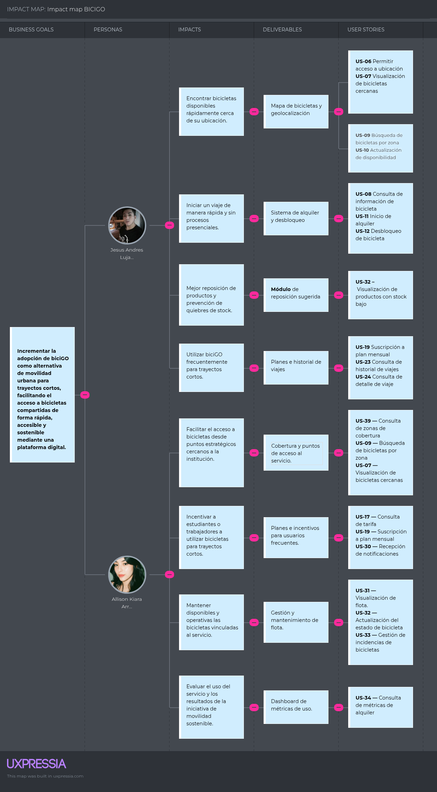
</p>

## 3.3. Product Backlog

<table border="1" cellspacing="0" cellpadding="7" style="border-collapse: collapse; width: 100%; border: 2px solid black;">
  <tr>
    <th align="center"># Orden</th>
    <th align="center">User Story Id</th>
    <th align="center">Título</th>
    <th align="center">Descripción</th>
    <th align="center">Story Points<br>(1 / 2 / 3 / 5 / 8)</th>
  </tr>
  <tr>
    <td valign="top" align="center"><b>1</b></td>
    <td valign="top" align="center"><b>US-39</b></td>
    <td valign="top">Consulta de zonas de cobertura</td>
    <td valign="top">Como usuario , quiero consultar las zonas donde opera biciGO, para saber si el servicio está disponible en el lugar donde deseo utilizar una bicicleta.</td>
    <td valign="top" align="center"><b>3</b></td>
  </tr>
  <tr>
    <td valign="top" align="center"><b>2</b></td>
    <td valign="top" align="center"><b>US-07</b></td>
    <td valign="top">Visualización de bicicletas cercanas</td>
    <td valign="top">Como usuario registrado , quiero visualizar las bicicletas disponibles cerca de mi ubicación, para elegir una alternativa conveniente para mi viaje.</td>
    <td valign="top" align="center"><b>5</b></td>
  </tr>
  <tr>
    <td valign="top" align="center"><b>3</b></td>
    <td valign="top" align="center"><b>US-08</b></td>
    <td valign="top">Consulta de información de bicicleta</td>
    <td valign="top">Como usuario registrado , quiero consultar la información de una bicicleta, para verificar su disponibilidad y condición antes de alquilarla.</td>
    <td valign="top" align="center"><b>3</b></td>
  </tr>
  <tr>
    <td valign="top" align="center"><b>4</b></td>
    <td valign="top" align="center"><b>US-17</b></td>
    <td valign="top">Consulta de tarifa</td>
    <td valign="top">Como usuario registrado , quiero consultar la tarifa aplicable al alquiler, para conocer las condiciones de cobro antes de utilizar una bicicleta.</td>
    <td valign="top" align="center"><b>2</b></td>
  </tr>
  <tr>
    <td valign="top" align="center"><b>5</b></td>
    <td valign="top" align="center"><b>US-01</b></td>
    <td valign="top">Registro de usuario</td>
    <td valign="top">Como visitante , quiero registrarme en biciGO proporcionando mis datos personales y credenciales, para poder acceder a los servicios de alquiler de bicicletas.</td>
    <td valign="top" align="center"><b>3</b></td>
  </tr>
  <tr>
    <td valign="top" align="center"><b>6</b></td>
    <td valign="top" align="center"><b>US-02</b></td>
    <td valign="top">Inicio de sesión</td>
    <td valign="top">Como usuario registrado , quiero iniciar sesión con mis credenciales, para acceder de forma segura a las funcionalidades de biciGO.</td>
    <td valign="top" align="center"><b>3</b></td>
  </tr>
  <tr>
    <td valign="top" align="center"><b>7</b></td>
    <td valign="top" align="center"><b>US-11</b></td>
    <td valign="top">Inicio de alquiler</td>
    <td valign="top">Como usuario registrado , quiero iniciar el alquiler de una bicicleta disponible, para utilizarla durante mi desplazamiento.</td>
    <td valign="top" align="center"><b>5</b></td>
  </tr>
  <tr>
    <td valign="top" align="center"><b>8</b></td>
    <td valign="top" align="center"><b>US-12</b></td>
    <td valign="top">Desbloqueo de bicicleta</td>
    <td valign="top">Como usuario con un alquiler autorizado , quiero desbloquear la bicicleta mediante el mecanismo proporcionado por biciGO, para comenzar mi recorrido.</td>
    <td valign="top" align="center"><b>5</b></td>
  </tr>
  <tr>
    <td valign="top" align="center"><b>9</b></td>
    <td valign="top" align="center"><b>US-13</b></td>
    <td valign="top">Consulta del viaje activo</td>
    <td valign="top">Como usuario con un alquiler activo , quiero consultar la información de mi recorrido, para conocer el estado actual de mi viaje.</td>
    <td valign="top" align="center"><b>3</b></td>
  </tr>
  <tr>
    <td valign="top" align="center"><b>10</b></td>
    <td valign="top" align="center"><b>US-14</b></td>
    <td valign="top">Consulta de costo durante el viaje</td>
    <td valign="top">Como usuario con un alquiler activo , quiero consultar el costo acumulado del recorrido, para controlar cuánto estoy gastando mientras utilizo la bicicleta.</td>
    <td valign="top" align="center"><b>3</b></td>
  </tr>
  <tr>
    <td valign="top" align="center"><b>11</b></td>
    <td valign="top" align="center"><b>US-15</b></td>
    <td valign="top">Finalización de alquiler</td>
    <td valign="top">Como usuario con un alquiler activo , quiero finalizar correctamente mi alquiler, para detener el cobro y liberar la bicicleta para otros usuarios.</td>
    <td valign="top" align="center"><b>5</b></td>
  </tr>
  <tr>
    <td valign="top" align="center"><b>12</b></td>
    <td valign="top" align="center"><b>US-16</b></td>
    <td valign="top">Registro de método de pago</td>
    <td valign="top">Como usuario registrado , quiero registrar un método de pago, para poder pagar los servicios utilizados en biciGO.</td>
    <td valign="top" align="center"><b>5</b></td>
  </tr>
  <tr>
    <td valign="top" align="center"><b>13</b></td>
    <td valign="top" align="center"><b>US-18</b></td>
    <td valign="top">Pago del alquiler</td>
    <td valign="top">Como usuario , quiero pagar el importe generado por mi alquiler, para completar correctamente la transacción del servicio utilizado.</td>
    <td valign="top" align="center"><b>5</b></td>
  </tr>
  <tr>
    <td valign="top" align="center"><b>14</b></td>
    <td valign="top" align="center"><b>US-37</b></td>
    <td valign="top">Consulta de comprobantes de pago</td>
    <td valign="top">Como usuario registrado , quiero consultar los comprobantes de mis pagos realizados, para revisar los cargos asociados a mis alquileres y suscripciones.</td>
    <td valign="top" align="center"><b>2</b></td>
  </tr>
  <tr>
    <td valign="top" align="center"><b>15</b></td>
    <td valign="top" align="center"><b>US-06</b></td>
    <td valign="top">Permitir acceso a ubicación</td>
    <td valign="top">Como usuario registrado , quiero permitir que biciGO acceda a mi ubicación, para identificar bicicletas disponibles cercanas.</td>
    <td valign="top" align="center"><b>2</b></td>
  </tr>
  <tr>
    <td valign="top" align="center"><b>16</b></td>
    <td valign="top" align="center"><b>US-09</b></td>
    <td valign="top">Búsqueda de bicicletas por zona</td>
    <td valign="top">Como usuario registrado , quiero buscar bicicletas en una zona específica, para planificar un desplazamiento aunque no me encuentre actualmente en ese lugar.</td>
    <td valign="top" align="center"><b>3</b></td>
  </tr>
  <tr>
    <td valign="top" align="center"><b>17</b></td>
    <td valign="top" align="center"><b>US-10</b></td>
    <td valign="top">Actualización de disponibilidad</td>
    <td valign="top">Como usuario registrado , quiero actualizar la disponibilidad de bicicletas mostrada, para consultar información reciente antes de seleccionar una unidad.</td>
    <td valign="top" align="center"><b>3</b></td>
  </tr>
  <tr>
    <td valign="top" align="center"><b>18</b></td>
    <td valign="top" align="center"><b>US-23</b></td>
    <td valign="top">Consulta de historial de viajes</td>
    <td valign="top">Como usuario registrado , quiero consultar mis viajes anteriores, para revisar el uso que he realizado de biciGO.</td>
    <td valign="top" align="center"><b>3</b></td>
  </tr>
  <tr>
    <td valign="top" align="center"><b>19</b></td>
    <td valign="top" align="center"><b>US-24</b></td>
    <td valign="top">Consulta de detalle de viaje</td>
    <td valign="top">Como usuario registrado , quiero consultar el detalle de un viaje realizado, para conocer su duración, distancia y costo final.</td>
    <td valign="top" align="center"><b>3</b></td>
  </tr>
  <tr>
    <td valign="top" align="center"><b>20</b></td>
    <td valign="top" align="center"><b>US-26</b></td>
    <td valign="top">Reporte de bicicleta dañada</td>
    <td valign="top">Como usuario , quiero reportar una bicicleta que presente daños, para evitar que otros usuarios utilicen una unidad potencialmente insegura.</td>
    <td valign="top" align="center"><b>3</b></td>
  </tr>
  <tr>
    <td valign="top" align="center"><b>21</b></td>
    <td valign="top" align="center"><b>US-27</b></td>
    <td valign="top">Reporte de problema durante un viaje</td>
    <td valign="top">Como usuario con un alquiler activo , quiero reportar un problema ocurrido durante mi recorrido, para recibir asistencia y dejar constancia del incidente.</td>
    <td valign="top" align="center"><b>3</b></td>
  </tr>
  <tr>
    <td valign="top" align="center"><b>22</b></td>
    <td valign="top" align="center"><b>US-28</b></td>
    <td valign="top">Contacto con soporte</td>
    <td valign="top">Como usuario , quiero comunicarme con soporte desde la plataforma, para obtener ayuda ante problemas relacionados con mi cuenta o alquileres.</td>
    <td valign="top" align="center"><b>3</b></td>
  </tr>
  <tr>
    <td valign="top" align="center"><b>23</b></td>
    <td valign="top" align="center"><b>US-29</b></td>
    <td valign="top">Seguimiento de incidencias</td>
    <td valign="top">Como usuario , quiero consultar el estado de mis incidencias reportadas, para conocer si están pendientes, en revisión o resueltas.</td>
    <td valign="top" align="center"><b>3</b></td>
  </tr>
  <tr>
    <td valign="top" align="center"><b>24</b></td>
    <td valign="top" align="center"><b>US-30</b></td>
    <td valign="top">Recepción de notificaciones</td>
    <td valign="top">Como usuario , quiero recibir notificaciones relacionadas con mis alquileres, pagos e incidencias, para mantenerme informado sobre eventos importantes de mi cuenta.</td>
    <td valign="top" align="center"><b>3</b></td>
  </tr>
  <tr>
    <td valign="top" align="center"><b>25</b></td>
    <td valign="top" align="center"><b>US-19</b></td>
    <td valign="top">Suscripción a plan mensual</td>
    <td valign="top">Como usuario frecuente , quiero contratar un plan mensual de biciGO, para acceder a condiciones de uso más convenientes.</td>
    <td valign="top" align="center"><b>5</b></td>
  </tr>
  <tr>
    <td valign="top" align="center"><b>26</b></td>
    <td valign="top" align="center"><b>US-20</b></td>
    <td valign="top">Cancelación de suscripción</td>
    <td valign="top">Como usuario suscrito , quiero cancelar mi suscripción mensual, para evitar futuras renovaciones cuando ya no desee utilizar el plan.</td>
    <td valign="top" align="center"><b>3</b></td>
  </tr>
  <tr>
    <td valign="top" align="center"><b>27</b></td>
    <td valign="top" align="center"><b>US-38</b></td>
    <td valign="top">Configuración de notificaciones</td>
    <td valign="top">Como usuario registrado , quiero configurar qué notificaciones deseo recibir, para controlar los avisos enviados por biciGO.</td>
    <td valign="top" align="center"><b>2</b></td>
  </tr>
  <tr>
    <td valign="top" align="center"><b>28</b></td>
    <td valign="top" align="center"><b>US-21</b></td>
    <td valign="top">Consulta de perfil</td>
    <td valign="top">Como usuario registrado , quiero consultar la información de mi perfil, para verificar los datos asociados a mi cuenta.</td>
    <td valign="top" align="center"><b>2</b></td>
  </tr>
  <tr>
    <td valign="top" align="center"><b>29</b></td>
    <td valign="top" align="center"><b>US-22</b></td>
    <td valign="top">Edición de perfil</td>
    <td valign="top">Como usuario registrado , quiero modificar mis datos personales, para mantener actualizada la información de mi cuenta.</td>
    <td valign="top" align="center"><b>3</b></td>
  </tr>
  <tr>
    <td valign="top" align="center"><b>30</b></td>
    <td valign="top" align="center"><b>US-25</b></td>
    <td valign="top">Cambio de contraseña</td>
    <td valign="top">Como usuario registrado , quiero cambiar mi contraseña desde mi perfil, para mantener segura mi cuenta.</td>
    <td valign="top" align="center"><b>3</b></td>
  </tr>
  <tr>
    <td valign="top" align="center"><b>31</b></td>
    <td valign="top" align="center"><b>US-36</b></td>
    <td valign="top">Eliminación de método de pago</td>
    <td valign="top">Como usuario registrado , quiero eliminar un método de pago que ya no utilizo, para mantener actualizadas mis opciones de cobro.</td>
    <td valign="top" align="center"><b>2</b></td>
  </tr>
  <tr>
    <td valign="top" align="center"><b>32</b></td>
    <td valign="top" align="center"><b>US-40</b></td>
    <td valign="top">Desactivación de cuenta</td>
    <td valign="top">Como usuario registrado , quiero desactivar mi cuenta cuando ya no desee utilizar biciGO, para dejar de acceder a los servicios de la plataforma.</td>
    <td valign="top" align="center"><b>3</b></td>
  </tr>
  <tr>
    <td valign="top" align="center"><b>33</b></td>
    <td valign="top" align="center"><b>US-31</b></td>
    <td valign="top">Visualización de flota</td>
    <td valign="top">Como administrador , quiero consultar el estado de las bicicletas de la plataforma, para supervisar la disponibilidad general de la flota.</td>
    <td valign="top" align="center"><b>5</b></td>
  </tr>
  <tr>
    <td valign="top" align="center"><b>34</b></td>
    <td valign="top" align="center"><b>US-32</b></td>
    <td valign="top">Actualización del estado de bicicleta</td>
    <td valign="top">Como administrador , quiero modificar el estado operativo de una bicicleta, para controlar qué unidades pueden ser alquiladas por los usuarios.</td>
    <td valign="top" align="center"><b>3</b></td>
  </tr>
  <tr>
    <td valign="top" align="center"><b>35</b></td>
    <td valign="top" align="center"><b>US-33</b></td>
    <td valign="top">Gestión de incidencias de bicicletas</td>
    <td valign="top">Como administrador , quiero revisar los reportes relacionados con bicicletas dañadas, para priorizar su mantenimiento y mantener segura la flota.</td>
    <td valign="top" align="center"><b>5</b></td>
  </tr>
  <tr>
    <td valign="top" align="center"><b>36</b></td>
    <td valign="top" align="center"><b>US-34</b></td>
    <td valign="top">Consulta de métricas de alquiler</td>
    <td valign="top">Como administrador , quiero visualizar métricas de uso de las bicicletas, para analizar el comportamiento del servicio y apoyar decisiones operativas.</td>
    <td valign="top" align="center"><b>5</b></td>
  </tr>
  <tr>
    <td valign="top" align="center"><b>37</b></td>
    <td valign="top" align="center"><b>US-35</b></td>
    <td valign="top">Gestión de usuarios</td>
    <td valign="top">Como administrador , quiero consultar y gestionar las cuentas de los usuarios, para atender situaciones que puedan afectar la seguridad o el correcto funcionamiento de biciGO.</td>
    <td valign="top" align="center"><b>5</b></td>
  </tr>
  <tr>
    <td valign="top" align="center"><b>38</b></td>
    <td valign="top" align="center"><b>US-03</b></td>
    <td valign="top">Recuperación de contraseña</td>
    <td valign="top">Como usuario registrado , quiero recuperar el acceso a mi cuenta cuando olvide mi contraseña, para poder continuar utilizando biciGO.</td>
    <td valign="top" align="center"><b>3</b></td>
  </tr>
  <tr>
    <td valign="top" align="center"><b>39</b></td>
    <td valign="top" align="center"><b>US-04</b></td>
    <td valign="top">Verificación de cuenta</td>
    <td valign="top">Como usuario recién registrado , quiero verificar mi cuenta, para confirmar mis datos y habilitar el acceso completo a los servicios de biciGO.</td>
    <td valign="top" align="center"><b>3</b></td>
  </tr>
  <tr>
    <td valign="top" align="center"><b>40</b></td>
    <td valign="top" align="center"><b>US-05</b></td>
    <td valign="top">Cierre de sesión</td>
    <td valign="top">Como usuario autenticado , quiero cerrar mi sesión, para evitar que otras personas accedan a mi cuenta desde el mismo dispositivo.</td>
    <td valign="top" align="center"><b>1</b></td>
  </tr>
  <tr>
    <td valign="top" align="center"><b>41</b></td>
    <td valign="top" align="center"><b>TS-05</b></td>
    <td valign="top">Get Nearby Bikes</td>
    <td valign="top">Como desarrollador , quiero implementar la consulta de bicicletas cercanas, para mostrar al usuario las unidades disponibles según su ubicación.</td>
    <td valign="top" align="center"><b>5</b></td>
  </tr>
  <tr>
    <td valign="top" align="center"><b>42</b></td>
    <td valign="top" align="center"><b>TS-06</b></td>
    <td valign="top">Get Bike Detail</td>
    <td valign="top">Como desarrollador , quiero implementar el detalle de una bicicleta, para exponer su estado y datos necesarios antes de iniciar un alquiler.</td>
    <td valign="top" align="center"><b>3</b></td>
  </tr>
  <tr>
    <td valign="top" align="center"><b>43</b></td>
    <td valign="top" align="center"><b>TS-07</b></td>
    <td valign="top">Search Coverage Zone</td>
    <td valign="top">Como desarrollador , quiero implementar la consulta de zonas de cobertura, para indicar si biciGO opera en una ubicación determinada.</td>
    <td valign="top" align="center"><b>3</b></td>
  </tr>
  <tr>
    <td valign="top" align="center"><b>44</b></td>
    <td valign="top" align="center"><b>TS-01</b></td>
    <td valign="top">Register Passenger</td>
    <td valign="top">Como desarrollador , quiero implementar el endpoint de registro de usuario, para permitir la creación de cuentas en la plataforma.</td>
    <td valign="top" align="center"><b>5</b></td>
  </tr>
  <tr>
    <td valign="top" align="center"><b>45</b></td>
    <td valign="top" align="center"><b>TS-02</b></td>
    <td valign="top">Login User</td>
    <td valign="top">Como desarrollador , quiero implementar el endpoint de inicio de sesión, para autenticar usuarios y permitir el acceso seguro a las funciones privadas.</td>
    <td valign="top" align="center"><b>5</b></td>
  </tr>
  <tr>
    <td valign="top" align="center"><b>46</b></td>
    <td valign="top" align="center"><b>TS-08</b></td>
    <td valign="top">Start Rental</td>
    <td valign="top">Como desarrollador , quiero implementar el endpoint para iniciar un alquiler, para asociar una bicicleta disponible con un usuario autenticado.</td>
    <td valign="top" align="center"><b>8</b></td>
  </tr>
  <tr>
    <td valign="top" align="center"><b>47</b></td>
    <td valign="top" align="center"><b>TS-09</b></td>
    <td valign="top">Unlock Bike</td>
    <td valign="top">Como desarrollador , quiero implementar la validación del código de desbloqueo, para autorizar únicamente la apertura de la bicicleta asociada al alquiler vigente.</td>
    <td valign="top" align="center"><b>5</b></td>
  </tr>
  <tr>
    <td valign="top" align="center"><b>48</b></td>
    <td valign="top" align="center"><b>TS-10</b></td>
    <td valign="top">Get Active Rental</td>
    <td valign="top">Como desarrollador , quiero implementar la consulta del alquiler activo, para mostrar al usuario la información actual de su viaje.</td>
    <td valign="top" align="center"><b>3</b></td>
  </tr>
  <tr>
    <td valign="top" align="center"><b>49</b></td>
    <td valign="top" align="center"><b>TS-11</b></td>
    <td valign="top">Finish Rental</td>
    <td valign="top">Como desarrollador , quiero implementar el endpoint de finalización de alquiler, para cerrar el viaje, calcular el importe y liberar la bicicleta.</td>
    <td valign="top" align="center"><b>8</b></td>
  </tr>
  <tr>
    <td valign="top" align="center"><b>50</b></td>
    <td valign="top" align="center"><b>TS-12</b></td>
    <td valign="top">Register Payment Method</td>
    <td valign="top">Como desarrollador , quiero implementar el registro de métodos de pago, para permitir que los usuarios dispongan de una opción válida para realizar cobros.</td>
    <td valign="top" align="center"><b>5</b></td>
  </tr>
  <tr>
    <td valign="top" align="center"><b>51</b></td>
    <td valign="top" align="center"><b>TS-13</b></td>
    <td valign="top">Process Rental Payment</td>
    <td valign="top">Como desarrollador , quiero implementar el procesamiento del pago de un alquiler, para registrar el cobro correspondiente al servicio utilizado.</td>
    <td valign="top" align="center"><b>8</b></td>
  </tr>
  <tr>
    <td valign="top" align="center"><b>52</b></td>
    <td valign="top" align="center"><b>TS-14</b></td>
    <td valign="top">Manage Subscription</td>
    <td valign="top">Como desarrollador , quiero implementar la gestión de suscripciones, para permitir activar y cancelar planes mensuales de biciGO.</td>
    <td valign="top" align="center"><b>5</b></td>
  </tr>
  <tr>
    <td valign="top" align="center"><b>53</b></td>
    <td valign="top" align="center"><b>TS-15</b></td>
    <td valign="top">Get User Profile</td>
    <td valign="top">Como desarrollador , quiero implementar la consulta y actualización del perfil, para permitir que cada usuario gestione sus datos personales.</td>
    <td valign="top" align="center"><b>5</b></td>
  </tr>
  <tr>
    <td valign="top" align="center"><b>54</b></td>
    <td valign="top" align="center"><b>TS-16</b></td>
    <td valign="top">Get Travel History</td>
    <td valign="top">Como desarrollador , quiero implementar la consulta del historial de viajes, para mostrar únicamente los alquileres pertenecientes al usuario autenticado.</td>
    <td valign="top" align="center"><b>3</b></td>
  </tr>
  <tr>
    <td valign="top" align="center"><b>55</b></td>
    <td valign="top" align="center"><b>TS-17</b></td>
    <td valign="top">Create Incident</td>
    <td valign="top">Como desarrollador , quiero implementar el registro de incidencias, para almacenar reportes relacionados con bicicletas y viajes.</td>
    <td valign="top" align="center"><b>5</b></td>
  </tr>
  <tr>
    <td valign="top" align="center"><b>56</b></td>
    <td valign="top" align="center"><b>TS-18</b></td>
    <td valign="top">Get Incident Status</td>
    <td valign="top">Como desarrollador , quiero implementar la consulta del estado de incidencias, para que el usuario pueda dar seguimiento a sus reportes.</td>
    <td valign="top" align="center"><b>3</b></td>
  </tr>
  <tr>
    <td valign="top" align="center"><b>57</b></td>
    <td valign="top" align="center"><b>TS-19</b></td>
    <td valign="top">Manage Bike Status</td>
    <td valign="top">Como desarrollador , quiero implementar endpoints administrativos para actualizar el estado de las bicicletas, para controlar disponibilidad y mantenimiento de la flota.</td>
    <td valign="top" align="center"><b>5</b></td>
  </tr>
  <tr>
    <td valign="top" align="center"><b>58</b></td>
    <td valign="top" align="center"><b>TS-20</b></td>
    <td valign="top">Get Dashboard Metrics</td>
    <td valign="top">Como desarrollador , quiero implementar las consultas del dashboard administrativo, para obtener métricas de alquileres, usuarios y disponibilidad de bicicletas.</td>
    <td valign="top" align="center"><b>5</b></td>
  </tr>
  <tr>
    <td valign="top" align="center"><b>59</b></td>
    <td valign="top" align="center"><b>TS-03</b></td>
    <td valign="top">Recover Password</td>
    <td valign="top">Como desarrollador , quiero implementar el proceso de recuperación de contraseña, para que un usuario pueda restablecer sus credenciales de forma segura.</td>
    <td valign="top" align="center"><b>5</b></td>
  </tr>
  <tr>
    <td valign="top" align="center"><b>60</b></td>
    <td valign="top" align="center"><b>TS-04</b></td>
    <td valign="top">Verify Account</td>
    <td valign="top">Como desarrollador , quiero implementar la verificación de cuenta, para habilitar únicamente usuarios que hayan completado correctamente el proceso de validación.</td>
    <td valign="top" align="center"><b>3</b></td>
  </tr>
</table>


# CAPÍTULO IV: PRODUCT DESIGN

## 4.1. Style Guidelines

### 4.1.1. General Style Guidelines

La guía de estilos de biciGO establece los criterios visuales y comunicacionales que se aplicarán en la landing page, la aplicación web de los usuarios y el dashboard administrativo. Su objetivo es mantener una experiencia consistente, accesible y fácil de utilizar en los distintos dispositivos. Las decisiones se relacionan con la propuesta de valor del proyecto: ofrecer una alternativa de movilidad urbana práctica, flexible y sostenible para recorridos cortos en Lima.

#### Branding

La identidad de biciGO se construye alrededor de los conceptos de movimiento, rapidez, sostenibilidad y accesibilidad. El isotipo representa una persona desplazándose en bicicleta y las líneas horizontales comunican velocidad y continuidad del recorrido. El logotipo combina una palabra de apariencia cercana y moderna con un recurso visual que destaca la letra "GO", reforzando la idea de iniciar un viaje.

El lema de la marca es **"Muévete. Vive. Lima."**. Esta frase relaciona el uso de la bicicleta con una experiencia cotidiana de movilidad y con el contexto urbano en el que funcionará el servicio. La marca utilizará una versión principal del logotipo sobre fondos claros y una versión de alto contraste para fondos oscuros.


Figura 1: Logotipo e isotipo de biciGO.

El logotipo debe conservar un área libre alrededor para evitar que otros elementos compitan visualmente con él. No se debe deformar, rotar, cambiar sus colores principales ni colocarlo sobre fondos que dificulten su lectura.

#### Tipografía

Se utilizará una combinación de dos familias tipográficas sans serif. Esta decisión favorece la lectura en dispositivos móviles y permite diferenciar los títulos del contenido operativo de la plataforma.

- **Tipografía primaria: Poppins.** Se utilizará en el logotipo de apoyo, títulos, encabezados y llamados principales. Sus formas geométricas y redondeadas transmiten dinamismo, modernidad y cercanía, características relacionadas con la movilidad urbana.
- **Tipografía secundaria: Inter.** Se utilizará en párrafos, etiquetas, formularios, tablas, mensajes del sistema y botones. Está pensada para conservar una buena legibilidad en tamaños pequeños y en pantallas de distintas dimensiones.

Los pesos definidos son: **Poppins SemiBold y Bold** para títulos; **Inter Regular** para párrafos; e **Inter Medium y SemiBold** para etiquetas, botones y datos destacados.

| Elemento | Tipografía | Peso | Tamaño referencial |
|---|---|---|---:|
| Título principal H1 | Poppins | Bold | 32 px |
| Título de sección H2 | Poppins | SemiBold | 24 px |
| Subtítulo H3 | Poppins | SemiBold | 20 px |
| Texto principal | Inter | Regular | 16 px |
| Texto secundario | Inter | Regular | 14 px |
| Botones y etiquetas | Inter | SemiBold | 14-16 px |


Figura 2: Muestra tipográfica de la familia Poppins aplicada a encabezados y textos destacados.


Figura 3: Muestra tipográfica de la familia Inter aplicada a textos, botones y etiquetas de interfaz.

La selección tipográfica busca equilibrar personalidad visual y legibilidad. Poppins aporta una sensación moderna y dinámica, ideal para encabezados y llamados de atención, mientras que Inter mantiene claridad, estructura y lectura cómoda en párrafos, formularios y botones.

#### Paleta de colores

La paleta se inspira en los colores presentes en el logotipo de biciGO. El verde representa movilidad sostenible, crecimiento y energía; el gris grafito comunica estabilidad, seguridad y legibilidad; y los tonos neutros permiten que la información sea clara en la interfaz.

| Rol | Color | Código | Uso |
|---|---|---|---|
| Primary Brand | Verde biciGO | `#7BC617` | Marca, enlaces y elementos destacados |
| Primary Dark | Verde oscuro | `#4F850D` | Estados activos y contraste del color de marca |
| Neutral Dark | Grafito | `#263238` | Texto principal, navegación y encabezados |
| Neutral Medium | Gris | `#607078` | Texto secundario e íconos informativos |
| Neutral Light | Gris muy claro | `#F3F6F1` | Fondos secundarios y superficies |
| Neutral White | Blanco | `#FFFFFF` | Fondo principal y contenido |
| Warning | Amarillo | `#E6A817` | Advertencias, mantenimiento y pagos pendientes |
| Error | Rojo | `#C93C3C` | Errores, cancelaciones y reportes críticos |
| Success | Verde de confirmación | `#2E8B57` | Viajes iniciados, pagos y acciones completadas |

El verde biciGO se utilizará para reforzar la identidad, pero no será el único recurso para comunicar estados. Los mensajes de éxito, advertencia y error también incluirán texto o íconos para que la información sea comprensible para personas con dificultades para distinguir colores. En la lámina de colores se deben presentar los nombres, códigos hexadecimales y ejemplos de uso de cada muestra.

#### Principios de diseño

Las decisiones visuales se basan en los siguientes principios:

- **Claridad:** las acciones principales, como buscar, alquilar y finalizar un viaje, deben identificarse rápidamente.
- **Consistencia:** los mismos colores, tipografías, íconos y patrones de interacción deben mantenerse en todas las vistas.
- **Eficiencia:** el usuario debe poder encontrar una bicicleta e iniciar un alquiler con la menor cantidad posible de pasos.
- **Accesibilidad:** los textos, controles y contrastes deben ser legibles en diferentes tamaños de pantalla.
- **Retroalimentación:** cada acción debe mostrar un estado claro de carga, éxito, error o confirmación.
- **Confianza:** los pagos, tiempos de alquiler, tarifas y datos del viaje deben mostrarse de manera visible y comprensible.

#### Spacing y dimensiones

Se utilizará una escala de espaciado basada en múltiplos de 4 y 8 píxeles para mantener un ritmo visual uniforme.

| Token | Valor | Uso |
|---|---:|---|
| `space-xs` | 4 px | Separación entre íconos y texto |
| `space-sm` | 8 px | Separación entre elementos relacionados |
| `space-md` | 16 px | Espaciado interno de controles |
| `space-lg` | 24 px | Separación entre componentes |
| `space-xl` | 32 px | Separación entre bloques de contenido |
| `space-2xl` | 48 px | Separación entre secciones principales |

Los botones y campos de formulario tendrán una altura mínima de 44 px para facilitar la interacción táctil. Los bordes redondeados serán de 8 px como máximo, con el fin de conservar una apariencia moderna sin perder claridad visual. Para la lámina de spacing se deben ilustrar los valores de 4, 8, 16, 24, 32 y 48 px.

#### Tono de comunicación

El tono de biciGO será **casual, respetuoso, claro y entusiasta**, sin utilizar un lenguaje excesivamente técnico. La comunicación será dinámica en promociones y mensajes de bienvenida, pero directa y serena en situaciones relacionadas con pagos, seguridad, accidentes o errores.

| Dimensión | Decisión de biciGO |
|---|---|
| Divertido / Serio | Dinámico, pero responsable |
| Formal / Casual | Casual y profesional |
| Respetuoso / Irreverente | Respetuoso e inclusivo |
| Entusiasta / Sereno | Entusiasta en acciones y sereno en alertas |

Ejemplos de textos de interfaz son: **"Buscar bicicleta"**, **"Iniciar alquiler"**, **"Tu viaje está activo"**, **"Viaje finalizado correctamente"** y **"No pudimos iniciar el alquiler. Intenta nuevamente."**. Los mensajes deben indicar qué ocurrió y cuál es el siguiente paso disponible para el usuario.

### 4.1.2. Web Style Guidelines

Las reglas web aplican la identidad de biciGO a interfaces responsive. La prioridad será la experiencia móvil, ya que el usuario probablemente consultará el mapa, escaneará un código QR o finalizará un alquiler mientras se encuentra desplazándose por la ciudad.

#### Grid System

En móvil se utilizará una sola columna con márgenes laterales de 16 px para priorizar la lectura y la interacción táctil. En escritorio se empleará un sistema de **12 columnas**, con un gutter de **24 px** y un ancho máximo de contenido de aproximadamente **1200 px**. El contenido debe conservar alineaciones consistentes entre encabezados, tarjetas, formularios y botones.

| Dispositivo | Ancho referencial | Estructura |
|---|---:|---|
| Móvil | Menor a 768 px | Una columna y navegación compacta |
| Escritorio | Desde 1024 px | Grid de 12 columnas y contenido centrado |

#### Navegación

La navegación de la landing page de biciGO estará orientada a la conversión y a la comprensión del servicio. Su estructura principal será simple, clara y enfocada en comunicar valor al usuario de forma directa. En escritorio se utilizará una barra superior con el logotipo, enlaces de navegación y un botón principal para **"Alquilar bicicleta"**. En móvil se utilizará una navegación compacta con opciones esenciales y acceso directo a la acción principal.

La estructura sugerida de navegación es la siguiente: **Inicio**, **¿Cómo funciona?**, **Beneficios**, **Tarifas**, **FAQ** y **Contacto**. Este enfoque evita saturar la página con elementos operativos y prioriza la intención comercial de la landing page: explicar la propuesta de valor y motivar la acción de registro o alquiler.

#### Componentes y estados de interacción

Los componentes deben conservar el estilo definido en la guía general. Se considerarán botones primarios, secundarios y de peligro; campos de formulario; tarjetas de bicicletas; marcadores de mapa; modales de confirmación; alertas; indicadores de disponibilidad; y tarjetas de resumen del viaje.

Cada componente interactivo debe contemplar los estados **normal, hover, focus, deshabilitado, cargando, éxito y error**. El estado de focus tendrá un borde visible para facilitar la navegación mediante teclado. Los botones y controles táctiles tendrán un área mínima de 44 por 44 px.


## 4.2. Information Architecture

### 4.2.1. Organization Systems

### 4.2.2. Labeling Systems

### 4.2.3. SEO Tags and Meta Tags

### 4.2.4. Searching Systems
El sistema incorpora mecanismos de búsqueda que permiten acceder rápidamente a información específica:

- **Búsqueda por:**
    - Codigo QR de bicicleta
    - ID de bicicleta.
    - Ubicacion del BikePoint
    - ID del viaje
    - ID del incidente

- **Filtros avanzados:**
    - Estado de bicicleta (disponible, en uso, en mantenimiento, no disponible)
    - Nombre del BikePoint
    - Fecha del viaje (dia, semana, mes)
    - Fecha del incidente

### 4.2.5. Navigation Systems
La navegación del sistema está diseñada para ser clara, eficiente y orientada a las necesidades del usuario:

- **Menú principal:**
  - Dashboard
  - Mapa
  - Mis viajes
  - Incidentes
  - Pagos y suscripciones

- **Navegación por flujo:**
  - Seguimiento de la bicicleta en base a su estado, ya sea si se encuentra disponible, en uso, en mantenimiento o no disponible por fallas.  

- **Navegación contextual:**
  - Acceso a información detallada desde dashboards.

- **Elementos de apoyo:**
  - Breadcrumbs (ej: Dashboard > Bicicletas > Bicicleta)  
  - Botones de acceso rápido
  - Indicadores de estado de las bicicletas

Asimismo, el sistema permite al usuario desplazarse facilmente entre las funcionalidades de alquiler y uso de bicicletas.

## 4.3. Landing Page UI Design
### 4.3.1. Landing Page Wireframe
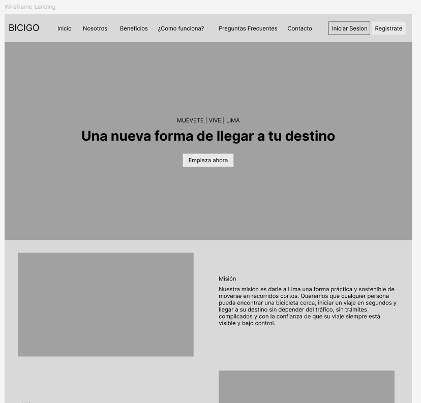

**Para ver el Wireframe completo dar click aqui:** https://www.figma.com/design/3nqdv1dpncuL6cV2shloZk/BiciGo_Landing_Page_Wireframe_-_Mockups?node-id=0-1&t=yX2veXVTfTuGFtXk-1

### 4.3.2. Landing Page Mock-up
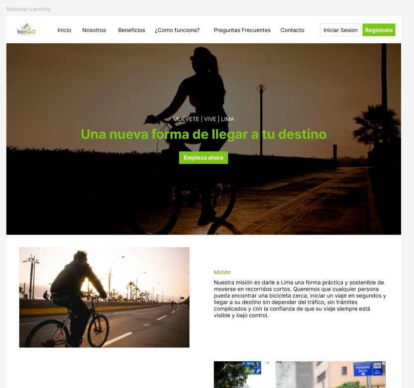

**Para ver el Mockup completo dar click aqui:** https://www.figma.com/design/3nqdv1dpncuL6cV2shloZk/BiciGo_Landing_Page_Wireframe_-_Mockups?node-id=0-1&t=yX2veXVTfTuGFtXk-1
## 4.4. Web Applications UX/UI Design

### 4.4.1. Web Applications Wireframes

### 4.4.2. Web Applications Wireflow Diagrams

### 4.4.2. Web Applications Mock-ups

### 4.4.3. Web Applications User Flow Diagrams

## 4.5. Web Applications Prototyping

## 4.6. Domain-Driven Software Architecture

### 4.6.1. Design-Level EventStorming

En esta sección se presenta el Design-Level EventStorming de biciGO, realizado con el fin de detallar y refinar el modelado del dominio identificado previamente. Durante la sesión, el equipo organizó eventos de dominio, comandos, políticas, agregados y bounded contexts relacionados con los principales procesos del sistema, como la gestión de usuarios, bicicletas, estaciones, disponibilidad, reservas, alquileres, pagos, mantenimiento y notificaciones. Este análisis permitió comprender mejor las responsabilidades de cada contexto y sus relaciones, sirviendo como base para el diseño de la arquitectura del software.

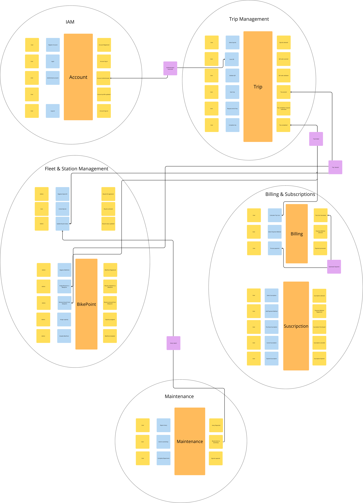

Figura 4: Design-Level EventStorming del dominio de biciGO.

### 4.6.2. Software Architecture Context Diagram

## Descripción

El diagrama de contexto de la arquitectura de software representa la interacción entre la **Plataforma Web de Alquiler de Bicicletas** y los principales actores y servicios externos que participan en su funcionamiento.

La plataforma permite a los usuarios registrarse, consultar bicicletas disponibles, seleccionar zonas de recogida y devolución, iniciar y finalizar viajes y consultar el historial de sus recorridos.

El sistema también contempla usuarios con una suscripción **Premium**, quienes pueden utilizar el servicio sin pagar la tarifa correspondiente al kilometraje durante la vigencia de dicha suscripción.

Además, la plataforma se comunica con servicios externos para obtener información de ubicación y distancia recorrida, así como para procesar las operaciones de pago.

---

## Actores y sistemas externos

### Usuario

El usuario interactúa directamente con la plataforma para:

- Registrarse e iniciar sesión.
- Consultar bicicletas disponibles.
- Consultar las zonas habilitadas.
- Seleccionar una bicicleta.
- Seleccionar una zona de recogida.
- Iniciar un viaje.
- Finalizar un viaje.
- Devolver la bicicleta.
- Consultar los kilómetros recorridos.
- Consultar el costo de sus viajes.
- Revisar el historial de viajes.

### Usuario Premium

El usuario Premium dispone de las mismas funcionalidades que un usuario regular, pero cuenta adicionalmente con los beneficios de una suscripción Premium.

Durante la vigencia de la suscripción:

- Puede realizar viajes normalmente.
- El sistema verifica su estado Premium al finalizar el viaje.
- No se aplica el cobro correspondiente al kilometraje recorrido.
- Puede gestionar y consultar el estado de su suscripción.

### Administrador

El administrador utiliza la plataforma para gestionar los principales elementos del servicio:

- Usuarios.
- Bicicletas.
- Zonas habilitadas.
- Puntos de recogida.
- Puntos de devolución.
- Viajes.
- Suscripciones Premium.

### Servicio de Geolocalización

El servicio de geolocalización es un sistema externo que proporciona información relacionada con la ubicación y la distancia recorrida.

La plataforma puede utilizar esta información para:

- Obtener la ubicación de las bicicletas.
- Registrar la ubicación durante un viaje.
- Determinar la distancia recorrida.
- Utilizar los kilómetros registrados para calcular la tarifa correspondiente.

### Pasarela de Pagos

La pasarela de pagos es un servicio externo encargado de procesar las operaciones económicas realizadas mediante la plataforma.

Puede utilizarse para:

- Procesar el pago de los viajes.
- Procesar el pago de las suscripciones Premium.
- Informar el resultado de una operación de pago.

---

## Sistema central

El sistema central corresponde a la:

**Plataforma Web de Alquiler de Bicicletas**

Esta plataforma concentra las funcionalidades principales del servicio y actúa como intermediario entre los usuarios, el administrador y los servicios externos.

Entre sus responsabilidades se encuentran:

- Gestión de usuarios.
- Gestión de bicicletas.
- Gestión de zonas.
- Gestión de viajes.
- Registro de kilómetros recorridos.
- Cálculo de tarifas.
- Gestión de suscripciones Premium.
- Procesamiento de solicitudes de pago.
- Integración con el servicio de geolocalización.

---

## Diagrama de Contexto

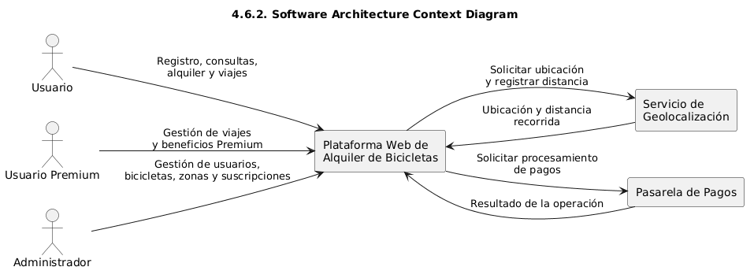

### 4.6.3. Software Architecture Container Diagrams
El diagrama de contenedores (L2) descompone BiciGo en sus bloques de alto nivel: la Landing Page (HTML5/CSS3/JS) que dirige a los usuarios hacia la aplicación, el Web Application que sirve los archivos estáticos y el Single Page Application (Vue 3 + PrimeVue) que provee todas las funcionalidades de la plataforma directamente en el navegador. El SPA se comunica con la API Application mediante llamadas REST, y depende de Html5Qrcode para el acceso a la cámara del dispositivo.

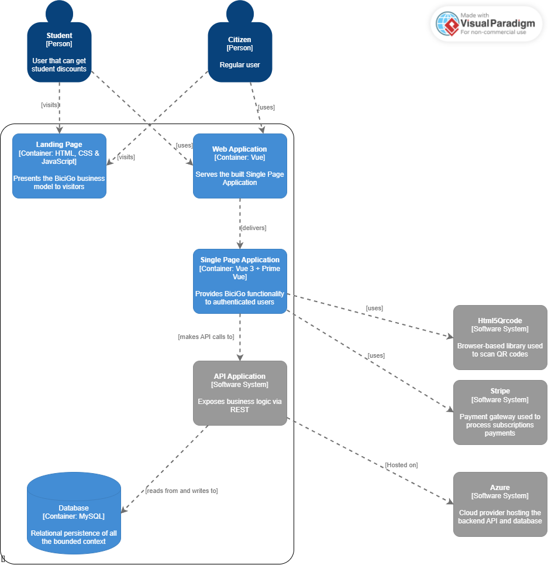


### 4.6.4. Software Architecture Components Diagrams

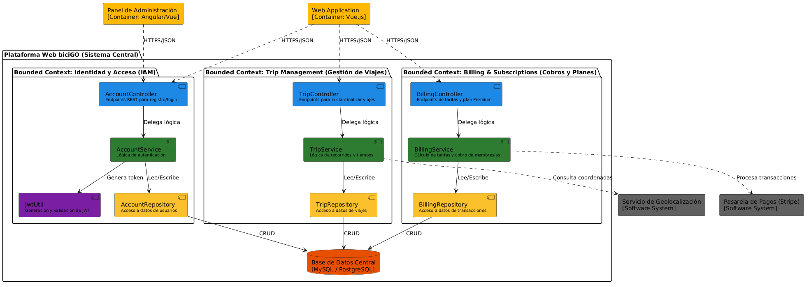

## 4.7. Software Object-Oriented Design

### 4.7.1. Class Diagrams
IAM

[iam](./Resources/chapter4/IAMSLA.png)

Trip managment
[trip](/Resources/chapter4/trip.png)

Fleet & Station Management
[fleet](./Resources/chapter4/fleet.png)

Billing
[billing](./Resources/chapter4/billing.png)

Maintance
[maintance](./Resources/chapter4/main.png)
## 4.8. Database Design
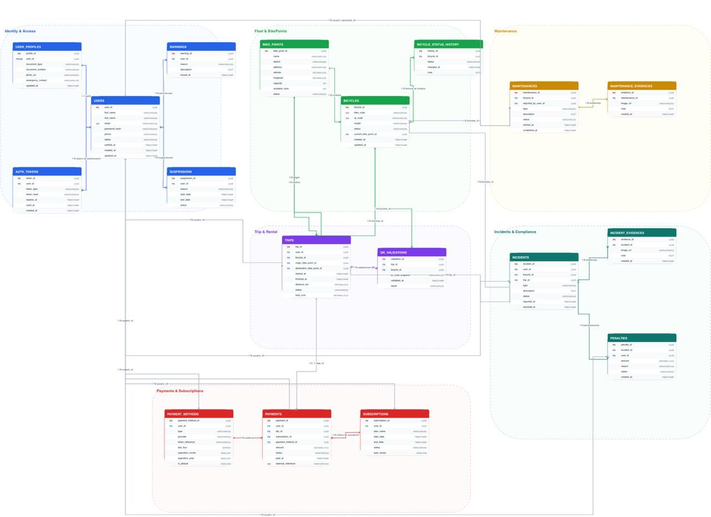


# CAPÍTULO V: Product Implementation, Validation & Deployment

## 5.1. Software Configuration Management

### 5.1.1. Software Development Environment Configuration
| Categoría | Herramienta | Propósito | Enlace |
|---|---|---|---|
| Diseño UX/UI | Figma | Elaboración de wireframes, mockups y prototipos utilizados para definir la interfaz y experiencia de usuario de biciGO. | [https://www.figma.com/design/FIUjx83bu9OhBxZ4EMqyfe/Sin-t%C3%ADtulo?node-id=0-1&t=2NPsUYYjUh7xKI3R-1](https://www.figma.com/design/FIUjx83bu9OhBxZ4EMqyfe/Sin-t%C3%ADtulo?node-id=0-1&t=2NPsUYYjUh7xKI3R-1) |
| Investigación UX | UXPressia | Herramienta utilizada para elaborar los User Personas de los segmentos objetivo de biciGO, permitiendo representar sus características, necesidades, frustraciones y objetivos. | [https://uxpressia.com/](https://uxpressia.com/) |
| Planeamiento del Producto | UXPressia | Herramienta utilizada para desarrollar el Impact Mapping de biciGO, relacionando el objetivo del negocio, actores, impactos esperados y entregables asociados. | [https://uxpressia.com/](https://uxpressia.com/) |
| Modelado de Base de Datos | Draw.io | Elaboración del diagrama de base de datos de biciGO, incluyendo entidades, atributos, claves y relaciones entre las tablas del sistema. | [https://drive.google.com/file/d/1frY_P-cg-4JuKiY2Jh8m85aaZD9V1CCT/view?usp=sharing](https://drive.google.com/file/d/1frY_P-cg-4JuKiY2Jh8m85aaZD9V1CCT/view?usp=sharing) |
| Modelado de Dominio | Canva | Desarrollo del Event Storming utilizado para identificar eventos, procesos y elementos principales del dominio de biciGO. | [https://canva.link/7coo689oj2nx3b7](https://canva.link/7coo689oj2nx3b7) |
| Desarrollo Web | GitHub Pages | Despliegue público de la Landing Page de biciGO. | [https://startup-chapa.github.io/Landing-Page/](https://startup-chapa.github.io/Landing-Page/) |
| Entorno de Desarrollo | WebStorm | Entorno utilizado para editar y organizar los archivos del proyecto, trabajar con Git y desarrollar los componentes web de biciGO. | [https://www.jetbrains.com/webstorm/](https://www.jetbrains.com/webstorm/) |
| Control de Versiones | Git | Sistema utilizado para registrar cambios, trabajar mediante ramas y mantener el historial del proyecto. | [https://git-scm.com/](https://git-scm.com/) |
| Repositorio Remoto | GitHub | Plataforma utilizada para almacenar el proyecto y facilitar el trabajo colaborativo entre los integrantes. | [https://github.com/](https://github.com/) |
| Documentación | Markdown | Formato utilizado para redactar y mantener los capítulos del informe, tablas, enlaces, imágenes y demás documentación del proyecto bajo un enfoque Docs-as-Code. | [https://www.markdownguide.org/](https://www.markdownguide.org/) |
| Gestión Ágil | Trello | Herramienta utilizada para organizar el Sprint Backlog, distribuir tareas y dar seguimiento al avance del equipo durante el Sprint. | [https://trello.com/invite/b/6aac96a6ce176e2f9d496d31/ATTI96186798f26dde57c47e51ca96f0fff04FDD51DF/sprint-web-1](https://trello.com/invite/b/6aac96a6ce176e2f9d496d31/ATTI96186798f26dde57c47e51ca96f0fff04FDD51DF/sprint-web-1) |
| Gestión del Producto | Product Backlog | Permite organizar y priorizar las User Stories y Technical Stories que forman parte del desarrollo de biciGO. | [https://trello.com/invite/b/6aac96a6ce176e2f9d496d31/ATTI96186798f26dde57c47e51ca96f0fff04FDD51DF/sprint-web-1](https://trello.com/invite/b/6aac96a6ce176e2f9d496d31/ATTI96186798f26dde57c47e51ca96f0fff04FDD51DF/sprint-web-1) |

### 5.1.2. Source Code Management
Para el control de versiones y la organización ordenada del código de nuestro proyecto BiciGo, el equipo utiliza GitHub como plataforma principal. GitHub nos permite almacenar código fuente de la Landing Page, Front-End, Back-End llevar un registro histórico de cambios, colaborar de manera estructurada y garantizar trazabilidad durante todo el ciclo de desarrollo. Por ende, creamos la organización Minex-Organization, que incluye los siguientes repositorios:
| Solución  | Nombre del repositorio  |  Enlace  |
|---|---|---|
| report | bicigo-report  | https://github.com/Startup-Chapa/project-report |
| website  | bicigo-website  |  https://github.com/Startup-Chapa/Landing-Page |
| webapp  |  bicigo-webapp  |  |
| platform  | bicigo-platform   |  |

Nuestro equipo de trabajo ha adoptado el flujo GitFlow, basado en el artículo “A successful Git branching model” de Vincent Driessen. La organización del repositorio se estructura en dos ramas principales y permanentes: master, que contiene las versiones estables listas para entrega, y develop, que funciona como la rama de integración continua del desarrollo. A partir de la rama develop, se crean ramas de tipo feature siguiendo la nomenclatura feature/chapter-#-description, por ejemplo: feature/chapter-ii-interviews. Estas ramas permiten que cada miembro del equipo desarrolle funcionalidades o secciones específicas de manera aislada. En casos donde un integrante desarrolla un capítulo completo, se utiliza una convención como feature/chapter-#-content. Una vez finalizado el trabajo, estas ramas se integran nuevamente en develop, asegurando una consolidación ordenada de los avances.

Cuando el producto se aproxima a una fecha de entrega, se genera una rama release a partir de develop. En esta etapa se realizan ajustes menores, como corrección de errores o mejoras finales. Posteriormente, la rama release se fusiona tanto en master como en develop, garantizando que los cambios aplicados se mantengan en futuras iteraciones del proyecto. En cuanto a la gestión de versiones, se utiliza Semantic Versioning mediante ramas con el formato release/vX.Y.Z. Asimismo, las correcciones críticas se gestionan a través de ramas hotfix, con la nomenclatura hotfix/vX.Y.Z, permitiendo resolver errores urgentes directamente sobre la versión en producción.

Adicionalmente, el equipo aplica la convención Conventional Commits, la cual estandariza los mensajes de confirmación para mejorar la trazabilidad y comprensión de los cambios. Cada commit sigue una estructura clara, por ejemplo:

git commit -m "docs(chapter-#): add ..."

Este enfoque facilita la generación automática de historiales de cambios y permite mantener un registro organizado y semántico del desarrollo.

En síntesis, cada nueva funcionalidad se desarrolla en una rama feature, las versiones listas para entrega se gestionan mediante release branches, y las correcciones urgentes a través de hotfix branches. Todo ello, junto con el uso de Conventional Commits, asegura un flujo de trabajo estructurado, colaborativo y alineado con buenas prácticas para el desarrollo del proyecto BiciGo.

**Repositorio report**


**Repositorio  website**


## 5.2. Landing Page, Services & Applications Implementation

### 5.2.1. Sprint 1

El Sprint 1 corresponde a la primera entrega del proyecto (AV1 – Sprint Review) y tiene como alcance la implementación y el despliegue de la primera versión del **Landing Page** de BiciGO. El Landing Page presenta el modelo de negocio y el propósito de la plataforma a los visitantes de los segmentos objetivo (ciudadanos urbanos que realizan trayectos cortos e instituciones que desean promover el uso de la bicicleta), y es el punto de entrada hacia las aplicaciones. Los Web Services y las Frontend Web Applications se implementarán en los siguientes Sprints, según el cronograma de entregas del curso.

#### 5.2.1.1. Sprint Planning 1

El Sprint Planning Meeting del Sprint 1 definió el objetivo del Sprint, las tareas necesarias para publicar la primera versión del Landing Page y la distribución del trabajo entre los integrantes de Chapa. Como insumos se utilizaron los artefactos de los capítulos anteriores: el Lean UX Canvas (Capítulo I), los segmentos objetivo, las User Personas, el wireframe y el mock-up del Landing Page (Capítulo IV) y la guía de estilos general y web (sección 4.1).

| Sprint # | Sprint 1 |
|---|---|
| **Sprint Planning Background** | |
| Prepared By | Aguirre Ramos, Eduardo Manuel |
| Attendees (to planning meeting) | Aguirre Ramos, Eduardo Manuel / Armestar Felipa, Adrian Andres / Ayllon Pauccar, Juan David / Franco del Carpio, José María / Velasquez Velasquez, Rodrigo |
| Sprint 0 Review Summary | No aplica. El Sprint 1 es el primer Sprint del proyecto. Antes de iniciarlo, el equipo completó la documentación de los Capítulos I al IV (Startup Profile, Requirements Elicitation, Requirements Specification y diseño del Landing Page) y creó los repositorios `project-report` y `Landing-Page`. |
| Sprint 0 Retrospective Summary | No aplica. El Sprint 1 es el primer Sprint del proyecto. |
| **Sprint Goal & User Stories** | |
| Sprint 1 Goal | *Our focus is on publishing the first deployed version of the BiciGO Landing Page, available in English and Latin American Spanish and responsive on mobile and desktop screens.*<br>*We believe it delivers a clear understanding of the service (mission, vision, benefits and how it works) and a direct way to get in touch with the team to urban citizens who make short trips and to institutions interested in promoting cycling.*<br>*This will be confirmed when the Landing Page is publicly reachable at its GitHub Pages URL, every section can be read on a 390 px and on a 1440 px wide screen without horizontal scrolling, and a visitor can switch the whole interface between English and Spanish.* |
| Sprint 1 Velocity | No aplica en Story Points. Las tareas del Sprint 1 no provienen de User Stories del Product Backlog (que describen funcionalidades de las aplicaciones), sino de tareas asociadas a las restricciones del Landing Page. El esfuerzo se planifica en horas: **76 horas** en total (ver Sprint Backlog 1). |
| Sum of Story Points | 0 |

#### 5.2.1.2. Aspect Leaders and Collaborators

Para el Sprint 1 se identificaron seis aspectos dentro del alcance. La Leadership-and-Collaboration Matrix (LACX) indica, para cada aspecto, quién lidera y quiénes colaboran. La organización de líderes y colaboradores guarda relación con la selección de tareas del Sprint Backlog 1.

- **Landing Page Structure & Content (HTML):** estructura semántica de las secciones y redacción de los contenidos.
- **Visual Style & Responsive Design (CSS):** aplicación de la guía de estilos del Capítulo IV y diseño adaptable a móvil y escritorio.
- **Internationalization (i18n):** diccionarios en inglés y español, y selector de idioma.
- **Deployment (GitHub Pages):** publicación del Landing Page en un sitio público.
- **Landing Page UI Design (Figma):** wireframe y mock-up que guían la implementación.
- **Report Documentation:** redacción de las secciones del Capítulo V correspondientes al Sprint.

| Team Member (Last Name, First Name) | GitHub Username | Structure & Content (HTML) | Visual Style & Responsive (CSS) | Internationalization (i18n) | Deployment (GitHub Pages) | UI Design (Figma) | Report Documentation |
|---|---|:---:|:---:|:---:|:---:|:---:|:---:|
| Aguirre Ramos, Eduardo Manuel | TheEngineEdu | C | C | C | C | C | L |
| Armestar Felipa, Adrian Andres | Adrian5102 | L | L | L | L | L | C |
| Ayllon Pauccar, Juan David | JuanDPAUC | C | C | C | C | C | C |
| Franco del Carpio, José María | VoltTrd [POR CONFIRMAR] | C | C | C | C | C | C |
| Velasquez Velasquez, Rodrigo | Rodrigov233 | C | C | C | C | C | C |

*L = Leader, C = Collaborator.*

La asignación de líderes y colaboradores se definió a partir de la participación de cada integrante en los repositorios `Landing-Page` y `project-report`.

#### 5.2.1.3. Sprint Backlog 1

El objetivo principal del Sprint 1 es publicar la primera versión del Landing Page de BiciGO, en inglés y español y con diseño responsive, para presentar el modelo de negocio a los visitantes. El Sprint Backlog 1 se gestiona en un tablero de Trello con las columnas To-do, In-Process, To-Review y Done.

Las tareas no derivan de User Stories del Product Backlog, ya que estas describen funcionalidades de las aplicaciones. Por ese motivo se registran como tareas adicionales asociadas a las restricciones del Landing Page (responsive design, i18n, accesibilidad, SEO, términos y condiciones, y despliegue). Cada tarea está estimada en un rango de 4 a 8 horas.

**Sprint #: Sprint 1**

| Story Id | Story Title | Task Id | Task Title | Task Description | Estimation (Hours) | Assigned To | Status |
|---|---|---|---|---|:---:|---|---|
| N/A | Landing Page (tarea general) | T-01 | Landing content and structure | Definir las secciones y los contenidos del Landing Page a partir del wireframe y del mock-up del Capítulo IV: navegación, hero, misión y visión, beneficios, cómo funciona, contacto, FAQ y footer. | 6 | Armestar Felipa, Adrian Andres | Done |
| N/A | Landing Page (tarea general) | T-02 | HTML5 semantic structure | Implementar `index.html` con elementos semánticos y atributos `data-i18n` para todos los textos visibles. | 8 | Armestar Felipa, Adrian Andres | Done |
| N/A | Landing Page (tarea general) | T-03 | Style guide and responsive CSS | Implementar `style.css` con las variables de color, tipografía y espaciado de la guía de estilos, y con *media queries* para móvil y escritorio. | 8 | Armestar Felipa, Adrian Andres | Done |
| N/A | Landing Page (tarea general) | T-04 | i18n English and Spanish | Crear los diccionarios `en.json` y `es.json`, y el selector de idioma EN/ES con persistencia del idioma elegido. | 6 | Armestar Felipa, Adrian Andres | Done |
| N/A | Landing Page (tarea general) | T-05 | Accessible FAQ accordion | Implementar el acordeón de preguntas frecuentes con atributos ARIA y soporte de teclado (Enter y Espacio). | 4 | Armestar Felipa, Adrian Andres | Done |
| N/A | Landing Page (tarea general) | T-06 | Contact form UI | Implementar la interfaz del formulario de contacto (nombre, teléfono, correo, tipo de usuario y mensaje). El envío del formulario queda pendiente. | 4 | Armestar Felipa, Adrian Andres | Done |
| N/A | Landing Page (tarea general) | T-07 | Deploy to GitHub Pages | Publicar el Landing Page desde la rama `main` con GitHub Pages y verificar el acceso público. | 4 | Armestar Felipa, Adrian Andres | Done |
| N/A | Landing Page (tarea general) | T-08 | Pricing section and sign-up CTA | Agregar la sección de tarifas prevista en la navegación del Capítulo IV y conectar los llamados a la acción con el registro. | 6 | Sin asignar | To-do |
| N/A | Landing Page (tarea general) | T-09 | Terms and conditions and social links | Redactar los términos y condiciones, enlazarlos en el footer y reemplazar los íconos de redes sociales por los enlaces reales. | 4 | Sin asignar | To-do |
| N/A | Landing Page (tarea general) | T-10 | SEO and meta tags | Agregar las etiquetas meta (description, Open Graph) y traducir el título de la página con el diccionario i18n. | 4 | Sin asignar | To-do |
| N/A | Landing Page (tarea general) | T-11 | Accessibility review | Revisar contraste de colores, estados de foco, etiquetas de formulario y atributos ARIA del Landing Page. | 6 | Sin asignar | To-do |
| N/A | Landing Page (tarea general) | T-12 | Execution video | Grabar el video que muestra la navegación del Landing Page y publicarlo para enlazarlo en la sección 5.2.1.5. | 4 | Sin asignar | To-do |
| N/A | Sprint management | T-13 | Sprint board in Trello | Crear el tablero del Sprint 1 en Trello, cargar las tareas y hacerlo público. | 4 | Sin asignar | To-do |
| N/A | Sprint management | T-14 | Chapter V documentation | Redactar las secciones 5.1.1, 5.1.3 y 5.2.1 del informe con las evidencias del Sprint. | 8 | Aguirre Ramos, Eduardo Manuel | To-Review |

#### 5.2.1.4. Development Evidence for Sprint Review

Durante el Sprint 1 se implementó la primera versión del Landing Page en el repositorio `Startup-Chapa/Landing-Page`: la estructura HTML, los estilos CSS responsive, los diccionarios de traducción en inglés y español y las imágenes de las secciones. En paralelo, en el repositorio `Startup-Chapa/project-report` se documentaron el wireframe y el mock-up del Landing Page (Capítulo IV) y la gestión del código fuente (Capítulo V), que sirvieron de base para la implementación. Los commits siguen la convención Conventional Commits descrita en la sección 5.1.2.

| Repository | Branch | Commit Id | Commit Message | Commit Message Body | Commited on (Date) |
|---|---|---|---|---|---|
| Startup-Chapa/Landing-Page | main | ef218d4 | Initial commit | Creación del repositorio del Landing Page. | 30/08/2026 |
| Startup-Chapa/Landing-Page | main | aeca1f3 | feat: add index & css files | Se crean los archivos `index.html` y `style.css`. | 14/09/2026 |
| Startup-Chapa/Landing-Page | main | 615a806 | feat: add first version of Landing Page | Primera versión de `index.html` (311 líneas) y `style.css` (511 líneas), y el logotipo de BiciGO. | 14/09/2026 |
| Startup-Chapa/Landing-Page | main | ef59cb5 | feat: add info for BiciGo | Se agregan las imágenes del hero, misión, visión y contacto, y los diccionarios `i18n/en.json` e `i18n/es.json`. | 14/09/2026 |
| Startup-Chapa/project-report | feature/chapter-4-landing-page-wireframe | e62842e | feat(chapter-4): add landing page wireframe | Se agrega la imagen del wireframe del Landing Page. | 16/09/2026 |
| Startup-Chapa/project-report | feature/chapter-4-landing-page-wireframe | 2caad89 | feat(chapter-4): add landing page Wireframe in report | Se incorpora el wireframe en la sección 4.3.1 del informe. | 16/09/2026 |
| Startup-Chapa/project-report | feature/chapter-4-landing-page-mockup | 8c32eb6 | feat(chapter-4): add landing page Mockup | Se agrega la imagen del mock-up del Landing Page. | 16/09/2026 |
| Startup-Chapa/project-report | feature/chapter-4-landing-page-mockup | e845f4f | feat(chapter-4): add landing page Mockup in report | Se incorpora el mock-up en la sección 4.3.2 del informe. | 16/09/2026 |
| Startup-Chapa/project-report | feature/source-code-management | 5c22418 | feat(chapter-5): add source code management | Se documenta la sección 5.1.2 Source Code Management. | 16/09/2026 |
| Startup-Chapa/project-report | feature/source-code-management | 44581d4 | feat(chapter-5): add source code management justification | Se agrega la justificación del flujo GitFlow y de Conventional Commits. | 16/09/2026 |


*Figura: historial de commits del repositorio Landing-Page en GitHub.*

#### 5.2.1.5. Execution Evidence for Sprint Review

El Landing Page de BiciGO está publicado y accesible en https://startup-chapa.github.io/Landing-Page/. La primera versión incluye las siguientes vistas:

- **Barra de navegación:** logotipo, enlaces a Home, About Us, Benefits, How does it work?, FAQs y Contact, selector de idioma EN/ES y botones Login y Sign Up.
- **Hero:** lema de la marca "MOVE | LIVE | LIMA", mensaje principal y botón de llamado a la acción *Get Started*.
- **Misión y visión:** textos de la propuesta de valor con fotografías de movilidad en Lima.
- **Beneficios:** seis tarjetas con los beneficios del servicio.
- **How does it work?:** explicación del recorrido del usuario, desde encontrar una bicicleta hasta finalizar el viaje.
- **Contacto:** formulario con nombre, teléfono, correo, tipo de usuario (estudiante, trabajador o ciudadano) y mensaje.
- **FAQs:** cinco preguntas frecuentes en formato acordeón, operables con el teclado.
- **Footer:** logotipo, íconos de redes sociales y aviso de derechos.

La interfaz está disponible en inglés (idioma por defecto) y en español latinoamericano, y se adapta a móvil y escritorio. En la verificación realizada, el ancho de la página coincide con el ancho de la pantalla tanto en 390 px como en 1440 px, es decir, sin desplazamiento horizontal.

**Vista de escritorio (1440 px)**


**Página completa en escritorio (1440 px)**


**Página completa en móvil (390 px)**


#### 5.2.1.6. Services Documentation Evidence for Sprint Review

En el Sprint 1 no se implementaron Web Services. El alcance de este Sprint se limitó al Landing Page, tal como establece la primera entrega del trabajo final, por lo que no existen endpoints documentados con OpenAPI ni commits de documentación de API en este Sprint.

Los endpoints que se implementarán en los siguientes Sprints están especificados como Technical Stories en el Capítulo III (por ejemplo, `GET /api/coverage` para la consulta de zonas de cobertura). Su documentación con OpenAPI (Swagger) se presentará en esta sección a partir del Sprint en que se implementen los Web Services.

#### 5.2.1.7. Software Deployment Evidence for Sprint Review

En el Sprint 1 se desplegó el Landing Page en **GitHub Pages**, directamente desde el repositorio `Startup-Chapa/Landing-Page`. Como el Landing Page es un sitio estático (HTML, CSS, JavaScript y archivos JSON), no requiere una etapa de compilación, y la publicación se realiza a partir del contenido de la rama `main`.

Los pasos realizados fueron los siguientes:

1. Se creó el repositorio `Landing-Page` en la organización Startup-Chapa de GitHub.
2. Se subieron a la rama `main` el archivo `index.html`, la hoja de estilos `style.css`, la carpeta `assets/images` y los diccionarios de la carpeta `i18n`.
3. En la configuración del repositorio (*Settings > Pages*) se habilitó GitHub Pages con la publicación desde la rama `main`.
4. GitHub ejecutó el flujo `pages build and deployment`, que finalizó correctamente el 14/09/2026 a las 23:42 (GMT-5), con una duración de 38 segundos, para el commit `ef59cb5`.
5. Se verificó el acceso público al sitio en https://startup-chapa.github.io/Landing-Page/.

| Producto | Plataforma | URL | Estado |
|---|---|---|---|
| Landing Page | GitHub Pages | https://startup-chapa.github.io/Landing-Page/ | Desplegado |
| Web Applications | Por definir (sección 5.1.4) | Sin desplegar en el Sprint 1 | No incluido en el alcance |
| Web Services | Por definir (sección 5.1.4) | Sin desplegar en el Sprint 1 | No incluido en el alcance |


*Figura: ejecución del flujo pages build and deployment en GitHub Actions.*

#### 5.2.1.8. Team Collaboration Insights during Sprint

Las actividades del Sprint 1 se organizaron con el flujo GitFlow descrito en la sección 5.1.2: el trabajo del informe se realizó en ramas `feature/*` creadas a partir de `develop` e integradas mediante Pull Requests. La implementación del Landing Page se realizó en el repositorio `Landing-Page`. La siguiente tabla resume los commits de cada integrante, sin contar los commits de fusión (*merge*), en la rama `develop` al cierre de este informe.

| Integrante | Usuario de GitHub | Commits en Landing-Page | Commits en project-report |
|---|---|:---:|:---:|
| Aguirre Ramos, Eduardo Manuel | TheEngineEdu | 1 | 9 |
| Armestar Felipa, Adrian Andres | Adrian5102 | 3 | 18 |
| Ayllon Pauccar, Juan David | JuanDPAUC | 0 | 7 |
| Franco del Carpio, José María | VoltTrd | 0 | 1 |
| Velasquez Velasquez, Rodrigo | Rodrigov233 | 0 | 4 |

---

## Conclusiones

Estrategia centrada en el usuario y metodología Lean UX: La definición del proyecto BiciGo se estructuró eficazmente al enfocar sus segmentos en dos perfiles finales B2C bien delimitados (Commuters diarios y Utility Riders para trámites). Esto permitió respaldar la problemática de movilidad urbana de "última milla" en distritos de alto tráfico (San Isidro, Miraflores y Surco) y construir artefactos clave de UX (técnica 5W2H, User Task Matrix, Journey Maps y Empathy Canvas) con datos concisos y fáciles de validar.

Arquitectura modular y planificación por Sprints: Se estableció una distinción clara entre la presencia web informativa (Landing Page) y la plataforma transaccional backend (RESTful API y Web App) organizada mediante Bounded Contexts (IAM, Trip Management, Fleet & Station, Billing). Esta separación permitió gestionar un Sprint Backlog ordenado en Trello, priorizando la captación de usuarios y la validación de la propuesta de valor en las fases iniciales antes del desarrollo completo de la lógica de negocio.

Estandarización y accesibilidad en el sistema de diseño: La aplicación rigurosa de las guías de estilo web —utilizando los tokens de color corporativo (#7BC617 y #263238), las familias tipográficas Poppins e Inter, escalas de espaciado de 4 a 48 px y un área táctil mínima de 44 px— garantiza una interfaz intuitiva, accesible y coherente tanto en prototipos de Figma como en código para dispositivos móviles y paneles de administración.